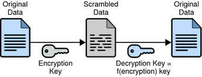
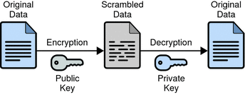

# HTTP 与 HTTPS

# POST 请求和 GET 请求
GET 请求通常用于查询、获取数据，而 POST 请求则用于发送数据，除了用途上的区别，它们还有以下这些不同：

1. GET 请求可以被缓存，可以被收藏为书签，但 POST 不行。
2. GET 请求会保留在浏览器的历史记录中，POST 不会。
3. GET 请求的长度有限制（不同的浏览器不一样，大约在几 Kb 左右），URL 的数据类型只能是 ASCII 字符，POST 请求没有限制。
4. GET 请求的参数在 URL 中，因此绝不能用 GET 请求传输敏感数据。POST 请求数据则写在 HTTP 的请求头中，安全性略高于 GET 请求。

**注意：**

POST 请求仅比 GET 请求略安全一点，它的数据不在 URL 中，但依然以明文的形式存放于 HTTP 的请求头中。

# 加密
根据加密解密的密钥是否相同分为对称加密和非对称加密。
### 1. 对称密钥加密

（Symmetric-Key Encryption），加密的加密和解密使用同一密钥。

- 优点：运算速度快；
- 缺点：密钥容易被获取。

### 2. 公开密钥加密

（Public-Key Encryption）而公开密钥加密使用一对密钥用于加密和解密，分别为公开密钥和私有密钥。公开密钥所有人都可以获得，通信发送方获得接收方的公开密钥之后，就可以使用公开密钥进行加密，接收方收到通信内容后使用私有密钥解密。

- 优点：更为安全；
- 缺点：运算速度慢；

### 3. HTTPs 采用的加密方式

HTTPs 采用混合的加密机制，使用公开密钥加密用于传输对称密钥，之后使用对称密钥加密进行通信。

