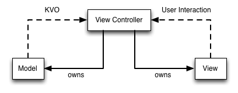
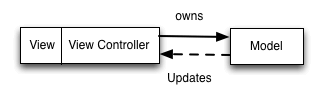

# MVVM 实战

在了解 MVVM 之前再来说一下 MVC。众所周知 MVC 已经拥有将近 50 年的历史，是最出名并且应用最广泛的架构模式。至于后来的 MVVM, MVP 等架构模式都是在它基础之上发展出来的。因此我们先来大致了解（或者复习）下 MVC。

## MVC
在 iOS 开发中，MVC 是苹果推荐的一个用来组织代码的权威范式,是构建iOS App的标准模式。按照 MVC 可以将整个应用分成 Model、View 和 Controller 三个部分。

- 视图（View）：负责渲染和展示内容，比如处理显示的字体间距位置等；
- 模型（Model）：单纯的数据结构数据，一般用来承载服务器返回的数据；
- 控制器（Controller）：负责控制视图和模型，比如管理视图的生命周期，发起网络请求获取模型数据，根据模型控制视图显示，处理用户交互等等。

下图是他们之间的依赖关系。

具体可以参考我写的一个 [demo](./code/mvvm)

这个例子中主要模拟了一个常见的业务场景。从服务器获取数据并展示，然后当用户点击的时候处理点击事件，并修改数据然后展示修改后的界面。

由上面的 demo 中我们可以看出来 View 和 Model 层的责任较为单一，比较轻量。相应的 Controller 层的责任就比较复杂了。

例子中 Controller 的职责（包括但不仅限于）：

- 管理根视图的生命周期和应用生命周期
- 负责将视图层的 UIView 对象添加到持有的根视图上；
- 负责处理用户行为，比如 UIButton 的点击；
- 作为 UITableView 以及其它容器视图的代理以及数据源；
- 负责 HTTP 请求的发起；
- 处理业务逻辑

在加上 Cocoa Touch 框架中 UIViewController 类持有一个根视图 UIView，所以视图层与控制器层是紧密耦合在一起的，这也是 iOS 项目经常遇到视图控制器非常臃肿的重要原因之一。因此 iOS 的依赖关系往往会被视为下面这种

## MVVM

