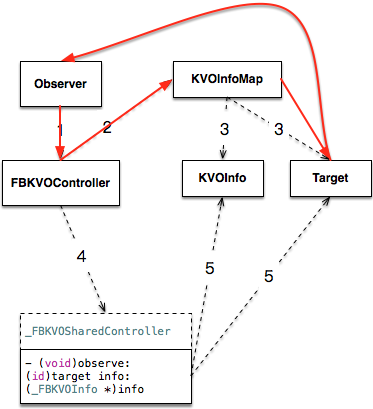

# NSHashTable 和 NSMapTable
## KVOController 
最近在使用 KVOController 的时候遇到了一个循环引用的问题。代码如下。

```
@weakify(self);
[self.KVOController observe:self keyPath:@"viewModel.model.is_followed" options:NSKeyValueObservingOptionOld | NSKeyValueObservingOptionNew block:^(id  _Nullable observer, id  _Nonnull object, NSDictionary<NSString *,id> * _Nonnull change) {
        @strongify(self);
        self.attentionBtn.selected = [change[NSKeyValueChangeNewKey] boolValue];
    }];
```

简单来说就是在 View 里面监听模型的改变，然后更新按钮的选中状态。

这样写了以后发现 View 不会被释放，造成了循环引用。

查看了 KVOController 的实现之后发现，这种使用 self.KVOController 监听 self 的用法会造成 self 与 KVOController 之间循环引用。

如下图所示



这里有两种解决方法。

1. 让 KVOController 监听模型

```
    @weakify(self);
    [self.KVOController observe:self.viewModel.model keyPath:@"is_followed" options:NSKeyValueObservingOptionOld | NSKeyValueObservingOptionNew block:^(id  _Nullable observer, id  _Nonnull object, NSDictionary<NSString *,id> * _Nonnull change) {
        @strongify(self);
        self.attentionBtn.selected = [change[NSKeyValueChangeNewKey] boolValue];
    }];
```

这里的 target 替换成 self.viewModel.model 。这样以来就没有了循环引用。

2. 使用 KVOControllerNonRetaining 

> Use this version when a strong reference between controller and observed object would create a retain cycle.
 When not retaining observed objects, special care must be taken to remove observation info prior to deallocation of the observed object.

 这是对这个的注释。大概意思就是我们上面遇到的那种循环引用的情况。它不会持有被观察的对象。

 这个具体的就是通过 NSMapTable 来实现的。

在 FBKVOController 的初始化方法中

```
- (instancetype)initWithObserver:(nullable id)observer retainObserved:(BOOL)retainObserved
{
  self = [super init];
  if (nil != self) {
    _observer = observer;
    NSPointerFunctionsOptions keyOptions = retainObserved ? NSPointerFunctionsStrongMemory|NSPointerFunctionsObjectPointerPersonality : NSPointerFunctionsWeakMemory|NSPointerFunctionsObjectPointerPersonality;
    _objectInfosMap = [[NSMapTable alloc] initWithKeyOptions:keyOptions valueOptions:NSPointerFunctionsStrongMemory|NSPointerFunctionsObjectPersonality capacity:0];
    pthread_mutex_init(&_lock, NULL);
  }
  return self;
}
```

可以看出通过参数 retainObserved 来区分 KVOController 和 KVOControllerNonRetaining。

归根结底就是 _objectInfosMap 这个 NSMapTable 的初始化的不同。

 ## NSHashTable 和 NSMapTable

 提到集合类型我们最常见的就是 NSSet、NSArray、NSDictionary 这三个。它们能满足我们日常开发中的大部分要求。但是它们都有一个特点就是：**将对象添加到容器时，会对该对象的引用计数+1**。 这样以来很自然就出现了上面中的循环引用的问题。而在 iOS6 之后 Objective-C Foundation 框架中添加了两个新的集合类 NSHashTable 和 NSMapTable。

在创建它们的对象时，会传 NSPointerFunctionsOptions 参数，列举如下:

- NSHashTableStrongMemory
    将HashTable容器内的对象引用计数+1一次
- NSHashTableZeroingWeakMemory
    在OSX 10.8之后已经废弃
- NSHashTableCopyIn
    将添加到容器的对象通过NSCopying中的方法，复制一个新的对象存入HashTable容器
- NSHashTableObjectPointerPersonality
    使用移位指针(shifted pointer)来做hash检测及确定两个对象是否相等；
- NSHashTableWeakMemory
    不会修改HashTable容器内对象元素的引用计数，并且对象释放后，会被自动移除

在 上面 FBKVOController 的里面正是应用了这一特性。

