# iOS中的多环境配置
在实际开发中我们经常会碰到在多个环境相互切换的问题。比如线上服务器、测试服务器的切换。最简单的方法当然就是定义相应的服务器地址的常量，然后程序员自己通过注释和去除注释来切换环境。但是一个常见的问题就是由于项目紧急上线导致某个参数忘记修改配置，导致生产事故的发生，这个问题一直比较困扰开发人员，导致开发的程序健壮性不强。

其实 Xcode 提供了一系列的工具帮助我们进行妥善地配置，下面我来介绍下三种解决方案。

## 1. 通过 Xcode 的 Build Configuration 来配置

1. 选择你的Xcode项目，找到info-Configuration，然后点击+，选择Duplication”Debug” Configuration 或Duplication”Release” Configuration ，添加一个新的配置。
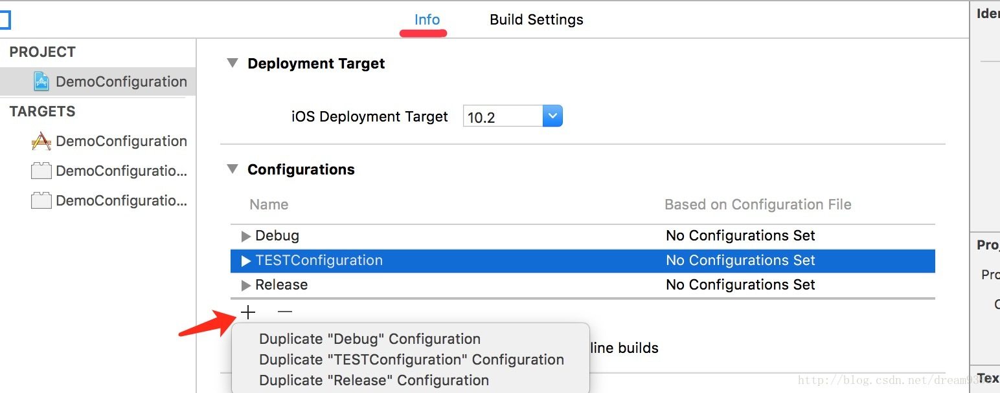
2. 如果此时项目里面有cocopods的话，刚刚新建完Build Configuration之后，请立即执行一下 `pod install`
3. 设置配置构建方案,选择项目的 Manage Schemes，选择当前的应用程序，点击左下角的小齿轮，然后点击 Duplicate，该应用程序构建方案具有相同的名称并且作为项目默认设置.
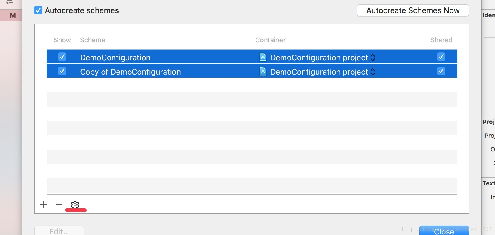
	1. 如果是多人开发项目，他们将不会看到你的新方案，因为你没有分享它。如果你选择你的方案，并且右侧点击share复选框，然后提交到你的源代码管理系统，其他人将能够使用这些方案了 
	2. 在新的对话框中，更改方案的名称，这里可以把 Run 模式和 Archive 都改成新建Scheme。若更改方案的名称，例如你的 App 名称 +AdHoc，然后选择 Archive 选项并且设置 Configuration 为 AdHoc，完成之后点击 close 按钮 
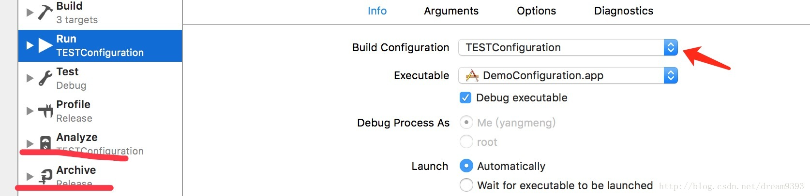

4. 配置和获取环境变量

	使用GCC预编译头参数 `GCC_PREPROCESSOR_DEFINITIONS `
我们进入到 Build Settings 里面，可以找到 `Apple LLVM Preprocessing`，这里我们可以找到 Preprocessor Macros 在这里，我们是可以加一些环境变量的宏定义来标识符。Preprocessor Macros 可以根据不同的环境预先制定不同定义的宏。 
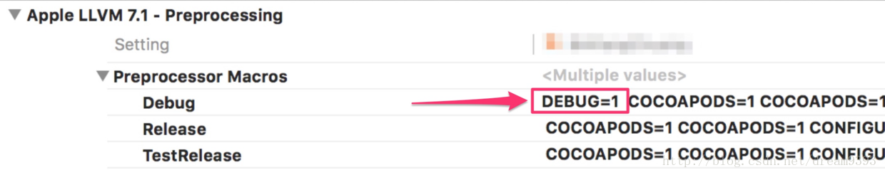

5. 有了这些我们预先设置的标识符之后，我们就可以在代码里面写入如下的代码了。

```
#ifdef DEVELOP
#define searchURL @"http://www.baidu.com"
#define sociaURL  @"weibo.com"
#elif UAT
#define searchURL @"http://www.bing.com"
#define sociaURL  @"twitter.com"
#else
#define searchURL @"http://www.google.com"
#define sociaURL  @"facebook.com"
#endif
```

6. 我们还可以通过配置来控制不同 scheme 输出不同的包名和图标。

	1. 新建User-defined Build Settings 
	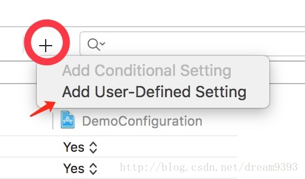

		再次回到Project的Build Settings里面来，Add User-Defined Setting。
		
		我们这里新加入2个参数，CustomAppBundleld是为了之后打包可以分开打成多个包，这里需要3个不同的Id，建议是直接在原来的Bundleld加上Scheme的名字即可。

		CustomProductName是为了app安装到手机上之后，手机上显示的名字，这里可以按照对应的环境给予描述，比如测试服，UAT，等等。如下图。  
		

	2. 修改info.plist文件和Images.xcassets 
	
		先来修改一下info.plist文件。
		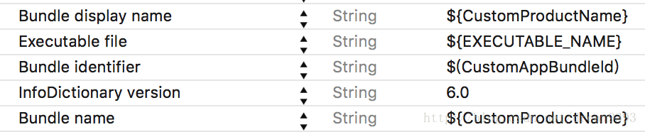

		由于我们新添加了2个CustomAppBundleld 和 CustomProductName，这里我们需要把info.plist里面的Bundle display name修改成我们自定义的这个字典。编译过程中，编译器会根据我们设置好的Scheme去自己选择Debug，Release，TestRelease分别对应的ProductName。

	3. 我们还需要在Images.xcassets里面新添加2个New iOS App Icon，名字最好和scheme的名字相同，这样好区分。 
	
		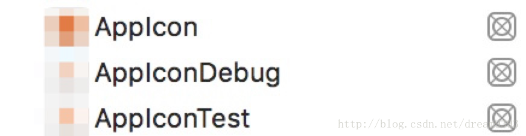
		
		新建完AppIcon之后，再在Build Setting里面找到Asset Catalog Compiler里面，然后把这几种模式下的App Icon set 
Name分别设置上对应的图标。如下图。
				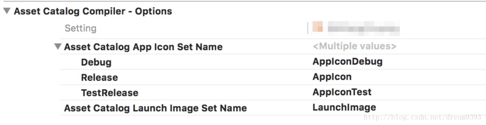

	4. 配置好上述之后，就可以选择不同环境运行app了。可以在手机上生成不同的环境的app，可以同时安装。

## 通过配置文件来进行配置

与上面的方法相同，他也要配置不同的 scheme。具体操作同上。创建好不同的 scheme 例如 Debug 、Release、 AdHoc 之后继续下面的操作。

1. 为每个环境设置不同的配置文件
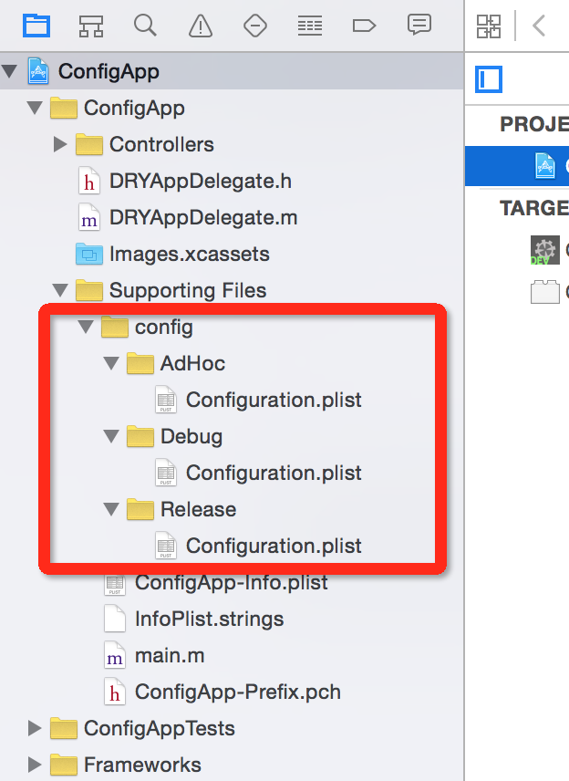
	1. 这些Configuration文件夹命名必须与你的项目配置名称匹配，显然这些是区分大小写的。具体路径如下图。
	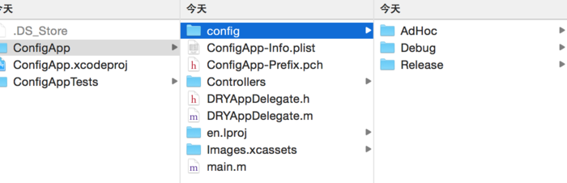
	2. 为了确保我们为每个环境使用了正确的配置，应该不要把文件加到应用程序中。比如在创建文件是取消加入到工程的选项，或者加入后在文件目录选择文件，在 Target Membership 中取消勾选。
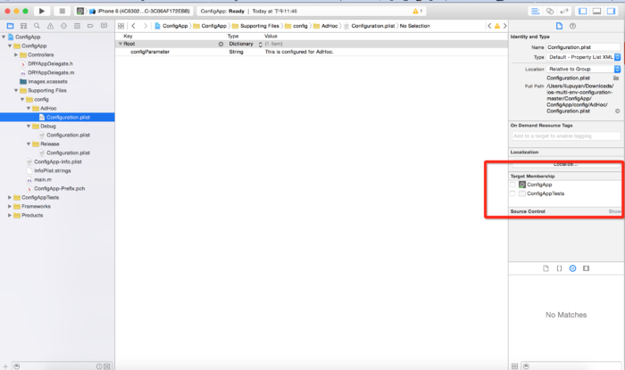
2. 接下来是要确保当应用程序被编译的时候拷贝对应的配置文件到应用程序中。要做到这一点，进入项目根目录，选择 NewRun Script Phase，并命名为 CopyConfiguration File(s)。
3. 将以下内容拷贝到script中，如图所示。

```
RESOURCE_PATH=${SRCROOT}/${PRODUCT_NAME}/config/${CONFIGURATION}
BUILD_APP_DIR=${BUILT_PRODUCTS_DIR}/${PRODUCT_NAME}.app 

echo "Copying all files under ${RESOURCE_PATH} to ${BUILD_APP_DIR}"
cp -v "${RESOURCE_PATH}/"* "${BUILD_APP_DIR}/"
```

该脚本将根据你的具体配置文件夹中的所有文件复制到构建应用程序包文件夹中。重要是保持CopyBundle Resources和添加文件的顺序。

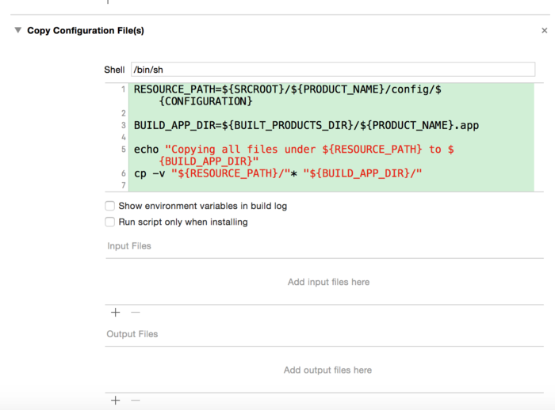

继续构建你的项目，然后检查输出，应该能看到echo 消息和列表文件被打印出来

4. 使用配置的值

	例如，在应用程序中获取配置文件的路径
	
```
NSBundle *bundle = [NSBundle mainBundle];
NSString *path = [bundle pathForResource:@"Configuration" ofType:@"plist"];
NSDictionary *config = [NSDictionary dictionaryWithContentsOfFile:path];
    
NSLog(@"%@", config[@"kBaseUrl"]);
```


## 参考
1. [iOS多环境配置](https://www.jianshu.com/p/0f1e8dc0812a)
2. [IOS打包测试发布环境配置](https://www.jianshu.com/p/0d5aa790713c)
3. [iOS多环境配置（Debug，Release之外）](https://blog.csdn.net/dream9393/article/details/58127654)

