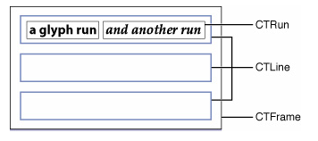
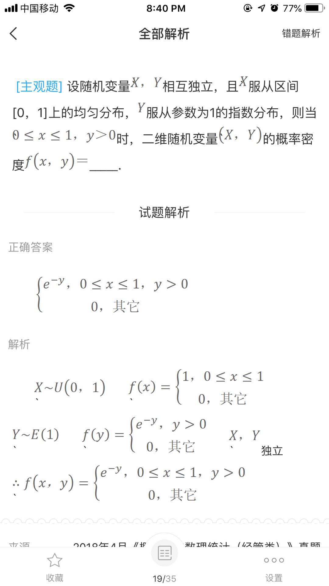

# 富文本与 DTCoreText
## 前言
最近在做一个做题相关的需求。涉及到数学公式等特殊符号需要用到到富文本来进行显示。由于之前项目中的这块儿功能有一些问题，比如图片上面会显示有额外的“·”这个符号，部分图片无法展示以及无法换行，图片文字无法水平方向上对齐等等。在这里记录下采坑的过程。

阅读了之前项目的代码后了解到项目中用到了一个第三方的开源库 RCLable。并且在这基础上做了一些修改，比如本来的 RCLable 是不支持网络图片的。因此为了满足需求对它做了拓展，利用 SDWebImage 来下载和缓存图片。

这里先记录下出现问题的原因。

### 1. 图片上额外的 “·” 符号
经过查找代码发现这个 “·” 是个占位符，用来对图片的位置进行定位的。去掉之后图片的显示位置就混乱了。

后来了解到 RCLable 底层也是通过 CoreText 来实现的，于是查询了一些资料.

在 CoreText 里面抽象出了以下这些类，将一段文字才分为基本单位为 CTRun 的一组类，然后通过计算他们的位置来实现排版。



而对于图片来说

> CoreText 实际上并没有相应 API 直接将一个图片转换为 CTRun 并进行绘制，它所能做的只是为图片预留相应的空白区域，而真正的绘制则是交由 CoreGraphics 完成。在 CoreText 中提供了 CTRunDelegate 这么个 Core Foundation 类，顾名思义它可以对 CTRun 进行拓展：AttributedString 某个段设置 kCTRunDelegateAttributeName 属性之后，CoreText 使用它生成 CTRun 是通过当前 Delegate 的回调来获取自己的 ascent，descent 和 width，而不是根据字体信息。这样就给我们留下了可操作的空间：用一个**空白字符**作为图片的占位符，设好 Delegate，占好位置，然后用 CoreGraphics 进行图片的绘制。

从上面可以看出来这个问题的原因就是没有使用空白字符而是用了 “·” 做占位符导致的问题。于是这个问题就可以通过下面这个空白字符来处理了。

```
unichar objectReplacementChar = 0xFFFC;
```

### 2. 剩下来的问题
- 无法换行是因为在处理原始数据的时候把对应的 p 标签给去掉了。
- 部分图片无法展示是因为在计算排版的时候当图片正好位于一行结尾的时候折行计算错误导致图片位置设置错误，然后就无法显示了。

## 解决方案
由于上面的问题涉及到排版的问题，改起来也比较麻烦（主要是代码太难看了 😭 ）。因此就决定换一个实现方式。

关于富文本显示的可以用以下几种实现方式。
### 0. WebView
既然服务器返回的是 HTML ，直接的想法就是用 WebView。但是对于做题这种需求来说肯定不能一道题一个 WebView。一来部分功能比如选项的控制和题目选项的位置大小不能用 WebView，二来就是性能的问题。pass！
### 1. CoreText 
接着想到的就是直接通过最底层的 CoreText 来说实现相关的功能。但是这个学习成本还是不低的。而且由于我们之前的处理方式是服务器返回 HTML 标签的方式，直接使用 CoreText 还需要处理 HTML 的解析以及图片下载缓存相关的功能。这个周期会更长。后期有时间再研究。pass！

### 2. TextKit
相对于 CoreText 来说 TextKit 更轻量一点，使用起来也更方便，但是跟 CoreText 一样的缺点就是依然需要处理标签。[资料](https://www.objccn.io/issue-5-1/) pass！

### 3. YYText
相对于上面苹果原生的文字处理框架，YYText 提供了更好的处理文字的方式，更难得的是提供了异步绘制的功能，能极高的提高性能。但是依然有上面存在的问题。 pass！

### 4. DTCoreText
解析 HTML 功能 ？ 有 ！！
图片缓存功能 ？ 有 ！！ 
OK，就你了。

## DTCoreText

DTCoreText 是个开源的 iOS 富文本组件，它可以解析 HTML 与 CSS 最终用 CoreText 绘制出来，通常用于在一些需要显示富文本的场景下代替低性能的 UIWebView，来看看它是怎样解析和渲染 HTML + CSS 的，总体上分成两步：

1. 数据解析—把 HTML + CSS 转换成 NSAttributeString
    - HTML字符串传入DTHTMLAttributeStringBuilder，通过DTHTMLParser的回调解析后生成dom树
    - dom树的每个节点都是自定义的DTHTMLElement，通过DTCSSStylesheet解析每个元素对应的样式，这时每个DTHTMLElement已经包含了节点的内容和样式
    - 最后从DTHTMLElement生成NSAttributeString。
2. 渲染—用 CoreText 把 NSAttributeString 内容渲染出来，再加上图片等元素
    这一步就不具体展开了具体可以看看[这里](http://blog.cnbang.net/tech/2729/)

需要注意的是第一步的解析过程。由于我们之前的需求中，服务器通过把 img 标签的 src 属性的图片地址后面加上了图片的大小。类似 `http://xxx/xxx/xxx.png?174|83`这样。直接按照正常的 HTML 来解析是解析不出来的。因此需要在解析的时候修改 img 标签的属性。

通过 DTCoreText 的 demo 我找到了生成 NSAttributedString 的方法。

```
NSAttributedString *string = [[NSAttributedString alloc] initWithHTMLData:data options:options documentAttributes:NULL];
```

在 options 里面可以传入一些参数来控制生成的结果。用到的比较重要的有下面这几个。

- DTWillFlushBlockCallBack
    这个是在将要解析 HTML 元素的时候的回调，能获得各个元素的描述和修改相关元素的属性。
- DTMaxImageSize
    这个是图片的最大尺寸。

其他的一些属性比如字体，链接的高亮颜色，文字行间距等都可以在这里设置。

下面是代码
```
- (NSAttributedString *)attributedString:(NSString *)htmlString
{
    NSData *data = [htmlString dataUsingEncoding:NSUTF8StringEncoding];
    
    CGSize maxImageSize = CGSizeMake(self.view.bounds.size.width - 50.0, self.view.bounds.size.height - 20.0);
    
    void (^callBackBlock)(DTHTMLElement *element) = ^(DTHTMLElement *element) {
        [self ergodicWithElememt:element];
    };
    
    NSMutableDictionary *options = [NSMutableDictionary dictionaryWithObjectsAndKeys:[NSNumber numberWithFloat:1.0], NSTextSizeMultiplierDocumentOption, [NSValue valueWithCGSize:maxImageSize], DTMaxImageSize,
                                    @"Times New Roman", DTDefaultFontFamily,  @"purple", DTDefaultLinkColor, @"red", DTDefaultLinkHighlightColor, callBackBlock, DTWillFlushBlockCallBack, nil];
    
    NSAttributedString *string = [[NSAttributedString alloc] initWithHTMLData:data options:options documentAttributes:NULL];
    
    return string;
}

- (void)ergodicWithElememt:(DTHTMLElement *)element
{
    if ([element.name isEqualToString:@"img"]) {
        NSMutableDictionary *dict = [NSMutableDictionary dictionaryWithDictionary:element.attributes];
        [dict setObject:@"middle" forKey:@"vertical-align"];
        NSString *url = [dict objectForKey:@"src"];
        NSArray * array = [url componentsSeparatedByString:@"?"];
        if (array.count==2) {
            NSString * realURL = array[0];
            realURL = [realURL stringByReplacingOccurrencesOfString:@"\"" withString:@""];
            [dict setObject:realURL forKey:@"src"];
            NSString * sizeStr = array[1];
            NSArray * frameArray = [sizeStr componentsSeparatedByString:@"|"];
            if (frameArray.count==2) {
                float width = [frameArray[0] floatValue]/2;
                float height = [frameArray[1] floatValue]/2;
                [dict setObject:[NSString stringWithFormat:@"%f", width] forKey:@"width"];
                [dict setObject:[NSString stringWithFormat:@"%f", height] forKey:@"height"];
            }
        }
        element.attributes = dict;
        element.textAttachment = [[DTImageTextAttachment alloc] initWithElement:element options:nil];
        [element applyStyleDictionary:dict];
        NSLog(@"%@", dict);
    }
    if (element.childNodes.count) {
        for (DTHTMLElement *oneChildElement in element.childNodes) {
            [self ergodicWithElememt:oneChildElement];
        }
    } else {
        return;
    }
}

```

上面的代码需要注意的就是
1. `[dict setObject:@"middle" forKey:@"vertical-align"];` 通过这个代码可以设置 text 和 image 的对齐方式。参考[这里](https://github.com/Cocoanetics/DTCoreText/issues/552#event-62201271)。如果是直接拼接的 HTML 标签需要设置 img 标签的 `style="vertical-align:middle;"`。 但是在这里需要按照上面的代码进行设置才能生效。
2. 设置完 element 的 attributes 属性后还需要重置 textAttachment。如下

```
element.attributes = dict;
element.textAttachment = [[DTImageTextAttachment alloc] initWithElement:element options:nil];
[element applyStyleDictionary:dict];
```

## 对比
修改前



修改后


## 参考
1. [DTCoreText 的 issue](https://github.com/Cocoanetics/DTCoreText/issues/552#event-62201271)
2. [iOS富文本组件的实现—DTCoreText源码解析 渲染篇](http://blog.cnbang.net/tech/2729/)
3. [iOS富文本组件的实现—DTCoreText源码解析 数据篇](https://blog.cnbang.net/tech/2630/)