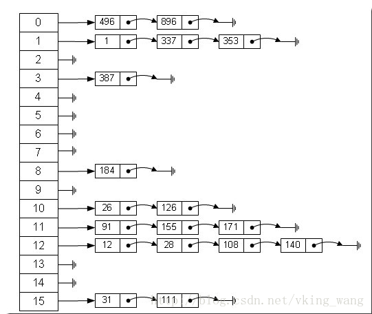

# 哈希表
## 概述
Objective-C 中的字典 NSDictionary 底层其实是一个哈希表，实际上绝大多数语言中字典都通过哈希表实现。哈希表（Hash Table，也叫散列表），是根据关键码值 (Key-Value) 而直接进行访问的数据结构，也就是说，它通过把关键码值映射到表中一个位置来访问记录，以加快查找的速度，其查找的时间复杂度为 O(1)。哈希表的实现主要需要解决两个问题，哈希函数和冲突解决。

## 哈希函数
哈希函数也叫散列函数，它对不同的输出值得到一个固定长度的消息摘要。理想的哈希函数对于不同的输入应该产生不同的结构，同时散列结果应当具有同一性（输出值尽量均匀）和雪崩效应（微小的输入值变化使得输出值发生巨大的变化）。

## 冲突解决
现实中的哈希函数不是完美的，当两个不同的输入值对应一个输出值时，就会产生“碰撞”，这个时候便需要解决冲突。

常见的冲突解决方法有开放定址法，链地址法，建立公共溢出区等。实际的哈希表实现中，使用最多的是链地址法。

## 链地址法
使用链地址法的哈希表实际上是一个“链表散列”的数据结构，即数组和链表的结合体。底层就是一个数组结构，数组中的每一项又是一个链表。当新建一个HashMap的时候，就会初始化一个数组。

当我们往HashMap中put元素的时候，先根据key的hashCode重新计算hash值，根据hash值得到这个元素在数组中的位置（即下标）， 如果数组该位置上已经存放有其他元素了，那么在这个位置上的元素将以链表的形式存放，新加入的放在链头，最先加入的放在链尾。如果数组该位置上没有元素，就直接将该元素放到此数组中的该位置上。



## 一些优化
在 HashMap 中要找到某个元素，需要根据 key 的 hash 值来求得对应数组中的位置。如何计算这个位置就是 hash 算法。前面说过 HashMap 的数据结构是数组和链表的结合，所以我们当然希望这个 HashMap 里面的 元素位置尽量的分布均匀些，尽量使得每个位置上的元素数量只有一个，那么当我们用 hash 算法求得这个位置的时候，马上就可以知道对应位置的元素就是我们要的，而不用再去遍历链表，这样就大大优化了查询的效率。

对于任意给定的对象，只要它的 hashCode() 返回值相同，那么程序调用 hash(int h) 方法所计算得到的 hash 码值总是相同的。我们首先想到的就是把 hash 值对数组长度取模运算，这样一来，元素的分布相对来说是比较均匀的。但是，“模”运算的消耗还是比较大的。在 JAVA的 HashMap 中是这样做的：调用 indexFor(int h, int length) 方法来计算该对象应该保存在 table 数组的哪个索引处。indexFor(int h, int length) 方法的代码如下：

```
static int indexFor(int h, int length) {  
    return h & (length-1);
}
```
这个方法非常巧妙，它通过 h & (table.length -1) 来得到该对象的保存位，而 HashMap 底层数组的长度总是 2 的 n 次方，这是HashMap在速度上的优化。在 HashMap 构造器中有如下代码：

```
int capacity = 1;
    while (capacity < initialCapacity)  
        capacity <<= 1;
```
这段代码保证初始化时HashMap的容量总是2的n次方，即底层数组的长度总是为2的n次方。

当length总是 2 的n次方时，h& (length-1)运算等价于对length取模，也就是h%length，但是&比%具有更高的效率。

至于 HashMap 的数组长度为什么是 2的n次幂，这是因为当数组长度为2的n次幂的时候，不同的key算得得 index 相同的几率较小，那么数据在数组上分布就比较均匀，也就是说碰撞的几率小，相对的，查询的时候就不用遍历某个位置上的链表，这样查询效率也就较高了。

## 负载因子
负载因子(load factor)，它用来衡量哈希表的 空/满 程度，一定程度上也可以体现查询的效率，计算公式为:

> 负载因子 = 总键值对数 / 数组大小

负载因子越大，意味着哈希表越满，越容易导致冲突，性能也就越低。因此，一般来说，当负载因子大于某个常数(可能是 1，或者 0.75 等)时，哈希表将自动扩容。

扩容的时候，会重新计算每个元素在数组中的位置，而这是一个非常消耗性能的操作，所以如果我们已经预知 HashMap 中元素的个数，那么预设元素的个数能够有效的提高 HashMap 的性能。

## 参考
1. [哈希表](https://hit-alibaba.github.io/interview/basic/algo/Hash-Table.html)
2. [深入理解哈希表](https://bestswifter.com/hashtable/)
3. [散列查找(哈希表)基础讲解](http://barryliu1995.studio/2017/07/21/%E6%95%A3%E5%88%97%E6%9F%A5%E6%89%BE-%E5%93%88%E5%B8%8C%E8%A1%A8/)
4. [HashMap实现原理分析](https://blog.csdn.net/vking_wang/article/details/14166593)
