# Instruments

众所周知 Instruments 是 Apple 提供的检测工具，功能强大。这里结合 《 iOS 和 macOS 性能优化》 这本书来记录下部分工具的用法。

[官方文档地址](https://help.apple.com/instruments/mac/current/#//apple_ref/doc/uid/TP40004652)

## Time Profiler（时间分析器？）

### 启动 
首先是启动 Instruments，可以通过 XCode 菜单栏上 Product 下的 Profile 来启动 或者使用快捷键 `⌘ + I` 。 

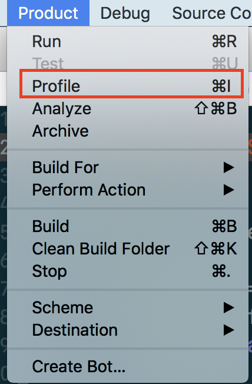</img>

这里有一点需要注意的是在 scheme 的配置中可以配置 Profile 的编译配置，如下图这种情况就是 debug 模式。

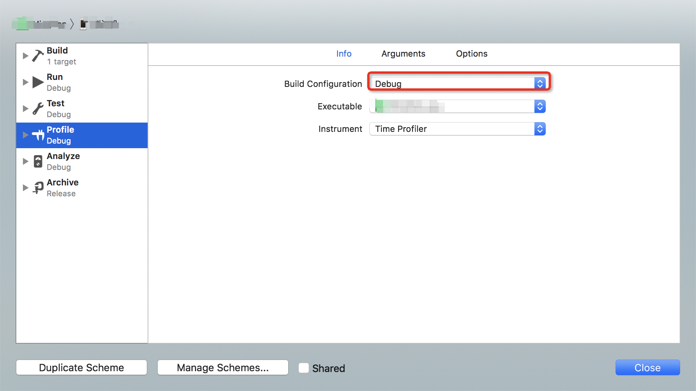</img>

在这种模式下编译没有生成 dSYM （符号表）文件。这时候通过 Time Profiler 来查看堆栈信息的时候就无法找到我们自己写的函数名和行号等信息了。

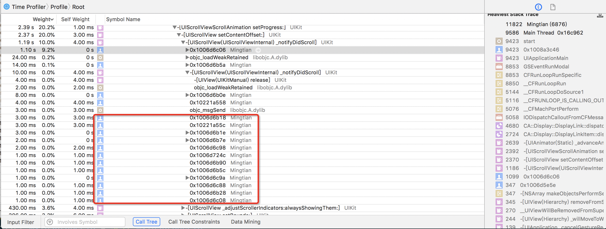

这个时候把 debug 改成 release 就能生成 dSYM 文件，并查看到具体函数名和代码行号了。

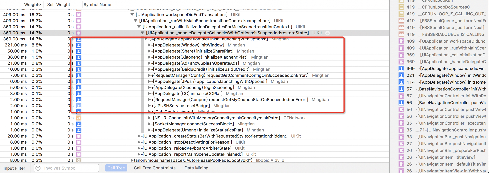

这时候双击某行就可以跳转到具体代码。

#### iOS符号表(dSYM)

这里记录下 dSYM 相关知识。

##### 什么是 dSYM
iOS构建时产生的符号表，它是内存地址与函数名，文件名，行号的映射表。 符号表元素如下所示:

<起始地址> <结束地址> <函数> [<文件名:行号>]

简单来说就是通过 dSYM 和 地址信息就可以定位到具体的函数名以及对应源代码中的行号。

##### 为什么要配置符号表？

当 APP crash 的时候崩溃日志会把崩溃时的堆栈信息给保存起来形成崩溃日志，但是这时候的堆栈信息是二进制的地址信息。这时候就需要通过 dSYM 来还原。

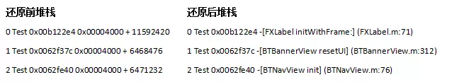

当然在 Time Profiler 里也是同样的作用。

##### XCode编译后有没有生成dSYM文件？

XCode Release编译默认会生成dSYM文件，而Debug编译默认不会生成.

对应的Xcode配置如下：

`XCode -> Build Settings -> Code Generation -> Generate Debug Symbols -> Yes`

`XCode -> Build Settings -> Build Option -> Debug Information Format -> DWARF with dSYM File`

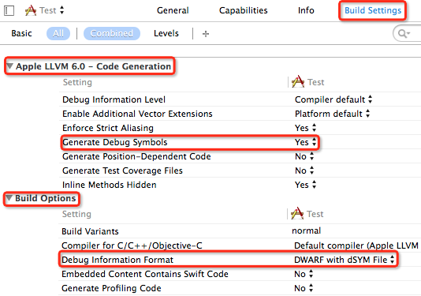

### 界面

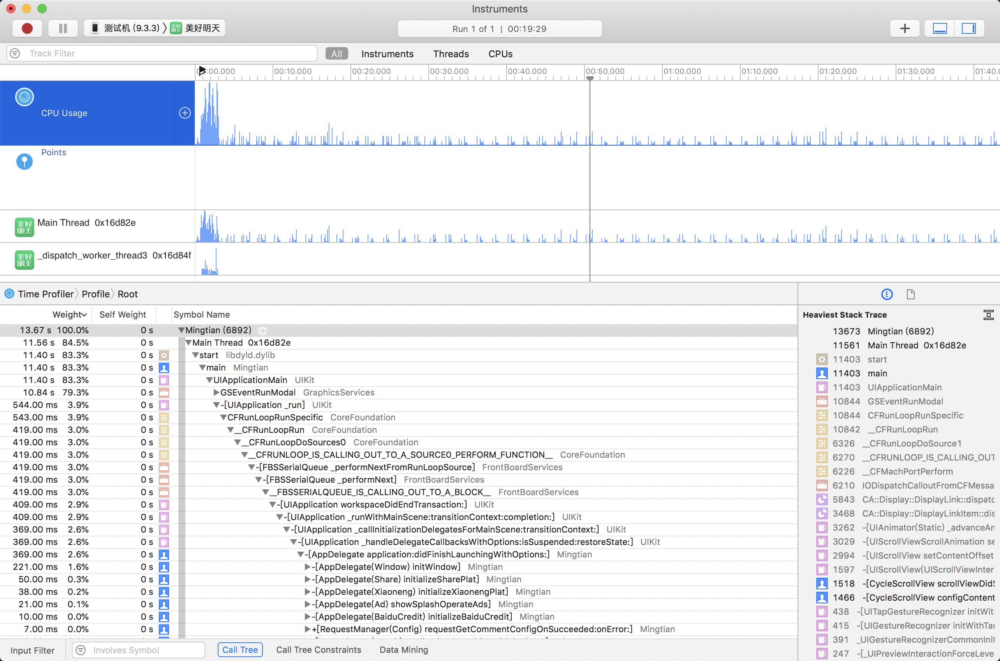

程序启动完成之后就会进入到上图所示的界面。

这个界面的上部分就是 cpu 及线程的使用情况 。下部分就是一些堆栈信息。

#### 图标说明
需要说明的就是在下部分的界面中有一些小的图标，这些图标表示这函数的来源。比如头像轮廓表示来自用户，杯子表示来自 Cocoa，小齿轮代表系统调用。（XCode 中打断点的时候也是按这些图标的类型来显示的）

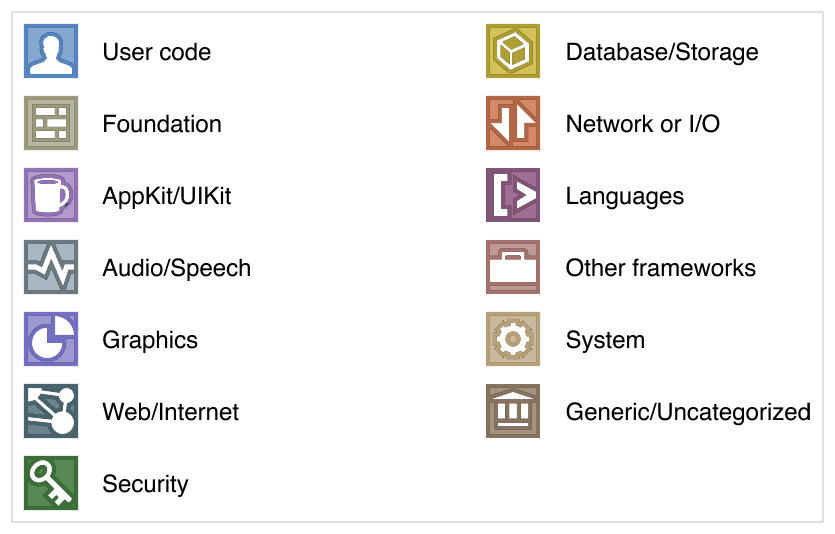

[apple 文档](https://developer.apple.com/library/ios/documentation/DeveloperTools/Conceptual/debugging_with_xcode/chapters/debugging_tools.html#//apple_ref/doc/uid/TP40015022-CH8-SW19)

#### CallTree 

我们发现调用堆栈上显示了许多系统的调用信息，看起来很是杂乱，影响我们定位到具体的代码中去，这时候需要利用下面 CallTree 选项的勾选操作。

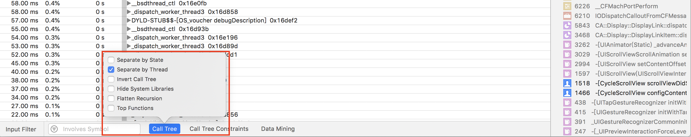

- Separate by Thread：按线程分开做分析，这样更容易揪出那些吃资源的问题线程。特别是对于主线程，它要处理和渲染所有的接口数据，一旦受到阻塞，程序必然卡顿或停止响应。

- Invert Call Tree：反向输出调用树。把调用层级最深的方法显示在最上面，更容易找到最耗时的操作。

- Hide Missing Symbols：隐藏缺失符号。如果dSYM文件或其他系统架构缺失，列表中会出现很多奇怪的十六进制的数值，用此选项把这些干扰元素屏蔽掉，让列表回归清爽。

- Hide System Libraries：隐藏系统库文件。过滤掉各种系统调用，只显示自己的代码调用。

- Flattern Recursion：拼合递归。将同一递归函数产生的多条堆栈（因为递归函数会调用自己）合并为一条。

- Top Functions：找到最耗时的函数或方法。

#### 选择指定时间

默认情况下,随着 APP 的运行期间所有的信息都会收集到，当我们查找指定功能的性能问题的时候就会被其他无关调用信息干扰。这时候需要选择指定时间段内的堆栈信息。

具体操作如下图

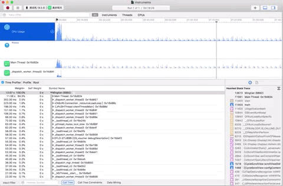</img>

#### Focus

当我们找到 CPU 主要耗费到哪个函数（方法）之后，想要仔细观察这个函数的时候可以使用 Focus 这个功能。操作方式是选中这个函数然后右键展开菜单

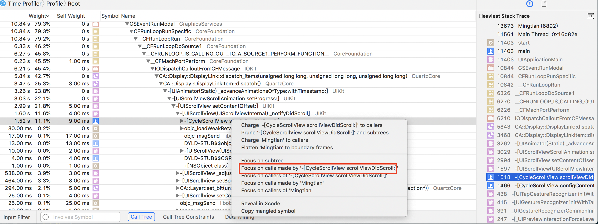

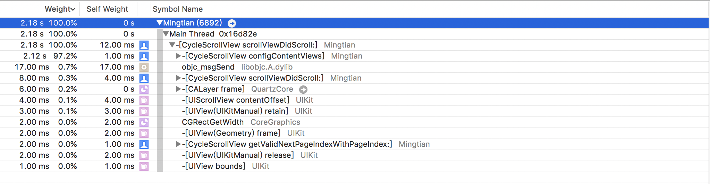

这样就可以专注于选中的调用。

# 参考

1. [Bugly iOS 符号表配置](https://bugly.qq.com/docs/user-guide/symbol-configuration-ios/?v=1508981694992#_2)

