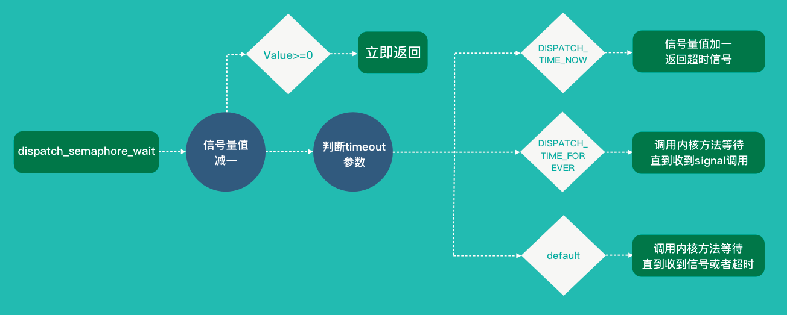
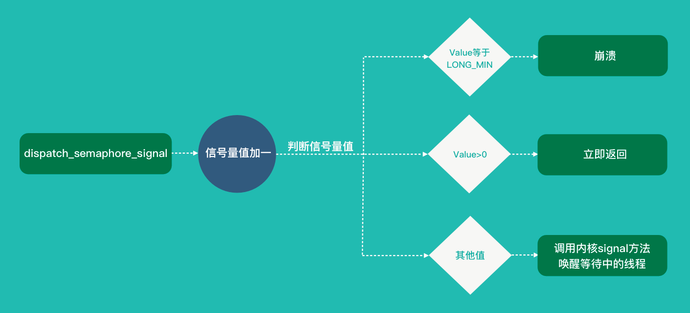

# iOS中的锁

开发中利用多线程来编程的时候往往会遇到线程安全的问题，这个时候就需要利用到锁。基本上来说锁的作用就是当一个线程A来执行一段代码的时候加上锁，这样其他的线程比如B就无法访问这段代码，只有A线程访问完成之后解锁，B线程才能访问。这样一来就可以确保线程安全了。

## @synchronized
这个是我们常见的，也是用起来比较方便的一个锁。比如下面这个例子。

```
	NSObject *obj = [[NSObject alloc] init];
    
    dispatch_async(dispatch_get_global_queue(DISPATCH_QUEUE_PRIORITY_DEFAULT, 0), ^{
        @synchronized(obj) {
            NSLog(@"需要线程同步的操作1 开始");
            sleep(3);
            NSLog(@"需要线程同步的操作1 结束");
        }
    });
    
    dispatch_async(dispatch_get_global_queue(DISPATCH_QUEUE_PRIORITY_DEFAULT, 0), ^{
        sleep(1);
        @synchronized(obj) {
            NSLog(@"需要线程同步的操作2");
        }
    });
    
2016-06-29 20:48:35.747 SafeMultiThread[35945:580107] 需要线程同步的操作1 开始
2016-06-29 20:48:38.748 SafeMultiThread[35945:580107] 需要线程同步的操作1 结束
2016-06-29 20:48:38.749 SafeMultiThread[35945:580118] 需要线程同步的操作2

```
`@synchronized`是 OC 层面的锁，它的后面需要紧跟一个 OC 对象，使用该对象为该锁的唯一标识，只有当标识相同时，才满足互斥，所以如果线程 2 中的 `@synchronized(obj)` 改为其他的对象，则线程2就不会被阻塞，`@synchronized` 指令实现锁的优点就是我们不需要在代码中显式的创建锁对象，便可以实现锁的机制，但作为一种预防措施，`@synchronized` 块会隐式的添加一个异常处理例程来保护代码，该处理例程会在异常抛出的时候自动的释放互斥锁。`@synchronized` 还有一个好处就是不用担心忘记解锁了。

如果在 `@sychronized(object){}` 内部 object 被释放或被设为 nil，但如果 object 一开始就是 nil，则失去了锁的功能。不过虽然 nil 不行，但 `@synchronized([NSNull null])` 是完全可以的。

更多相关内容可以看[这里](http://yulingtianxia.com/blog/2015/11/01/More-than-you-want-to-know-about-synchronized/)

## dispatch_semaphore
这是 GCD 提供的一个加锁的方式，更多的称之为信号量。大致可以把信号量理解为进入一个大门的钥匙，比如一个大门有三把钥匙，这时候进去一个人并拿走一个钥匙，等到钥匙被全被拿走的时候就没有人能进入了，必须等里面的人出来后把钥匙挂门口之后别的人才能进去。

三个相关函数：

####  1.`dispatch_semaphore_create(long value);`
	
生成信号量，参数value是信号量计数的初始值。

**注意** value 必须大于 0 否则函数就会返回NULL。

这一步相当于声明这个门有几把钥匙。

####  2.`dispatch_semaphore_wait(dispatch_semaphore_t dsema, dispatch_time_t timeout);`
这个函数会将信号量值减一，如果大于等于0就立即返回，否则等待信号量唤醒或者超时（注意 timeout 的类型为 `dispatch_time_t`，不能直接传入整形或 float 型数），如果等待的期间 desema 的值被`dispatch_semaphore_signal`函数加1了，且该函数（即`dispatch_semaphore_wait`）所处线程获得了信号量，那么就继续向下执行并将信号量减1。如果等待期间没有获取到信号量或者信号量的值一直为0，那么等到 timeout 时，其所处线程自动执行其后语句。



这一步相当于有钥匙的时候拿走一把钥匙，没有钥匙的时候就要一直等待，并且如果超时时间到了的话会直接进入大门。
####  3.`dispatch_semaphore_signal(dispatch_semaphore_t dsema);`

会将信号量值加一，如果value大于0立即返回，否则唤醒某个等待中的线程。


这一步相当于返还钥匙。

具体用法可以参考我的另外一个 [GCD](./GCD.md) 相关的文章。

## pthread_mutex

pthread 表示 POSIX thread，定义了一组跨平台的线程相关的 API，pthread_mutex 表示互斥锁。互斥锁的实现原理与信号量非常相似，不是使用忙等，而是阻塞线程并睡眠，需要进行上下文切换。

```
pthread_mutexattr_t attr;
pthread_mutexattr_init(&attr);
pthread_mutexattr_settype(&attr, PTHREAD_MUTEX_NORMAL);  // 定义锁的属性

pthread_mutex_t mutex;
pthread_mutex_init(&mutex, &attr) // 创建锁

pthread_mutex_lock(&mutex); // 申请锁
    // 临界区
pthread_mutex_unlock(&mutex); // 释放锁
```
一般情况下，一个线程只能申请一次锁，也只能在获得锁的情况下才能释放锁，多次申请锁或释放未获得的锁都会导致崩溃。假设在已经获得锁的情况下再次申请锁，线程会因为等待锁的释放而进入睡眠状态，因此就不可能再释放锁，从而导致死锁。

然而这种情况经常会发生，比如某个函数申请了锁，在临界区内又递归调用了自己。辛运的是 pthread_mutex 支持递归锁，也就是允许一个线程递归的申请锁，只要把 attr 的类型改成 `PTHREAD_MUTEX_RECURSIVE` 即可。

## NSLocking
```
@protocol NSLocking

- (void)lock;
- (void)unlock;

@end

```
首先是 `NSLocking` 协议，实现这个协议的有 `NSLock` `NSConditionLock` `NSRecursiveLock`  `NSCondition`。可以把他们看出是一个系列的。这些都是在内部封装了一个 pthread_mutex，区别仅仅是内部 pthread_mutex 互斥锁的类型不同。它的实现非常简单，通过宏，定义了 lock 方法。而通过宏定义，可以简化方法的定义。下面来一个一个介绍。

## NSLock


```
	NSLock *lock = [[NSLock alloc] init];
    dispatch_async(dispatch_get_global_queue(DISPATCH_QUEUE_PRIORITY_DEFAULT, 0), ^{
        //[lock lock];
        [lock lockBeforeDate:[NSDate date]];
            NSLog(@"需要线程同步的操作1 开始");
            sleep(2);
            NSLog(@"需要线程同步的操作1 结束");
        [lock unlock];
        
    });
    
    dispatch_async(dispatch_get_global_queue(DISPATCH_QUEUE_PRIORITY_DEFAULT, 0), ^{
        sleep(1);
        if ([lock tryLock]) {//尝试获取锁，如果获取不到返回NO，不会阻塞该线程
            NSLog(@"锁可用的操作");
            [lock unlock];
        }else{
            NSLog(@"锁不可用的操作");
        }
        
        NSDate *date = [[NSDate alloc] initWithTimeIntervalSinceNow:3];
        if ([lock lockBeforeDate:date]) {//尝试在未来的3s内获取锁，并阻塞该线程，如果3s内获取不到恢复线程, 返回NO,不会阻塞该线程
            NSLog(@"没有超时，获得锁");
            [lock unlock];
        }else{
            NSLog(@"超时，没有获得锁");
        }
        
    });

```
tryLock 和 lockBeforeDate :两个方法，前一个方法会尝试加锁，如果锁不可用(已经被锁住)，刚并不会阻塞线程，并返回 NO。 lockBeforeDate: 方法会在所指定Date之前尝试加锁，如果在指定时间之前都不能加锁，则返回 NO。

## NSConditionLock
NSConditionLock 和 NSLock 类似，都遵循 NSLocking 协议，方法都类似，只是多了一个 condition 属性，以及每个操作都多了一个关于 condition 属性的方法，例如 tryLock，tryLockWhenCondition:，NSConditionLock 可以称为条件锁，只有 condition 参数与初始化时候的 condition 相等，lock 才能正确进行加锁操作。而 unlockWithCondition: 并不是当 Condition 符合条件时才解锁，而是解锁之后，修改 Condition 的值，这个结论可以从下面的例子中得出。

```
//主线程中
    NSConditionLock *lock = [[NSConditionLock alloc] initWithCondition:0];
    
    //线程1
    dispatch_async(dispatch_get_global_queue(DISPATCH_QUEUE_PRIORITY_DEFAULT, 0), ^{
        [lock lockWhenCondition:1];
        NSLog(@"线程1");
        sleep(2);
        [lock unlock];
    });
    
    //线程2
    dispatch_async(dispatch_get_global_queue(DISPATCH_QUEUE_PRIORITY_DEFAULT, 0), ^{
        sleep(1);//以保证让线程2的代码后执行
        if ([lock tryLockWhenCondition:0]) {
            NSLog(@"线程2");
            [lock unlockWithCondition:2];
            NSLog(@"线程2解锁成功");
        } else {
            NSLog(@"线程2尝试加锁失败");
        }
    });
    
    //线程3
    dispatch_async(dispatch_get_global_queue(DISPATCH_QUEUE_PRIORITY_DEFAULT, 0), ^{
        sleep(2);//以保证让线程2的代码后执行
        if ([lock tryLockWhenCondition:2]) {
            NSLog(@"线程3");
            [lock unlock];
            NSLog(@"线程3解锁成功");
        } else {
            NSLog(@"线程3尝试加锁失败");
        }
    });
    
    //线程4
    dispatch_async(dispatch_get_global_queue(DISPATCH_QUEUE_PRIORITY_DEFAULT, 0), ^{
        sleep(3);//以保证让线程2的代码后执行
        if ([lock tryLockWhenCondition:2]) {
            NSLog(@"线程4");
            [lock unlockWithCondition:1];    
            NSLog(@"线程4解锁成功");
        } else {
            NSLog(@"线程4尝试加锁失败");
        }
    });
    
2016-08-19 13:51:15.353 ThreadLockControlDemo[1614:110697] 线程2
2016-08-19 13:51:15.354 ThreadLockControlDemo[1614:110697] 线程2解锁成功
2016-08-19 13:51:16.353 ThreadLockControlDemo[1614:110689] 线程3
2016-08-19 13:51:16.353 ThreadLockControlDemo[1614:110689] 线程3解锁成功
2016-08-19 13:51:17.354 ThreadLockControlDemo[1614:110884] 线程4
2016-08-19 13:51:17.355 ThreadLockControlDemo[1614:110884] 线程4解锁成功
2016-08-19 13:51:17.355 ThreadLockControlDemo[1614:110884] 线程1

```
上面代码先输出了 ”线程 2“，因为线程 1 的加锁条件不满足，初始化时候的 condition 参数为 0，而加锁条件是 condition 为 1，所以加锁失败。locakWhenCondition 与 lock 方法类似，加锁失败会阻塞线程，所以线程 1 会被阻塞着，而 tryLockWhenCondition 方法就算条件不满足，也会返回 NO，不会阻塞当前线程。

回到上面的代码，线程 2 执行了 [lock unlockWithCondition:2]; 所以 Condition 被修改成了 2。

而线程 3 的加锁条件是 Condition 为 2， 所以线程 3 才能加锁成功，线程 3 执行了 [lock unlock]; 解锁成功且不改变 Condition 值。

线程 4 的条件也是 2，所以也加锁成功，解锁时将 Condition 改成 1。这个时候线程 1 终于可以加锁成功，解除了阻塞。

从上面可以得出，NSConditionLock 还可以实现任务之间的依赖。

## NSRecursiveLock
NSRecursiveLock 是递归锁，他和 NSLock 的区别在于，NSRecursiveLock 可以在一个线程中重复加锁，NSRecursiveLock 会记录上锁和解锁的次数，当二者平衡的时候，才会释放锁，其它线程才可以上锁成功。

```
NSRecursiveLock *lock = [[NSRecursiveLock alloc] init];
    
    dispatch_async(dispatch_get_global_queue(DISPATCH_QUEUE_PRIORITY_DEFAULT, 0), ^{
        
        static void (^RecursiveBlock)(int);
        RecursiveBlock = ^(int value) {
            [lock lock];
            if (value > 0) {
                NSLog(@"value:%d", value);
                RecursiveBlock(value - 1);
            }
            [lock unlock];
        };
        RecursiveBlock(2);
    });

2016-08-19 14:43:12.327 ThreadLockControlDemo[1878:145003] value:2
2016-08-19 14:43:12.327 ThreadLockControlDemo[1878:145003] value:1

```
如上面的示例，如果用 NSLock 的话，lock 先锁上了，但未执行解锁的时候，就会进入递归的下一层，而再次请求上锁，阻塞了该线程，线程被阻塞了，自然后面的解锁代码不会执行，而形成了死锁。而 NSRecursiveLock 递归锁就是为了解决这个问题。

## NSCondition
```
NSCondition *condition = [[NSCondition alloc] init];
    
    NSMutableArray *products = [NSMutableArray array];
    
    dispatch_async(dispatch_get_global_queue(DISPATCH_QUEUE_PRIORITY_DEFAULT, 0), ^{
        while (1) {
            [condition lock];
            if ([products count] == 0) {
                NSLog(@"wait for product");
                [condition wait];
            }
            [products removeObjectAtIndex:0];
            NSLog(@"custome a product");
            [condition unlock];
        }

    });
    
    dispatch_async(dispatch_get_global_queue(DISPATCH_QUEUE_PRIORITY_DEFAULT, 0), ^{
        while (1) {
            [condition lock];
            [products addObject:[[NSObject alloc] init]];
            NSLog(@"produce a product,总量:%zi",products.count);
            [condition signal];
            [condition unlock];
            sleep(1);
        }

    });

```

一种最基本的条件锁。手动控制线程wait和signal。

[condition lock];一般用于多线程同时访问、修改同一个数据源，保证在同一时间内数据源只被访问、修改一次，其他线程的命令需要在lock 外等待，只到unlock ，才可访问

[condition unlock];与lock 同时使用

[condition wait];让当前线程处于等待状态

[condition signal];CPU发信号告诉线程不用在等待，可以继续执行
