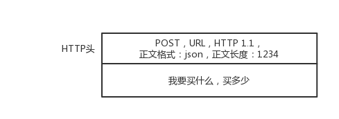
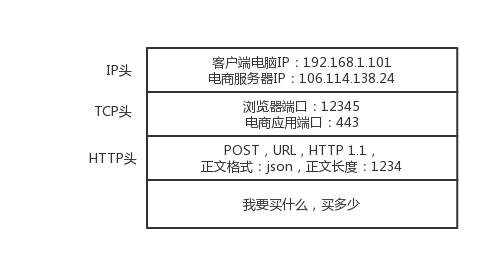
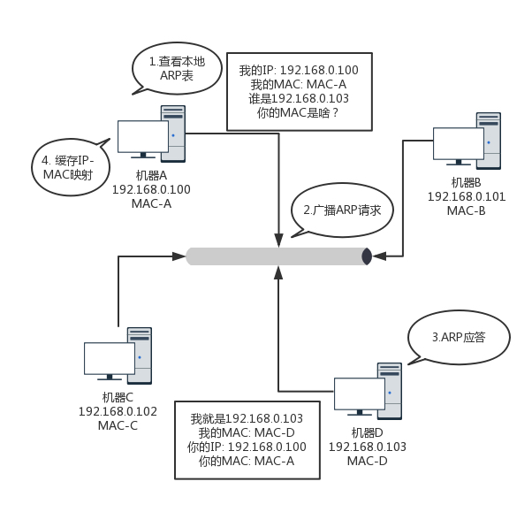
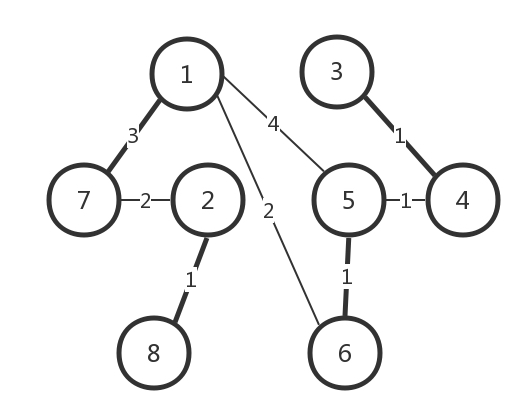
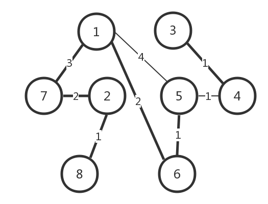
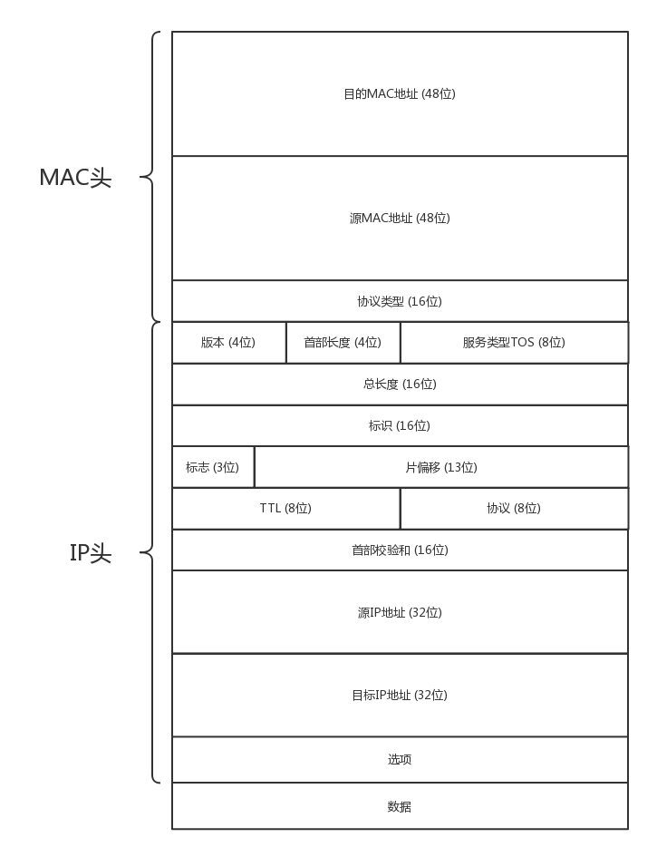
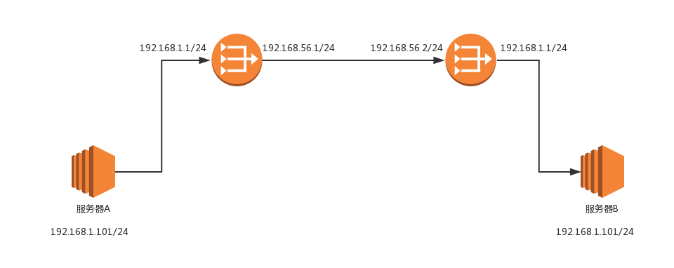
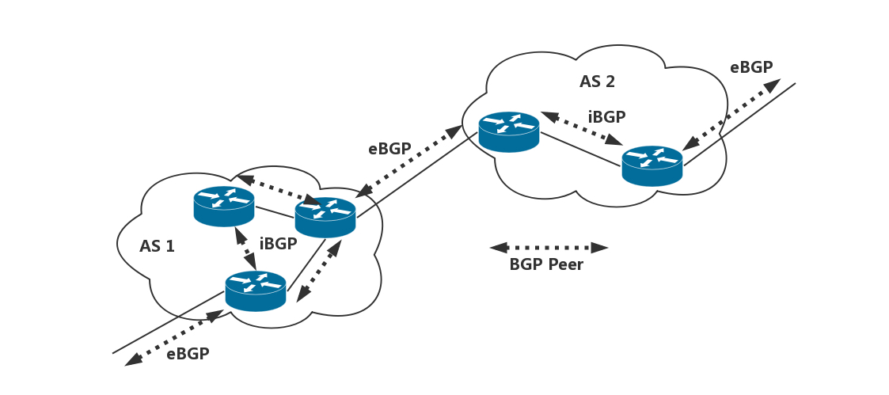

# 趣谈网络协议学习记录
## 0. 开篇词
略
## 1. 为什么要学习网络协议？
### 协议三要素
```
public class HelloWorld {
	public static void main(String[] args) {
		System.out.println("Hello World!");
	}
}
```
上面是计算机语言中的一种，它可以看成程序员控制一台计算机工作的协议。具备了协议的三要素。

- 语法，就是这一段内容要符合一定的规则和格式。例如，括号要成对，结束要使用分号等。
- 语义，就是这一段内容要代表某种意义。例如数字减去数字是有意义的，数字减去文本一般来说就没有意义。
- 顺序，就是先干啥，后干啥。例如，可以先加上某个数值，然后再减去某个数值。

```
HTTP/1.1 200 OK
Date: Tue, 27 Mar 2018 16:50:26 GMT
Content-Type: text/html;charset=UTF-8
Content-Language: zh-CN

<!DOCTYPE html>
<html>
<head>
<base href="https://pages.kaola.com/" />
<meta charset="utf-8"/> <title> 网易考拉 3 周年主会场 </title>
```
上面是 HTTP 协议，同样符合协议的三要素

- 语法，也就是说，只有按照上面那个格式来，浏览器才认。例如，上来是状态，然后是首部，然后是内容。
- 语义，就是要按照约定的意思来。例如，状态 200，表述的意思是网页成功返回。如果不成功，就是我们常见的“404”。
- 顺序，你一点浏览器，就是发送出一个 HTTP 请求，然后才有上面那一串 HTTP 返回的东西。

综上可以看出所有的协议都有语法、语义、顺序这三大要素。

### 从浏览器里面下单到浏览器呈现内容这一过程中涉及的协议

1. 浏览器中点击下单后浏览器根据 URL 通过地址簿协议 DNS 或者更加精准的地址簿查找协议HTTPDNS去查找 IP 地址。
2. 浏览器就开始打包它的请求。使用 HTTP 协议或者进行加密传输的 HTTPS 协议。协议里面都会写明“你要买什么和买多少”。
	
	
	
3. 上面 DNS、HTTP 所处的层称之为**应用层**。
4. 接下来由**传输层**来进行处理。传输层有两种协议，一种是无连接的协议 UDP，一种是面向连接的协议 TCP。所谓的面向连接意思就是，TCP 会保证这个包能够到达目的地。如果不能到达，就会重新发送，直至到达。TCP 协议里面会有两个端口，一个是浏览器监听的端口，一个是电商的服务器监听的端口。操作系统往往通过端口来判断，它得到的包应该给哪个进程。

	

5. 然后是**网络层**的 IP 协议。在 IP 协议里面会有源 IP 地址，即浏览器所在机器的 IP 地址和目标 IP 地址。

	

6. IP 地址相当于门牌号，可以通过它看出这个目标 IP 地址是本地人，还是外地人。如果是外地的就需要先查找网关。
7. 由于操作系统启动的时候，就会被 DHCP 协议配置 IP 地址，以及默认的网关的 IP 地址 192.168.1.1。这样以来可以通过 ARP 协议获取网关的 MAC 地址。这样以来就把 IP 包交给了 **MAC层**。
	
	
	
8. 网关（往往是一个路由器）收到包之后，会根据自己的路由表，判断下一步到某个 IP 地址应该怎么走。
9. 路由器有点像玄奘西行路过的一个个国家的一个个城关。每个城关都连着两个国家，每个国家相当于一个局域网，在每个国家内部，都可以使用本地的地址 MAC 进行通信。
10. 一旦跨越城关，就需要拿出 IP 头来，里面写着贫僧来自东土大唐（就是源 IP 地址），欲往西天拜佛求经（指的是目标 IP 地址）。路过宝地，借宿一晚，明日启行，请问接下来该怎么走啊？
11. 城关往往是知道接下来该怎么走的，因为城关和临近的城关也会经常沟通。到哪里应该怎么走，这种沟通的协议称为路由协议，常用的有OSPF和BGP。
12. 走到最后一个城关知道了自己就是这个网络包要去的地方。于是，对着自己所在的国家吼一声，谁是目标 IP 啊？目标服务器就会回复一个 MAC 地址。网络包过关后，通过这个 MAC 地址就能找到目标服务器。
13. 目标服务器发现 MAC 地址对上了，取下 MAC 头来，发送给操作系统的网络层。发现 IP 也对上了，就取下 IP 头。IP 头里会写上一层封装的是 TCP 协议，然后将其交给传输层，即 TCP 层。
14. 到达 TCP 层之后，TCP 头中有目标端口号，通过这个端口号，可以找到电商网站的进程正在监听这个端口号，假设一个 Tomcat，将这个包发给电商网站。
15. 电商网站的进程得到 HTTP 请求的内容，知道了要买东西，买多少。然后返回相应的内容的 HTTPS 的包。这个包，会像来的时候一样，经过千难万险到达你的个人电脑，最终进入浏览器，显示支付成功。

## 2. 网络分层的真实含义是什么？

### 不恰当的比喻
教科书或者老师往往会打一个十分不恰当的比喻：为什么网络要分层呀？因为不同的层次之间有不同的沟通方式，这个叫作协议。例如，一家公司也是分“层次”的，分总经理、经理、组长、员工。总经理之间有他们的沟通方式，经理和经理之间也有沟通方式，同理组长和员工。

#### 不恰当的原因
**所有不能表示出层层封装含义的比喻，都是不恰当的。** 在上面例子中总经理握手，不需要员工在吧，总经理之间谈什么，不需要员工参与吧，但是网络世界不是这样的。

比如 TCP 在三次握手的时候，IP 层和 MAC 层在做什么呢？当然是 TCP 发送每一个消息，都会带着 IP 层和 MAC 层了。因为，TCP 每发送一个消息，IP 层和 MAC 层的所有机制都要运行一遍。而你只看到 TCP 三次握手了，其实，IP 层和 MAC 层为此也忙活好久了。

**只要是在网络上跑的包，都是完整的。可以有下层没上层，绝对不可能有上层没下层。**

所以对 TCP 协议来说，三次握手也好，重试也好，只要想发出去包，就要有 IP 层和 MAC 层，不然是发不出去的。

### 更好的例子-发快递
1. 你准备发一件快递给一个朋友。
2. 快递员查询收件地址的邮编（DNS请求）
3. 打包快递，贴上快递单。（封装请求， 会话层）
4. 快递员封装一层盒子贴上快递单带回网店(传输层）
5. 到快递点检查是否区域快件（网络层）
6. 将快件交给运输车（链路层）
7. 各个快递转运中心（物理层）
8. 快件到达收件市转运中心（物理层）
9. 转运输车（链路层）
10. 到达区域分发（网络层）
11. 网点派送（传输层）
12. 快递员方面签收（会话层）
13. 拆开检查（表示层）
14. 收到快递（应用层）

## 3. ifconfig：最熟悉又陌生的命令行
### 命令行中怎么查看 IP 地址
在 Windows 上是 ipconfig，在 Linux 上是 ifconfig 或者 ip addr。
个别精简 Linux 系统中可能没有这些命令，需要安装 net-tools 和 iproute2 这两个工具。
### IP 地址是一个网卡在网络世界的通讯地址，相当于我们现实世界的门牌号码。
ipv4 中类似 10.100.122.2 就是一个 IP 地址。这个地址被点分隔为四个部分，每个部分 8 个 bit，所以 IP 地址总共是 32 位。
ipv4 的 IP 地址最初的时候被分成了以下 5 类。


对于 A、B、 C 类主要分两部分，前面一部分是网络号，后面一部分是主机号。比如大家都是六单元 1001 号，我是小区 A 的六单元 1001 号，而你是小区 B 的六单元 1001 号。网络号就是小区名称，主机好就是具体单元。

下面这个表格，详细地展示了 A、B、C 三类地址所能包含的主机的数量。


### 无类型域间选路（CIDR）

通过上面的表格可以看出 C 类地址包含的最大主机数太少了，而 B 类地址包含的又太多。在实际的使用过程中出现了各种问题。于是无类型域间选路（CIDR） 出现了。

将 32 位的 IP 地址一分为二，前面是网络号，后面是主机号。从哪里分呢？你如果注意观察的话可以看到，10.100.122.2/24，这个 IP 地址中有一个斜杠，斜杠后面有个数字 24。这种地址表示形式，就是 CIDR。后面 24 的意思是，32 位中，前 24 位是网络号，后 8 位是主机号。

伴随着 CIDR 存在的，一个是广播地址（broadcast），10.100.122.255。如果发送这个地址，所有 10.100.122 网络里面的机器都可以收到。另一个是子网掩码（netmask），255.255.255.0。

将子网掩码和 IP 地址进行 AND 计算。前面三个 255，转成二进制都是 1。1 和任何数值取 AND，都是原来数值，因而前三个数不变，为 10.100.122。后面一个 0，转换成二进制是 0，0 和任何数值取 AND，都是 0，因而最后一个数变为 0，合起来就是 10.100.122.0。这就是网络号。将子网掩码和 IP 地址按位计算 AND，就可得到网络号。

对于 16.158.165.91/22 这种不是 8 的整数倍的 CIDR 来说需要需要把它转化成二进制来看。16.158 的部分不会动，它占了前 16 位。中间的 165，变为二进制为10100101。除了前面的 16 位，还剩 6 位。所以，这 8 位中前 6 位是网络号，16.158.<101001>，而<01>.91 是机器号。

第一个地址是 16.158.<101001><00>.1，即 16.158.164.1。子网掩码是 255.255.<111111><00>.0，即 255.255.252.0。广播地址为 16.158.<101001><11>.255，即 16.158.167.255。

### 公有 IP 地址和私有 IP 地址
私有 IP 地址就像每个小区有自己的楼编号和门牌号，不同小区都可以有各个相同的编号。而公有 IP 就像街道名称，这个是政府进行分配管理的。 

192.168.0.x 是最常用的私有 IP 地址。能明显看出 192.168.0 是网络号，后面是主机号。而整个网络里面的第一个地址 192.168.0.1，往往就是你这个私有网络的出口地址。例如，你家里的电脑连接 Wi-Fi，Wi-Fi 路由器的地址就是 192.168.0.1，而 192.168.0.255 就是广播地址。一旦发送这个地址，整个 192.168.0 网络里面的所有机器都能收到。

### 解析
下面这个是 mac 上执行 ifconfig 后的部分输出
```
①lo0: flags=8049<UP,LOOPBACK,RUNNING,MULTICAST> mtu 16384
	options=1203<RXCSUM,TXCSUM,TXSTATUS,SW_TIMESTAMP>
	inet 127.0.0.1 netmask 0xff000000
	inet6 ::1 prefixlen 128
	inet6 fe80::1%lo0 prefixlen 64 scopeid 0x1
	nd6 options=201<PERFORMNUD,DAD>
①en0: ④flags=8863<UP,BROADCAST,SMART,RUNNING,SIMPLEX,MULTICAST> ⑤mtu 1500
	options=10b<RXCSUM,TXCSUM,VLAN_HWTAGGING,AV>
	③ether 78:7b:8a:d2:0d:65
	②inet6 fe80::b8:d1f6:4d2:dab5%en0 prefixlen 64 secured scopeid 0x6
	②inet 192.168.1.190 netmask 0xffffff00 broadcast 192.168.1.255
	nd6 options=201<PERFORMNUD,DAD>
	media: autoselect (100baseTX <full-duplex>)
	status: active
```
① 

- lo 全称是loopback，又称环回接口，往往会被分配到 127.0.0.1 这个地址。这个地址用于本机通信，经过内核处理后直接返回，不会在任何网络中出现。
- en 以太网接口，以太网接口与网卡对应，每个硬件网卡(一个MAC)对应一个以太网接口。

②

- inet: ipv4/ netmask: 子网掩码/ broadcast: 广播地址
- inet6: ipv6

③

- ether MAC 地址。MAC 地址全局唯一，不会有两个网卡有相同的 MAC 地址，而且网卡自生产出来，就带着这个地址。

④

网络设备的状态标识

- UP 表示网卡处于启动的状态；
- BROADCAST 表示这个网卡有广播地址，可以发送广播包；
- MULTICAST 表示网卡可以发送多播包；
- LOWER_UP 表示 L1 是启动的，也即网线插着呢。
- MTU1500 是指最大传输单元 MTU 为 1500，这是以太网的默认值。MTU 是二层 MAC 层的概念。MAC 层有 MAC 的头，以太网规定连 MAC 头带正文合起来，不允许超过 1500 个字节。正文里面有 IP 的头、TCP 的头、HTTP 的头。如果放不下，就需要分片来传输。

### MAC 地址
MAC 地址是一个很容易让人“误解”的地址。因为 MAC 地址号称全局唯一。很多人看到这里就会想，既然这样，整个互联网的通信，全部用 MAC 地址好了，只要知道了对方的 MAC 地址，就可以把信息传过去。

这样当然是不行的。一个网络包要从一个地方传到另一个地方，除了要有确定的地址，还需要有定位功能。而有门牌号码属性的 **IP 地址，才是有远程定位功能的**。

**MAC 地址更像是身份证，是一个唯一的标识**。它的唯一性设计是为了组网的时候，不同的网卡放在一个网络里面的时候，可以不用担心冲突。从硬件角度，保证不同的网卡有不同的标识。

MAC 地址是有一定定位功能的，只不过范围非常有限。你可以根据 IP 地址，找到杭州市网商路 599 号 B 楼 6 层，但是依然找不到我，你就可以靠吼了，大声喊身份证 XXXX 的是哪位？我听到了，我就会站起来说，是我啊。但是如果你在上海，到处喊身份证 XXXX 的是哪位，我不在现场，当然不会回答，因为我在杭州不在上海。

所以，MAC 地址的通信范围比较小，局限在一个子网里面。例如，从 192.168.0.2/24 访问 192.168.0.3/24 是可以用 MAC 地址的。一旦跨子网，即从 192.168.0.2/24 到 192.168.1.2/24，MAC 地址就不行了，需要 IP 地址起作用了。


## 4. DHCP 与 PXE：IP 是怎么来的，又是怎么没的？

### 如何配置 IP 地址？
可以自己利用命令行来配置 IP 地址。但是不按一定规则来配置的话就无法正常连接。

比如 192.168.1.6 就在你自己这台机器的旁边，甚至是在同一个交换机上，而你把自己的机器的地址设为了 16.158.23.6。这时当你往旁边的机器发送数据包的时候，知道了自己的 IP 地址，目标的 IP 地址 以及自己的 MAC 地址。还需要知道目的地的 MAC 地址，这时系统首先会判断，要去的这个地址和我是一个网段的吗，或者和我的一个网卡是同一网段的吗？只有是一个网段的，它才会发送 ARP 请求，获取 MAC 地址。如果发现不是它会发给网关，但是网关配置的时候系统会要求网关要和当前的网络至少一个网卡是同一个网段的。因此这样配置是显然不行的。因此手动配置 IP 的时候需要询问网络管理员，让他给分配合适的 IP。这样以来当局域网内的机器多起来，或者机器发生变动的时候都需要网络管理员来配置，这无疑是反人类的工作。

### 动态主机配置协议（DHCP）
动态主机配置协议（Dynamic Host Configuration Protocol），简称DHCP，它是一个自动配置 IP 的协议。DHCP 的方式就相当于租房。你不用装修，都是帮你配置好的。你暂时用一下，用完退租就可以了。

解析 DHCP 的工作方式

1. DHCP Discover
	当一台机器新加入一个网络的时候，使用 IP 地址 0.0.0.0 ，以 IP 地址 255.255.255.255 这个广播地址为目的地址发送了一个广播包。里面是自己的 MAC 地址。
	
	

2. DHCP Offer

	网络管理员在网络里面配置的 DHCP Server 会收到这个广播。由于 MAC 地址的唯一性 DHCP Server 就能知道这是个新来的机器，需要租给它一个 IP 地址。这时候 sever 以  255.255.255.255 这个广播地址为目的地址发送广播包。里面是之前接收的 MAC 地址以及新分配的 IP 地址。
	
	

3. DHCP Request

	新来的机器选取最先到达的 DHCP Offer ，然后发送一个 DHCP Request 广播包，里面是自己的 MAC 地址、接受的 IP 地址、提供 Offer 的 Sever 服务器地址等。通过这个广播来告诉所有的 Sever 自己接受了哪个 IP 地址。这样以来其他 Sever 就会撤销刚刚分配的 IP 地址，留待后用。
	
	由于还没有得到 DHCP Server 的最后确认，客户端仍然使用 0.0.0.0 为源 IP 地址、255.255.255.255 为目标地址进行广播。

	
	
4. DHCP ACK

	当 DHCP Server 接收到客户机的 DHCP request 之后，会广播返回给客户机一个 DHCP ACK 消息包，表明已经接受客户机的选择，并将这一 IP 地址的合法租用信息和其他的配置信息都放入该广播包，发给客户机。
	
	
	
### IP 地址的收回和续租

既然是租房子，就是有租期的。租期到了，管理员就要将 IP 收回。

客户机会在租期过去 50% 的时候，直接向为其提供 IP 地址的 DHCP Server 发送 DHCP request 消息包。客户机接收到该服务器回应的 DHCP ACK 消息包，会根据包中所提供的新的租期以及其他已经更新的 TCP/IP 参数，更新自己的配置。这样，IP 租用更新就完成了。

### 预启动执行环境（PXE）
简单了解了下，简单来说就是通过配置 DHCP Server 来租给 PXE 客户端一个 IP 地址，同时也给它 PXE 服务器的地址、启动文件 pxelinux.0，然后去 PXE 服务器下载这个文件后，就可以初始化机器。


## 5. 从物理层到 MAC 层：如何在宿舍里自己组网玩联机游戏？

### 第一层（物理层）
如果有一根网线一头插在一台电脑的网卡上，另一头插在另一台电脑的网卡上。普通的网线这样是通不了的（现在的网卡已经能自适应直连线了），这是因为水晶头的第 1、2 和第 3、6 脚，它们分别起着收、发信号的作用。这时候需要将一端的 1 号和 3 号线、2 号和 6 号线互换一下位置，就能够在物理层实现一端发送的信号，另一端能收到。这就是所谓的**1－3、2－6 交叉接法**。

连好电脑后还需要配置电脑的 IP 地址、子网掩码和默认网关，这些要按照上一节中介绍的相应规则配好。

把三台电脑连在一起的时候还需要一个叫作 Hub 的东西，也就是集线器。这种设备有多个口，可以将多台电脑连接起来。但是，和交换机不同，集线器没有大脑，它完全在物理层工作。它会将自己收到的每一个字节，都复制到其他端口上去。这是第一层物理层联通的方案。

### 第二层（数据链路层）
数据链路层，也即 MAC 层。MAC 的全称是 Medium Access Control，即媒体访问控制。它解决以下几个问题。

1.	这个包是发给谁的？谁应该接收？

	为了解决这个问题用到一个物理地址，叫作链路层地址。但是因为第二层主要解决媒体接入控制的问题，所以它常被称为MAC 地址。
	
2.	大家都在发，会不会产生混乱？有没有谁先发、谁后发的规则？

	这个问题的解决方案叫**多路访问**，主要由以下三种方式。
	
	- 方式一：分多个车道。每个车一个车道，你走你的，我走我的。这在计算机网络里叫作**信道划分**；
	- 方式二：今天单号出行，明天双号出行，轮着来。这在计算机网络里叫作**轮流协议**；
	- 方式三：不管三七二十一，有事儿先出门，发现特堵，就回去。错过高峰再出。我们叫作**随机接入协议**。著名的以太网，用的就是这个方式。
3.	如果发送的时候出现了错误，怎么办？

#### 第二层的网络包格式

对于以太网，第二层开头就是目标的 MAC 地址和源的 MAC 地址。


上图中所示的**类型**，大部分的类型是 IP 数据包，然后 IP 里面包含 TCP、UDP，以及 HTTP 等，这都是里层封装的事情。

上图中的 **CRC**，称为循环冗余检测。通过 XOR 异或的算法，来计算整个包是否在发送的过程中出现了错误。这个用来解决第三个问题。

通过这个目标 MAC 地址，数据包在链路上广播时，MAC 的网卡才能发现这个包是给它的。MAC 的网卡把包收进来，然后打开 IP 包，发现 IP 地址也是自己的，再打开 TCP 包，发现端口是自己，也就是 80，而 nginx 就是监听 80。
于是将请求提交给 nginx，nginx 返回一个网页。然后将网页需要发回请求的机器。然后层层封装，最后到 MAC 层。因为来的时候有源 MAC 地址，返回的时候，源 MAC 就变成了目标 MAC，再返给请求的机器。


### ARP 协议
当一个电脑知道目的电脑的 IP 地址的时候需要知道目的电脑的 MAC 地址。这样以来才能发出正确格式的网络包。这时候就需要 ARP 协议，也就是已知 IP 地址，求 MAC 地址的协议。



简单来说就是广而告之，发送一个广播包，谁是这个 IP 谁来回答。为了避免每次都用 ARP 请求，机器本地也会进行 ARP 缓存。当然机器会不断地上线下线，IP 也可能会变，所以 ARP 的 MAC 地址缓存过一段时间就会过期。

### 交换机

当局域网中机器数目少的时候通过 Hub 来连接是没什么问题的，但是一旦机器数目增多，问题就出现了。因为 Hub 是广播的，不管某个接口是否需要，所有的 Bit 都会被发送出去，然后让主机来判断是不是需要。这种方式路上的车少就没问题，车一多，产生冲突的概率就提高了。而且把不需要的包转发过去，纯属浪费。

这时候需要使用另外一种二层设备:**交换机**。

交换机是一个能把 MAC 头拿下来，检查一下目标 MAC 地址，然后根据策略转发的设备。

而且当一台 MAC1 电脑将一个包发送给另一台 MAC2 电脑时，当这个包到达交换机的时候，一开始交换机也不知道 MAC2 的电脑在哪个口，所以没办法，它只能将包转发给出了来的那个口之外的其他所有的口。但是，这个时候，交换机会干一件非常聪明的事情，就是交换机会记住，MAC1 是来自一个明确的口。以后有包的目的地址是 MAC1 的，直接发送到这个口就可以了。

当交换机作为一个关卡一样，过了一段时间之后，就有了整个网络的一个结构了，这个时候，基本上不用广播了，全部可以准确转发。当然，每个机器的 IP 地址会变，所在的口也会变，因而交换机上的学习的结果，我们称为转发表，是有一个过期时间的。

Q&A

1. 在二层中我们讲了 ARP 协议，即已知 IP 地址求 MAC；还有一种 RARP 协议，即已知 MAC 求 IP 的，你知道它可以用来干什么吗？

	之前有无盘工作站，即没有硬盘的机器，无法持久化ip地址到本地，但有网卡，所以可以用RARP协议来获取IP地址。RARP可以用于局域网管理员想指定机器IP（与机器绑定，不可变），又不想每台机器去设置静态IP的情况，可以在RARP服务器上配置MAC和IP对应的ARP表，不过获取每台机器的MAC地址，好像也挺麻烦的。这个协议现在应该用得不多了吧，都用BOOTP或者DHCP了。

2. 如果一个局域网里面有多个交换机，ARP 广播的模式会出现什么问题呢？

	ARP广播时，交换机会将一个端口收到的包转发到其它所有的端口上。
	比如数据包经过交换机A到达交换机B，交换机B又将包复制为多份广播出去。
	如果整个局域网存在一个环路，使得数据包又重新回到了最开始的交换机A，这个包又会被A再次复制多份广播出去。
	如此循环，数据包会不停得转发，而且越来越多，最终占满带宽，或者使解析协议的硬件过载，行成广播风暴。

## 6. 交换机与VLAN：办公室太复杂，我要回学校
办公室大多是一排排的桌子，每个桌子都有网口，一排十几个座位就有十几个网口，一个楼层就会有几十个甚至上百个网口。如果算上所有楼层，这个场景自然比宿舍里的复杂多了。
### 拓扑结构是怎么形成的？


上图中两台交换机连接着三个局域网，每个局域网上都有多台机器。
- 如果机器 1 只知道机器 4 的 IP 地址，当它想要访问机器 4，把包发出去的时候，它必须要知道机器 4 的 MAC 地址。
- 机器 1 发起广播，机器 2 收到这个广播，但是这不是找它的，所以没它什么事。交换机 A 一开始是不知道任何拓扑信息的，在它收到这个广播后，采取的策略是，除了广播包来的方向外，它还要转发给其他所有的网口。于是机器 3 也收到广播信息了，但是这和它也没什么关系。
- 交换机 B 也是能够收到广播信息的，但是这时候它也是不知道任何拓扑信息的，因而也是进行广播的策略，将包转发到局域网三。这个时候，机器 4 和机器 5 都收到了广播信息。机器 4 主动响应说，这是找我的，这是我的 MAC 地址。于是一个 ARP 请求就成功完成了。

在上面的过程中，交换机 A 和交换机 B 都是能够学习到这样的信息：机器 1 是在左边这个网口的。当了解到这些拓扑信息之后，情况就好转起来。当机器 2 要访问机器 1 的时候，机器 2 并不知道机器 1 的 MAC 地址，所以机器 2 会发起一个 ARP 请求。这个广播消息会到达机器 1，也同时会到达交换机 A。这个时候交换机 A 已经知道机器 1 是不可能在右边的网口的，所以这个广播信息就不会广播到局域网二和局域网三。
当机器 3 要访问机器 1 的时候，也需要发起一个广播的 ARP 请求。这个时候交换机 A 和交换机 B 都能够收到这个广播请求。交换机 A 当然知道主机 A 是在左边这个网口的，所以会把广播消息转发到局域网一。同时，交换机 B 收到这个广播消息之后，由于它知道机器 1 是不在右边这个网口的，所以不会将消息广播到局域网三。

### 如何解决常见的环路问题？

这样看起来，两台交换机工作得非常好。随着办公室越来越大，交换机数目肯定越来越多。当整个拓扑结构复杂了，这么多网线，绕过来绕过去，不可避免地会出现一些意料不到的情况。其中常见的问题就是环路问题。


我们来想象一下机器 1 访问机器 2 的过程。一开始，机器 1 并不知道机器 2 的 MAC 地址，所以它需要发起一个 ARP 的广播。广播到达机器 2，机器 2 会把 MAC 地址返回来，看起来没有这两个交换机什么事情。

但是问题来了，这两个交换机还是都能够收到广播包的。交换机 A 一开始是不知道机器 2 在哪个局域网的，所以它会把广播消息放到局域网二，在局域网二广播的时候，交换机 B 右边这个网口也是能够收到广播消息的。交换机 B 会将这个广播息信息发送到局域网一。局域网一的这个广播消息，又会到达交换机 A 左边的这个接口。交换机 A 这个时候还是不知道机器 2 在哪个局域网，于是将广播包又转发到局域网二。左转左转左转，好像是个圈哦。

可能有人会说，当两台交换机都能够逐渐学习到拓扑结构之后，是不是就可以了？

别想了，压根儿学不会的。机器 1 的广播包到达交换机 A 和交换机 B 的时候，本来两个交换机都学会了机器 1 是在局域网一的，但是当交换机 A 将包广播到局域网二之后，交换机 B 右边的网口收到了来自交换机 A 的广播包。根据学习机制，这彻底损坏了交换机 B 的三观，刚才机器 1 还在左边的网口呢，怎么又出现在右边的网口呢？哦，那肯定是机器 1 换位置了，于是就误会了，交换机 B 就学会了，机器 1 是从右边这个网口来的，把刚才学习的那一条清理掉。同理，交换机 A 右边的网口，也能收到交换机 B 转发过来的广播包，同样也误会了，于是也学会了，机器 1 从右边的网口来，不是从左边的网口来。

然而当广播包从左边的局域网一广播的时候，两个交换机再次刷新三观，原来机器 1 是在左边的，过一会儿，又发现不对，是在右边的，过一会，又发现不对，是在左边的。

这还是一个包转来转去，每台机器都会发广播包，交换机转发也会复制广播包，当广播包越来越多的时候，按照上一节讲过一个共享道路的算法，也就是路会越来越堵，最后谁也别想走。所以，必须有一个方法解决环路的问题，怎么破除环路呢？

### STP 协议
在数据结构中，有一个方法叫作**最小生成树**。有环的我们常称为图。将图中的环破了，就生成了树。在计算机网络中，生成树的算法叫作STP，全称 Spanning Tree Protocol。

* Root Bridge，也就是**根交换机**。这个比较容易理解，可以比喻为“掌门”交换机，是某棵树的老大，是掌门，最大的大哥。
* Designated Bridges，有的翻译为**指定交换机**。这个比较难理解，可以想像成一个“小弟”，对于树来说，就是一棵树的树枝。所谓“指定”的意思是，我拜谁做大哥，其他交换机通过这个交换机到达根交换机，也就相当于拜他做了大哥。这里注意是树枝，不是叶子，因为叶子往往是主机。
* Bridge Protocol Data Units （BPDU） ，**网桥协议数据单元**。可以比喻为“相互比较实力”的协议。行走江湖，比的就是武功，拼的就是实力。当两个交换机碰见的时候，也就是相连的时候，就需要互相比一比内力了。BPDU 只有掌门能发，已经隶属于某个掌门的交换机只能传达掌门的指示。
* Priority Vector，**优先级向量**。可以比喻为实力 （值越小越牛）。实力是啥？就是一组 ID 数目，[Root Bridge ID, Root Path Cost, Bridge ID, and Port ID]。为什么这样设计呢？这是因为要看怎么来比实力。先看 Root Bridge ID。拿出老大的 ID 看看，发现掌门一样，那就是师兄弟；再比 Root Path Cost，也即我距离我的老大的距离，也就是拿和掌门关系比，看同一个门派内谁和老大关系铁；最后比 Bridge ID，比我自己的 ID，拿自己的本事比。

##### STP 的工作过程
一开始，江湖纷争，异常混乱。大家都觉得自己是掌门，谁也不服谁。于是，所有的交换机都认为自己是掌门，每个网桥都被分配了一个 ID。这个 ID 里有管理员分配的优先级，当然网络管理员知道哪些交换机贵，哪些交换机好，就会给它们分配高的优先级。这种交换机生下来武功就很高，起步就是乔峰。（下图中连线的数字表示两个点之间的距离）


既然都是掌门，互相都连着网线，就互相发送 BPDU 来比功夫呗。这一比就发现，有人是岳不群，有人是封不平，赢的接着当掌门，输的就只好做小弟了。当掌门的还会继续发 BPDU，而输的人就没有机会了。它们只有在收到掌门发的 BPDU 的时候，转发一下，表示服从命令。 



数字表示优先级。就像这个图，5 和 6 碰见了，6 的优先级低，所以乖乖做小弟。于是一个小门派形成，5 是掌门，6 是小弟。其他诸如 1-7、2-8、3-4 这样的小门派，也诞生了。于是江湖出现了很多小的门派，小的门派，接着合并。

合并的过程会出现以下四种情形，我分别来介绍。

##### 情形一：掌门遇到掌门

当 5 碰到了 1，掌门碰见掌门，1 觉得自己是掌门，5 也刚刚跟别人 PK 完成为掌门。这俩掌门比较功夫，最终 1 胜出。于是输掉的掌门 5 就会率领所有的小弟归顺。结果就是 1 成为大掌门。


##### 情形二：同门相遇

同门相遇可以是掌门与自己的小弟相遇，这说明存在“环”了。这个小弟已经通过其他门路拜在你门下，结果你还不认识，就 PK 了一把。结果掌门发现这个小弟功夫不错，不应该级别这么低，就把它招到门下亲自带，那这个小弟就相当于升职了。
我们再来看，假如 1 和 6 相遇。6 原来就拜在 1 的门下，只不过 6 的上司是 5，5 的上司是 1。1 发现，6 距离我才只有 2，比从 5 这里过来的 5（=4+1）近多了，那 6 就直接汇报给我吧。于是，5 和 6 分别汇报给 1。


同门相遇还可以是小弟相遇。这个时候就要比较谁和掌门的关系近，当然近的当大哥。刚才 5 和 6 同时汇报给 1 了，后来 5 和 6 再比较功夫的时候发现，5 你直接汇报给 1 距离是 4，如果 5 汇报给 6 再汇报给 1，距离只有 2+1=3，所以 5 干脆拜 6 为上司。

##### 情形三：掌门与其他帮派小弟相遇

小弟拿本帮掌门和这个掌门比较，赢了，这个掌门拜入门来。输了，会拜入新掌门，并且逐渐拉拢和自己连接的兄弟，一起弃暗投明。



例如，2 和 7 相遇，虽然 7 是小弟，2 是掌门。就个人武功而言，2 比 7 强，但是 7 的掌门是 1，比 2 牛，所以没办法，2 要拜入 7 的门派，并且连同自己的小弟都一起拜入。

##### 情形四：不同门小弟相遇

各自拿掌门比较，输了的拜入赢的门派，并且逐渐将与自己连接的兄弟弃暗投明。  


例如，5 和 4 相遇。虽然 4 的武功好于 5，但是 5 的掌门是 1，比 4 牛，于是 4 拜入 5 的门派。后来当 3 和 4 相遇的时候，3 发现 4 已经叛变了，4 说我现在老大是 1，比你牛，要不你也来吧，于是 3 也拜入 1。

这样最终生成一棵树。这样以来有环路的图就变成没有环路的树，从而解决环路问题。

### 如何解决广播问题和安全问题？VLAN

毕竟机器多了，交换机也多了，就算交换机比 Hub 智能一些，但是还是难免有广播的问题，一大波机器，相关的部门、不相关的部门，广播一大堆，性能就下来了。就像一家公司，创业的时候，一二十个人，坐在一个会议室，有事情大家讨论一下，非常方便。但是如果变成了 50 个人，全在一个会议室里面吵吵，就会乱的不得了。

你们公司有不同的部门，有的部门需要保密的，比如人事部门，肯定要讨论升职加薪的事儿。由于在同一个广播域里面，很多包都会在一个局域网里面飘啊飘，碰到了一个会抓包的程序员，就能抓到这些包，如果没有加密，就能看到这些敏感信息了。还是上面的例子，50 个人在一个会议室里面七嘴八舌的讨论，其中有两个 HR，那他们讨论的问题，肯定被其他人偷偷听走了。

那咋办，分部门，分会议室呗。那我们就来看看怎么分。

- 物理隔离。每个部门设一个单独的会议室，对应到网络方面，就是每个部门有单独的交换机，配置单独的子网，这样部门之间的沟通就需要路由器了。路由器咱们还没讲到，以后再说。这样的问题在于，有的部门人多，有的部门人少。人少的部门慢慢人会变多，人多的部门也可能人越变越少。如果每个部门有单独的交换机，口多了浪费，少了又不够用。
- 虚拟隔离，就是用我们常说的 **VLAN** ，或者叫虚拟局域网。使用了 VLAN 后原来的二层头上回加上一个 TAG 如下所示。


TAG 里面有一个 VLAN ID，一共 12 位。如果我们买的交换机是支持 VLAN 的，当这个交换机把二层的头取下来的时候，就能够识别这个 VLAN ID。这样只有相同 VLAN 的包，才会互相转发，不同 VLAN 的包，是看不到的。这样广播问题和安全问题就都能够解决了。


对于支持 VLAN 的交换机，有一种口叫作 Trunk 口。它可以转发属于任何 VLAN 的口。交换机之间通过这种口相互连接。

### Q&A
1. STP 协议能够很好的解决环路问题，但是也有它的缺点，你能举几个例子吗？
	STP 对于跨地域甚至跨国组织的网络支持，就很难做了，计算量太大。	
	一个是某个交换机状态发生变化的时候，整个树需要重新构建，另一个是被破开的环的链路被浪费了。
2. 在一个比较大的网络中，如果两台机器不通，你知道应该用什么方式调试吗？
	先ping，不通的话traceroute，参数逐渐加一。

## 7. ICMP 与 ping：投石问路的侦察兵
### ICMP 协议的格式
ICMP 全称 Internet Control Message Protocol，就是互联网控制报文协议。这里面的关键词是“控制”。

ICMP 报文是封装在 IP 包里面的。作为侦查兵传输指令的时候，肯定需要源地址和目标地址。


### 查询报文类型

常用的ping 就是查询报文，作用是主动查看敌情，对应 ICMP 的查询报文类型。它是一种主动请求，并且获得主动应答的 ICMP 协议。所以，ping 发的包也是符合 ICMP 协议格式的，只不过它在后面增加了自己的格式。多了两个字段，一个是标识符，另一个是序号。

- 标识符。这个很好理解，你派出去两队侦查兵，一队是侦查战况的，一队是去查找水源的，要有个标识才能区分。
- 序号，你派出去的侦查兵，都要编个号。如果派出去 10 个，回来 10 个，就说明前方战况不错；如果派出去 10 个，回来 2 个，说明情况可能不妙。

对 ping 的主动请求，进行网络抓包，称为 ICMP ECHO REQUEST。同理主动请求的回复，称为 ICMP ECHO REPLY。

选项数据中，ping 还会存放发送请求的时间值，来计算往返时间，说明路程的长短。

### 差错报文类型
#### 第一种是终点不可达。
小兵：报告主公，您让把粮草送到张将军那里，结果没有送到。
如果你是主公，你肯定会问，为啥送不到？具体的原因在代码中表示就是，网络不可达代码为 0，主机不可达代码为 1，协议不可达代码为 2，端口不可达代码为 3，需要进行分片但设置了不分片位代码为 4。
具体的场景就像这样：
* 网络不可达（0）：主公，找不到地方呀？
* 主机不可达（1）：主公，找到地方没这个人呀？
* 协议不可达（2）：主公，找到地方，找到人，口号没对上，人家天王盖地虎，我说 12345！
* 端口不可达（3）：主公，找到地方，找到人，对了口号，事儿没对上，我去送粮草，人家说他们在等救兵。
* 需要进行分片但设置了不分片位（4）：主公，走到一半，山路狭窄，想换小车，但是您的将令，严禁换小车，就没办法送到了。

#### 第二种是源站抑制
也就是让源站放慢发送速度。小兵：报告主公，您粮草送的太多了吃不完。
#### 第三种是时间超时
也就是超过网络包的生存时间还是没到。小兵：报告主公，送粮草的人，自己把粮草吃完了，还没找到地方，已经饿死啦。
#### 第四种是路由重定向
也就是让下次发给另一个路由器。小兵：报告主公，上次送粮草的人本来只要走一站地铁，非得从五环绕，下次别这样了啊。

差错报文的结构相对复杂一些。除了前面还是 IP，ICMP 的前 8 字节不变，后面则跟上出错的那个 IP 包的 IP 头和 IP 正文的前 8 个字节。

而且这类侦查兵特别恪尽职守，不但自己返回来报信，还把一部分遗物也带回来。
* 侦察兵：报告主公，张将军已经战死沙场，这是张将军的印信和佩剑。
* 主公：神马？张将军是怎么死的（可以查看 ICMP 的前 8 字节）？没错，这是张将军的剑，是他的剑（IP 数据包的头及正文前 8 字节）。

### ping 的发送和接收过程


这只是最简单的，同一个局域网里面的情况。如果跨网段的话，还会涉及网关的转发、路由器的转发等等。这个过程后面几节会详细描述。
## 8. 世界这么大，我想出网关：欧洲十国游与玄奘西行
### 怎么在宿舍上网？
#### 第一个办法，让你们宿舍长再买一个网卡
这个时候，你们宿舍长的电脑里就有两张网卡。一张网卡的线插到你们宿舍的交换机上，另一张网卡的线插到校园网的网口。而且，这张新的网卡的 IP 地址要按照学校网管部门分配的配置，不然上不了网。这种情况下，如果你们宿舍的人要上网，就需要一直开着宿舍长的电脑。
#### 第二个办法，你们共同出钱买个家庭路由器
家庭路由器会有内网网口和外网网口。把外网网口的线插到校园网的网口上，将这个外网网口配置成和网管部的一样。内网网口连上你们宿舍的所有的电脑。这种情况下，如果你们宿舍的人要上网，就需要一直开着路由器。

这两种方法其实是一样的。只不过第一种方式，让你的宿舍长的电脑，变成一个有多个口的路由器而已。而你买的家庭路由器，里面也跑着程序，和你宿舍长电脑里的功能一样，只不过是一个嵌入式的系统。

###  MAC 头和 IP 头的细节


在任何一台机器上，当要访问另一个 IP 地址的时候，都会先通过 CIDR 和子网掩码判断，这个目标 IP 地址，和当前机器的 IP 地址，是否在同一个网段。

#### 如果是同一个网段
例如，你访问你旁边的兄弟的电脑，那就没网关什么事情，直接将源地址和目标地址放入 IP 头中，然后通过 ARP 获得 MAC 地址，将源 MAC 和目的 MAC 放入 MAC 头中，发出去就可以了。
#### 如果不是同一网段
例如，你要访问你们校园网里面的 BBS，该怎么办？这就需要发往默认网关 Gateway。Gateway 的地址一定是和源 IP 地址是一个网段的。往往不是第一个，就是第二个。例如 192.168.1.0/24 这个网段，Gateway 往往会是 192.168.1.1/24 或者 192.168.1.2/24。

#### 网关
如何发往默认网关呢？网关不是和源 IP 地址是一个网段的么？这个过程就和发往同一个网段的其他机器是一样的：将源地址和目标 IP 地址放入 IP 头中，通过 ARP 获得网关的 MAC 地址，将源 MAC 和网关的 MAC 放入 MAC 头中，发送出去。网关所在的端口，例如 192.168.1.1/24 将网络包收进来，然后接下来怎么做，就完全看网关的了。

网关往往被认为是由路由器来担任，它是一个三层转发的设备。就是把 MAC 头和 IP 头都取下来，然后根据里面的内容，看看接下来把包往哪里转发的设备。

**实际上路由器是一台设备，它有五个网口或者网卡，相当于有五只手，分别连着五个局域网。每只手的 IP 地址都和局域网的 IP 地址相同的网段，每只手都是它握住的那个局域网的网关。**

任何一个想发往其他局域网的包，都会到达其中一只手，被拿进来，拿下 MAC 头和 IP 头，看看，根据自己的路由算法，选择另一只手，加上 IP 头和 MAC 头，然后扔出去。

### 静态路由
**静态路由，其实就是在路由器上，配置一条一条规则**。这些规则包括：想访问 BBS 站（它肯定有个网段），从 2 号口出去，下一跳是 IP2；想访问教学视频站（它也有个自己的网段），从 3 号口出去，下一跳是 IP3，然后保存在路由器里。
每当要选择从哪只手抛出去的时候，就一条一条的匹配规则，找到符合的规则，就按规则中设置的那样，从某个口抛出去，找下一跳的 IP。

### 转发过程中 IP 头和 MAC 头的变化
MAC 地址是一个局域网内才有效的地址。因而，MAC 地址只要过网关，就必定会改变，因为已经换了局域网。两者主要的区别在于 IP 地址是否改变。不改变 IP 地址的网关，我们称为 **转发网关**；改变 IP 地址的网关，我们称为 **NAT 网关**。
#### 转发网关型


这个过程中，每到一个新的局域网，MAC 都是要变的，但是 IP 地址都不变。在 IP 头里面，不会保存任何网关的 IP 地址。所谓的下一跳是，某个 IP 要将这个 IP 地址的 MAC 放入 MAC 头。

这种模式比喻称为欧洲十国游，是因为在整个过程中，IP 头里面的地址都是不变的。IP 地址在三个局域网都可见，在三个局域网之间的网段都不会冲突。在三个网段之间传输包，IP 头不改变。这就像在欧洲各国之间旅游，一个签证就能搞定。
#### NAT 网关型

上面的例子固然可以实现，但是我们经常会碰到的问题是，局域网之间没有商量过，各定各的网段，因而 IP 段冲突了。最左面服务器 A 的地址是 192.168.1.101，最右面服务器 B 的地址也是 192.168.1.101，如果单从 IP 地址上看，简直是自己访问自己，其实是 A 的 192.168.1.101 要访问 B 的 192.168.1.101。

这时候可以使用 NAT（Network Address Translator）。它用于在本地网络中使用私有地址，在连接互联网时转而使用全局IP地址。服务器 B 接收的包 的源 IP 为服务器 A 的国际身份，因而发送返回包的时候，也发给这个国际身份，由路由器 A 做 NAT，转换为国内身份。

现在大家每家都有家用路由器，家里的网段都是 192.168.1.x，所以你肯定访问不了你邻居家的这个私网的 IP 地址的。所以，当我们家里的包发出去的时候，都被家用路由器 NAT 成为了运营商的地址了。

## 9. 路由协议：西出网关无故人，敢问路在何方
### 路由表
路由器就是一台网络设备，它有多张网卡。当一个入口的网络包送到路由器时，它会根据一个本地的转发信息库，来决定如何正确地转发流量。这个转发信息库通常被称为路由表。

一张路由表中会有多条路由规则。每一条规则至少包含这三项信息。
* 目的网络：这个包想去哪儿？
* 出口设备：将包从哪个口扔出去？
* 下一跳网关：下一个路由器的地址。

ps. route 命令和 ip route 命令都可以进行查询或者配置。

比如我们设置 ip route add 10.176.48.0/20 via 10.173.32.1 dev eth0，就说明要去 10.176.48.0/20 这个目标网络，要从 eth0 端口出去，经过 10.173.32.1。

### 配置策略路由
在真实的复杂的网络环境中，除了可以根据目的 ip 地址配置路由外，还可以根据多个参数来配置路由，这就称为策略路由。

可以根据源 IP 地址、入口设备、TOS 等配置不同的路由表，然后在路由表中查找路由。这样可以使得来自不同来源的包走不同的路由。

```
ip rule add from 192.168.1.0/24 table 10 
ip rule add from 192.168.2.0/24 table 20
```

通过上面的配置就可以实现从 192.168.1.10/24 这个网段来的，使用 table 10 中的路由表，而从 192.168.2.0/24 网段来的，使用 table20 的路由表。

一条路由规则中，也可以走多条路径。

```
ip route add default scope global nexthop via 100.100.100.1 weight 1 nexthop via 200.200.200.1 weight 2
```
下一跳有两个地方，分别是 100.100.100.1 和 200.200.200.1，权重分别为 1 比 2。

### 动态路由算法
使用动态路由路由器，可以根据路由协议算法生成动态路由表，随网络运行状况的变化而变化。
可以将复杂的路径，抽象为一种叫作图的数据结构。而且肯定走得路越少越好，道路越短越好，因而这就转化成为如何在途中找到最短路径的问题。

#### 1. 距离矢量路由算法，基于 Bellman-Ford 算法
这种算法的基本思路是，每个路由器都保存一个路由表，包含多行，每行对应网络中的一个路由器，每一行包含两部分信息，一个是要到目标路由器，从那条线出去，另一个是到目标路由器的距离。

由此可以看出，每个路由器都是知道全局信息的。那这个信息如何更新呢？每个路由器都知道自己和邻居之间的距离，每过几秒，每个路由器都将自己所知的到达所有的路由器的距离告知邻居，每个路由器也能从邻居那里得到相似的信息。

每个路由器根据新收集的信息，计算和其他路由器的距离，比如自己的一个邻居距离目标路由器的距离是 M，而自己距离邻居是 x，则自己距离目标路由器是 x + M。

###### 问题
1. 好消息传得快，坏消息传得慢。
如果有个路由器加入了这个网络，它的邻居就能很快发现它，然后将消息广播出去。要不了多久，整个网络就都知道了。但是一旦一个路由器挂了，挂的消息是没有广播的。当每个路由器发现原来的道路到不了这个路由器的时候，感觉不到它已经挂了，而是试图通过其他的路径访问，直到试过了所有的路径，才发现这个路由器是真的挂了。


最后一步会重复进行，数越来越大，直到超过一个阈值，我们才能判定 A 真的挂了。

2. 每次发送的时候，要发送整个全局路由表。
最早的路由协议 RIP 就是这个算法，但是当网络大了，谁也受不了这么大的数据量。

#### 2. 链路状态路由算法，基于 Dijkstra 算法
这种算法的基本思路是：当一个路由器启动的时候，首先是发现邻居，向邻居 say hello，邻居都回复。然后计算和邻居的距离，发送一个 echo，要求马上返回，除以二就是距离。然后将自己和邻居之间的链路状态包广播出去，发送到整个网络的每个路由器。这样每个路由器都能够收到它和邻居之间的关系的信息。因而，每个路由器都能在自己本地构建一个完整的图，然后针对这个图使用 Dijkstra 算法，找到两点之间的最短路径。

不像距离距离矢量路由协议那样，更新时发送整个路由表。链路状态路由协议只广播更新的或改变的网络拓扑，这使得更新信息更小，节省了带宽和 CPU 利用率。而且一旦一个路由器挂了，它的邻居都会广播这个消息，可以使得坏消息迅速收敛。

### 动态路由协议
#### 1. 基于链路状态路由算法的 OSPF
OSPF（Open Shortest Path First，开放式最短路径优先）就是这样一个基于链路状态路由协议，广泛应用在数据中心中的协议。由于主要用在数据中心内部，用于路由决策，因而称为内部网关协议（Interior Gateway Protocol，简称IGP）。

内部网关协议的重点就是找到最短的路径。在一个组织内部，路径最短往往最优。当然有时候 OSPF 可以发现多个最短的路径，可以在这多个路径中进行负载均衡，这常常被称为等价路由。

有了等价路由，到一个地方去可以有相同的两个路线，可以分摊流量，还可以当一条路不通的时候，走另外一条路。这个在后面我们讲数据中心的网络的时候，一般应用的接入层会有负载均衡 LVS。它可以和 OSPF 一起，实现高吞吐量的接入层设计。

#### 2. 基于距离矢量路由算法的 BGP
但是外网的路由协议，也即国家之间的，又有所不同。我们称为外网路由协议（Border Gateway Protocol，简称BGP）。

在一个国家内部，有路当然选近的走。但是国家之间，不光远近的问题，还有政策的问题。例如，唐僧去西天取经，有的路近。但是路过的国家看不惯僧人，见了僧人就抓。例如灭法国，连光头都要抓。这样的情况即便路近，也最好绕远点走。

对于网络包同样，每个数据中心都设置自己的 Policy。例如，哪些外部的 IP 可以让内部知晓，哪些内部的 IP 可以让外部知晓，哪些可以通过，哪些不能通过。这就好比，虽然从我家里到目的地最近，但是不能谁都能从我家走啊！

在网络世界，这一个个国家成为自治系统AS（Autonomous System）。自治系统分几种类型。
* Stub AS：对外只有一个连接。这类 AS 不会传输其他 AS 的包。例如，个人或者小公司的网络。
* Multihomed AS：可能有多个连接连到其他的 AS，但是大多拒绝帮其他的 AS 传输包。例如一些大公司的网络。
* Transit AS：有多个连接连到其他的 AS，并且可以帮助其他的 AS 传输包。例如主干网。



BGP 又分为两类，eBGP 和 iBGP。自治系统间，边界路由器之间使用 eBGP 广播路由。内部网络也需要访问其他的自治系统。边界路由器如何将 BGP 学习到的路由导入到内部网络呢？就是通过运行 iBGP，使得内部的路由器能够找到到达外网目的地的最好的边界路由器。
BGP 协议使用的算法是路径矢量路由协议（path-vector protocol）。它是距离矢量路由协议的升级版。

前面说了距离矢量路由协议的缺点。其中一个是收敛慢。在 BGP 里面，除了下一跳 hop 之外，还包括了自治系统 AS 的路径，从而可以避免坏消息传的慢的问题，也即上面所描述的，B 知道 C 原来能够到达 A，是因为通过自己，一旦自己都到达不了 A 了，就不用假设 C 还能到达 A 了。

另外，在路径中将一个自治系统看成一个整体，不区分自治系统内部的路由器，这样自治系统的数目是非常有限的。就像大家都能记住出去玩，从中国出发先到韩国然后到日本，只要不计算细到具体哪一站，就算是发送全局信息，也是没有问题的。

## 10. UDP协议：因性善而简单，难免碰到“城会玩”
### TCP 和 UDP 有哪些区别？
大部分人会回答，TCP 是面向连接的，UDP 是面向无连接的。

**其实所谓的建立连接，是为了在客户端和服务端维护连接，而建立一定的数据结构来维护双方交互的状态，用这样的数据结构来保证所谓的面向连接的特性。**

1. TCP 提供可靠交付。通过 TCP 连接传输的数据，无差错、不丢失、不重复、并且按序到达。我们都知道 IP 包是没有任何可靠性保证的，一旦发出去，就像西天取经，走丢了、被妖怪吃了，都只能随它去。但是 TCP 号称能做到那个连接维护的程序做的事情。而 UDP 继承了 IP 包的特性，不保证不丢失，不保证按顺序到达。
2. TCP 是面向字节流的。发送的时候发的是一个流。IP 包可不是一个流，而是一个个的 IP 包。之所以变成了流，这也是 TCP 自己的状态维护做的事情。而 UDP 继承了 IP 的特性，基于数据报的，一个一个地发，一个一个地收。
3. TCP 是可以有拥塞控制的。它意识到包丢弃了或者网络的环境不好了，就会根据情况调整自己的行为，看看是不是发快了，要不要发慢点。UDP 就不会，应用让我发，我就发，管它洪水滔天。

总之：**TCP 其实是一个有状态服务**，通俗地讲就是有脑子的，里面精确地记着发送了没有，接收到没有，发送到哪个了，应该接收哪个了，错一点儿都不行。而 **UDP 则是无状态服务**。通俗地说是没脑子的，天真无邪的，发出去就发出去了。

### UDP 包的头部


在 IP 头里面有个 8 位协议，用来存放数据里面到底是 TCP 还是 UDP。如果是 UDP 就按照 UDP 解析。

可以看到 UDP 包的头部是很简单的，只有端口号。而无论应用程序写的使用 TCP 传数据，还是 UDP 传数据，都要监听一个端口。根据端口号，将数据交给相应的应用程序。

### UDP 的三大特点
1. 沟通简单，不需要大量的数据结构、处理逻辑、包头字段。相信网络通路默认就是很容易送达的，不容易被丢弃的。
2. 轻信他人。它不会建立连接，虽然有端口号，但是监听在这个地方，谁都可以传给他数据，他也可以传给任何人数据，甚至可以同时传给多个人数据。
3. 愣头青，做事不懂权变。它不会根据网络的情况进行发包的拥塞控制，无论网络丢包丢成啥样了，它该怎么发还怎么发。

### UDP 的三大使用场景
#### 1. 需要资源少，在网络情况比较好的内网，或者对于丢包不敏感的应用。
 DHCP 就是基于 UDP 协议的。一般的获取 IP 地址都是内网请求，而且一次获取不到 IP 又没事，过一会儿还有机会。我们讲过 PXE 可以在启动的时候自动安装操作系统，操作系统镜像的下载使用的 TFTP，这个也是基于 UDP 协议的。在还没有操作系统的时候，客户端拥有的资源很少，不适合维护一个复杂的状态机，而是因为是内网，一般也没啥问题。
 #### 2. 不需要一对一沟通，建立连接，而是可以广播的应用。
 UDP 的不面向连接的功能，可以使得可以承载广播或者多播的协议。DHCP 就是一种广播的形式，就是基于 UDP 协议的，而广播包的格式前面说过了。

对于多播，我们在讲 IP 地址的时候，讲过一个 D 类地址，也即组播地址，使用这个地址，可以将包组播给一批机器。当一台机器上的某个进程想监听某个组播地址的时候，需要发送 IGMP 包，所在网络的路由器就能收到这个包，知道有个机器上有个进程在监听这个组播地址。当路由器收到这个组播地址的时候，会将包转发给这台机器，这样就实现了跨路由器的组播。

#### 3. 需要处理速度快，时延低，可以容忍少数丢包，但是要求即便网络拥塞，也毫不退缩，一往无前的时候。
UDP 简单、处理速度快，不像 TCP 那样，操这么多的心，各种重传啊，保证顺序啊，前面的不收到，后面的没法处理啊。不然等这些事情做完了，时延早就上去了。而 TCP 在网络不好出现丢包的时候，拥塞控制策略会主动的退缩，降低发送速度，这就相当于本来环境就差，还自断臂膀，用户本来就卡，这下更卡了。

当前很多应用都是要求低时延的，它们可不想用 TCP 如此复杂的机制，而是想根据自己的场景，实现自己的可靠和连接保证。例如，如果应用自己觉得，有的包丢了就丢了，没必要重传了，就可以算了，有的比较重要，则应用自己重传，而不依赖于 TCP。有的前面的包没到，后面的包到了，那就先给客户展示后面的嘛，干嘛非得等到齐了呢？如果网络不好，丢了包，那不能退缩啊，要尽快传啊，速度不能降下来啊，要挤占带宽，抢在客户失去耐心之前到达。

### 基于 UDP 的五个例子
#### 1. 网页或者 APP 的访问
原来访问网页和手机 APP 都是基于 HTTP 协议的。HTTP 协议是基于 TCP 的，建立连接都需要多次交互，对于时延比较大的目前主流的移动互联网来讲，建立一次连接需要的时间会比较长，然而既然是移动中，TCP 可能还会断了重连，也是很耗时的。而且目前的 HTTP 协议，往往采取多个数据通道共享一个连接的情况，这样本来为了加快传输速度，但是 TCP 的严格顺序策略使得哪怕共享通道，前一个不来，后一个和前一个即便没关系，也要等着，时延也会加大。

**QUIC（全称Quick UDP Internet Connections，快速 UDP 互联网连接）**是 Google 提出的一种基于 UDP 改进的通信协议，其目的是降低网络通信的延迟，提供更好的用户互动体验。QUIC 在应用层上，会自己实现快速连接建立、减少重传时延，自适应拥塞控制。

#### 2. 流媒体的协议
现在直播比较火，直播协议多使用 RTMP，这个协议我们后面的章节也会讲，而这个 RTMP 协议也是基于 TCP 的。TCP 的严格顺序传输要保证前一个收到了，下一个才能确认，如果前一个收不到，下一个就算包已经收到了，在缓存里面，也需要等着。对于直播来讲，这显然是不合适的，因为老的视频帧丢了其实也就丢了，就算再传过来用户也不在意了，他们要看新的了，如果老是没来就等着，卡顿了，新的也看不了，那就会丢失客户，所以直播，实时性比较比较重要，宁可丢包，也不要卡顿的。

另外，对于丢包，其实对于视频播放来讲，有的包可以丢，有的包不能丢，因为视频的连续帧里面，有的帧重要，有的不重要，如果必须要丢包，隔几个帧丢一个，其实看视频的人不会感知，但是如果连续丢帧，就会感知了，因而在网络不好的情况下，应用希望选择性的丢帧。

还有就是当网络不好的时候，TCP 协议会主动降低发送速度，这对本来当时就卡的看视频来讲是要命的，应该应用层马上重传，而不是主动让步。因而，很多直播应用，都基于 UDP 实现了自己的视频传输协议。

#### 3. 实时游戏
游戏有一个特点，就是实时性比较高。快一秒你干掉别人，慢一秒你被别人爆头，所以很多职业玩家会买非常专业的鼠标和键盘，争分夺秒。

因而，实时游戏中客户端和服务端要建立长连接，来保证实时传输。但是游戏玩家很多，服务器却不多。由于维护 TCP 连接需要在内核维护一些数据结构，因而一台机器能够支撑的 TCP 连接数目是有限的。

另外还是 TCP 的强顺序问题，对战的游戏，对网络的要求很简单，玩家通过客户端发送给服务器鼠标和键盘行走的位置，服务器会处理每个用户发送过来的所有场景，处理完再返回给客户端，客户端解析响应，渲染最新的场景展示给玩家。

如果出现一个数据包丢失，所有事情都需要停下来等待这个数据包重发。客户端会出现等待接收数据，然而玩家并不关心过期的数据，激战中卡 1 秒，等能动了都已经死了。

游戏对实时要求较为严格的情况下，采用自定义的可靠 UDP 协议，自定义重传策略，能够把丢包产生的延迟降到最低，尽量减少网络问题对游戏性造成的影响。

#### 4. IoT 物联网
一方面，物联网领域终端资源少，很可能只是个内存非常小的嵌入式系统，而维护 TCP 协议代价太大；另一方面，物联网对实时性要求也很高，而 TCP 还是因为上面的那些原因导致时延大。Google 旗下的 Nest 建立 Thread Group，推出了物联网通信协议 Thread，就是基于 UDP 协议的。

#### 5. 移动通信领域
在 4G 网络里，移动流量上网的数据面对的协议 GTP-U 是基于 UDP 的。因为移动网络协议比较复杂，而 GTP 协议本身就包含复杂的手机上线下线的通信协议。如果基于 TCP，TCP 的机制就显得非常多余。

