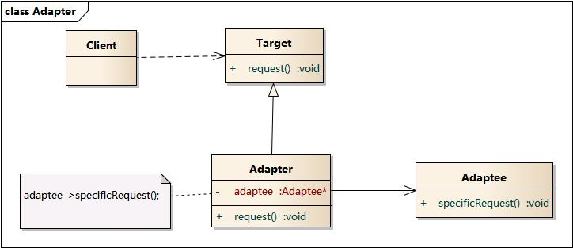
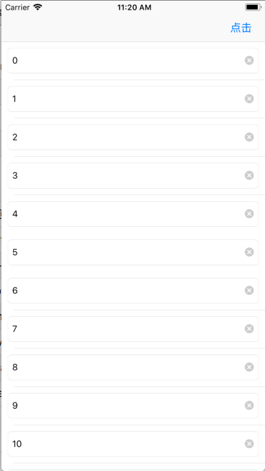

# 目录

图说设计模式是开源于 [GitBook](https://design-patterns.readthedocs.io/zh_CN/latest/index.html) 上的一本介绍设计模式的书，比较了多个介绍设计模式的书之后感觉这本书的介绍更符个人的理解方式。因此在这里记录一下看书过程。

## 看懂 UML 类图和时序图

见 [这里](../uml.md)

## 创建型模式

创建型模式(Creational Pattern)对类的实例化过程进行了抽象，能够将软件模块中对象的创建和对象的使用分离。为了使软件的结构更加清晰，外界对于这些对象只需要知道它们共同的接口，而不清楚其具体的实现细节，使整个系统的设计更加符合单一职责原则。

### 1. 简单工厂
简单工厂又称为静态工厂方法模式。

个人感觉这种设计模式就是一个封装思想的体现，比如在我们做界面的时候有两个不同的 Button，一种是文字图片左右布局，一种是文字图片上下布局。这时候我们常见的封装思路就是为 UIButton 添加一个分类，为其添加一个构建不同按钮的方法。显然这个方法可以是一个类方法（也就是其他语言中的静态方法），而且这个方法需要接收一个参数来区分要创建哪种按钮，可以是字符串或者最好的是一个枚举类型。

这样以来其实就构成了一个简单工厂模式的典型例子。其中这个 UIButton 的分类就是一个工厂的角色，两种类型的 Button 就是具体产品角色。 他们的父类 UIButton 就是抽象产品的角色。


```
extension UIButton {
    static func adjustedBtn(type: ButtonType) -> UIButton {
        switch type {
        case .leftAndRight:
            let button = UIButton()
            button.setTitle("leftAndRight", for: .normal)
            return button
        case .topAndBottom :
            let button = UIButton()
            button.setTitle("topAndBottom", for: .normal)
            return button
        }
    }
}
```

简单工厂模式的要点在于：当你需要什么，只需要传入一个正确的参数，就可以获取你所需要的对象，而无须知道其创建细节。

优点：简化使用者的工作，封装创建的代码便于复用。

缺点：添加新的产品时需要修改工厂逻辑，不便于维护和扩展。

### 2. 工厂方法

工厂方法模式是简单工厂模式的进一步抽象和推广。由于使用了面向对象的多态性，工厂父类负责定义创建产品对象的公共接口，而工厂子类则负责生成具体的产品对象，这样做的目的是将产品类的实例化操作延迟到工厂子类中完成，即通过工厂子类来确定究竟应该实例化哪一个具体产品类。这使得工厂方法模式可以允许系统在不修改工厂角色的情况下引进新产品。


工厂方法通过抽象的父类来实现更高的拓展性，这也是抽象威力的一种体现。简单来说就是通过抽象就可以让使用者不再关心具体类型，而只需要关心具体类型的抽象父类的提供接口就行了。


一个简单的例子就是我们在写业务代码的时候往往会出现在一个页面根据条件跳转到另外几个不同的界面，比如现在有两个按钮每个按钮跳转的的界面不同，但是都是控制器。这时候通过工厂方法来声明一个抽象的工厂类 AbstractFactory，然后生成两个具体工程类 FactoryA 和 FactoryB 继承自 AbstractFactory。这时候的跳转逻辑可以改成下面的代码。

```
@IBAction func leftClick() {
        self.factory = FactoryA()
        self.pushWithFactory()
    }
    
    @IBAction func rightClick() {
        self.factory = FactoryB()
        self.pushWithFactory()
    }
    
    func pushWithFactory() {
        let vc = self.factory?.creatController()
        if let vc = vc {
            self.present(vc, animated: true, completion: nil)
        }
    }
```

初看这个方法也没什么优点，还多创建了工厂类族。但是当添加新的跳转逻辑的时候这个模式的威力就体现了出来。

```
@IBAction func middleClick() {
        self.factory = FactoryC()
        self.pushWithFactory()
    }
```

可以看出来只需要新建新的具体工厂 FactoryC 和控制器 ControllerC 就可以了，不需要修改其他跳转的逻辑。

> 使用工厂方法模式的另一个优点是在系统中加入新产品时，无须修改抽象工厂和抽象产品提供的接口，无须修改客户端，也无须修改其他的具体工厂和具体产品，而只要添加一个具体工厂和具体产品就可以了。这样，系统的可扩展性也就变得非常好，完全符合“开闭原则”。

这个就是工厂方法使用情景。
### 3. 抽象工厂
了解之前首先明确两个概念

> 产品等级结构 ：产品等级结构即产品的继承结构，如一个抽象类是电视机，其子类有海尔电视机、海信电视机、TCL电视机，则抽象电视机与具体品牌的电视机之间构成了一个产品等级结构，抽象电视机是父类，而具体品牌的电视机是其子类。

> 产品族 ：在抽象工厂模式中，产品族是指由同一个工厂生产的，位于不同产品等级结构中的一组产品，如海尔电器工厂生产的海尔电视机、海尔电冰箱，海尔电视机位于电视机产品等级结构中，海尔电冰箱位于电冰箱产品等级结构中。

多个位于不同产品等级结构中属于不同类型的具体产品时需要使用抽象工厂模式.


当一个产品族中的多个对象被设计成一起工作时，它能够保证客户端始终只使用同一个产品族中的对象。这对一些需要根据当前环境来决定其行为的软件系统来说，是一种非常实用的设计模式。

### 4. 建造者模式
建造者模式主要用于复杂对象的创建。比如一个对象由多个对象组合而成，但是他们的赋值过程需要按照一定的顺序来进行。这时候就需要使用建造者模式了。


其中最总要的角色就是 Director 。 所有的建造过程都是由他进行控制的。

当然在实际的使用中可以省略掉一些角色。
- 省略抽象建造者角色：如果系统中只需要一个具体建造者的话，可以省略掉抽象建造者。
- 省略指挥者角色：在具体建造者只有一个的情况下，如果抽象建造者角色已经被省略掉，那么还可以省略指挥者角色，让 Builder 角色扮演指挥者与建造者双重角色。

在实际的使用中，我认为上面的角色都可以省略掉，由产品自己来提供创建方法。

```
- (instancetype)initWithTitle:(NSString *)title
                 contentImage:(NSString *)contentImage
                   customView:(UIView *)customView
                      message:(NSString *)message
            attributedMessage:(NSAttributedString *)attributedMessage
                messageDetail:(NSString *)messageDetail
      attributedMessageDetail:(NSAttributedString *)attributedMessageDetail
            cancelButtonTitle:(NSString *)cancelButtonTitle
            otherButtonTitles:(NSArray<NSString *> *)otherButtonTitles
{
    ...

    if (title.length) {
        self.title = title;
        [self.centerBackView addSubview:self.titleLab];
    }
        
    [self.centerBackView addSubview:self.contentScrollView];
        
    if (contentImage) {
        self.contentImage = contentImage;
        [self.contentScrollView addSubview:self.contentImageView];
    }

    ...
}
```
比如上面这个方法是我之前封装的一个自定义弹框的控件。我提供了一个初始化方法，当然 title 和 contentImage 可能会传空，这时候这个方法就会判断传入的值来添加相应的视图。这个时候这个初始化方法就是一个指挥者的角色。

与抽象工厂模式相比， 建造者模式返回一个组装好的完整产品 ，而 抽象工厂模式返回一系列相关的产品，这些产品位于不同的产品等级结构，构成了一个产品族。

### 5. 单例模式
单例模式就都比较熟悉了，iOS 中诸如 UIApplication 这些单例是我们经常用到的。我们也常常自定义单例。由于单例模式比较简单，唯一需要注意的就是单例模式的滥用。要避免无谓的单例。

在使用单利的时候最需要注意的就是线程安全的问题。具体可以参考我之前的[一篇文章](https://github.com/hnxczk/hnxczk.github.io/blob/master/articles/reading-notes/head-first-design-pattern/05-singleton-pattern.md ).

## 结构型模式
不止一次看到“多用组合，少用继承”这句话。而结构型的设计模式就是用来解决如何将一个个类组合在一起这个问题的。

### 1. 适配器模式
类似于电源适配器的设计，适配器模式应用的场景也是类似的。

当客户类调用适配器的方法时，在适配器类的内部将调用适配者类的方法，而这个过程对客户类是透明的，客户类并不直接访问适配者类。因此，适配器可以使由于接口不兼容而不能交互的类可以一起工作。

适配器模式有对象适配器和类适配器两种实现：




对于类适配器来说需要用到多继承，部分语言不支持。因此这里主要了解下对象适配器。

在计算机领域有一句名言：“Any problem  in computer science can be solved by anther layer of indirection.（计算机科学领域的任何问题都可以通过增加一个间接的中间层来解决）”。个人感觉适配器模式就是这一思想的体现。

在我们实际的开发中，都会涉及到网络请求。而自己来写网络请求或者使用系统提供 API 都有一些不方便的地方，这时候我们往往会用第三方的网络请求框架，比如 iOS 中有名的 AFNetWorking 以及很早之前的 ASINetWoring。其中 ASI 是几年前流行的框架，不过后来因为作者不再维护而渐渐被废弃。开发者也渐渐转向 AFN。这个时候就出现了一个迁移的问题。 AFN 与 ASI 的实现功能虽然大致相同，但是他们的接口 API 却完全不同。这个时候就可以通过添加适配器层来适配二者的 API。

> 适配器模式适用情况包括：系统需要使用现有的类，而这些类的接口不符合系统的需要；想要建立一个可以重复使用的类，用于与一些彼此之间没有太大关联的一些类一起工作。

### 2. 桥接模式

设想如果要绘制矩形、圆形、椭圆、正方形，我们至少需要4个形状类，但是如果绘制的图形需要具有不同的颜色，如红色、绿色、蓝色等，此时至少有如下两种设计方案：

- 第一种设计方案是为每一种形状都提供一套各种颜色的版本。
- 第二种设计方案是根据实际需要对形状和颜色进行组合

对于有两个变化维度（即两个变化的原因）的系统，采用方案二来进行设计系统中类的个数更少，且系统扩展更为方便。设计方案二即是桥接模式的应用。桥接模式将继承关系转换为关联关系，从而降低了类与类之间的耦合，减少了代码编写量。


个人感觉这是一个在开发中非常常用的设计模式。就拿 Cocoa 提供的 UIView 来说，当我们需要不同背景颜色的 view 的时候，肯定不会去声明诸如 BlackView， GreenView 这些 UIView 的子类。会通过组合的方式，给 UIView 添加一个 backgroundColor 的属性，来实现这种需求。

当然上面的这个例子比较初级，桥接模式的主要优点是分离抽象接口及其实现部分。这样就实现了抽象化(Abstraction)与实现化(Implementation)脱耦，它们可以沿着各自的维度独立变化。

### 3. 装饰模式

装饰模式以对客户透明的方式动态地给一个对象附加上更多的责任，换言之，客户端并不会觉得对象在装饰前和装饰后有什么不同。装饰模式可以在不需要创造更多子类的情况下，将对象的功能加以扩展。这就是装饰模式的模式动机。


其实装饰模式与桥接模式有很高的相似度。区别于桥接模式使用关联关系取代继承关系，装饰模式不仅使用了关联也是用了继承。通过继承，被装饰的角色与装饰者具有相同的父类（或者实现了相同的接口），这样以来可以不修改原有代码接入新的业务逻辑。而通过关联关系可以动态的扩展，使系统有了较好的松耦合性。

在实际的使用中，装饰模式应该更适用于扩展原有功能的情况下。你如当你接手了一个新的项目，需要在原来的基础上添加新的功能，而又不能破坏原来代码的封装性（重构不熟悉的代码是个大坑😭😭）。这个时候可以使用装饰者模式。

装饰者模式也会增加代码复杂度，降低代码的可读性。因此我感觉这个更像是一个应急的方案，除非时间紧急尽量不要用这个（赶紧重构吧骚年😝）。在设计新的业务功能的时候也尽量把这种设计模式的优先级调后。

### 4. 外观模式

外观模式(Facade Pattern)：外部与一个子系统的通信必须通过一个统一的外观对象进行，为子系统中的一组接口提供一个一致的界面，外观模式定义了一个高层接口，这个接口使得这一子系统更加容易使用。


根据“单一职责原则”，在软件中往往将一个系统划分为若干个子系统有利于降低整个系统的复杂性。但是增加了客户使用子系统的难度。这时候使用外观模式就对客户屏蔽了子系统组件，减少了客户处理对象的数量，增加了系统的易用性。

> 外观模式创造出一个外观对象，将客户端所涉及的属于一个子系统的协作伙伴的数量减到最少，使得客户端与子系统内部的对象的相互作用被外观对象所取代。外观类充当了客户类与子系统类之间的“第三者”，降低了客户类与子系统类之间的耦合度，外观模式就是实现代码重构以便达到“迪米特法则(单一职责原则)”要求的一个强有力的武器。

在实际的开发过程中我们往往希望我们的代码具有高内聚低耦合的特性。比如比较有名的 SDWebImage 这个网络图片加载的第三方库。使用的时候只需要调用 `[self.imageView sd_setImageWithURL:[NSURL URLWithString:@"url"] placeholderImage:[UIImage imageNamed:@"placeholder.png"]];` 这一句代码就可以了，图片下载、缓存、编解码等工作都在内部进行处理。从这个角度来看的话 `UIImageView + WebCache` 里的这个方法就是一个外观类，下载、缓存、编解码这些都是子系统。

> 外观模式适用情况包括：要为一个复杂子系统提供一个简单接口；客户程序与多个子系统之间存在很大的依赖性；在层次化结构中，需要定义系统中每一层的入口，使得层与层之间不直接产生联系。

### 5. 享元模式

享元模式(Flyweight Pattern)：运用共享技术有效地支持大量细粒度对象的复用。系统只使用少量的对象，而这些对象都很相似，状态变化很小，可以实现对象的多次复用。由于享元模式要求能够共享的对象必须是细粒度对象，因此它又称为轻量级模式，它是一种对象结构型模式。


享元接口，定义共享接口

```
protocol FlyWeight {
    func action()
}
```
具体享元类，实现享元接口。该类的对象将被复用

```
class ConcreteFlyWeight: FlyWeight {
    var name: String
    
    init(name: String) {
        self.name = name
    }
    
    func action() {
        print("name = \(self.name) action")
    }
}
```
享元工厂。它将维护已创建的享元实例，并通过实例标记（一般用内部状态）去索引对应的实例。当目标对象未创建时，享元工厂负责创建实例并将其加入标记-对象映射。当目标对象已创建时，享元工厂直接返回已有实例，实现对象的复用。

```
class FlyWeightFactory {
    var concurrentHashMap = {() -> Dictionary<String, FlyWeight> in
        return Dictionary()
    }()
    
    func getFlyweight(name: String) -> FlyWeight {
        let flyweight = self.concurrentHashMap[name]
        
        if let flyweight = flyweight {
            print("Instance of name = \(name) exist")
            return flyweight
        } else {
            print("Instance of name = \(name) does not exist, creating it")
            let flyweight = ConcreteFlyWeight(name: name)
            print("Instance of name = \(name) created")
            self.concurrentHashMap[name] = flyweight
            return flyweight
        }
        
    }
}
```

通过上面的代码课以看出享元模式的核心思想就是对象的复用。这点其实是我们很熟悉的性能优化方式的一种。比如 UITableVIew 中 cell 的复用就是利用这样的机制来实现的。

> 享元模式以共享的方式高效地支持大量的细粒度对象，享元对象能做到共享的关键是区分内部状态(Internal State)和外部状态(External State)。
>
>内部状态是存储在享元对象内部并且不会随环境改变而改变的状态，因此内部状态可以共享。
>
>外部状态是随环境改变而改变的、不可以共享的状态。享元对象的外部状态必须由客户端保存，并在享元对象被创建之后，在需要使用的时候再传入到享元对象内部。一个外部状态与另一个外部状态之间是相互独立的。

理解这两种状态的区别可以从我们经常遇到的一种需求来思考。如下面所示。

</img>


每个 cell 上都有一个 textfield 来接收输入。这时候每个 cell 中 textfield 的 text 可以看成是内部状态，他们可以共享（也就是说在 cell 复用的时候可以重新设置）。但是每个 cell 输入内容所表示的意义则是外部状态，不可以共享。比如第 0 行表示名称，第 1 行表示电话，第 2 行表示住址... 这些所表示的意义就是外部状态。这是两种不同的状态，因此在编写逻辑的时候要注意区分。

### 6. 代理模式


### 7. 组合模式

## 行为型模式
