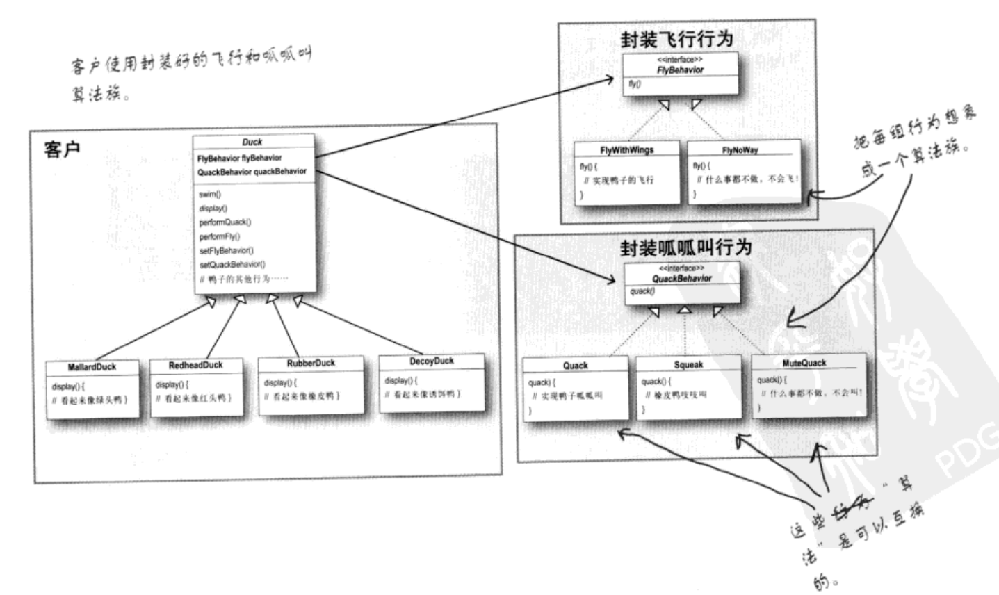
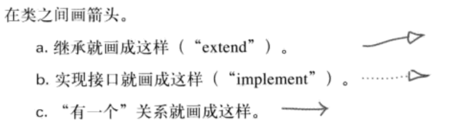

# 策略模式

## 总结

**策略模式**：定义了算法族，分别封装起来，让他们之间可以相互替换，此模式让算法的变化独立于使用算法的客户。

设计原则
1. **把会变化的部分抽取并封装起来，好让其他部分不受影响**
2. **面对接口编程，而不是面向实现编程**
3. **多用组合，少用继承**

## 模拟鸭子的游戏
### 利用继承
游戏中会出现各式各样的鸭子，熟悉面向对象思想的第一反应就是设计一个鸭子的父类（Duck），所有类型的鸭子都继承自该类。比如绿头鸭（MallardDuck）和红头鸭（RedheadDuck）。具体代码如下。

```
@interface Duck : NSObject

- (void)quack;
- (void)swim;
- (void)display;

@end

@implementation Duck

- (void)quack
{
    NSLog(@"呱呱");
}

- (void)swim
{
    NSLog(@"swim");
}

- (void)display
{
    NSLog(@"display");
}

@end

```

```
#import "Duck.h"

@interface MallardDuck : Duck

@end

@implementation MallardDuck

- (void)display
{
    NSLog(@"display-绿头鸭");
}

@end
```

```
#import "Duck.h"

@interface RedheadDuck : Duck

@end

@implementation RedheadDuck

- (void)display
{
    NSLog(@"display-红头鸭");
}

@end

```

这样的话在需要不同的鸭子的时候分别实例化不同的对象就可以了。

```
MallardDuck *mallarDuck = [[MallardDuck alloc] init];
[mallarDuck display];
        
RedheadDuck *redheadDuck = [[RedheadDuck alloc] init];
[redheadDuck display];
```

```
2018-06-18 20:34:47.878191+0800 01-SimUDuck[34855:1217414] display-绿头鸭
2018-06-18 20:34:47.878693+0800 01-SimUDuck[34855:1217414] display-红头鸭
```

目前来看是没有问题的，但是当我们需要一个 “fly” 功能的时候，我们会想着在父类（Duck）中添加一个 fly 方法的时候。这样就会有一个问题，就是有些鸭子是不会飞的（比如橡皮鸭子）。一种解决方法就是在橡皮鸭子（RubberDuck）中覆写父类的 fly 方法。

```
@implementation RubberDuck

- (void)quack
{
    NSLog(@"吱吱");
}

- (void)display
{
    NSLog(@"display-橡皮鸭子");
}

- (void)fly
{
    // 覆盖什么也不做
}
```
这样一来也能解决问题，但是当我们还有其他鸭子比如诱饵鸭子这种既不会叫也不会飞的鸭子的时候也要覆盖相应的方法。

### 利用接口
利用接口的解决方案就是把单个的行为抽象为一个协议，当你的一种类型需要相关的行为的时候让它遵守协议并实现协议中的方法即可。这样的话依然无法优雅的实现相关需求。这是因为我们的项目不是一成不变的，或者说唯一不变的就是变化。当某个需求修改是这种实现方式需要修改各个实现该协议的类，这无疑是个大工程。

### 把问题归零

设计原则

**把会变化的部分抽取并封装起来，好让其他部分不受影响**

### 分开变化的和不变化的部分
分析上面的例子我们可以看到除了 quack 和 fly 方法之外别的方法都是没有特别需要修改的，因此除了 Duck 外拆分出两组类，一个跟 quack 有关，一个跟 fly 有关。 

设计原则

**面对接口编程，而不是面向实现编程**

具体实现如下

1. 声明两个协议 FlyBehavior 和 QuackBehavior

```
@protocol FlyBehavior<NSObject>

- (void)fly;

@end

@protocol QuackBehavior<NSObject>

- (void)qucak;

@end
```

2. 实现协议的几个类

```
@interface FlyWithWings : NSObject<FlyBehavior>

@end

@implementation FlyWithWings

- (void)fly
{
    NSLog(@"会飞的鸭子");
}

@end
```

```
@interface FlyWithWings : NSObject<FlyBehavior>

@end

@implementation FlyNoWay

- (void)fly
{
    NSLog(@"不会飞的鸭子");
}

@end
```

```
@interface Quack : NSObject<QuackBehavior>

@end

@implementation Quack

- (void)qucak
{
    NSLog(@"gua gua");
}

@end
```

```
@interface Squeak : NSObject<QuackBehavior>

@end

@implementation Squeak

- (void)qucak
{
    NSLog(@"zi zi");
}

@end
```

```
@interface MuteQuack : NSObject<QuackBehavior>

@end

@implementation MuteQuack

- (void)qucak
{
    NSLog(@"do nothing");
}

@end
```

3. 修改 Duck 的内部实现，为其添加两个属性。

```
@interface Duck : NSObject

@property (nonatomic, strong) id<QuackBehavior> quackBehavior;
@property (nonatomic, strong) id<FlyBehavior> flyBehavior;

- (void)performQuack;
- (void)performFly;
- (void)swim;
- (void)display;

@end

@implementation Duck

- (void)performQuack
{
    [self.quackBehavior qucak];
}

- (void)performFly
{
    [self.flyBehavior fly];
}

- (void)swim
{
    NSLog(@"swim");
}

- (void)display
{
    NSLog(@"display");
}

@end
```

4. 声明一个特定类型的子类 MallardDuck， 并修改器初始化方法。

```
@interface MallardDuck : Duck

@end

@implementation MallardDuck

- (instancetype)init
{
    if (self = [super init]) {
        self.quackBehavior = [[Quack alloc] init];
        self.flyBehavior = [[FlyWithWings alloc] init];
    }
    return self;
}

@end
```

5. 这样以来在使用的时候直接出示化对应的子类。

```
MallardDuck *mallardDuck = [[MallardDuck alloc] init];
[mallardDuck performFly];
[mallardDuck performQuack];
```

经过上面的几个步骤就实现了策略模式的设计，这样的好处就是把可变的与不可变的分离开来。这样一来就能在修改少部分代码的情况下实现功能的修改。



说明



### ‘有一个‘可能比’是一个‘更好

“有一个”：每一个鸭子都有一个FlyBehavior和一个QuackBehavior，好将飞行和呱呱叫委托给它们代为处理。
当你将两个类结合起来使用，如同本例一般，这就是组合，这种做法和“继承”不同的地方在于，鸭子的行为不是继承来的，而是和适当的行为对象“组合”来的。

设计原则

**多用组合，少用继承**

使用组合建立系统具有很大的弹性，不仅可以将算法族封装成类，还可以动态的修改行为。
