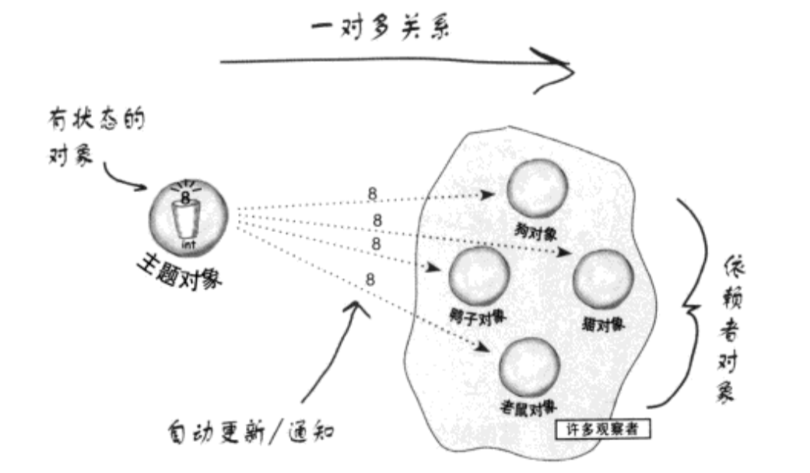
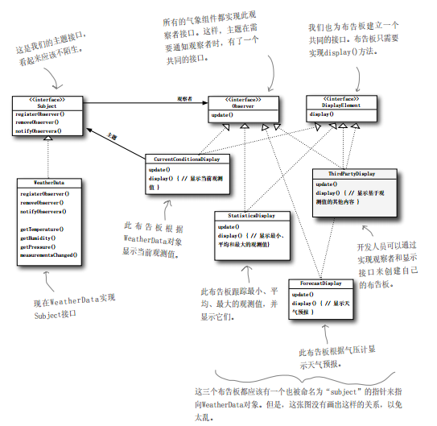

# 观察者模式
## 气象监测应用
建立一个应用，利用已知的 WeatherData 对象获取数据并更新三个布告板：目前情况（温度、湿度、气压）、气象统计、天气预报。

```
@interface WeatherData : NSObject

- (CGFloat)getTemperature;
- (CGFloat)getHumidity;
- (CGFloat)getPressure;

// 一旦气象测量更新，此方法会被调用
- (void)measurementsChanged;

@end
```
### 已知条件
1. WeatherData类具有getter方法，可以取得三个测量值。
2. 当心的测量数据备妥时，measurementsChanged 方法就会被调用（我们不在乎此方法是如何被调用的，我们只在乎它被调用了）。
3. 我们需要实现三个使用天气数据的布告板，一旦 WeatherData 有新的测量，这些布告板必须马上更新。
4. 此系统必须可扩展，让其他开发人员建立定制的布告板，用户可以随心所欲地添加或删除任何布告板。

## 错误示范

```
- (void)measurementsChanged
{
    CGFloat temp = [self getTemperature];
    CGFloat hum = [self getHumidity];
    CGFloat pressure = [self getPressure];
    
    [currentConditionsDisplay updateWithTemp:temp humidity:hum pressure:pressure];
    [statisticsDisplay updateWithTemp:temp humidity:hum pressure:pressure];
    [forecastDisplay updateWithTemp:temp humidity:hum pressure:pressure];
}
```
存在的问题
1. 我们是针对具体实现编程，而非针对接口。这样的话我们以后再正价或者删除布告板的时候必须修改程序。
2. 对于每个新的布告板，我们都得修改代码。
3. 我们无法再运行时动态地增加（或删除）布告板。
4. 我们尚未封装改变的部分。

## 观察者模式
定义

**观察者模式定义了对象之间的一对多依赖，这样一来，当一个对象改变状态时，它的所有依赖者都会受到通知并自动更新**



## 松耦合的威力

**松耦合的设计之所以能让我买建立有弹性的、能应对变化的系统是因为对象之间的画像依赖降到了最低。**

就拿观察者模式来说这就是一个松耦合的设计。主题只知道观察者实现了某些接口，但是它并不知道观察者具体的类型，也不知道观察者的具体细节。主题唯一依赖的就是一个实现相应接口的对象列表，把观察者加入该列表或者从列表中删除都不会影响到主题。

##代码实现



具体实现见[相关代码](./code/02-obsever-pattern/01-Weather)

## JAVA 内置的观察者
