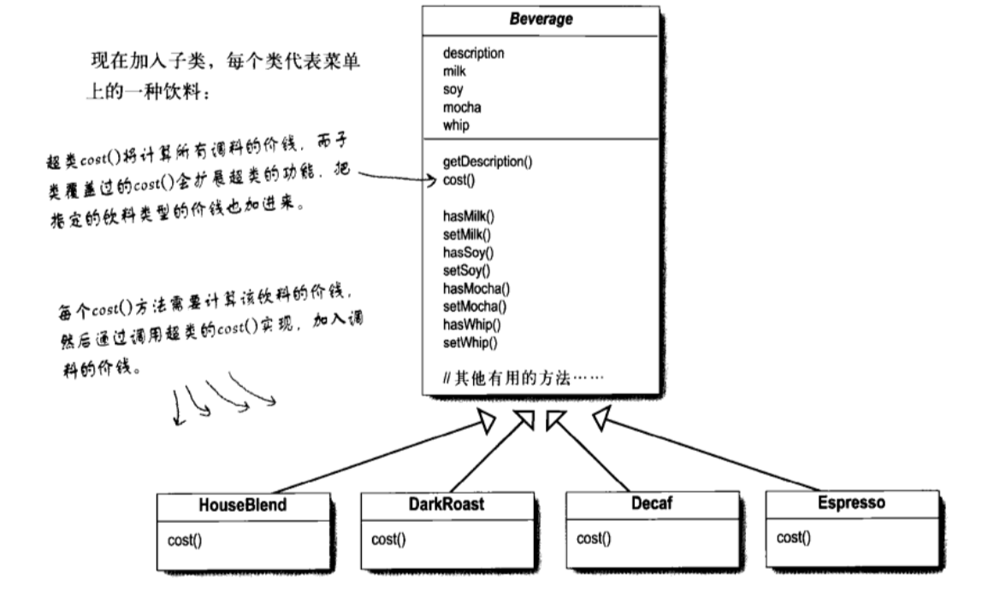
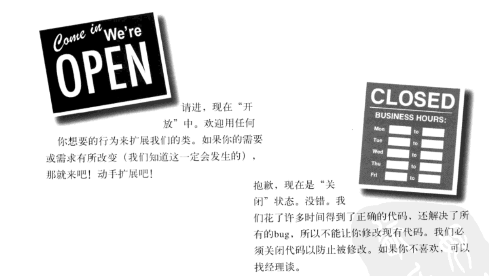

# 装饰者模式

购买咖啡的时候顾客可以要求加入各种调料，而咖啡最后会根据加入调料的不同和多少来收取不同的费用。因此在构建咖啡这个需求的时候，按照面向对象的思想最直接想到的就是抽象出来一个咖啡的父类，然后有各种调料对应的属性。同时咖啡的费用通过 `cost` 方法来获取，方法里面会计算好各种调料的份额和价钱然后算出总价。添加新的口味咖啡的时候就继承自咖啡这个父类来实现。并且新口味咖啡这些子类会重写并调用父类的 `cost` 来实现价格的计算。具体如下图。

上面的例子可以解决部分问题，但是当遇到一些需求变更，比如某种调料的价格发生的变动或者要加入新的调料的种类的时候我们都需要修改父类。这样以来程序的扩展性就出现了问题。

## 开放-关闭原则

**类应该对扩展开放，对修改关闭**

这是因为在实际的开发过程中总是伴随着新的需求，这就要求我们要有开放的能力来承接新的需求，但是是如果直接修改代码的话就会不可避免的引进 bug 或者产生意外的副作用。因此我们在设计代码的时候应该对扩展开放，而对修改关闭。

> ps 让程序中所有的地方都遵循`开发-关闭`原则并不是一个好的设计。因为在遵循该原则的时候通常会引进新的抽象层级，增加代码的复杂度。因此需要根据工作领域的了解和设计经验来找出需要扩展的部分来遵循开发-关闭的设计原则。

## 定义

动态的将责任附加到对象上。若要扩展功能，装饰者提供了比继承更有弹性的替代方案。

个人感觉就是在扩展功能的时候生成一个装饰者，提供了一些扩展功能，并且该装饰者与被装饰者有相同的父类，这样以来所有需要被装饰者的地方都可以使用装饰者代替。

一个形象的比喻就是画和画框，画是被装饰者，画框是装饰者。画是不能直接挂到墙上的，现在把画放到画框中就可以挂到墙上了，这就是扩展功能。并且这样也没有涉及到修改画。而之前画的功能就是被欣赏，现在画和画框也能被欣赏。

