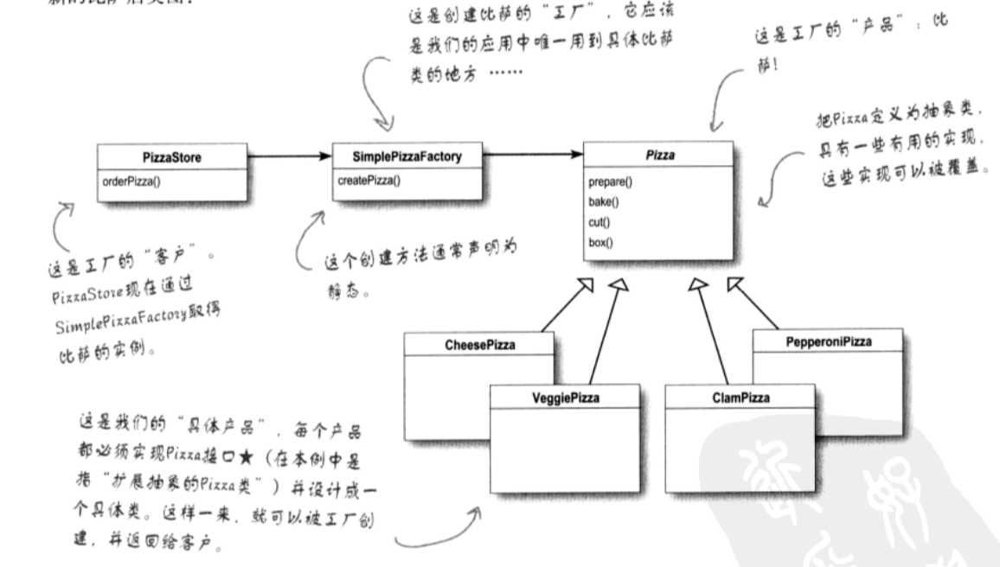
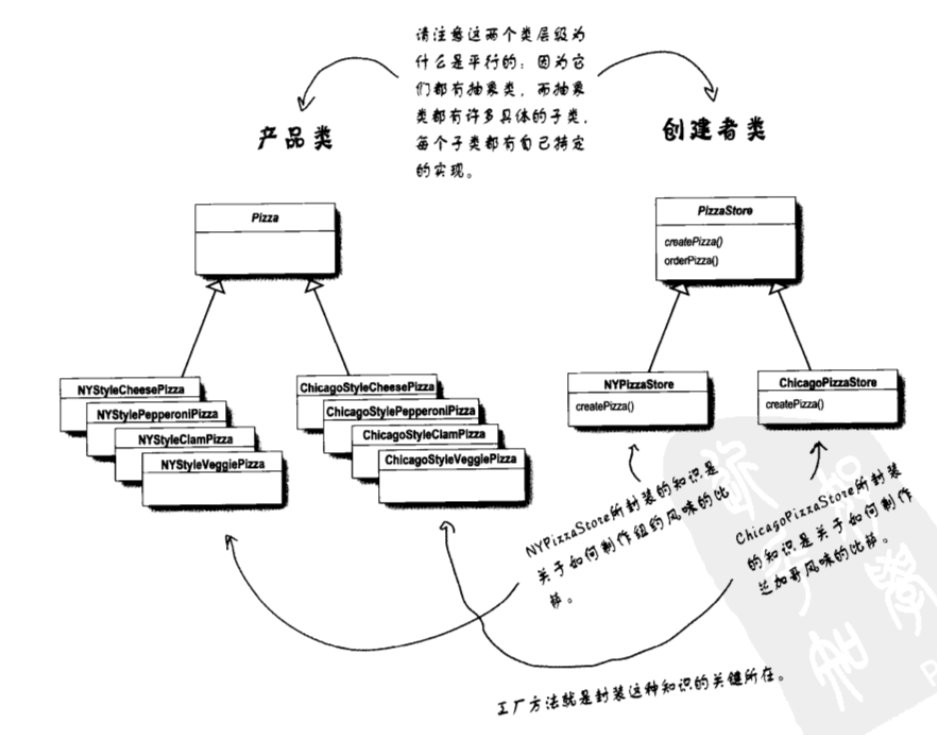
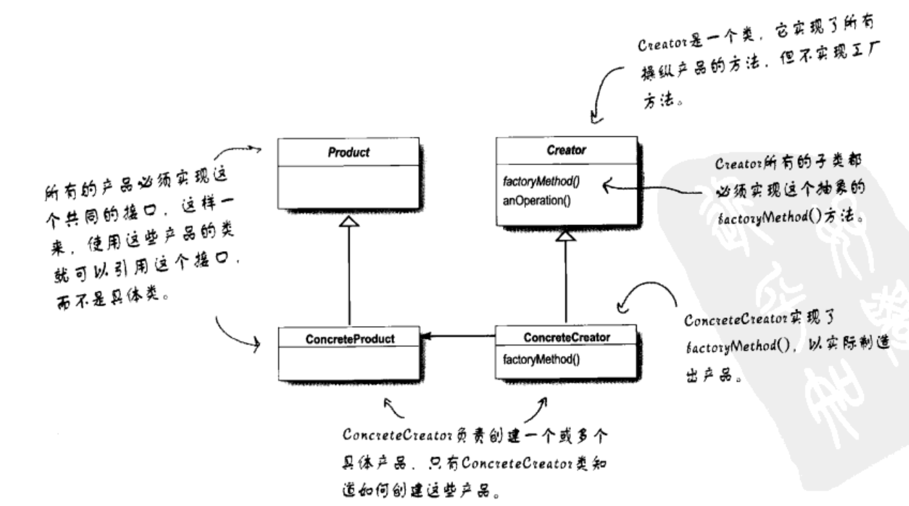
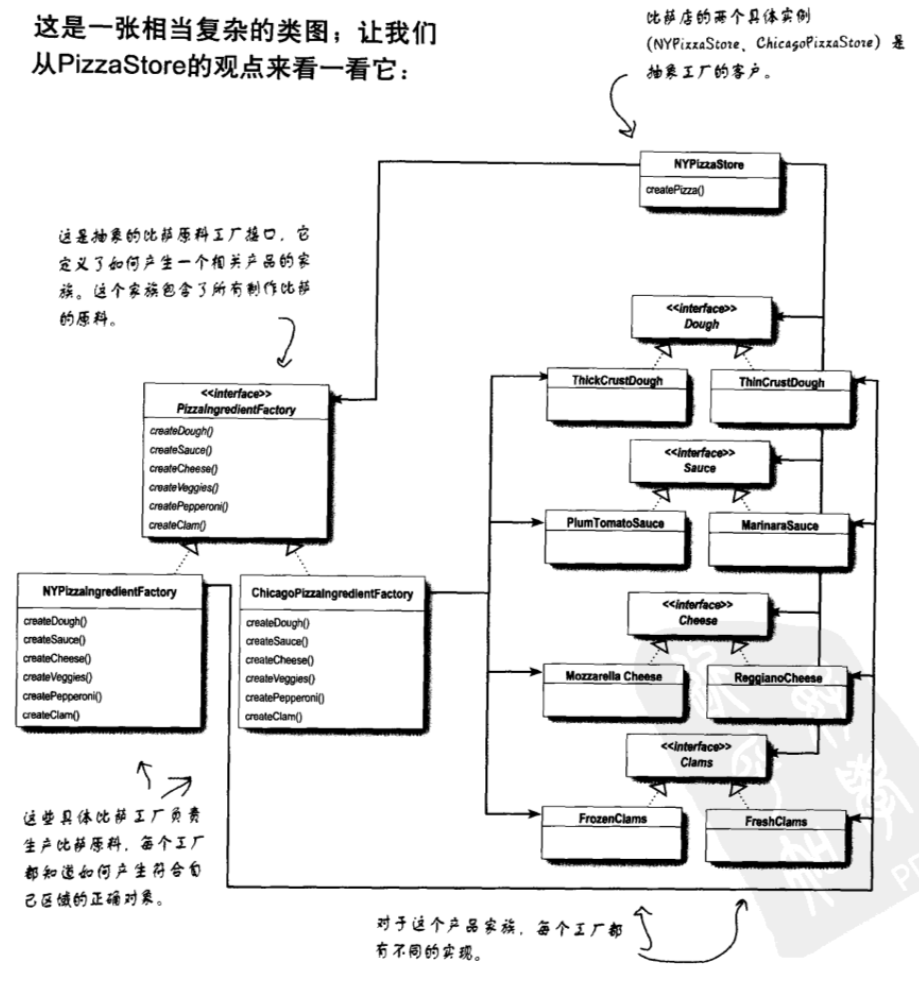
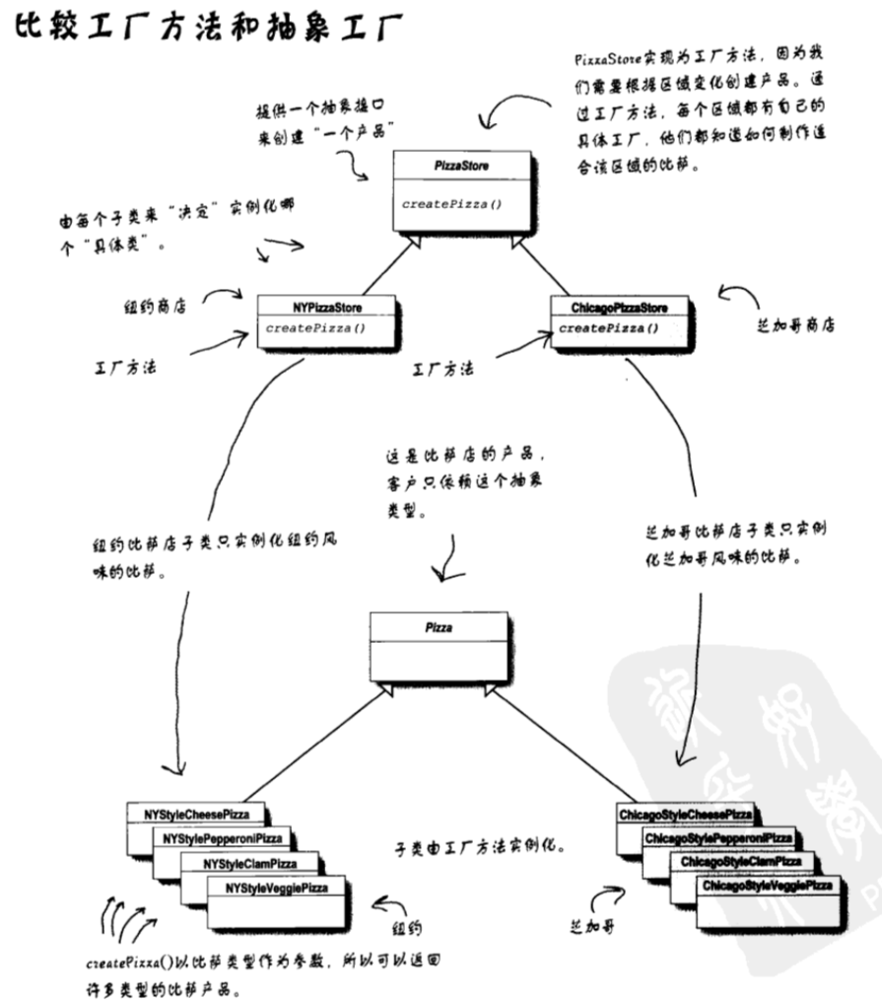
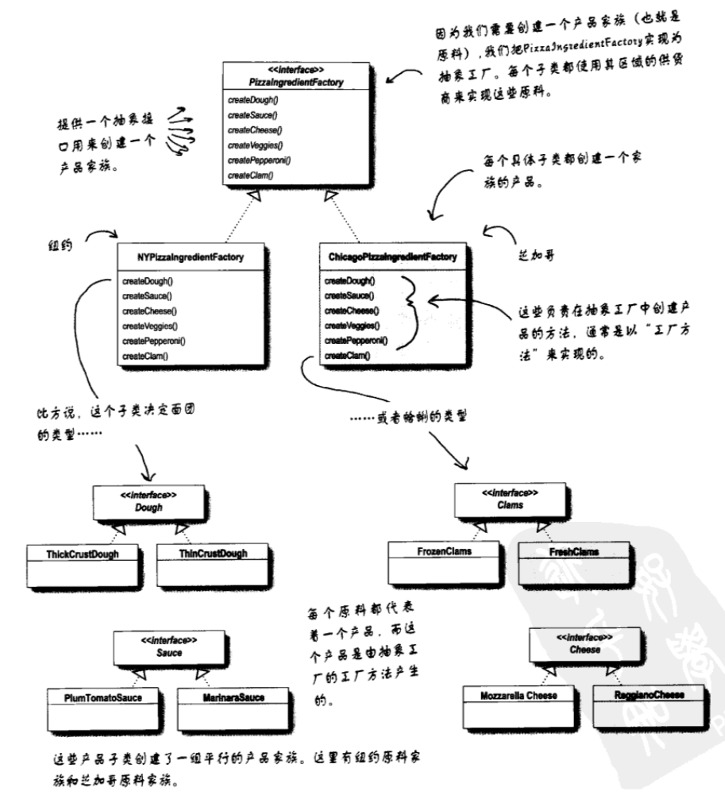

# 工厂模式

## 披萨店的问题

当披萨店生产不同的披萨的时候需要根据类型来进行生产，因此下面的代码就自然而然的出现了。
```
Pizza* orderPizzaByType(NSString *type)
{
    Pizza *pizza;
    if ([type isEqualToString:@"cheese"]) {
        pizza = [[CheesePizza alloc] init];
    } else if ([type isEqualToString:@"greek"]) {
        pizza = [[GreekPizza alloc] init];
    } else if ([type isEqualToString:@"pepperoni"]) {
        pizza = [[PepperoniPizza alloc] init];
    }
    
    [pizza prepare];
    [pizza bake];
    [pizza cut];
    [pizza box];

    return pizza;
}
```

当披萨店增加或者删除某种类型的披萨的时候就不可避免的需要修改此处代码。这显然不符合开放封闭的设计原则。

## 静态工厂

```
@implementation SimplePizzaFactory

+ (Pizza *)createPizzaByType:(NSString *)type
{
    Pizza *pizza = nil;
    if ([type isEqualToString:@"cheese"]) {
        pizza = [[CheesePizza alloc] init];
    } else if ([type isEqualToString:@"greek"]) {
        pizza = [[GreekPizza alloc] init];
    } else if ([type isEqualToString:@"pepperoni"]) {
        pizza = [[PepperoniPizza alloc] init];
    }
    
    return pizza;
}

@end
```

```
Pizza *pizza = [SimplePizzaFactory createPizzaByType:@"cheese"];
        
[pizza prepare];
[pizza bake];
[pizza cut];
[pizza box];
```
通过 SimplePizzaFactory 类的类方法来创建 Pizza。这样就把生产 Pizza 的方法封装了起来，其他地方只需要用这个方法就能创建。修改的时候也只用修改者一处。

缺点：无法通过继承来改变创建方法的行为。

## 定义简单工厂


代码在[这里](./code/04-factory-pattern/01-Pizza)

**注意：在设计模式中，所谓的“实现一个接口”并“不一定”表示“写一个类，并让其来实现某个接口协议”。“实现一个接口”泛指“实现某个超级类型(可以是类或接口协议)的某个方法**

## 工厂方法模式

所有工厂模式都是用来封装对象的创建。工厂方法模式通过让子类决定改创建的对象是什么，来达到将对象创建的过程封装的目的。

在简单工厂中我们是由一个具体的类 SimplePizzaFactory 来负责所有具体类的实力化，接下来我们对 PizzaStore 做一些改变。

```
@implementation PizzaStore

- (instancetype)init
{
    NSAssert(![self isMemberOfClass:[PizzaStore class]], @"AbstractDownloader is an abstract class, you should not instantiate it directly.");
    return [super init];
}

- (Pizza *)orderPizzaByType:(NSString *)type
{
    Pizza *pizza = [self createPizzaByType:type];
    
    [pizza prepare];
    [pizza bake];
    [pizza cut];
    [pizza box];
    
    return pizza;
}

// 实例化披萨的任务被放到一个方法中，并且它是抽象的
// 1. 因为该方法是抽象的因此需要依赖子类对象来处理
// 2. 工厂方法将 orderPizzaByType 与实际创建具体产品的子类对象的创建代码解耦了。
- (Pizza *)createPizzaByType:(NSString *)type
{
    AbstractMethodNotImplemented();
}

@end
```  

经过修改 PizzaStore 成为了抽象类，由其子类 `NYPizzaStore` `ChicagoPizzaStore` 负责实例化。
在子类中重写 createPizzaByType 这一工厂方法，这样一来就能通过子类来决定改创建哪种披萨对象。

代码在[这里](./code/04-factory-pattern/02-Pizza)

类图


## 定义工厂方法模式

**工厂方法模式定义了一个创建对象的接口，但由子类决定要实例化的类是哪一个。工厂方法让类把实例化推迟到子类**



## 简单工厂和工厂方法之间的差别

简单工厂吧所有的事情都放在一个地方处理完，而工厂方法则是创建一个框架，让子类决定如何实现。比如在工厂方法中，orderPizza 方法提供了一般的框架来创建披萨，它依赖于工厂方法创建具体类，而工厂方法是个抽象方法，它由子类来决定到底创建那个具体的披萨。相较而言简单工厂并没有工厂方法模式的弹性。

## 一个依赖很深的披萨店

当我们完全不用工厂模式的时候会出现如下图所示的严重依赖问题。这显然不是什么好事。


> **依赖倒置原则：要依赖抽象，不要依赖具体类**
不能让高层的组件依赖低层组件，而且不管高层低层他们都应该依赖于抽象。

这里所谓的高层的组件意思就是其行为由其他低层组件来定义。比如上图中 PizzaStore 的行为就依赖于 Pizza 的对象。这显然是不符合依赖倒置原则的。

使用工厂方法之后的依赖关系


可以看出高层组件（PizzaStore）和低层组件（各种披萨）都依赖于 Pizza 这个抽象类。相较于第一张图高层组件的依赖明显倒置了。

## 实现倒置的指导方针
1. 变量不可能持有具体类的引用。
    如果使用 new 就会持有具体的类的引用，这是需要使用工厂方法来处理。
2. 不要让类派生自具体类。
    如果派生自具体类，你就会依赖具体类。因此请派送自一个抽象（接口或者抽象类）。
3. 不要覆盖基类中已实现的方法。
    如果覆盖基类已经实现的方法，你的基类就不是一个合适被继承的抽象。基类中已经实现的类应该由所有子类共享。
    
当然，并不是强制要求所有的设计都符合以上原则，需要具体分析。。

## 抽象工厂
需求： 我们要建造一个工厂来生产原料，这个工厂负责创建原料家族中的个种原料。每个地区都有各自的原料加工厂。
1. 首先抽象出来一个原料工厂的接口.

```
@protocol PizzaIngredientFactory <NSObject>

- (Dough *)createDough;
- (Sauce *)createSauce;

@end
```
```
@interface NYPizzaIngredientFactory : NSObject<PizzaIngredientFactory>

@end

@implementation NYPizzaIngredientFactory

- (Dough *)createDough
{
    return [[ThinCrustDough alloc] init];
}

- (Sauce *)createSauce
{
    return [[MarinaraSauce alloc] init];
}
@end
```
2. 为每个区域建造一个工厂，你需要创建一个实现 PizzaIngredientFactory 的接口的类来实现每一个创建方法。
3. 实现一组原料类供工厂使用，例如 ReggianoCheese，RedPeppers,ThickCrustDough.这些类可以在何时的区域间共享。
4. 然后你仍然需要将这一切组织起来，将新的原料工厂整合进旧的PizzaStore代码中。

修改 Pizza, 主要修改 Prepare 方法，使其成为一个抽象方法，交给子类去实现。

```
@implementation Pizza

- (instancetype)init
{
    NSAssert(![self isMemberOfClass:[Pizza class]], @"AbstractDownloader is an abstract class, you should not instantiate it directly.");
    return [super init];
}

- (void)prepare
{
    AbstractMethodNotImplemented();
}

- (void)bake
{
    NSLog(@"Bake for 25 minutes at 350");
}
- (void)cut
{
    NSLog(@"Cutting the pizza into diagonal slices");
}

- (void)box
{
    NSLog(@"Place pizza in official PizzaStore box");
}

- (NSString *)getName
{
    return self.name;
}

- (NSMutableArray<NSString *> *)toppings
{
    if (!_toppings) {
        _toppings = [NSMutableArray array];
    }
    return _toppings;
}
```

实现子类 , 主要添加一个原料工厂，并重写了 prepare 方法。

```
@interface CheesePizza : Pizza

@property (nonatomic, strong) id<PizzaIngredientFactory> ingredientFactory;

- (instancetype)initWithIngredientFactory:(id<PizzaIngredientFactory>) ingredientFactory;

@end

@implementation CheesePizza

- (instancetype)initWithIngredientFactory:(id<PizzaIngredientFactory>) ingredientFactory
{
    if (self = [super init]) {
        self.ingredientFactory = ingredientFactory;
    }
    return self;
}

- (void)prepare
{
    NSLog(@"Preparing %@", self.name);
    self.dough = [self.ingredientFactory createDough];
    self.sauce = [self.ingredientFactory createSauce];
}

@end
```

修改披萨店的代码

```
- (Pizza *)createPizzaByType:(NSString *)type
{
    NYPizzaIngredientFactory *ingreditenFactory = [[NYPizzaIngredientFactory alloc] init];
    Pizza *pizza = nil;
    if ([type isEqualToString:@"cheese"]) {
        pizza = [[CheesePizza alloc] initWithIngredientFactory:ingreditenFactory];
    } else if ([type isEqualToString:@"clam"]) {
        pizza = [[ClamPizza alloc] initWithIngredientFactory:ingreditenFactory];
    }
    return pizza;
}
```

通过上面的代码我们引入新类型的工厂，也就是所谓的抽象工厂，来创建披萨原料家族。
通过抽象工厂所提供的接口可以创建产品的家族，利用这个接口书写代码，我们的代码将从实际工厂解耦，以便在不同上下文中实现各式各样的工厂，制造出各种不同的产品。

类图



## 定义抽象工厂模式
**抽象工厂模式提供一个接口，用于创建相关或依赖对象的家族，而不需要明确指定具体类。**

工厂方法其实就是潜伏在抽象工厂里面。因为抽象工厂的任务就是定义一个负责创建一组产品的接口。这个接口内的每个方法都是负责创建一个具体的产品。同时我们在实现抽象工厂的子类中提供具体的做法。因此在抽象工厂里面利用工厂方法是很自然的。

## 工厂方法与抽象工厂




