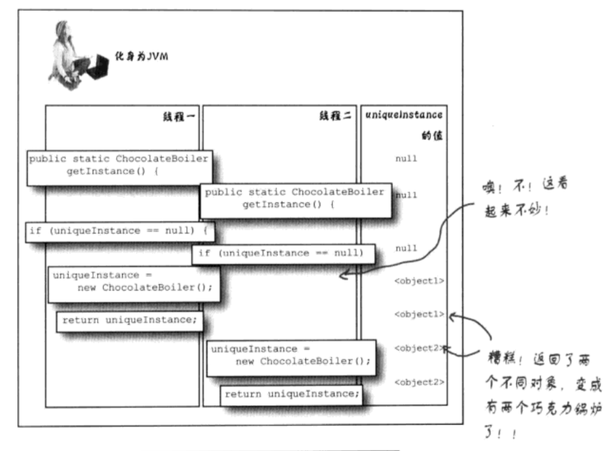

# 单例模式
单例模式（Singleton Pattern）是最简单的设计模式之一。这种类型的设计模式属于创建型模式，它提供了一种创建对象的最佳方式。这种模式涉及到一个单一的类，该类负责创建自己的对象，同时确保只有单个对象被创建。
## 单例模式的由来
有一些对象其实我们只需要一个，比方说：线程池(threadpool)、缓存(cache)、对话框、处理偏好设置和注册表(registry)的对象、日志对象、充当打印机、显卡等设备的驱动程序的对象，这类对象只能有一个实例，如果制造出多个实例，就会导致许多问题产生，比如：程序的行为异常、资源使用过量，或者是不一致的结果。

## 保证只有一个实例对象
注意，在 swift 中完全不用以下这些麻烦的方式来实现单例。这里只是为了配合书中的代码引出问题。
具体实现及原因可以看[这里](http://swifter.tips/singleton/)和[这里](https://juejin.im/post/59e30701f265da432f3026ad)
```
class Singleton {
    private static var _instance: Singleton?

    private init() {}
    
    static func share() -> Singleton {
        if _instance == nil {
            _instance = Singleton()
        }
        return _instance!
    }
    
    // other method
}
```
```
var singleton = Singleton.share();
var singleton2 = Singleton.share();
```
```
Printing description of singleton:
<Singleton: 0x102919960>
Printing description of singleton2:
<Singleton: 0x102919960>
```
保证只会有一个实例对象的方法就是
1. 声明构造函数为私有
2. 利用一个静态变量来记录这个唯一实例
3. 通过 `share()` 方法来向外界提供实例对象（先判断静态变量是否有值，为空的话再创建）

## 巧克力工厂

```
class ChocolateBoiler {
    private var empty: Bool
    private var boiled: Bool
    
    private static var instance: ChocolateBoiler?
    
    private init() {
        empty = true;
        boiled = false;
    }
    
    static func share() -> ChocolateBoiler {
        if instance == nil {
            instance = ChocolateBoiler()
        }
        return instance!
    }
    
    func fill() {
        // 空的才能往里加入原料
        if isEmpty() {
            empty = false
            boiled = false
        }
    }
    
    func drain() {
        // 必须是满的而且煮过的才能排出
        if !isEmpty() && isBoiled() {
            empty = true
        }
    }
    
    func boil() {
        // 煮的时候必须是满的并且没煮过的
        if !isEmpty() && !isBoiled() {
            boiled = true
        }
    }
    
    func isEmpty() -> Bool {
        return self.empty
    }
    
    func isBoiled() -> Bool {
        return self.boiled;
    }
}
``` 
这是一个单例模式的巧克力工厂。

## 定义
**单例模式：单件模式确保一个类只有一个实例，并提供一个全局访问点**

## 多线程中出现的问题


## 处理方法
其他语言中需要进行加锁，比如 java 中的 synchronized 与 OC 中的 @synchronized、 dispatch_once 都是这种处理方式。

```
+ (id)sharedInstance {  
    static testClass *sharedInstance = nil;  
    @synchronized(self) {  
        if (!sharedInstance) {  
            sharedInstance = [[self alloc] init];  
        }  
    }  
    return sharedInstance;  
} 
```
为减少频繁加锁的性能损耗可以使用下面的这种方式
```
+ (id)sharedInstance {  
    static testClass *sharedInstance = nil;  
    if (!sharedInstance) {
        @synchronized(self) {  
            if (!sharedInstance) {  
                sharedInstance = [[self alloc] init];  
            }  
        } 
    }
    return sharedInstance;  
} 
```
更好的方式当然还是 dispatch_once
```
+ (id)sharedInstance {  
    static testClass *sharedInstance = nil;  
    static dispatch_once_t once;  
    dispatch_once(&once, ^{  
        sharedInstance = [[self alloc] init];  
    });  
    return sharedInstance;  
}  
```
dispatch_once 为什么能做到既解决同步多线程问题又不影响性能呢？
下面我们来看看 dispatch_once 的原理：
1. dispatch_once 主要是根据 onceToken 的值来决定怎么去执行代码。
2. 当 onceToken = 0时，线程执行 dispatch_once 的 block 中代码
3. 当 onceToken = -1时，线程跳过 dispatch_once 的 block 中代码不执行
4. 当 onceToken 为其他值时，线程被线程被阻塞，等待 onceToken 值改变
5. 当线程首先调用 shareInstance，某一线程要执行 block 中的代码时，首先需要改变 onceToken 的值，再去执行 block 中的代码。这里 onceToken 的值变为了 140734605830464。
6. 这样当其他线程再获取 onceToken 的值时，值已经变为 140734605830464。其他线程被阻塞。
7. 当block线程执行完 block 之后。onceToken 变为 -1。其他线程不再阻塞，跳过 block。
8. 下次再调用 shareInstance 时，block 已经为 -1。直接跳过 block。
9. 这样 dispatch_once 在首次调用时同步阻塞线程，生成单例之后，不再阻塞线程。

[出处见这里](https://www.jianshu.com/p/160d77888443)

而由于 swift 中已经使用 dispatch_once behind the scenes 来执行全局变量和静态属性的线程安全延迟初始化。因此不需要进行加锁。

```
    private static let instance = ChocolateBoiler2()
    
    private init() {
        empty = true;
        boiled = false;
    }
    
    static func share() -> ChocolateBoiler2 {
        return instance
    }
```
通过上面的方法就能保证线程安全。
