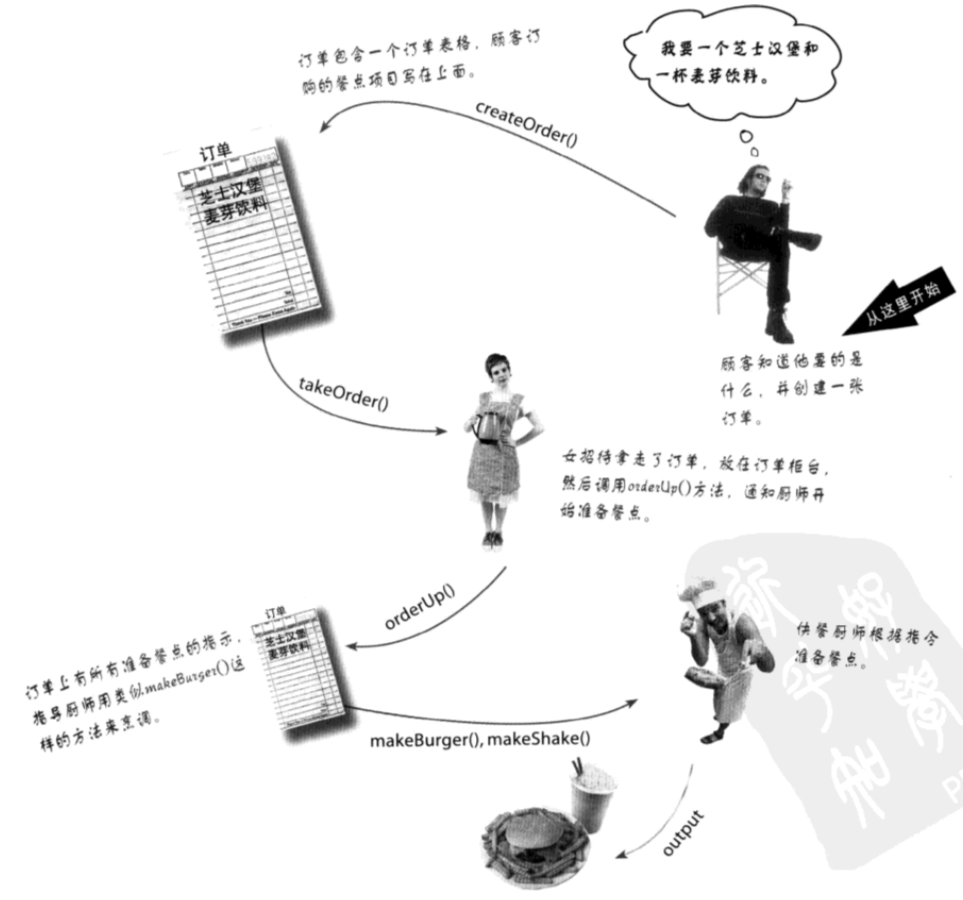
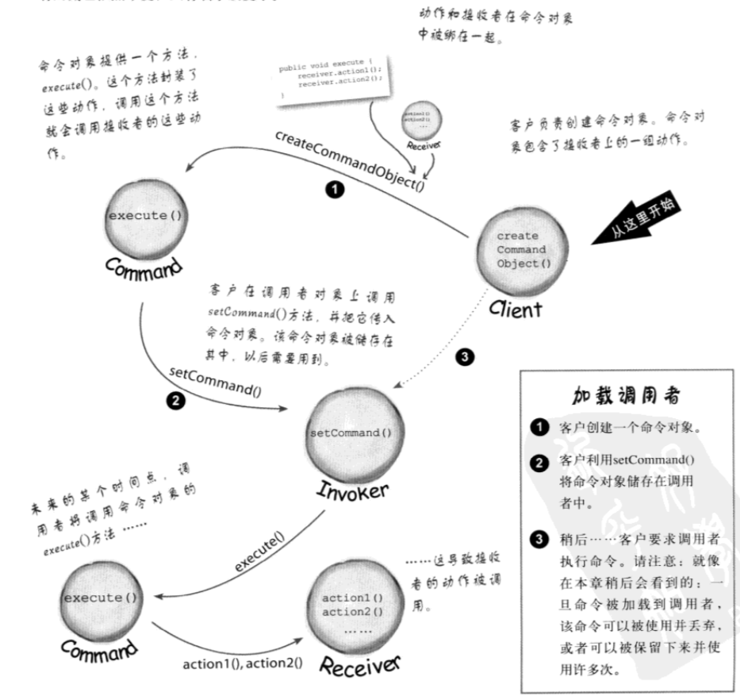
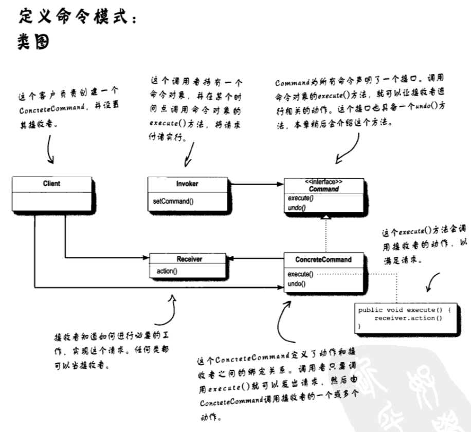

# 命令模式
一个餐厅点餐的交互过程
1. 客户创建订单
2. 订单封装了准备餐点的请求
3. 女招待的工作是接受订单，然后调用订单的 orderUp() 方法
4. 厨师具备具体准备餐点的能力

抽象出来命令模式

具体代码见[这里](./code/06-command-pattern/01-Command)

## 定义命令模式
命令模式：将“请求”封装成对象，一边使用不同的请求、队列或者日志来来参数化其他对象。命令模式也支持可撤销的操作。

我们知道一个命令对象通过在特定接收者上绑定一组动作来封装一个请求。要达到这点，命令对象间动作和接收者包进对象中，这个对象只暴露出一个execute()方法，当此方法被调用的时候，接收者就会进行这些动作，从外面来看，其他对象不知道究竟哪个接收者进行了那些动作，只知道如果调动execute()方法，请求的目的就能达到。

