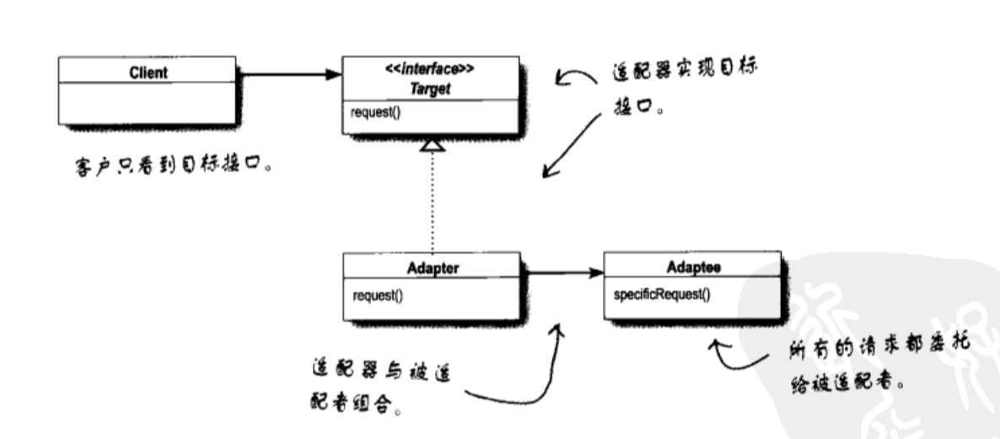
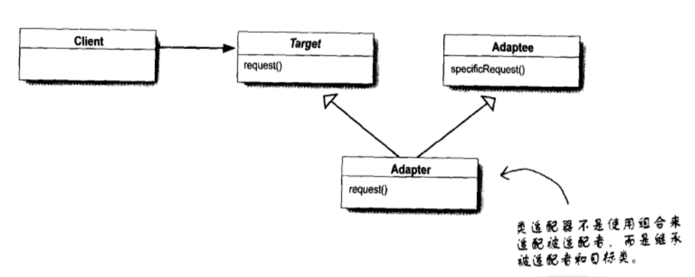

# 适配器模式与外观模式

## 生活中的适配器

买过港版 iPhone 的同学对适配器这个东西肯定印象深刻，由于香港使用欧制的交流电插头与标准的插座不匹配。因此买手机的时候商家都会送一个适配器，通过适配器就可以正常的充电了。这里的适配器模式就跟这个有点类似。

## 例子

首先是两个接口：鸭子和火鸡

```
protocol Duck {
    func quack()
    func fly()
}
```
```
protocol Turkey {
    func gobble()
    func fly()
}
```
实现上面接口的绿头鸭和火鸡的类

```
class MallardDuck: Duck {
    func quack() {
        print("Quack")
    }
    
    func fly() {
        print("I'm flying")
    }
}
```
```
class WildTurkey: Turkey {
    func gobble() {
        print("Gobble gobble")
    }
    func fly() {
        print("I'm flying a short distance")
    }
}
```
最后是实现 Duck 接口的 TurkeyAdapter 适配器

```
class TurkeyAdapter: Duck {
    var turkey: Turkey
    
    init(turkey: Turkey) {
        self.turkey = turkey
    }
    
    func quack() {
        turkey.gobble()
    }
    
    // 由于火鸡飞的近因此调用多次的飞行
    func fly() {
        for _ in 0..<5 {
            turkey.fly()
        }
    }
}
```

调用

```
var duck = MallardDuck()

var turkey = WildTurkey()
var turkeyAdapter = TurkeyAdapter(turkey: turkey)

duck.quack()
duck.fly()

turkey.gobble()
turkey.fly()

turkeyAdapter.quack()
turkeyAdapter.fly()
```

从上面我我们可以看出来通过 适配器 就可以把 火鸡 当成 鸭子 来使用。

客户使用适配器的过程如下：

1. 客户通过目标接口调用适配器的方法对适配器发出请求。
2. 适配器使用被适配者接口把请求转换成被适配者的一个或多个调用接口。
3. 客户接受到调用的结构，但并未察觉这一切是适配器在起转换作用。

## 定义

**适配器模式将一个类的接口，转换成客户期望的另一个接口，适配器让原本接口不兼容的类可以合作无间。**

这个模式可以通过创建适配器进行接口转换，让不兼容的接口变成兼容。这可以让客户从实现的接口解耦。如果在一端时间之后，我们想要改变接口，适配器可以将改变的部分封装起来，客户就不必为了应对不同的接口而每次跟着修改。



## 对象和类的适配器

上图所示的其实是对象的适配器，而类的适配器则需要多继承来实现，在我们熟悉的 Java Swift OC 中都是不能实现的。




