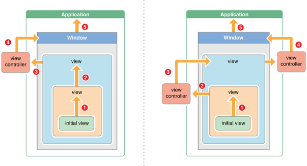

# 事件响应
## UIResponder
当 App 与用户进行交互的时候需要依赖于各种事件，比如用户点击一个按钮，这就会产生一个点击事件。而在 UIKit 中这些事件定义在 UIResponder 类中。
我们常见的 UIApplication、UIView、UIViewController 这几个类都是直接继承自 UIResponder。了解这一点对于理解响应链有很大的帮助。

## 响应链
大多数事件的分发都是依赖响应链的。响应链是由一系列链接在一起的响应者组成的。一般情况下，一条响应链开始于第一响应者，结束于 application 对象。如果一个响应者不能处理事件，则会将事件沿着响应链传到下一响应者。

那这里就会有三个问题：

- 响应链是何时构建的
- 系统是如何确定第一响应者的
- 确定第一响应者后，系统又是按照什么样的顺序来传递事件的

### 构建响应链
在一个 App 中，所有视图是按一定的结构组织起来的，即树状层次结构。除了根视图外，每个视图都有一个父视图；而每个视图都可以有0个或多个子视图。而在这个树状结构构建的同时，也构建了一条条的事件响应链。

### 确定第一响应者
当用户触发某一事件(触摸事件或运动事件)后，UIKit 会创建一个事件对象( UIEvent )，该对象包含一些处理事件所需要的信息。然后事件对象被放到一个事件队列中。这些事件按照先进先出的顺序来处理。当处理事件时，程序的 UIApplication 对象会从队列头部取出一个事件对象，将其分发出去。通常首先是将事件分发给程序的主 window 对象，对于触摸事件来讲，window 对象会首先尝试将事件分发给触摸事件发生的那个视图上。这一视图通常被称为`hit-test`视图，而查找这一视图的过程就叫做`hit-testing`。

系统使用 `hit-testing` 来找到触摸下的视图，它检测一个触摸事件是否发生在相应视图对象的边界之内(即视图的 frame 属性，这也是为什么子视图如果在父视图的 frame 之外时，是无法响应事件的)。如果在，则会递归检测其所有的子视图。包含触摸点的视图层次架构中最底层的视图就是 `hit-test` 视图。在检测出 `hit-test` 视图后，系统就将事件发送给这个视图来进行处理。

### 事件传递
最有机会处理事件的对象是 `hit-test` 视图或第一响应者。如果这两者都不能处理事件，UIKit 就会将事件传递到响应链中的下一个响应者。每一个响应者确定其是否要处理事件或者是通过 nextResponder 方法将其传递给下一个响应者。这一过程一直持续到找到能处理事件的响应者对象或者最终没有找到响应者。

>从上面可以看到，视图、视图控制器、窗口对象和app对象都能处理事件。另外需要注意的是，手势也会影响到事件的传递。

1. 初始视图(initial view)尝试处理事件。如果它不能处理事件，则将事件传递给其父视图。
2. 初始视图的父视图(superview)尝试处理事件。如果这个视图还是不能处理事件，则将事件传递给视图所在的视图控制器。
3. 视图控制器会尝试处理事件。如果这个视图控制器不能处理事件，则将事件传递给窗口(window)对象。
4. 窗口(window)对象尝试处理事件。如果不能处理，则将事件传递给单例 application 对象。
5. 如果 application 对象不能处理事件，则丢弃这个事件。

## 参考
1. [UIKit: UIResponder](http://southpeak.github.io/2015/03/07/cocoa-uikit-uiresponder/)