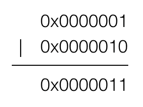
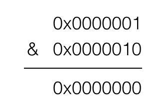

# SDWebImage 源码解析
地址：[https://github.com/rs/SDWebImage](https://github.com/rs/SDWebImage)

版本：v4.3.3

ps: 从 github 直接 down 下来的 zip 包中的 demo 无法正常跑起来，提示缺少某些文件，解决办法就是利用`git clone --recursive https://github.com/rs/SDWebImage.git`直接 clone。

pps: 最新的 demo 中包含了一个 FLAnimatedImageView 的库，大致看了一下这个是用来做一些动图用的。暂时按下不表，我们依然从最常用的功能开始看。


上面这是官方给出的类图。可以看出其规模还是很可观的。


从这个时序图可以看出大致的调用层级，然后我们按着这个来分析。
## UIImageView + WebCache
项目中用到最多的大概是下面这个方法

```
[self.imageView sd_setImageWithURL:[NSURL URLWithString:@"url"]
                  placeholderImage:[UIImage imageNamed:@"placeholder.png"]];
```

我们按下 command 键 进入方法实现，然后按下 command + shift + j 在目录中选中当前文件。然后我们会发现该方法定义在 `UIImageView +WebCache` 这个文件中，同时你会看到很多的 `sd_setImageWithURL......` 方法, 它们最终都会调用下面这个方法

```
- (void)sd_internalSetImageWithURL:(nullable NSURL *)url
                  placeholderImage:(nullable UIImage *)placeholder
                           options:(SDWebImageOptions)options
                      operationKey:(nullable NSString *)operationKey
                     setImageBlock:(nullable SDSetImageBlock)setImageBlock
                          progress:(nullable SDWebImageDownloaderProgressBlock)progressBlock
                         completed:(nullable SDExternalCompletionBlock)completedBlock
                           context:(nullable NSDictionary<NSString *, id> *)context;
```
该方法定义于`UIView+WebCache`中。为什么不是`UIImageView+WebCache`而要上一层到 UIView 的分类里呢？ 因为 SDWebImage 框架也支持 UIButton 的下载图片等方法，所以需要在它们的父类：UIView 里面统一一个下载方法。

## UIView + WebCache

`sd_internalSetImageWithURL `方法的具体实现

```
 // 获取操作的 key，然后根据 key 去取消下载操作。框架中的所有操作实际上都是通过一个 operationDictionary 的 NSMapTable 来管理, 而这个字典实际上是动态的添加到 UIView 上的一个属性。这行代码是要保证没有当前正在进行的异步下载操作, 不会与即将进行的操作发生冲突。
    NSString *validOperationKey = operationKey ?: NSStringFromClass([self class]);
    [self sd_cancelImageLoadOperationWithKey:validOperationKey];
    
    // 添加 imageURLKey 外界可通过 sd_imageURL 方法获取当前的 url
    objc_setAssociatedObject(self, &imageURLKey, url, OBJC_ASSOCIATION_RETAIN_NONATOMIC);
    
    // 设置占位图
    if (!(options & SDWebImageDelayPlaceholder)) {
        if ([context valueForKey:SDWebImageInternalSetImageGroupKey]) {
            dispatch_group_t group = [context valueForKey:SDWebImageInternalSetImageGroupKey];
            dispatch_group_enter(group);
        }
        dispatch_main_async_safe(^{
            [self sd_setImage:placeholder imageData:nil basedOnClassOrViaCustomSetImageBlock:setImageBlock];
        });
    }
    
    if (url) {
        // 检查加载指示器是否显示
        // check if activityView is enabled or not
        if ([self sd_showActivityIndicatorView]) {
            // 添加指示器
            [self sd_addActivityIndicator];
        }
        
        // 重置进度
        // reset the progress
        self.sd_imageProgress.totalUnitCount = 0;
        self.sd_imageProgress.completedUnitCount = 0;
        
        // 获取manager
        SDWebImageManager *manager;
        if ([context valueForKey:SDWebImageExternalCustomManagerKey]) {
            manager = (SDWebImageManager *)[context valueForKey:SDWebImageExternalCustomManagerKey];
        } else {
            manager = [SDWebImageManager sharedManager];
        }
        
        __weak __typeof(self)wself = self;
        SDWebImageDownloaderProgressBlock combinedProgressBlock = ^(NSInteger receivedSize, NSInteger expectedSize, NSURL * _Nullable targetURL) {
            wself.sd_imageProgress.totalUnitCount = expectedSize;
            wself.sd_imageProgress.completedUnitCount = receivedSize;
            if (progressBlock) {
                progressBlock(receivedSize, expectedSize, targetURL);
            }
        };
        // 利用 manger 下载图片
        id <SDWebImageOperation> operation = [manager loadImageWithURL:url options:options progress:combinedProgressBlock completed:^(UIImage *image, NSData *data, NSError *error, SDImageCacheType cacheType, BOOL finished, NSURL *imageURL) {
            // 下载完成的回调
            
            __strong __typeof (wself) sself = wself;
            if (!sself) { return; }
            
            [sself sd_removeActivityIndicator];
            
            // if the progress not been updated, mark it to complete state
            if (finished && !error && sself.sd_imageProgress.totalUnitCount == 0 && sself.sd_imageProgress.completedUnitCount == 0) {
                sself.sd_imageProgress.totalUnitCount = SDWebImageProgressUnitCountUnknown;
                sself.sd_imageProgress.completedUnitCount = SDWebImageProgressUnitCountUnknown;
            }
            // 是否调用完成回调
            BOOL shouldCallCompletedBlock = finished || (options & SDWebImageAvoidAutoSetImage);
            // 是否不自动设置图片
            BOOL shouldNotSetImage = ((image && (options & SDWebImageAvoidAutoSetImage)) ||
                                      (!image && !(options & SDWebImageDelayPlaceholder)));
            SDWebImageNoParamsBlock callCompletedBlockClojure = ^{
                if (!sself) { return; }
                // 需要设置图片，调用sd_setNeedsLayout，告诉 runloop 需要重绘，runloop 会在当前循环完成后进行重新绘制
                if (!shouldNotSetImage) {
                    [sself sd_setNeedsLayout];
                }
                if (completedBlock && shouldCallCompletedBlock) {
                    completedBlock(image, error, cacheType, url);
                }
            };
            
            // case 1a: we got an image, but the SDWebImageAvoidAutoSetImage flag is set
            // OR
            // case 1b: we got no image and the SDWebImageDelayPlaceholder is not set
            if (shouldNotSetImage) {
                dispatch_main_async_safe(callCompletedBlockClojure);
                return;
            }
            
            UIImage *targetImage = nil;
            NSData *targetData = nil;
            if (image) {
                // case 2a: we got an image and the SDWebImageAvoidAutoSetImage is not set
                targetImage = image;
                targetData = data;
            } else if (options & SDWebImageDelayPlaceholder) {
                // case 2b: we got no image and the SDWebImageDelayPlaceholder flag is set
                targetImage = placeholder;
                targetData = nil;
            }
            
            // 检查变换属性是否设置
            // check whether we should use the image transition
            SDWebImageTransition *transition = nil;
            if (finished && (options & SDWebImageForceTransition || cacheType == SDImageCacheTypeNone)) {
                transition = sself.sd_imageTransition;
            }
            
            if ([context valueForKey:SDWebImageInternalSetImageGroupKey]) {
                dispatch_group_t group = [context valueForKey:SDWebImageInternalSetImageGroupKey];
                dispatch_group_enter(group);
                dispatch_main_async_safe(^{
                    // 设置图片及图片变化
                    [sself sd_setImage:targetImage imageData:targetData basedOnClassOrViaCustomSetImageBlock:setImageBlock transition:transition cacheType:cacheType imageURL:imageURL];
                });
                // ensure completion block is called after custom setImage process finish
                dispatch_group_notify(group, dispatch_get_main_queue(), ^{
                    callCompletedBlockClojure();
                });
            } else {
                dispatch_main_async_safe(^{
                    // 设置图片及图片变化
                    [sself sd_setImage:targetImage imageData:targetData basedOnClassOrViaCustomSetImageBlock:setImageBlock transition:transition cacheType:cacheType imageURL:imageURL];
                    // 调用完成的回调，确认是否重绘
                    callCompletedBlockClojure();
                });
            }
        }];
                // 把当前的操作放入字典中
        [self sd_setImageLoadOperation:operation forKey:validOperationKey];
    } else {
        // 未设置url的处理
        dispatch_main_async_safe(^{
            [self sd_removeActivityIndicator];
            if (completedBlock) {
                NSError *error = [NSError errorWithDomain:SDWebImageErrorDomain code:-1 userInfo:@{NSLocalizedDescriptionKey : @"Trying to load a nil url"}];
                completedBlock(nil, error, SDImageCacheTypeNone, url);
            }
        });
    }
```
上面代码主要的工作就是先根据 key 取消字典中（这个字典是通过关联属性关联到 UIView 上的）的操作，然后通过 manger 创建操作并放到字典中。期间进行了 url 检测，指示器检测，图片变换检测、图片设置检测以及是否调用回调检测等操作。

## SDWebImageManager
在上面的方法中我们了解到下载图片的操作是通过 SDWebImageManager 进行的。通过源码和上方的类图我们可以看出这个类是比较核心的一个类，他通过管理 SDImageCache 和 SDWebImageDownloader 这两个类来协调异步下载和图片缓存。

### 管理策略

```
typedef NS_OPTIONS(NSUInteger, SDWebImageOptions) {
    
    // 默认情况下，当URL下载失败时，URL会被列入黑名单，导致库不会再去重试，该标记用于禁用黑名单
    SDWebImageRetryFailed = 1 << 0,
    
    // 默认情况下，图片下载开始于UI交互，该标记禁用这一特性，这样下载延迟到UIScrollView减速时
    SDWebImageLowPriority = 1 << 1,
    
    // 该标记禁用磁盘缓存
    SDWebImageCacheMemoryOnly = 1 << 2,
    
    // 该标记启用渐进式下载，图片在下载过程中是渐渐显示的，如同浏览器一下。
    // 默认情况下，图像在下载完成后一次性显示
    SDWebImageProgressiveDownload = 1 << 3,
    
    // 即使图片缓存了，也期望HTTP响应cache control，并在需要的情况下从远程刷新图片。
    // 磁盘缓存将被NSURLCache处理而不是SDWebImage，因为SDWebImage会导致轻微的性能下载。
    // 该标记帮助处理在相同请求URL后面改变的图片。如果缓存图片被刷新，则完成block会使用缓存图片调用一次
    // 然后再用最终图片调用一次
    SDWebImageRefreshCached = 1 << 4,
    
    // 在iOS 4+系统中，当程序进入后台后继续下载图片。这将要求系统给予额外的时间让请求完成
    // 如果后台任务超时，则操作被取消
    SDWebImageContinueInBackground = 1 << 5,
    
    // 通过设置NSMutableURLRequest.HTTPShouldHandleCookies = YES;来处理存储在NSHTTPCookieStore中的cookie
    SDWebImageHandleCookies = 1 << 6,
    
    // 允许不受信任的SSL认证
    SDWebImageAllowInvalidSSLCertificates = 1 << 7,
    
    // 默认情况下，图片下载按入队的顺序来执行。该标记将其移到队列的前面，
    // 以便图片能立即下载而不是等到当前队列被加载
    SDWebImageHighPriority = 1 << 8,
    
    // 默认情况下，占位图片在加载图片的同时被加载。该标记延迟占位图片的加载直到图片已被加载完成
    SDWebImageDelayPlaceholder = 1 << 9,
    
    // 通常我们不调用动画图片的transformDownloadedImage代理方法，因为大多数转换代码可以管理它。
    // 使用这个 flag 则任何情况下都进行转换。
    SDWebImageTransformAnimatedImage = 1 << 10,
    
    // 默认情况下图片下载后就会被设置到视图，但是一些时候我们需要获取设置图片的时机（用来添加过滤或者添加渐变动画）
    // 当你想在结束的时候手动设置图片时可以利用这个 flag
    SDWebImageAvoidAutoSetImage = 1 << 11,
    
    // 默认情况下图片下载后就会被设置到视图，但是一些时候我们需要获取设置图片的时机（用来添加过滤或者添加渐变动画）
    // 当你想在结束的时候手动设置图片时可以利用这个 flag
    SDWebImageAvoidAutoSetImage = 1 << 11,
    
   // 默认情况下，图片会基于他们的原始大小进行解码，在小内存 iOS 的设备中，这个 flag 会压缩图片。
    SDWebImageScaleDownLargeImages = 1 << 12,
    
   // 默认情况下对于内存缓存的图片并不会去查找磁盘，通过这个标识就可以同时查找磁盘上的内容。
    // 建议这个标识与 SDWebImageQueryDiskSync 一起使用确保图片是在同一个 runloop 中加载
    SDWebImageQueryDataWhenInMemory = 1 << 13,
    
   // 默认情况下查找内存缓存是同步的操作，磁盘缓存是异步操作。这个标识可以同步查找磁盘缓存来确认图片的加载在同一个 runloop 中。
    // 这个 flag 可以用来避免不适用内存缓存或者其他情况下引起的 cell 重用造成的闪烁问题
    SDWebImageQueryDiskSync = 1 << 14,

    // 默认情况下没有缓存的情况下就会通过网络下载，这个 flag 可以阻止网络下载，只使用缓存。
    SDWebImageFromCacheOnly = 1 << 15,
 
     // 默认情况下可以利用 `SDWebImageTransition` 来实现图片下载完成后进行变换的操作，但是只对下载的图片起作用，利用这个可以对缓存的图片也能起作用
    SDWebImageForceTransition = 1 << 16
};
```

### 下载方法
接下来分析下最重要的下载方法

```
- (id <SDWebImageOperation>)loadImageWithURL:(nullable NSURL *)url
                                     options:(SDWebImageOptions)options
                                    progress:(nullable SDWebImageDownloaderProgressBlock)progressBlock
                                   completed:(nullable SDInternalCompletionBlock)completedBlock {
    // 没有 completedBlock 被认为是无意义的，直接断言走你
    // Invoking this method without a completedBlock is pointless
    NSAssert(completedBlock != nil, @"If you mean to prefetch the image, use -[SDWebImagePrefetcher prefetchURLs] instead");

    // 如果 url 参数传入的是 NSString 则转换为 NSURL
    // Very common mistake is to send the URL using NSString object instead of NSURL. For some strange reason, Xcode won't
    // throw any warning for this type mismatch. Here we failsafe this error by allowing URLs to be passed as NSString.
    if ([url isKindOfClass:NSString.class]) {
        url = [NSURL URLWithString:(NSString *)url];
    }
    
    // 防止类型错误
    // Prevents app crashing on argument type error like sending NSNull instead of NSURL
    if (![url isKindOfClass:NSURL.class]) {
        url = nil;
    }

    // 创建操作对象，需要注意的是这个操作对象只是一个实现了 cancel 方法的 nsobject 对象，他有一个 cacheOperation 的 NSOperation 对象，而 调用 cancel 方法的话会进行一些清理操作
    SDWebImageCombinedOperation *operation = [SDWebImageCombinedOperation new];
    operation.manager = self;

    BOOL isFailedUrl = NO;
    if (url) {
        // 检查该 url 是否是之前请求失败 url
        @synchronized (self.failedURLs) {
            isFailedUrl = [self.failedURLs containsObject:url];
        }
    }
    // url 错误，或者该 url 是失败 url 且不要求重试失败 url ，则直接返回
    if (url.absoluteString.length == 0 || (!(options & SDWebImageRetryFailed) && isFailedUrl)) {
        [self callCompletionBlockForOperation:operation completion:completedBlock error:[NSError errorWithDomain:NSURLErrorDomain code:NSURLErrorFileDoesNotExist userInfo:nil] url:url];
        return operation;
    }
    
    // 添加操作到当前运行的操作集合中
    @synchronized (self.runningOperations) {
        [self.runningOperations addObject:operation];
    }
    
    NSString *key = [self cacheKeyForURL:url];
    
    // 获取缓存配置
    SDImageCacheOptions cacheOptions = 0;
    if (options & SDWebImageQueryDataWhenInMemory) cacheOptions |= SDImageCacheQueryDataWhenInMemory;
    if (options & SDWebImageQueryDiskSync) cacheOptions |= SDImageCacheQueryDiskSync;
    if (options & SDWebImageScaleDownLargeImages) cacheOptions |= SDImageCacheScaleDownLargeImages;
    
    __weak SDWebImageCombinedOperation *weakOperation = operation;
    // 查找缓存
    operation.cacheOperation = [self.imageCache queryCacheOperationForKey:key options:cacheOptions done:^(UIImage *cachedImage, NSData *cachedData, SDImageCacheType cacheType) {
        __strong __typeof(weakOperation) strongOperation = weakOperation;
        if (!strongOperation || strongOperation.isCancelled) {
            [self safelyRemoveOperationFromRunning:strongOperation];
            return;
        }
        
        // Check whether we should download image from network
        // 是否需要下载图片 = （不是只从缓存中获取图片）&& （（没有缓存图片） || （即使有缓存图片，也需要更新缓存图片））&& （（代理没有响应imageManager:shouldDownloadImageForURL:消息，默认返回yes，需要下载图片）|| （imageManager:shouldDownloadImageForURL:返回yes，需要下载图片））
        BOOL shouldDownload = (!(options & SDWebImageFromCacheOnly))
            && (!cachedImage || options & SDWebImageRefreshCached)
            && (![self.delegate respondsToSelector:@selector(imageManager:shouldDownloadImageForURL:)] || [self.delegate imageManager:self shouldDownloadImageForURL:url]);
        if (shouldDownload) {
            // 有缓存图片 并且 即使图片缓存了，也期望HTTP响应cache control，并在需要的情况下从远程刷新图片。
            // 则先返回缓存中的图片给外部，之后继续从网络下载并刷新缓存中的图片
            if (cachedImage && options & SDWebImageRefreshCached) {
                // If image was found in the cache but SDWebImageRefreshCached is provided, notify about the cached image
                // AND try to re-download it in order to let a chance to NSURLCache to refresh it from server.
                [self callCompletionBlockForOperation:strongOperation completion:completedBlock image:cachedImage data:cachedData error:nil cacheType:cacheType finished:YES url:url];
            }

            // 下载策略
            // download if no image or requested to refresh anyway, and download allowed by delegate
            SDWebImageDownloaderOptions downloaderOptions = 0;
            if (options & SDWebImageLowPriority) downloaderOptions |= SDWebImageDownloaderLowPriority;
            if (options & SDWebImageProgressiveDownload) downloaderOptions |= SDWebImageDownloaderProgressiveDownload;
            if (options & SDWebImageRefreshCached) downloaderOptions |= SDWebImageDownloaderUseNSURLCache;
            if (options & SDWebImageContinueInBackground) downloaderOptions |= SDWebImageDownloaderContinueInBackground;
            if (options & SDWebImageHandleCookies) downloaderOptions |= SDWebImageDownloaderHandleCookies;
            if (options & SDWebImageAllowInvalidSSLCertificates) downloaderOptions |= SDWebImageDownloaderAllowInvalidSSLCertificates;
            if (options & SDWebImageHighPriority) downloaderOptions |= SDWebImageDownloaderHighPriority;
            if (options & SDWebImageScaleDownLargeImages) downloaderOptions |= SDWebImageDownloaderScaleDownLargeImages;
            
            // 如果是刷新缓存操作，不执行渐进下载，同时需要执行缓存操作
            if (cachedImage && options & SDWebImageRefreshCached) {
                // force progressive off if image already cached but forced refreshing
                downloaderOptions &= ~SDWebImageDownloaderProgressiveDownload;
                // ignore image read from NSURLCache if image if cached but force refreshing
                downloaderOptions |= SDWebImageDownloaderIgnoreCachedResponse;
            }
            
            // `SDWebImageCombinedOperation` -> `SDWebImageDownloadToken` -> `downloadOperationCancelToken`, which is a `SDCallbacksDictionary` and retain the completed block below, so we need weak-strong again to avoid retain cycle
            __weak typeof(strongOperation) weakSubOperation = strongOperation;
            strongOperation.downloadToken = [self.imageDownloader downloadImageWithURL:url options:downloaderOptions progress:progressBlock completed:^(UIImage *downloadedImage, NSData *downloadedData, NSError *error, BOOL finished) {
                __strong typeof(weakSubOperation) strongSubOperation = weakSubOperation;
                if (!strongSubOperation || strongSubOperation.isCancelled) {
                    // Do nothing if the operation was cancelled
                    // See #699 for more details
                    // if we would call the completedBlock, there could be a race condition between this block and another completedBlock for the same object, so if this one is called second, we will overwrite the new data
                } else if (error) {
                    [self callCompletionBlockForOperation:strongSubOperation completion:completedBlock error:error url:url];
                    BOOL shouldBlockFailedURL;
                    // Check whether we should block failed url
                    if ([self.delegate respondsToSelector:@selector(imageManager:shouldBlockFailedURL:withError:)]) {
                        shouldBlockFailedURL = [self.delegate imageManager:self shouldBlockFailedURL:url withError:error];
                    } else {
                        shouldBlockFailedURL = (   error.code != NSURLErrorNotConnectedToInternet
                                                && error.code != NSURLErrorCancelled
                                                && error.code != NSURLErrorTimedOut
                                                && error.code != NSURLErrorInternationalRoamingOff
                                                && error.code != NSURLErrorDataNotAllowed
                                                && error.code != NSURLErrorCannotFindHost
                                                && error.code != NSURLErrorCannotConnectToHost
                                                && error.code != NSURLErrorNetworkConnectionLost);
                    }
                    // 下载失败，并且排除上述网络原因，将该 Url 置为操作失败的 Url
                    if (shouldBlockFailedURL) {
                        @synchronized (self.failedURLs) {
                            [self.failedURLs addObject:url];
                        }
                    }
                }
                else {
                    // 下载成功后尝试去清除 SDWebImageRetryFailed 策略下的失败 url
                    if ((options & SDWebImageRetryFailed)) {
                        @synchronized (self.failedURLs) {
                            [self.failedURLs removeObject:url];
                        }
                    }
                    
                    BOOL cacheOnDisk = !(options & SDWebImageCacheMemoryOnly);
                    
                    // 对一些情况下的图片进行缩放处理
                    // We've done the scale process in SDWebImageDownloader with the shared manager, this is used for custom manager and avoid extra scale.
                    if (self != [SDWebImageManager sharedManager] && self.cacheKeyFilter && downloadedImage) {
                        downloadedImage = [self scaledImageForKey:key image:downloadedImage];
                    }

                    if (options & SDWebImageRefreshCached && cachedImage && !downloadedImage) {
                        // Image refresh hit the NSURLCache cache, do not call the completion block
                        // 设置了 NSUrlCache 作为默认缓存，则不执行自定义的缓存
                    }
                    //（下载图片成功 && （没有动图||处理动图） && （下载之后，缓存之前处理图片）
                    else if (downloadedImage && (!downloadedImage.images || (options & SDWebImageTransformAnimatedImage)) && [self.delegate respondsToSelector:@selector(imageManager:transformDownloadedImage:withURL:)]) {
                        dispatch_async(dispatch_get_global_queue(DISPATCH_QUEUE_PRIORITY_HIGH, 0), ^{
                            // 通过代理对图片进行转换
                            UIImage *transformedImage = [self.delegate imageManager:self transformDownloadedImage:downloadedImage withURL:url];

                            if (transformedImage && finished) {
                                BOOL imageWasTransformed = ![transformedImage isEqual:downloadedImage];
                                NSData *cacheData;
                                // pass nil if the image was transformed, so we can recalculate the data from the image
                                if (self.cacheSerializer) {
                                    cacheData = self.cacheSerializer(transformedImage, (imageWasTransformed ? nil : downloadedData), url);
                                } else {
                                    cacheData = (imageWasTransformed ? nil : downloadedData);
                                }
                                // 缓存图片
                                [self.imageCache storeImage:transformedImage imageData:cacheData forKey:key toDisk:cacheOnDisk completion:nil];
                            }
                            // 将图片传入 completedBlock
                            [self callCompletionBlockForOperation:strongSubOperation completion:completedBlock image:transformedImage data:downloadedData error:nil cacheType:SDImageCacheTypeNone finished:finished url:url];
                        });
                    }
                    // (图片下载成功并结束)
                    else {
                        if (downloadedImage && finished) {
                            if (self.cacheSerializer) {
                                dispatch_async(dispatch_get_global_queue(DISPATCH_QUEUE_PRIORITY_HIGH, 0), ^{
                                    NSData *cacheData = self.cacheSerializer(downloadedImage, downloadedData, url);
                                    [self.imageCache storeImage:downloadedImage imageData:cacheData forKey:key toDisk:cacheOnDisk completion:nil];
                                });
                            } else {
                                [self.imageCache storeImage:downloadedImage imageData:downloadedData forKey:key toDisk:cacheOnDisk completion:nil];
                            }
                        }
                        [self callCompletionBlockForOperation:strongSubOperation completion:completedBlock image:downloadedImage data:downloadedData error:nil cacheType:SDImageCacheTypeNone finished:finished url:url];
                    }
                }
                // 如果完成，从当前运行的操作列表里移除当前操作
                if (finished) {
                    [self safelyRemoveOperationFromRunning:strongSubOperation];
                }
            }];
        }
        // 存在缓存图片
        else if (cachedImage) {
            // 调用完成的block
            [self callCompletionBlockForOperation:strongOperation completion:completedBlock image:cachedImage data:cachedData error:nil cacheType:cacheType finished:YES url:url];
            // 删去当前的下载操作
            [self safelyRemoveOperationFromRunning:strongOperation];
        }
        // 没有缓存的图片，而且下载被代理终止了
        else {
            // Image not in cache and download disallowed by delegate
            [self callCompletionBlockForOperation:strongOperation completion:completedBlock image:nil data:nil error:nil cacheType:SDImageCacheTypeNone finished:YES url:url];
            [self safelyRemoveOperationFromRunning:strongOperation];
        }
    }];

    return operation;
}
```
该方法主要用于获取图片，根据设置的策略从缓存中或者从网络下载图片并缓存。并返回 operation。

### SDWebImageCombinedOperation
当 url 被正确传入之后, 会实例一个非常奇怪的 "operation", 它其实是一个遵循 SDWebImageOperation 协议的 NSObject 的子类. 而这个协议也非常的简单:

```
@protocol SDWebImageOperation <NSObject>

- (void)cancel;

@end
```
这里仅仅是将这个 SDWebImageOperation 类包装成一个看着像 NSOperation 其实并不是 NSOperation 的类, 而这个类唯一与 NSOperation 的相同之处就是它们都可以响应 cancel 方法. 

而调用这个类的存在实际是为了使代码更加的简洁, 因为调用这个类的 cancel 方法, 会使得它持有的查找缓存和下载图片的两个 operation 都被 cancel.

```
@interface SDWebImageCombinedOperation : NSObject <SDWebImageOperation>

@property (assign, nonatomic, getter = isCancelled) BOOL cancelled;
// downloadToken 中包含下载的 Operation 以及其对应的 token
@property (strong, nonatomic, nullable) SDWebImageDownloadToken *downloadToken;
// cacheOperation 指查询缓存的 Operation
@property (strong, nonatomic, nullable) NSOperation *cacheOperation;
@property (weak, nonatomic, nullable) SDWebImageManager *manager;

@end

@implementation SDWebImageCombinedOperation

- (void)cancel {
    @synchronized(self) {
        self.cancelled = YES;
        if (self.cacheOperation) {
            [self.cacheOperation cancel];
            self.cacheOperation = nil;
        }
        if (self.downloadToken) {
            [self.manager.imageDownloader cancel:self.downloadToken];
        }
        [self.manager safelyRemoveOperationFromRunning:self];
    }
}

@end
```
而这个类, 应该是为了实现更简洁的 cancel 操作而设计出来的.

## SDWebImageCache

从源码可以看出该类在创建的时候可以通过设置namespace和存储位置来区分不同的缓存。并且该类有个串行队列来管理 IO 操作。   
 
```
_ioQueue = dispatch_queue_create("com.hackemist.SDWebImageCache", DISPATCH_QUEUE_SERIAL);
```

而在上面 manger 的 `loadImageWithURL ` 方法中可以看到跟缓存相关的两个重要方法 `queryCacheOperationForKey ` 和 `storeImage `

### queryCacheOperationForKey
```
- (nullable NSOperation *)queryCacheOperationForKey:(nullable NSString *)key options:(SDImageCacheOptions)options done:(nullable SDCacheQueryCompletedBlock)doneBlock {
    if (!key) {
        if (doneBlock) {
            doneBlock(nil, nil, SDImageCacheTypeNone);
        }
        return nil;
    }
    
    // 首先查找内存缓存
    // First check the in-memory cache...
    UIImage *image = [self imageFromMemoryCacheForKey:key];
    BOOL shouldQueryMemoryOnly = (image && !(options & SDImageCacheQueryDataWhenInMemory));
    if (shouldQueryMemoryOnly) {
        if (doneBlock) {
            doneBlock(image, nil, SDImageCacheTypeMemory);
        }
        return nil;
    }
    
    NSOperation *operation = [NSOperation new];
    // 封装 block 是为了后面同步或者异步执行
    void(^queryDiskBlock)(void) =  ^{
        if (operation.isCancelled) {
            // do not call the completion if cancelled
            return;
        }
        
        // 创建自动释放池来及时释放内存占用较大的临时变量
        @autoreleasepool {
            NSData *diskData = [self diskImageDataBySearchingAllPathsForKey:key];
            UIImage *diskImage;
            SDImageCacheType cacheType = SDImageCacheTypeDisk;
            if (image) {
                // the image is from in-memory cache
                diskImage = image;
                cacheType = SDImageCacheTypeMemory;
            } else if (diskData) {
                // decode image data only if in-memory cache missed
                diskImage = [self diskImageForKey:key data:diskData options:options];
                if (diskImage && self.config.shouldCacheImagesInMemory) {
                    // cost 被用来计算缓存中所有对象的代价。当内存受限或者所有缓存对象的总代价超过了最大允许的值时，缓存会移除其中的一些对象。
                    NSUInteger cost = SDCacheCostForImage(diskImage);
                    [self.memCache setObject:diskImage forKey:key cost:cost];
                }
            }
            
            if (doneBlock) {
                if (options & SDImageCacheQueryDiskSync) {
                    doneBlock(diskImage, diskData, cacheType);
                } else {
                    dispatch_async(dispatch_get_main_queue(), ^{
                        doneBlock(diskImage, diskData, cacheType);
                    });
                }
            }
        }
    };
    
    if (options & SDImageCacheQueryDiskSync) {
        // 同步调用 block
        queryDiskBlock();
    } else {
        // 异步调用 block
        dispatch_async(self.ioQueue, queryDiskBlock);
    }
    
    return operation;
}
```
### storeImage

```
- (void)storeImage:(nullable UIImage *)image
         imageData:(nullable NSData *)imageData
            forKey:(nullable NSString *)key
            toDisk:(BOOL)toDisk
        completion:(nullable SDWebImageNoParamsBlock)completionBlock {
    if (!image || !key) {
        if (completionBlock) {
            completionBlock();
        }
        return;
    }
    // if memory cache is enabled
    // 设置内存缓存
    if (self.config.shouldCacheImagesInMemory) {
        NSUInteger cost = SDCacheCostForImage(image);
        [self.memCache setObject:image forKey:key cost:cost];
    }
    // 添加到磁盘
    if (toDisk) {
        // 如果确定需要磁盘缓存，则将缓存操作作为一个任务放入ioQueue中
        // 异步io串行队列，为什么用串行？因为涉及到写入操作，怕对应的key话发生混乱，也就是怕产生的文件名和存入磁盘的数据不对应所以磁盘存储都要一个个存储，这样就可以不用去加锁了，为什么要进行加锁，因为并发情况下这些存储操作都不是线程安全的，但使用了串行队列就完全不需要考虑加锁释放锁
        dispatch_async(self.ioQueue, ^{
            @autoreleasepool {
                NSData *data = imageData;
                if (!data && image) {
                    // If we do not have any data to detect image format, check whether it contains alpha channel to use PNG or JPEG format
                    // 检查是否包含alpha通道，因为jpeg是有损压缩格式, 将像素信息用jpeg保存成文件再读取出来，其中某些像素值会有少许变化。没有透明信息jpeg比较适合用来存储相机拍摄出来的图片。png是一种无损压缩格式，它可以有透明效果，png比较适合矢量图,几何图.所以下面如果包含Alpha的图片就把它的格式定义为PNG，如果没有则定位为JPEG
                    SDImageFormat format;
                    if (SDCGImageRefContainsAlpha(image.CGImage)) {
                        format = SDImageFormatPNG;
                    } else {
                        format = SDImageFormatJPEG;
                    }
                    // 然后再根据 format 进行对 UIImage 编码，编码过程，这里指的就是将一个 UIImage 表示的图像，编码为对应图像格式的数据，输出一个 NSData 的过程
                    data = [[SDWebImageCodersManager sharedInstance] encodedDataWithImage:image format:format];
                }
                // 存储到磁盘中
                [self _storeImageDataToDisk:data forKey:key];
            }
            
            if (completionBlock) {
                dispatch_async(dispatch_get_main_queue(), ^{
                    completionBlock();
                });
            }
        });
    } else {
        if (completionBlock) {
            completionBlock();
        }
    }
}
```
关于存储相关的更详细说明可以看 [这里](https://blog.csdn.net/ZCMUCZX/article/details/79491589)

### SDMemoryCache
该类是用来管理内存缓存的类。其继承自NSCache。内部有两个属性

```
// 存储用的表
@property (nonatomic, strong, nonnull) NSMapTable<KeyType, ObjectType> *weakCache; 
// 保证线程安全的信号量
@property (nonatomic, strong, nonnull) dispatch_semaphore_t weakCacheLock; 
```
并且提供以下两个宏，方便进行加锁和解锁

```
#define LOCK(lock) dispatch_semaphore_wait(lock, DISPATCH_TIME_FOREVER);
#define UNLOCK(lock) dispatch_semaphore_signal(lock);
```

使用`dispatch_semaphore_t `来保证线程安全是一个性能较好的解决方案，具体可以参考我的另一篇 [文章](./locks.md)

而对于 weakCache 这个表来说，我们可以看到在存的时候会在 weakCache 和这个类本身中都保存，而在收到内存警告的时候会清空NSCache，而 weakCache 则没有清理。取的时候会先去 NSCache 本身中取，如果为空则去 weakCache 中去取，如果有会从新设置到 NSCache 中。


## SDWebImageDownloader
它是一个异步下载器，并对图像加载做了优化处理。
### 下载选项

```
typedef NS_OPTIONS(NSUInteger, SDWebImageDownloaderOptions) {
	 // 设置图片下载队列的优先级为低优先级
    SDWebImageDownloaderLowPriority = 1 << 0,
    
    // 图片会随着下载进度慢慢显示
    SDWebImageDownloaderProgressiveDownload = 1 << 1,
    
    // 默认情况下请求不使用NSURLCache，如果设置该选项，则以默认的缓存策略来使用NSURLCache
    SDWebImageDownloaderUseNSURLCache = 1 << 2,
    
    // 如果从NSURLCache缓存中读取图片，则使用nil作为参数来调用完成block
    SDWebImageDownloaderIgnoreCachedResponse = 1 << 3,
    
	// 在iOS 4+系统上，允许程序进入后台后继续下载图片。该操作通过向系统申请额外的时间来完成后台下载。如果后台任务终止，则操作会被取消
    SDWebImageDownloaderContinueInBackground = 1 << 4,
    
    // 通过设置NSMutableURLRequest.HTTPShouldHandleCookies = YES来处理存储在NSHTTPCookieStore中的cookie
    SDWebImageDownloaderHandleCookies = 1 << 5,
    
    // 允许不受信任的SSL证书。主要用于测试目的。
    SDWebImageDownloaderAllowInvalidSSLCertificates = 1 << 6,
    
    // 将图片下载放到高优先级队列中
    SDWebImageDownloaderHighPriority = 1 << 7,
    
    // 压缩图片
    SDWebImageDownloaderScaleDownLargeImages = 1 << 8,
};
```

### downloadImageWithURL
通过制定 url 来下载，代码中可以看到先调用了 `addProgressCallback` 并在传入的 block 中设置了请求头等一系列参数并根据 request 返回了一个 operation。

```
- (nullable SDWebImageDownloadToken *)downloadImageWithURL:(nullable NSURL *)url
                                                   options:(SDWebImageDownloaderOptions)options
                                                  progress:(nullable SDWebImageDownloaderProgressBlock)progressBlock
                                                 completed:(nullable SDWebImageDownloaderCompletedBlock)completedBlock {
    __weak SDWebImageDownloader *wself = self;
    
    return [self addProgressCallback:progressBlock completedBlock:completedBlock forURL:url createCallback:^SDWebImageDownloaderOperation *{
        __strong __typeof (wself) sself = wself;
        // 设置超时时长，默认是15s
        NSTimeInterval timeoutInterval = sself.downloadTimeout;
        if (timeoutInterval == 0.0) {
            timeoutInterval = 15.0;
        }

        // 保证只使用 NSURLCache 或者 SDImageCache 中的一种，不要同时使用二者
        // In order to prevent from potential duplicate caching (NSURLCache + SDImageCache) we disable the cache for image requests if told otherwise
        NSURLRequestCachePolicy cachePolicy = options & SDWebImageDownloaderUseNSURLCache ? NSURLRequestUseProtocolCachePolicy : NSURLRequestReloadIgnoringLocalCacheData;
        // 创建请求
        NSMutableURLRequest *request = [[NSMutableURLRequest alloc] initWithURL:url
                                                                    cachePolicy:cachePolicy
                                                                timeoutInterval:timeoutInterval];
        
        request.HTTPShouldHandleCookies = (options & SDWebImageDownloaderHandleCookies);
        //HTTPShouldUsePipelining设置为YES, 则允许不必等到response, 就可以再次请求. 这个会很大的提高网络请求的效率,但是也可能会出问题
        //因为客户端无法正确的匹配请求与响应, 所以这依赖于服务器必须保证,响应的顺序与客户端请求的顺序一致.如果服务器不能保证这一点, 那可能导致响应和请求混乱.
        request.HTTPShouldUsePipelining = YES;
        
        // 设置 HTTP header中的 Accept 来告诉服务器倾向于获取 @"image/*;q=0.8" 或者 @"image/webp,image/*;q=0.8" 类型的数据
        if (sself.headersFilter) {
            // 过滤 header
            request.allHTTPHeaderFields = sself.headersFilter(url, [sself allHTTPHeaderFields]);
        }
        else {
            // 设置 header
            request.allHTTPHeaderFields = [sself allHTTPHeaderFields];
        }
        
        // 使用 operationClass 这个属性来确保生成的 operation 必须遵循 SDWebImageDownloaderOperationInterface 协议
        // 否则就从新生成一个 SDWebImageDownloaderOperation 对象
        SDWebImageDownloaderOperation *operation = [[sself.operationClass alloc] initWithRequest:request inSession:sself.session options:options];
        operation.shouldDecompressImages = sself.shouldDecompressImages;
        
        // 进行身份认证
        if (sself.urlCredential) {
            operation.credential = sself.urlCredential;
        } else if (sself.username && sself.password) {
            operation.credential = [NSURLCredential credentialWithUser:sself.username password:sself.password persistence:NSURLCredentialPersistenceForSession];
        }
        
        // 下载优先级
        if (options & SDWebImageDownloaderHighPriority) {
            operation.queuePriority = NSOperationQueuePriorityHigh;
        } else if (options & SDWebImageDownloaderLowPriority) {
            operation.queuePriority = NSOperationQueuePriorityLow;
        }
        
        // 执行顺序是后进先出（栈）的话进行处理
        if (sself.executionOrder == SDWebImageDownloaderLIFOExecutionOrder) {
            // Emulate LIFO execution order by systematically adding new operations as last operation's dependency
            [sself.lastAddedOperation addDependency:operation];
            sself.lastAddedOperation = operation;
        }

        return operation;
    }];
}
```

### addProgressCallback
这个方法主要作用是获取 URLOperations 中的 operation， 没有的话调用 createCallback 进行创建然后加入到 URLOperations 中。然后把取得的 operation 加入到 queue 中。并且会在 operation 完成的回调中从 URLOperations 去除。

```
- (nullable SDWebImageDownloadToken *)addProgressCallback:(SDWebImageDownloaderProgressBlock)progressBlock
                                           completedBlock:(SDWebImageDownloaderCompletedBlock)completedBlock
                                                   forURL:(nullable NSURL *)url
                                           createCallback:(SDWebImageDownloaderOperation *(^)(void))createCallback {
    // The URL will be used as the key to the callbacks dictionary so it cannot be nil. If it is nil immediately call the completed block with no image or data.
    // url 用来作为回调字典的key，如果为空，立即返回失败
    if (url == nil) {
        if (completedBlock != nil) {
            completedBlock(nil, nil, nil, NO);
        }
        return nil;
    }
    
    // 使用信号量来确保 URLOperations downloadQueue 的 线程安全
    // URLOperations 以下载url作为key value是具体的下载operation 用字典来存储，方便cancel等操作
    LOCK(self.operationsLock);
    // 根据 url 取出 operation
    SDWebImageDownloaderOperation *operation = [self.URLOperations objectForKey:url];
    // 没有 operation 的话就会调用 createCallback 来获取
    if (!operation) {
        operation = createCallback();
        __weak typeof(self) wself = self;
        // operation 完成的回调中从 URLOperations 中移除
        operation.completionBlock = ^{
            __strong typeof(wself) sself = wself;
            if (!sself) {
                return;
            }
            LOCK(sself.operationsLock);
            [sself.URLOperations removeObjectForKey:url];
            UNLOCK(sself.operationsLock);
        };
        // 添加到 URLOperations 中
        [self.URLOperations setObject:operation forKey:url];
        // Add operation to operation queue only after all configuration done according to Apple's doc.
        // `addOperation:` does not synchronously execute the `operation.completionBlock` so this will not cause deadlock.
        // 这段代码不会造成死锁的原因是 当 operation 加入 queue 中时并不会同步的执行 operation.completionBlock
        [self.downloadQueue addOperation:operation];
    }
    UNLOCK(self.operationsLock);

    // 把 progressBlock 和 completedBlock 放入 callbackBlocks 中
    id downloadOperationCancelToken = [operation addHandlersForProgress:progressBlock completed:completedBlock];
    
    // 生成 token ，后续 manger 可以根据 token 取消相应的操作
    SDWebImageDownloadToken *token = [SDWebImageDownloadToken new];
    token.downloadOperation = operation;
    token.url = url;
    token.downloadOperationCancelToken = downloadOperationCancelToken;

    return token;
}
```

## SDWebImageDownloaderOperation
由上面的代码我们可以看出他们做的工作就是生成 operation 然后对 operation 进行一些处理。而`SDWebImageDownloaderOperation `才是具体的执行图片下载的单位。他继承自 NSOperation ，负责生成 NSURLSessionTask 进行图片请求，支持下载取消和后台下载，在下载中及时汇报下载进度，在下载成功后，对图片进行解码，缩放和压缩等操作。 

### start

```
// 重写operation的start方法，当任务添加到NSOperationQueue后会执行该方法，启动下载任务
- (void)start {
    //添加锁，防止多线程数据竞争
    @synchronized (self) {
        if (self.isCancelled) {
            self.finished = YES;
            [self reset];
            return;
        }

#if SD_UIKIT
        // 如调用者配置了在后台可以继续下载图片，那么在这里继续下载
        Class UIApplicationClass = NSClassFromString(@"UIApplication");
        BOOL hasApplication = UIApplicationClass && [UIApplicationClass respondsToSelector:@selector(sharedApplication)];
        if (hasApplication && [self shouldContinueWhenAppEntersBackground]) {
            __weak __typeof__ (self) wself = self;
            UIApplication * app = [UIApplicationClass performSelector:@selector(sharedApplication)];
            self.backgroundTaskId = [app beginBackgroundTaskWithExpirationHandler:^{
                __strong __typeof (wself) sself = wself;

                if (sself) {
                    [sself cancel];

                    [app endBackgroundTask:sself.backgroundTaskId];
                    sself.backgroundTaskId = UIBackgroundTaskInvalid;
                }
            }];
        }
#endif
        // 判断unownedSession是否为了nil，如果是nil则重新创建一个ownedSession
        // 注意这里unownedSession使用的属性修饰符是weak，因为unownedSession是从SDWebImageDownloader传过来的，所以需要SDWebImageDownloader管理
        // 如果unownedSession是nil，我们需要手动创建一个并且管理它的生命周期和代理方法
        NSURLSession *session = self.unownedSession;
        if (!session) {
            NSURLSessionConfiguration *sessionConfig = [NSURLSessionConfiguration defaultSessionConfiguration];
            sessionConfig.timeoutIntervalForRequest = 15;
            
            /**
             *  Create the session for this task
             *  We send nil as delegate queue so that the session creates a serial operation queue for performing all delegate
             *  method calls and completion handler calls.
             */
            session = [NSURLSession sessionWithConfiguration:sessionConfig
                                                    delegate:self
                                               delegateQueue:nil];
            self.ownedSession = session;
        }
        
        // 获取网络请求的缓存数据
        if (self.options & SDWebImageDownloaderIgnoreCachedResponse) {
            // Grab the cached data for later check
            NSURLCache *URLCache = session.configuration.URLCache;
            if (!URLCache) {
                URLCache = [NSURLCache sharedURLCache];
            }
            NSCachedURLResponse *cachedResponse;
            // NSURLCache's `cachedResponseForRequest:` is not thread-safe, see https://developer.apple.com/documentation/foundation/nsurlcache#2317483
            @synchronized (URLCache) {
                cachedResponse = [URLCache cachedResponseForRequest:self.request];
            }
            if (cachedResponse) {
                self.cachedData = cachedResponse.data;
            }
        }
        //使用 session 来创建一个 NSURLSessionDataTask 类型下载任务
        self.dataTask = [session dataTaskWithRequest:self.request];
        self.executing = YES;
    }

    if (self.dataTask) {
#pragma clang diagnostic push
#pragma clang diagnostic ignored "-Wunguarded-availability"
        if ([self.dataTask respondsToSelector:@selector(setPriority:)]) {
            if (self.options & SDWebImageDownloaderHighPriority) {
                self.dataTask.priority = NSURLSessionTaskPriorityHigh;
            } else if (self.options & SDWebImageDownloaderLowPriority) {
                self.dataTask.priority = NSURLSessionTaskPriorityLow;
            }
        }
#pragma clang diagnostic pop
        // 开始执行任务
        [self.dataTask resume];
        // 任务开启，遍历进度块数组 执行第一个下载进度 进度为0
        for (SDWebImageDownloaderProgressBlock progressBlock in [self callbacksForKey:kProgressCallbackKey]) {
            progressBlock(0, NSURLResponseUnknownLength, self.request.URL);
        }
        __weak typeof(self) weakSelf = self;
        //在主线程发送通知，并将self传出去，为什么在主线程发送呢？
        //因为在哪个线程发送通知就在哪个线程接受通知，这样如果在接受通知方法中执行修改UI的操作也不会有问题
        dispatch_async(dispatch_get_main_queue(), ^{
            [[NSNotificationCenter defaultCenter] postNotificationName:SDWebImageDownloadStartNotification object:weakSelf];
        });
    } else {
        // 如果创建tataTask失败就执行失败的回调块
        [self callCompletionBlocksWithError:[NSError errorWithDomain:NSURLErrorDomain code:NSURLErrorUnknown userInfo:@{NSLocalizedDescriptionKey : @"Task can't be initialized"}]];
        [self done];
        return;
    }

#if SD_UIKIT
    // 后台继续下载
    Class UIApplicationClass = NSClassFromString(@"UIApplication");
    if(!UIApplicationClass || ![UIApplicationClass respondsToSelector:@selector(sharedApplication)]) {
        return;
    }
    if (self.backgroundTaskId != UIBackgroundTaskInvalid) {
        UIApplication * app = [UIApplication performSelector:@selector(sharedApplication)];
        [app endBackgroundTask:self.backgroundTaskId];
        self.backgroundTaskId = UIBackgroundTaskInvalid;
    }
#endif
}
```
### NSURLSessionTaskDelegate
这里只分析了下请求完成的代理方法，在该方法中会对下载完成的图片进行解码。

```
// 下载完成或下载失败时的回调方法
- (void)URLSession:(NSURLSession *)session task:(NSURLSessionTask *)task didCompleteWithError:(NSError *)error {
    @synchronized(self) {
        self.dataTask = nil;
        __weak typeof(self) weakSelf = self;
        // 回到主线程发送下载结束的通知
        dispatch_async(dispatch_get_main_queue(), ^{
            [[NSNotificationCenter defaultCenter] postNotificationName:SDWebImageDownloadStopNotification object:weakSelf];
            if (!error) {
                [[NSNotificationCenter defaultCenter] postNotificationName:SDWebImageDownloadFinishNotification object:weakSelf];
            }
        });
    }
    
    // make sure to call `[self done]` to mark operation as finished
    // 下载失败则走失败的回调
    if (error) {
        [self callCompletionBlocksWithError:error];
        [self done];
    } else {
        // 判断下载回调结束块数量是否大于0
        if ([self callbacksForKey:kCompletedCallbackKey].count > 0) {
            /**
             *  If you specified to use `NSURLCache`, then the response you get here is what you need.
             */
            __block NSData *imageData = [self.imageData copy];
            // 如果图片存在
            if (imageData) {
                /**  if you specified to only use cached data via `SDWebImageDownloaderIgnoreCachedResponse`,
                 *  then we should check if the cached data is equal to image data
                 */
                // 判断调用是否配置了使用缓存，如果是则判断缓存data是否和当前图片一致，如果一致则回调结束
                if (self.options & SDWebImageDownloaderIgnoreCachedResponse && [self.cachedData isEqualToData:imageData]) {
                    // call completion block with nil
                    [self callCompletionBlocksWithImage:nil imageData:nil error:nil finished:YES];
                    [self done];
                } else {
                    // 在 coderQueue 这个串行队列中对图片 data 解码
                    // decode the image in coder queue
                    dispatch_async(self.coderQueue, ^{
                        UIImage *image = [[SDWebImageCodersManager sharedInstance] decodedImageWithData:imageData];
                        // 根据图片url获得缓存的key
                        NSString *key = [[SDWebImageManager sharedManager] cacheKeyForURL:self.request.URL];
                        // 对图片进行缩放
                        image = [self scaledImageForKey:key image:image];
                        
                        BOOL shouldDecode = YES;
                        // Do not force decoding animated GIFs and WebPs
                        // 针对GIF和WebP图片不做压缩
                        if (image.images) {
                            shouldDecode = NO;
                        } else {
#ifdef SD_WEBP
                            // sd_imageFormatForImageData分类方法判断是哪种图片格式
                            SDImageFormat imageFormat = [NSData sd_imageFormatForImageData:imageData];
                            if (imageFormat == SDImageFormatWebP) {
                                shouldDecode = NO;
                            }
#endif
                        }
                        // 如果是可以压缩的格式，并且调用者也设置了压缩，那么这里开始压缩图片
                        if (shouldDecode) {
                            if (self.shouldDecompressImages) {
                                BOOL shouldScaleDown = self.options & SDWebImageDownloaderScaleDownLargeImages;
                                image = [[SDWebImageCodersManager sharedInstance] decompressedImageWithImage:image data:&imageData options:@{SDWebImageCoderScaleDownLargeImagesKey: @(shouldScaleDown)}];
                            }
                        }
                        CGSize imageSize = image.size;
                        if (imageSize.width == 0 || imageSize.height == 0) {
                            [self callCompletionBlocksWithError:[NSError errorWithDomain:SDWebImageErrorDomain code:0 userInfo:@{NSLocalizedDescriptionKey : @"Downloaded image has 0 pixels"}]];
                        } else {
                            // 不存在图片直接回调结束
                            [self callCompletionBlocksWithImage:image imageData:imageData error:nil finished:YES];
                        }
                        [self done];
                    });
                }
            } else {
                [self callCompletionBlocksWithError:[NSError errorWithDomain:SDWebImageErrorDomain code:0 userInfo:@{NSLocalizedDescriptionKey : @"Image data is nil"}]];
                [self done];
            }
        } else {
            // 结束后的操作
            [self done];
        }
    }
}

```

## 下载流程
具体的下载流程用文字来叙述： 

1. 首先生成继承自NSOperation的SDWebImageDownloaderOperation，配置当前operation。 
2. 将operation添加到NSOperationQueue下载队列中，添加到下载队列会触发operation的start方法。 
3. 如果发现operation的isCancelled为YES，说明已经被取消，则finished=YES结束下载。 
4. 创建NSURLSessionTask执行resume开始下载。 
5. 当收到服务端的相应时根据code判断请求状态，如果是正常状态则发送正在接受response的通知以及下载进度。如果是304或者其他异常状态则cancel下载操作。 
6. 在didReceiveData每次收到服务器的返回response时，给可变data追加图片当前下载的data，并汇报下载的进度。 
7. 在didCompleteWithError下载结束时，如果下载成功进行图片data解码，图片的缩放或者压缩操作，发送下载结束通知。下载失败执行失败回调。 

## 相关技术点
### NS_OPTIONS与位运算
NS_OPTIONS 用来定义位移相关操作的枚举值，当一个枚举变量需要携带多种值的时候就需要，我们可以参考 UIKit.Framework 的头文件，可以看到大量的枚举定义。例如在 SDWebImage 下面就会接触到 SDWebImageOptions 枚举值：

```
typedef NS_OPTIONS(NSUInteger, SDWebImageOptions) {
    SDWebImageRetryFailed = 1 << 0,
    SDWebImageLowPriority = 1 << 1,
    SDWebImageCacheMemoryOnly = 1 << 2,
    SDWebImageProgressiveDownload = 1 << 3,
    SDWebImageRefreshCached = 1 << 4,
    SDWebImageContinueInBackground = 1 << 5,
    ...
};
```
“<<”是位运算中的左移运算符，第一个值 SDWebImageRetryFailed = 1 << 0，十进制1转化为二进制：0b00000001，这里 <<0 将所有二进制位左移0位，那么还是0b00000001，最终SDWebImageRetryFailed 值为1. 
第二个枚举值SDWebImageLowPriority = 1<<1,这里是将1的二进制所有位向左移动1位，空缺的用0补齐，那么0b00000001变成0b00000010，十进制为2则SDWebImageLowPriority值为2。 

下面来举个使用的例子

```
 [customImageView sd_setImageWithURL:url placeholderImage:nil options:SDWebImageRetryFailed | SDWebImageCacheMemoryOnly];
```
注意到代码中用到了”|”，‘|’是位运算中的或运算，需要两个操作数，作用是将两个数的相同位进行逻辑或运算，即如果两个对应位有一个位1，则运算后此位为1，如果两个对应位都为0。例如十进制1的二进制0b00000001 | 十进制2的二进制0b00000010，结果为0b00000011十进制为3。



具体的用法可以通过下面的代码来演示

```
if (url.absoluteString.length == 0 || (!(options & SDWebImageRetryFailed) && isFailedUrl)) {
    }
```
‘&’是位运算中的与运算，当对应位数同为1结果才为1.例如十进制1的二进制0b00000001&十进制2的二进制0b00000010，结果为0b00000000十进制是0. 


上面的代码中，SD将此时的options二进制0b00000101和SDWebImageRetryFailed的二进制进行&运算，如果options包含了SDWebImageRetryFailed则结果为真。

### 如何快速判断当前程序是否有指定类
可以通过以下代码来进行判断

```
    if (NSClassFromString(@"SDNetworkActivityIndicator")) {
	}
```

### NSCache
NSCache 类：一个类似于集合的容器。它存储 key-value 对，这一点类似于NSDictionary类。我们通常用使用缓存来临时存储短时间使用但创建昂贵的对象。重用这些对象可以优化性能，因为它们的值不需要重新计算。另外一方面，这些对象对于程序来说不是紧要的，在内存紧张时会被丢弃。

NSCache与可变集合有几点不同：

- NSCache类结合了各种自动删除策略，以确保不会占用过多的系统内存。如果其它应用需要内存时，系统自动执行这些策略。当调用这些策略时，会从缓存中删除一些对象，以最大限度减少内存的占用。
- NSCache是线程安全的，我们可以在不同的线程中添加、删除和查询缓存中的对象，而不需要锁定缓存区域。
- 不像NSMutableDictionary对象，一个缓存对象不会拷贝key对象。

### NSOperation 及 NSOperationQueue
操作队列是Objective-C中一种高级的并发处理方法，现在它是基于GCD来实现的。相对于GCD来说，操作队列的优点是可以取消在任务处理队列中的任务，另外在管理操作间的依赖关系方面也容易一些。对 SDWebImage 中我们就看到了如何使用依赖将下载顺序设置成后进先出的顺序。而且最核心的下载图片与图片解码的工作都是在其自定义的 SDWebImageDownloaderOperation 中来实现的。

### 确保在主线程的宏

```
#define dispatch_main_async_safe(block)\
    if (strcmp(dispatch_queue_get_label(DISPATCH_CURRENT_QUEUE_LABEL), dispatch_queue_get_label(dispatch_get_main_queue())) == 0) {\
        block();\
    } else {\
        dispatch_async(dispatch_get_main_queue(), block);\
    }
#endif
```
```
dispatch_main_async_safe(^{
 				 //将下面这段代码放在主线程中
            [self sd_setImage:placeholder imageData:nil basedOnClassOrViaCustomSetImageBlock:setImageBlock];
        });
```

### 锁
在代码里面用的最多的锁就是 `dispatch_semaphore_t` 这个信号量，并定义了两个宏来方便操作。其特点就是性能相对较好。

```
#define LOCK(lock) dispatch_semaphore_wait(lock, DISPATCH_TIME_FOREVER);
#define UNLOCK(lock) dispatch_semaphore_signal(lock);
```
另外常见的锁就是下面这个互斥锁的用法

```
@synchronized (self.runningOperations) {
        [self.runningOperations addObject:operation];
    }
```

## 参考
1. [搬好小板凳看SDWebImage源码解析](https://blog.csdn.net/luobo140716/article/details/78829104)
2. [SDWebImage 源码解析](https://juejin.im/post/5a4080d16fb9a0451969d0aa)
3. [iOS 源代码分析 --- SDWebImage](https://github.com/Draveness/analyze/blob/master/contents/SDWebImage/iOS%20源代码分析%20---%20SDWebImage.md)
4. [SDWebImage实现分析](http://southpeak.github.io/2015/02/07/sourcecode-sdwebimage/)