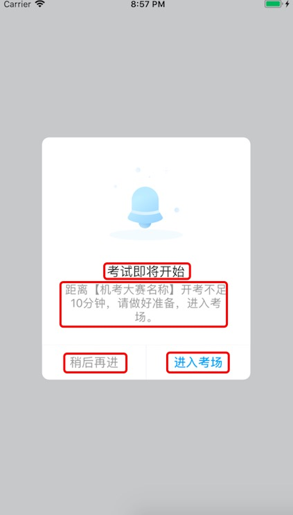

# 8 月份总结

## 历史问题
1. 代码整理

    在做美题一期的时候由于代码比较陌生外加代码比较杂乱，因此在做题相关需求实现的过程中踩了一些坑，因此在实现功能的时候同时对代码进行了整理，并在版本提交后辅助飞朋对代码逻辑进行了重新的梳理，优化了代码结构。
2. 做题界面图文混排遗留问题

    在美题一期的项目中遗留了几个问题比如图片上显示“`”,部分图片无法加载等。在二期中对其进行了解决和优化。具体看[这里](../dttext.md)。
## 创新
封装新的弹框控件 HKAlertView。

根据 UI 的设计稿，经分析发现原有的弹框控件不能满足需求，比如下图中的红框出都是可以置空的，并且老的控件并不能设置图片。因此特地封装了 HKAlertView 这一个控件。除了以上的需求外还提供了 自定义中部视图等额外功能。

## 成长

1. 通过对做题界面的图文混排的处理，对 CoreText 有了大致了解。

2. 继续设计模式的学习

    

    策略模式(Strategy Pattern)：定义一系列算法，将每一个算法封装起来，并让它们可以相互替换。策略模式让算法独立于使用它的客户而变化。

