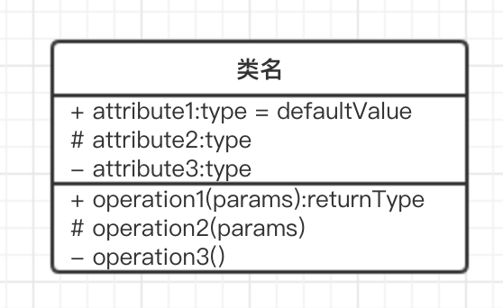
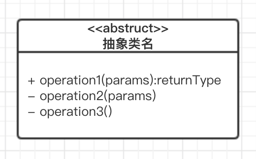
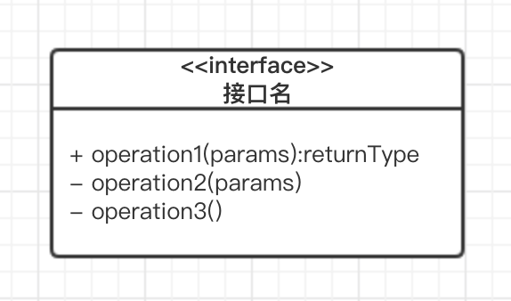
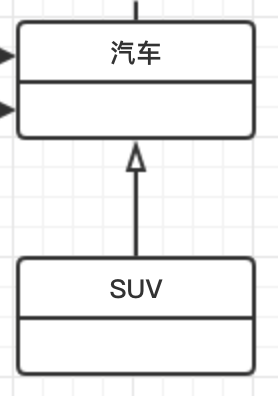
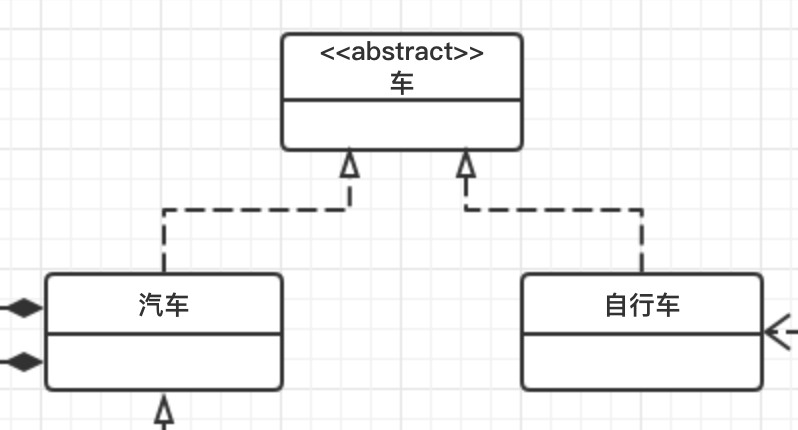
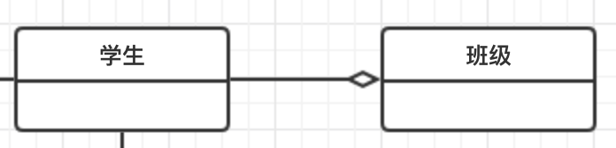
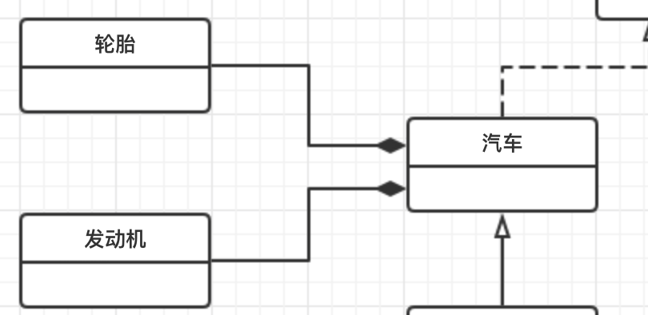
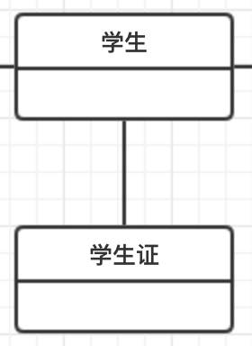
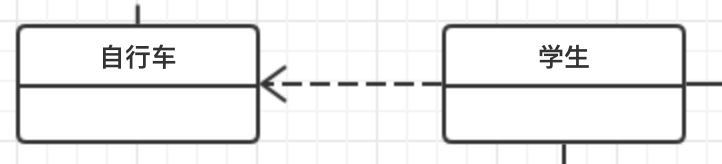
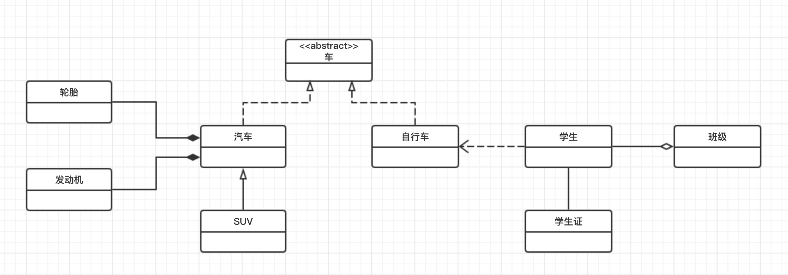

# UML 类图

UML 是统一建模语言（Unified Modeling Language）的缩写。这里只简单介绍其中类图的各个类之间的线条和箭头的含义。通过学习这些就能应付日常的工作和交流。并且知道了这些以后看一些设计模式相关的结构图就不会有什么问题了。
## 类图中的元素
### 类和接口

从上到下依次是类名、属性、方法。

属性和方法前面的符号代表其可见性

- private 的在前方用 - 表示
- public 的在前方用 + 表示
- protected 的在前方用 # 表示

接口和抽象类中的标识方式在不同地方介绍也不同，这里取其中我认为看起来比较好的两种方式。

### 类之间关系
#### 泛化关系(generalization)
> 泛化可以被定义为一个专门的元件连接关系与一个广义的元素，它基本上描述了在对象世界中的继承关系，是一种一般化-特殊化的关系。

继承非抽象类属于这个关系。比如 SUV 继承自 汽车。

用一条带空心箭头的直线来表示。

#### 实现关系(realize)
> 类之间的语义关系，其中的一个类指定了由另一个类保证执行的契约。

继承抽象类或者实现接口都属于这种关系。

用一条带空心箭头的虚线表示。

#### 聚合关系(aggregation)
> 聚合关系用于表示实体对象之间的关系，表示整体由部分构成的语义；例如一个班级由多个学生组成；
与组合关系不同的是，整体和部分不是强依赖的，即使整体不存在了，部分仍然存在；例如， 班级因毕业撤销了，学生不会消失，他们依然存在；

用一条带空心菱形箭头的直线表示。

上图中学生聚合而成为一个班级。
#### 组合关系(composition)
> 组合关系同样表示整体由部分构成的语义；比如公司由多个部门组成；
但组合关系是一种强依赖的特殊聚合关系，如果整体不存在了，则部分也不存在了；例如， 公司不存在了，部门也将不存在了；

用一条带实心菱形箭头直线表示.

上图中汽车由引擎和轮胎组合而成。
#### 关联关系(association)
> 它描述不同类的对象之间的结构关系；它是一种静态关系， 通常与运行状态无关，一般由常识等因素决定的；它一般用来定义对象之间静态的、天然的结构； 所以，关联关系是一种“强关联”的关系；
比如，乘车人和车票之间就是一种关联关系；学生和学校就是一种关联关系；
关联关系默认不强调方向，表示对象间相互知道；如果特别强调方向，可以使用箭头来表示；

拥有成员变量属于这种关系。

用一条直线表示，如果强调方向的话可以加上箭头表示方向。

上图中，学生拥有学生证这个成员变量
#### 依赖关系(dependency)
> 描述一个对象在运行期间会用到另一个对象的关系；
> 与关联关系不同的是，它是一种临时性的关系，通常在运行期间产生，并且随着运行时的变化； 依赖关系也可能发生变化；
显然，依赖也有方向，双向依赖是一种非常糟糕的结构，我们总是应该保持单向依赖，杜绝双向依赖的产生；

依赖关系体现为类构造方法及类方法的传入参数，箭头的指向为调用关系；依赖关系除了临时知道对方外，还是“使用”对方的方法和属性；

用一套带箭头的虚线表示。

上图中自行车在骑的时候需要学生来骑，因此它依赖于学生。但这个关系是临时的，比如对应共享单车来说一个学生骑过之后，学生和自行车就没有了关系。

## 完整的示例

- 车的类图结构为<<abstract>>，表示车是一个抽象类；
- 它有两个继承类：小汽车和自行车；它们之间的关系为实现关系，使用带空心箭头的虚线表示；
- 小汽车为与SUV之间也是继承关系，它们之间的关系为泛化关系，使用带空心箭头的实线表示；
- 小汽车与发动机之间是组合关系，使用带实心箭头的实线表示；
- 学生与班级之间是聚合关系，使用带空心箭头的实线表示；
- 学生与学生证之间为关联关系，使用一根实线表示；
- 学生上学需要用到自行车，与自行车是一种依赖关系，使用带箭头的虚线表示；

## 参考
- [看懂UML类图和时序图](http://design-patterns.readthedocs.io/zh_CN/latest/read_uml.html)
- [w3cschool UML教程](https://www.w3cschool.cn/uml_tutorial/uml_tutorial-pohy28t3.html)
- [轻松理解UML用例图时序图类图的教程](http://www.wistbean.com/blog/2017/10/03/uml-diagrams/)
- [在线编辑 UML 的网站 www.processon.com](https://www.processon.com)

