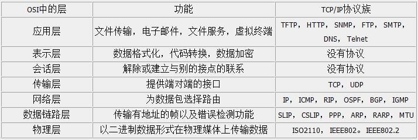
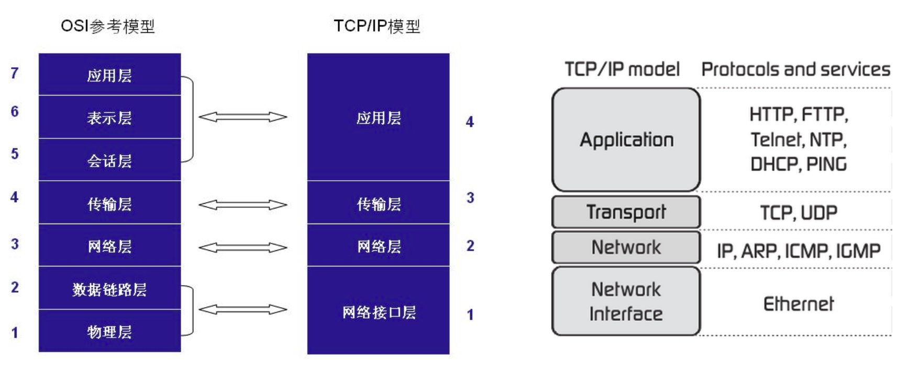

# 网络概述
## OSI网络模型

四层模型是 TCP/IP 技术的实际模型，七层模型是标准化组织制订的理论规范，两者有如上图的对应关系。人们很少用到七层模型，一般常见的地方在负载均衡时：四层负载均衡和七层负载均衡，分别指的是在 TCP 和 HTTP 层面进行负载均衡。

## 可靠的 TCP
以太网数据帧和 IP 数据包都只是简单地规定了头部应该如何携带信息，而以太网帧并不保证能够送达，也不能保证按照顺序送达，出现了可靠性问题。

### 一个假设

假设我们需要从 192.168.1.2 向 192.168.1.3 发送一首歌，这首歌是真正的二进制数据，全部采用 0、1 组成，这样会便于我们理解，因为人脑处理文本信息的时候总是有一种障碍。

在没有 TCP 协议的情况下，我们知道了本机以及目标计算机的 ip 地址，我们将歌曲的二进制信息按照 1500 字节（12000位）一块，分别包裹上 IP 首部和以太网首部，通过网口将这段 0、1 发送了出去。假设一共 2000 个 以太网帧。接着就会出现下面几种情况：

1. 前 1000 个 以太网帧被交换机完美地转发过去了，但是后 1000 个因为交换机受到干扰而没有发到 192.168.1.3 那里，歌曲放到一半就放不出来了。
2. 2000 个都发过去了，但是顺序错乱了：我们会得到一个放不出来的奇怪二进制文件。
3. 2000 个都发过去了，但是部分数据遭到了破坏，0 变成了 1，结果歌曲放一半播放器崩溃了。

这时候我们就会发现只靠 IP 协议是无法满足所有通信要求的。

###如何实现可靠性传输？

TCP 通过校验、序列号机制、确认应答机制、重发控制、连接管理等特性实现了可靠性传输。具体的特性不再展开叙述，因为 TCP 实在是太复杂，展开讲还能再写五个本文这么长的系列文章。下面我重点介绍 TCP 实现可靠传输的几个重点功能：

1. TCP 以 段 为基本单位发送数据，段的长度是在首次建立连接的时候双方约定好的。
2. 序列号和确认应答机制：每个段的发送都会携带一个整数序列号：当前段第一位在完整数据中的字节顺序，每次接收到一个段，远程计算机都要回复一个带序列号的“确认收到”。
3. 重发机制：首个段发送的时候使用一个比较大的 timeout 值，之后每次的 timeout 的值都是实时计算的，因为 TCP 希望在网络情况变化时也能够尽可能地提供高性能的传输。timeout 时间过了还没有收到携带本段序列号的“确认收到”，那就重发。
TCP 还有基于窗口的发送速度优化、流量控制、拥塞控制等内容不再赘述。

## TCP三次握手
举个例子，A与B要建立可靠连接。

以A为视角来看

- 1、A向B发出消息，告诉B我要跟你建立连接。然后等待B的回信，这次握手是必不可少的；
- 2、如果收到B的正确回信说明B知道要建立连接着件事，并做好准备。通过这一次握手A已经知道了B能入自己建立连接了。（但是为什么还需要第三次握手呢，这就要从B的视角来看待这个问题。）
- 3、向B发出消息告诉这边收到B发过来的消息了。

B的视角

- 1、B收到A发来第一次握手的消息，知道了A要与自己建立连接。
- 2、B向A发出一次握手消息告诉对方自己做好了准备。这个时候如果没有第三次握手收到A发消息过来B就无法确定A是否收到了自己发过去确认信息，因此需要第三次握手。
- 3、B收到A发过来的第三次握手信息就确认了对方收到了自己发出去的第二次信息。这样一来就能建立了可靠的连接。

## TCP四次挥手
举个例子，A与B要断开可靠连接。

A 的视角

- 1、A向B发出消息告诉B我要断开连接，这意味着A这边不会再向B发送数据了。
- 2、A收到B发过来的消息说B已经知道A这边要断开连接，但是B还有一些数据没有传输完成。此时A不能向B发送数据，但是B能向A发送数据。
- 3、A收到B发过来的消息说B这边数据已经传输完成，可以断开连接了。
- 4、A向B发送消息告诉B自己知道B那边数据传输完成了，可以断开连接了。

B的视角

- 1、B收到A的消息知道了对方要断开连接
- 2、B向A发消息告诉A自己知道了对方的请求，但自己还有数据没有传输完。让A继续等待数据的传输。
- 3、B向A发消息告诉A自己的数据全部传输完成了，可以断开连接了。
- 4、B收到A发的消息确认对方收到了自己数据传输完成的消息，然后断开连接。

###为什么握手是三次而挥手是四次？

原因很简单：TCP 是全双工协议，即可以同时发送和接收数据，两条通道是完全独立的。

1. 尝试建立连接时，两者之间什么关系都没有，而“收到。我也要建立连接。”这两个动作是有顺序的，直接用一个 IP 包发送就可以了，节省时间。
2. 尝试断开连接时，“收到。我也要断开连接。”这两个动作之间还有其他事情要发生：客户端这边是不会再发送数据了，但是服务器发给客户端的 IP 包可能还在路上，这时候就要等待客户端给一个“收到”的回应，才能放心地发出“我也要断开连接”这个包。

##参考
- [0.软件工程师需要了解的网络知识：从铜线到HTTP](https://lvwenhan.com/操作系统/485.html)
- [1.通俗大白话来理解TCP协议的三次握手和四次分手](https://github.com/jawil/blog/issues/14)
- [2.https://github.com/CyC2018/Interview-Notebook/blob/master/notes/计算机网络.md](https://github.com/CyC2018/Interview-Notebook/blob/master/notes/计算机网络.md)
