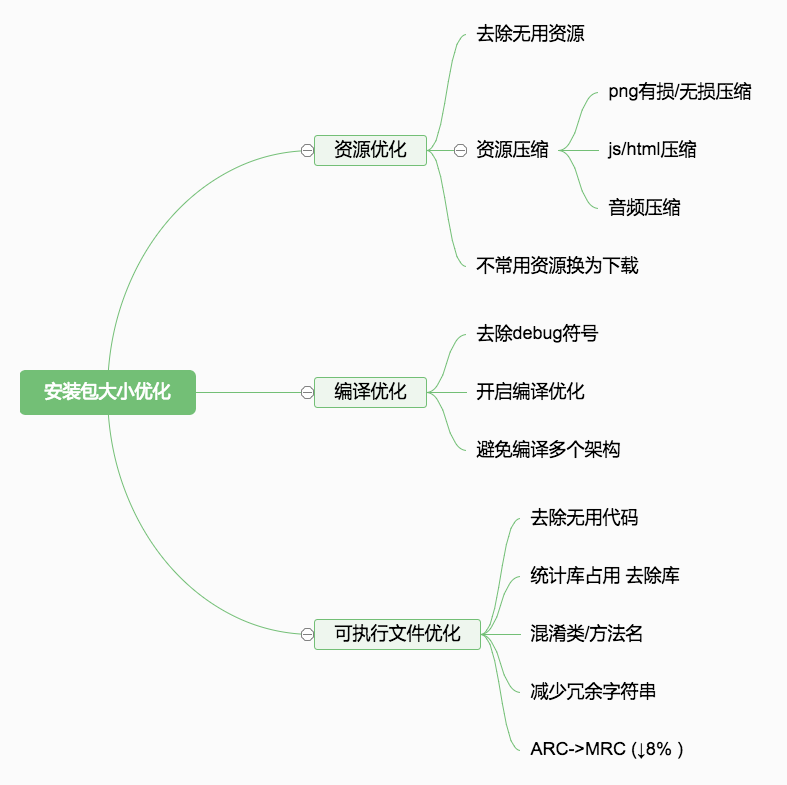
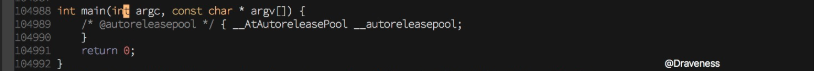
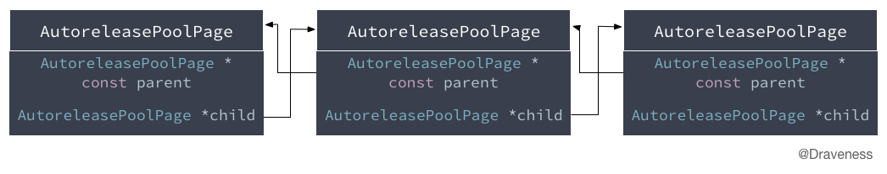
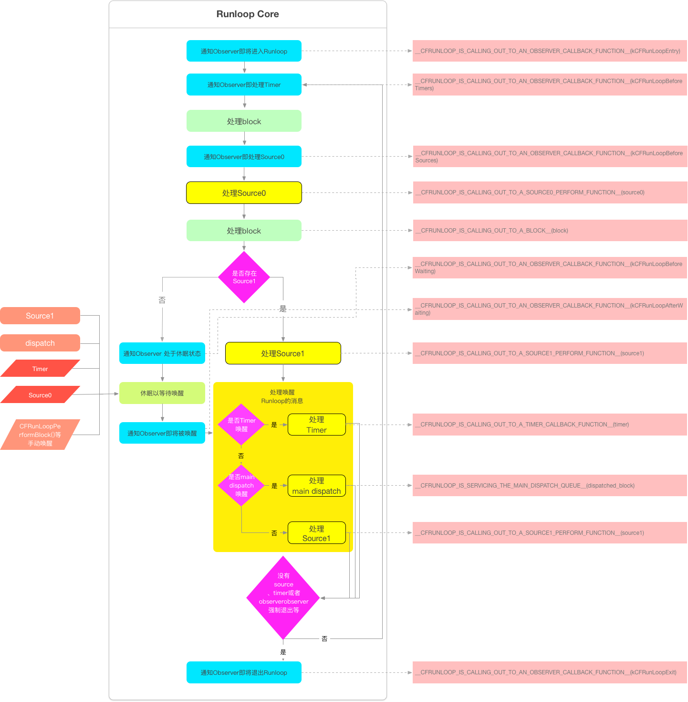
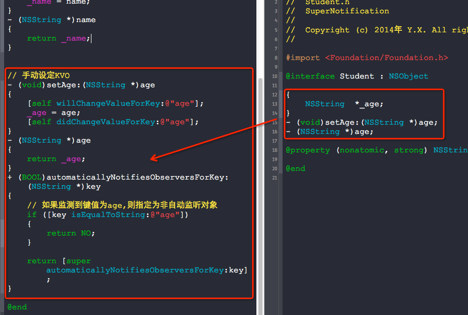
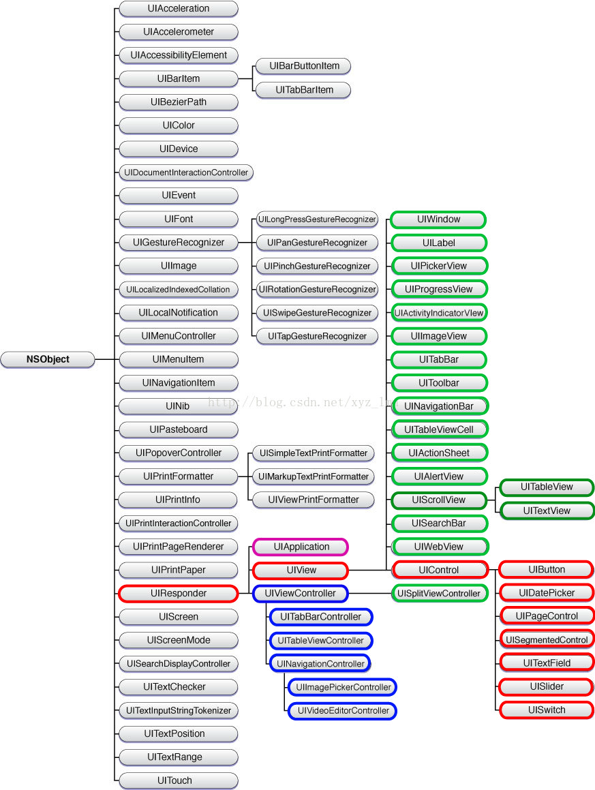

## viewController的生命周期
- -[ViewController initWithCoder:] 或 -[ViewController initWithNibName:Bundle]:首先从归档文件中加载UIViewController对象。即使是纯代码，也会把nil作为参数传给后者。
- -[ViewController awakeFromNib]:作为第一个方法的助手，方便处理一些额外的设置。
- -[ViewController loadView]:创建或加载一个view并把它赋值给UIViewController的view属性
- -[ViewController viewDidLoad]:此时整个视图层次(view hierarchy)已经被放到内存中，可以移除一些视图，修改约束，加载数据等
- -[ViewController viewWillAppear:]:视图加载完成，并即将显示在屏幕上,还没有设置动画，可以改变当前屏幕方向或状态栏的风格等。
- -[ViewController viewWillLayoutSubviews]：即将开始子视图位置布局
- -[ViewController viewDidLayoutSubviews]：用于通知视图的位置布局已经完成
- -[ViewController viewDidAppear:]：视图已经展示在屏幕上，可以对视图做一些关于展示效果方面的修改。
- -[ViewController viewWillDisappear:]：视图即将消失
- -[ViewController viewDidDisappear:]：视图已经消失

## 如何提高编译速度及项目瘦身
### 提高编译速度
- 正确的使用 .pch 文件，这是因为 pch 文件一旦发生修改，会导致彻彻底底，完完整整的项目重编译，从而降低编译速度。
 1. .pch 文件中不要导入宏定义
 2. 我们自己写的比较大的文件，也不要加到 .pch 文件中去
- 正确的 import 操作，推荐使用 @import
- 打包静态库
- 关闭编译优化
- 不生成 dYSM 文件
- 仅支持 armv7 指令集

### 项目瘦身
- Bitcode 这样做的好处在于官方会自动的帮我们去做一些优化，查看了一些国外的文章大致的猜想是苹果在设备安装应用的时候，会根据设备的 CPU 架构自动的去下发与架构相匹配的一份二进制文件，而生成的其它 CPU 架构的二进制文件则不被下发。
- 去除重复、无用资源文件，解决名字重复问题
- 图片使用.xcassets管理且无须考虑@1x\@2x\@3x 问题。万不得已再用拖的办法，同时结合一定策略方案进行包瘦身。
- icon 使用 iconfont
- 非必须资源文件可以放到自己服务器上， 但必用资源文件需要内置到安装包中。



### 参考

1. [iOS App 瘦身实践总结](https://juejin.im/post/5800ef71a0bb9f0058736caa)
2. [iOS可执行文件瘦身方法](http://blog.cnbang.net/tech/2544/)

## 一个autorealese对象在什么时刻释放
- 手动干预释放时机--指定autoreleasepool 在当前作用域大括号结束时release
- 在没有手加 Autorelease Pool 的情况下，Autorelease 对象是在当前的 runloop 迭代结束时释放的，而它能够释放的原因是系统在每个 runloop 迭代中都加入了自动释放池 Push 和 Pop。

在主线程的 NSRunLoop 对象（在系统级别的其他线程中应该也是如此，比如通过 dispatch_get_global_queue(DISPATCH_QUEUE_PRIORITY_DEFAULT, 0) 获取到的线程）的每个 event loop 开始前，系统会自动创建一个 autoreleasepool ，并在 event loop 结束时 drain 。

### 实现原理：

1. @autoreleasepool {} 被转换为一个 __AtAutoreleasePool 结构体, 这个结构体在大括号开始的时候创建，大括号结束的时候释放。


```
struct __AtAutoreleasePool {
  __AtAutoreleasePool() {atautoreleasepoolobj = objc_autoreleasePoolPush();}
  ~__AtAutoreleasePool() {objc_autoreleasePoolPop(atautoreleasepoolobj);}
  void * atautoreleasepoolobj;
};
```
这个结构体会在初始化时调用 `objc_autoreleasePoolPush()` 方法，会在析构时调用 `objc_autoreleasePoolPop` 方法。这样以来就能保证在大括号开始的时候调用`objc_autoreleasePoolPush()`，大括号结束的时候调用`objc_autoreleasePoolPop`。

这样以来就变成了这样

```
int main(int argc, const char * argv[]) {
    {
        void * atautoreleasepoolobj = objc_autoreleasePoolPush();
        
        // do whatever you want
        
        objc_autoreleasePoolPop(atautoreleasepoolobj);
    }
    return 0;
}
```

2. autoreleasepool 是没有单独的内存结构的，它是通过以 AutoreleasePoolPage 为结点的双向链表来实现的。如下图所示。



3. 单个 AutoreleasePoolPage 的内存结构如下


其中从`begain()`到`end()`之间的空间可以看成是一个用来存储自动释放对象的栈，当一个节点的空间使用完之后会创建下一个节点，这样以来就实现了`释放池`这个概念。而 **id *next**指针作为游标指向栈顶最新add进来的autorelease对象的下一个位置

4. 向一个对象发送 - autorelease 消息，就是将这个对象加入到当前 AutoreleasePoolPage 的栈顶 next 指针指向的位置

5. 需要注意的是 `POOL_SENTINEL`（哨兵对象）它其实就是一个 nil 的别名。在每个自动释放池初始化调用 `objc_autoreleasePoolPush` 的时候，都会把一个 `POOL_SENTINEL` push 到自动释放池的栈顶，并且返回这个 `POOL_SENTINEL` 哨兵对象。而当方法 `objc_autoreleasePoolPop` 调用时，就会向自动释放池中的对象发送 release 消息，直到第一个 `POOL_SENTINEL`。这样就实现了多个autoreleasepool 的嵌套。例如：

```
 @autoreleasepool { 
	id obj1 ...
	 @autoreleasepool {
	 	id obj2 ...
		 @autoreleasepool {
			id obj3 ...
		}
	}
}
```

### 参考
1. [黑幕背后的Autorelease](http://blog.sunnyxx.com/2014/10/15/behind-autorelease/)
2. [自动释放池的前世今生](https://github.com/Draveness/analyze/blob/master/contents/objc/%E8%87%AA%E5%8A%A8%E9%87%8A%E6%94%BE%E6%B1%A0%E7%9A%84%E5%89%8D%E4%B8%96%E4%BB%8A%E7%94%9F.md)

## RunLoop

RunLoop 内部其实是一个`_do while_`循环，这也正是 Runloop 运行的本质。执行了这个函数以后就一直处于“等待-处理”的循环之中，直到循环结束。只是不同于我们自己写的循环它在休眠时几乎不会占用系统资源，当然这是由于系统内核负责实现的，也是 Runloop 精华所在。

内部逻辑



### Runloop Mode

从源码很容易看出，Runloop总是运行在某种特定的 CFRunLoopModeRef 下（每次运行`__CFRunLoopRun()`函数时必须指定 Mode）。而通过 CFRunloopRef 对应结构体的定义可以很容易知道每种 Runloop 都可以包含若干个 Mode，每个 Mode 又包含 Source/Timer/Observer。每次调用 Runloop 的主函数`__CFRunLoopRun()`时必须指定一种 Mode，这个 Mode 称为 `currentMode`，当切换Mode时必须退出当前 Mode，然后重新进入 Runloop 以保证不同 Mode 的 Source/Timer/Observer 互不影响。

### Source

Source有两个版本：Source0 和 Source1。

- Source0 只包含了一个回调（函数指针），它并不能主动触发事件。使用时，你需要先调用 CFRunLoopSourceSignal(source)，将这个 Source 标记为待处理，然后手动调用 CFRunLoopWakeUp(runloop) 来唤醒 RunLoop，让其处理这个事件。
- Source1 包含了一个 mach_port 和一个回调（函数指针），被用于通过内核和其他线程相互发送消息。这种 Source 能主动唤醒 RunLoop 的线程。

### Timer
又叫Timer Source，基于时间的触发器，上层对应NSTimer。Source1 和 Timer 都属于端口事件源，不同的是所有的 Timer 都共用一个端口“Mode Timer Port”，而每个 Source1 都有不同的对应端口。

### Observer
它相当于消息循环中的一个监听器，随时通知外部当前RunLoop的运行状态。它包含一个函数指针_callout_将当前状态及时告诉观察者。

### Call out
在开发过程中几乎所有的操作都是通过Call out进行回调的(无论是Observer的状态通知还是Timer、Source的处理)，而系统在回调时通常使用如下几个函数进行回调(换句话说你的代码其实最终都是通过下面几个函数来负责调用的，即使你自己监听Observer也会先调用下面的函数然后间接通知你，所以在调用堆栈中经常看到这些函数)

### Runloop 实际应用

#### AutoreleasePool
App启动后，苹果在主线程 RunLoop 里注册了两个 Observer，其回调都是 `_wrapRunLoopWithAutoreleasePoolHandler()`。

第一个 Observer 监视的事件是 Entry(即将进入Loop)，其回调内会调用 `_objc_autoreleasePoolPush()`创建自动释放池。其 order 是-2147483647，优先级最高，保证创建释放池发生在其他所有回调之前。

第二个 Observer 监视了两个事件： BeforeWaiting(准备进入休眠) 时调用`_objc_autoreleasePoolPop()` 和 `_objc_autoreleasePoolPush()` 释放旧的池并创建新池；Exit(即将退出Loop) 时调用 `_objc_autoreleasePoolPop()` 来释放自动释放池。这个 Observer 的 order 是 2147483647，优先级最低，保证其释放池子发生在其他所有回调之后。

在主线程执行的代码，通常是写在诸如事件回调、Timer回调内的。这些回调会被 RunLoop 创建好的 AutoreleasePool 环绕着，所以不会出现内存泄漏，开发者也不必显示创建 Pool 了。

#### 事件响应
苹果注册了一个 Source1 (基于 mach port 的) 用来接收系统事件，其回调函数为 `__IOHIDEventSystemClientQueueCallback()`。

当一个硬件事件(触摸/锁屏/摇晃等)发生后，首先由 IOKit.framework 生成一个 IOHIDEvent 事件并由 SpringBoard 接收。SpringBoard 只接收按键(锁屏/静音等)，触摸，加速，接近传感器等几种 Event，随后用 mach port 转发给需要的App进程。随后苹果注册的那个 Source1 就会触发回调，并调用 `_UIApplicationHandleEventQueue()` 进行应用内部的分发。

`_UIApplicationHandleEventQueue()` 会把 IOHIDEvent 处理并包装成 UIEvent 进行处理或分发，其中包括识别 UIGesture/处理屏幕旋转/发送给 UIWindow 等。通常事件比如 UIButton 点击、touchesBegin/Move/End/Cancel 事件都是在这个回调中完成的。

#### 界面更新
如果打印App启动之后的主线程RunLoop可以发现另外一个callout为**`_ZN2CA11Transaction17observer_callbackEP19__CFRunLoopObservermPv`**的 Observer，这个监听专门负责UI变化后的更新，比如修改了 frame、调整了 UI 层级（UIView/CALayer）或者手动设置了 `setNeedsDisplay`/`setNeedsLayout`之后就会将这些操作提交到全局容器。而这个Observer监听了主线程 RunLoop 的即将进入休眠和退出状态，一旦进入这两种状态则会遍历所有的 UI 更新并提交进行实际绘制更新。

更具体的内容可以看 [揭秘 iOS 布局](https://juejin.im/post/5a951c655188257a804abf94)

#### 定时器
NSTimer 其实就是 CFRunLoopTimerRef，他们之间是 toll-free bridged 的。一个 NSTimer 注册到 RunLoop 后，RunLoop 会为其重复的时间点注册好事件。例如 10:00, 10:10, 10:20 这几个时间点。RunLoop为了节省资源，并不会在非常准确的时间点回调这个Timer。Timer 有个属性叫做 Tolerance (宽容度)，标示了当时间点到后，容许有多少最大误差。

如果某个时间点被错过了，例如执行了一个很长的任务，则那个时间点的回调也会跳过去，不会延后执行。就比如等公交，如果 10:10 时我忙着玩手机错过了那个点的公交，那我只能等 10:20 这一趟了。

CADisplayLink 是一个和屏幕刷新率一致的定时器（但实际实现原理更复杂，和 NSTimer 并不一样，其内部实际是操作了一个 Source）。如果在两次屏幕刷新之间执行了一个长任务，那其中就会有一帧被跳过去（和 NSTimer 相似），造成界面卡顿的感觉。在快速滑动TableView时，即使一帧的卡顿也会让用户有所察觉。

#### GCD
在 RunLoop 的源代码中可以看到用到了 GCD 的相关内容，但是 RunLoop 本身和 GCD 并没有直接的关系。当调用了`dispatch_async(dispatch_get_main_queue(), <#^(void)block#>)`时 libDispatch 会向主线程 RunLoop 发送消息唤醒 RunLoop，RunLoop 从消息中获取 block，并且在`__CFRUNLOOP_IS_SERVICING_THE_MAIN_DISPATCH_QUEUE__`回调里执行这个 block。不过这个操作仅限于主线程，其他线程 dispatch 操作是全部由 libDispatch 驱动的。

#### NSURLConnection
一旦启动 NSURLConnection 以后就会不断调用 delegate 方法接收数据，这样一个连续的的动作正是基于 RunLoop 来运行。
一旦 NSURLConnection 设置了 delegate 会立即创建一个线程`com.apple.NSURLConnectionLoader`，同时内部启动 RunLoop 并在 NSDefaultMode 模式下添加4个 Source0。其中 CFHTTPCookieStorage 用于处理 cookie ; CFMultiplexerSource 负责各种 delegate 回调并在回调中唤醒 delegate 内部的 RunLoop（通常是主线程）来执行实际操作。

### 参考
1. [iOS刨根问底-深入理解RunLoop](https://www.cnblogs.com/kenshincui/p/6823841.html)
2. [深入理解RunLoop](https://blog.ibireme.com/2015/05/18/runloop/)

## 手动设定实例变量的KVO实现监听


[参考](https://yq.aliyun.com/articles/30483)

## KVO的实现原理，实现的一对方法名，为什么需要在dealloc里移除，如果不移除会如何？如果没有执行add方法，但是却执行了remove方法，会出现什么现象？
当你观察一个对象时，一个新的类会动态被创建。这个类继承自该对象的原本的类，并重写了被观察属性的 setter 方法。自然，重写的 setter 方法会负责在调用原 setter方法之前和之后，通过调willChangeValueForKey: 和 didChangevlueForKey:这两个方法来通知所有观察对象值的更改。最后把这个对象的 isa 指针 指向这个新创建的子类，对象就神奇的变成了新创建的子类的实例。不仅如此，Apple 还重写了 -class 方法，企图欺骗我们这个类没有变，就是原本那个类。

如果不在 dealloc 中移除的话，当被监听的值发生改变后依然会调用监听方法，但是这时候对象已经被释放了，这时候极有可能出现坏内存访问这个错误。

没有执行 add 只执行 remove 方法的操作会导致程序 crash

## copy

### 对非集合类对象的copy操作：

在非集合类对象中：对 immutable 对象进行 copy 操作，是指针复制，mutableCopy 操作时内容复制；对 mutable 对象进行 copy 和 mutableCopy 都是内容复制。用代码简单表示如下：

	- [immutableObject copy] // 浅复制
	- [immutableObject mutableCopy] //深复制
	- [mutableObject copy] //深复制
	- [mutableObject mutableCopy] //深复制

### 对集合类对象的copy操作：

在集合类对象中，对 immutable 对象进行 copy，是指针复制， mutableCopy 是内容复制；对 mutable 对象进行 copy 和 mutableCopy 都是内容复制。但是：集合对象的内容复制仅限于对象本身，对象元素仍然是指针复制。用代码简单表示如下：

	- [immutableObject copy] // 浅复制
	- [immutableObject mutableCopy] //单层深复制
	- [mutableObject copy] //单层深复制
	- [mutableObject mutableCopy] //单层深复制

## 手写单例

```
static Person *_instance;

+ (instancetype)allocWithZone:(struct _NSZone *)zone
{
    static dispatch_once_t onceToken;
    dispatch_once(&onceToken, ^{
        if (!_instance) {
            _instance = [super allocWithZone:zone];
        }
    });
    return _instance;
}

+ (instancetype)shareInstance
{
    return [[self alloc] init];
}


- (id)copyWithZone:(NSZone *)zone
{
    return _instance;
}

- (id)mutableCopyWithZone:(NSZone *)zone
{
    return _instance;
}
```

## 分类和类拓展的区别?
- 分类 的加载在 运行时，类拓展 的加载在 编译时。
- 分类 不能给系统的类添加方法。
- 类拓展 只以声明的形式存在，一般存在 .m 文件中。

## block相关
下面代码输出什么

```
	NSMutableString *a = [NSMutableString stringWithString:@"Tom"];
    void (^foo)(void) = ^{
        NSLog(@"\n block内部：%@", a);
    };
    a = [NSMutableString stringWithFormat:@"Jim"];
    foo();
```

添加注释

```
    NSMutableString *a = [NSMutableString stringWithString:@"Tom"];
    NSLog(@"\n 定义以前：%@-a指向的堆中地址：%p；a在栈中的指针地址：%p", a, a, &a);
    void (^foo)(void) = ^{
        NSLog(@"\n block内部：%@-a指向的堆中地址：%p；a在栈中的指针地址：%p", a, a, &a);
    };
    NSLog(@"\n 定义以后修改之前：%@-a指向的堆中地址：%p；a在栈中的指针地址：%p", a, a, &a);
    a = [NSMutableString stringWithFormat:@"Jim"];
    NSLog(@"\n 定义以后修改之后：%@-a指向的堆中地址：%p；a在栈中的指针地址：%p", a, a, &a);
    foo();
    NSLog(@"\n 调用以后：%@-a指向的堆中地址：%p；a在栈中的指针地址：%p", a, a, &a);
```
打印的结果

```
2018-04-24 18:24:14.527111+0800 run[80182:26277714] 
 定义以前：Tom-a指向的堆中地址：0x60400025d310；a在栈中的指针地址：0x7fff59569c58
2018-04-24 18:24:14.527495+0800 run[80182:26277714] 
 定义以后修改之前：Tom-a指向的堆中地址：0x60400025d310；a在栈中的指针地址：0x7fff59569c58
2018-04-24 18:24:14.527615+0800 run[80182:26277714] 
 定义以后修改之后：Jim-a指向的堆中地址：0x60000025bd50；a在栈中的指针地址：0x7fff59569c58
2018-04-24 18:24:14.527706+0800 run[80182:26277714] 
 block内部：Tom-a指向的堆中地址：0x60400025d310；a在栈中的指针地址：0x60000025bb60
2018-04-24 18:24:14.527803+0800 run[80182:26277714] 
 调用以后：Jim-a指向的堆中地址：0x60000025bd50；a在栈中的指针地址：0x7fff59569c58
```
block 内输出 Tom, 这是因为当 a 被捕获后其成为一个常量指针拷贝指向先前的 Tom 字符串的地址，在 block 内不可修改。修改外部 a 指向的地址后并不会影响 block 内部的拷贝。

## NSTimer 需要注意的地方
### 调用 Timer 会强引用对象
timer 添加到 Runloop 的时候，会被 Runloop 强引用。然后 timer 又会有一个对 Target 的强引用。如果说 timer 又强引用了 该对象的话 ，导致对象一直不能被释放掉。

这时候可以通过在合适的时机调用 `[_timer invalidate]`来销毁 timer。而且 timer 在哪个线程创建就要在哪个线程停止，否则会导致资源不能被正确的释放。

更好的做法是抽取一个分类，让 timer 来强引用 NSTimer 这个类。它是个单例。这样的话就无所谓循环引用了。但是这时候还是需要在合适的时间调用`invalidate `来释放 timer。

```
#import "NSTimer+EZ_Helper.h"

@implementation NSTimer (EZ_Helper)
+ (NSTimer *)ez_scheduledTimerWithTimeInterval:(NSTimeInterval)inTimeInterval block:(void (^)())inBlock repeats:(BOOL)inRepeats
{
    void (^block)() = [inBlock copy];
    NSTimer * timer = [self scheduledTimerWithTimeInterval:inTimeInterval target:self selector:@selector(__executeTimerBlock:) userInfo:block repeats:inRepeats];
    return timer;
}

+ (NSTimer *)ez_timerWithTimeInterval:(NSTimeInterval)inTimeInterval block:(void (^)())inBlock repeats:(BOOL)inRepeats
{
    void (^block)() = [inBlock copy];
    NSTimer * timer = [self timerWithTimeInterval:inTimeInterval target:self selector:@selector(__executeTimerBlock:) userInfo:block repeats:inRepeats];
    return timer;
}

+ (void)__executeTimerBlock:(NSTimer *)inTimer;
{
    if([inTimer userInfo])
    {
        void (^block)() = (void (^)())[inTimer userInfo];
        block();
    }
}
@end
```

### NSTimer必须加入NSRunloop中才能正确执行
如果在非主线程的线程中只是创建一个 NSTimer 并启动,该 NSTimer 是不会执行的,除非将NSTimer加入到该线程的 NSRunloop 中,并启动 NSRunloop 才行。

## iOS 内存管理
### 总则
- 自己生成的对象，自己所持有 （比如alloc等方法生成的）
- 非自己生成的对象，自己也可以持有 （比如一些工厂方法生成的，会先将对象放到自动释放池中）
- 不再需要自己持有的对象时释放
- 非自己持有的对象自己无法释放

| 对象操作 | 方法 |
|:----:|:-------|
| 生成并持有对象 | alloc/new/copy/mutableCopy |
| 持有对象 | retain |
| 释放对象 | release |
| 废弃对象 | dealloc |

### 引用计数的实现
苹果是利用引用计数表这个散列表来管理引用计数的。好处如下

- 对象用的内存块的分配无需考虑内存块的头部
- 引用计数表各个记录中存有内存块地址，可以追溯到各个对象的内存块
- 利用内存检测工具检测内存泄露时，引用计数表有助于检测各个对象的持有者是否存在

### __autoreleasing

ARC 下不能显示的对一个对象调用 autorelease 方法，也不能使用 NSAutoreleasePool 类。需要使用 @autoreleasepool 来代替 NSAutoreleasePool。而 `__autoreleasing` 修饰符则用来代替 autorelease  方法。显然我们很少用到这个关键字，这是因为编译器会在合适的时机来添加这个关键字。

- `__weak` 修饰的变量会被加上 `__autoreleasing` 关键字，防止访问变量的时候该对象可能被废弃。
- id 的指针活对象的指针在没有显示的指定时会被加上 `__autoreleasing` 修饰符。例如 

| 代码 | 编译 |
|:----:|:-------|
| `id obj` | `id __strong obj` |
| `id *obj` | `id __autreleasing *obj` |
| `NSObject **obj` | `NSObject * __autreleasing *obj` |

**注意：在 ARC 下，需要注意方法的名称，这是因为对象作为返回值且方法名不是 alloc/new/copy/mutableCopy 时编译器会自动将其注册到缓存池中。例如类似 [NSArray array]这样的方法时**

### 使用自动引用计数应遵循的原则
- 不能使用 retain、release、retainCount、autorelease。
- 不可以使用 NSAllocateObject、NSDeallocateObject。
- 必须遵守内存管理方法的命名规则。
- 不需要显示的调用 Dealloc。
- 使用 @autoreleasePool 来代替 NSAutoreleasePool。
- 不可以使用区域 NSZone。
- 对象性变量不可以作为 C 语言的结构体成员。
- 显示转换 id 和 void*。

### __weak 属性修饰的变量，如何实现在变量没有强引用后自动置为 nil ？
用的弱引用 - weak表。也是一张 哈希表。

被 weak 修饰的指针变量所指向的地址是 key ，所有指向这块内存地址的指针会被添加在一个数组里，这个数组是 Value。当内存地址销毁，数组里的所有对象被置为 nil。

### ARC 在编译时做了哪些工作
根据代码执行的上下文语境，在适当的位置插入 retain，release

### ARC 在运行时做了哪些工作
- 主要是指 weak 关键字。weak 修饰的变量能够在引用计数为0 时被自动设置成 nil，显然是有运行时逻辑在工作的。

- 为了保证向后兼容性，ARC 在运行时检测到类函数中的 autorelease 后紧跟其后 retain，此时不直接调用对象的 autorelease 方法，而是改为调用 `objc_autoreleaseReturnValue`。 `objc_autoreleaseReturnValue` 会检视当前方法返回之后即将要执行的那段代码，若那段代码要在返回对象上执行 retain 操作，则设置全局数据结构中的一个标志位，而不执行 autorelease 操作，与之相似，如果方法返回了一个自动释放的对象，而调用方法的代码要保留此对象，那么此时不直接执行 retain ，而是改为执行 `objc_retainAoutoreleasedReturnValue`函数。此函数要检测刚才提到的标志位，若已经置位，则不执行 retain 操作，设置并检测标志位，要比调用 autorelease 和retain更快。

### 说一下什么是 悬垂指针？什么是 野指针?
悬垂指针

>指针指向的内存已经被释放了，但是指针还存在，这就是一个 悬垂指针 或者说 迷途指针

野指针

>没有进行初始化的指针，其实都是 野指针

### 内存中的5大区分别是什么？
- 栈区（stack）：由编译器自动分配释放 ，存放函数的参数值，局部变量的值等。其 操作方式类似于数据结构中的栈。
- 堆区（heap）：一般由程序员分配释放， 若程序员不释放，程序结束时可能由OS回收 。注意它与数据结构中的堆是两回事，分配方式倒是类似于链表。
- 全局区（静态区）（static）：全局变量和静态变量的存储是放在一块的，初始化的 全局变量和静态变量在一块区域， 未初始化的全局变量和未初始化的静态变量在相邻的另一块区域。 - 程序结束后由系统释放。
- 文字常量区：常量字符串就是放在这里的。 程序结束后由系统释放。
- 程序代码区：存放函数体的二进制代码。

### UIKit 的继承模型



