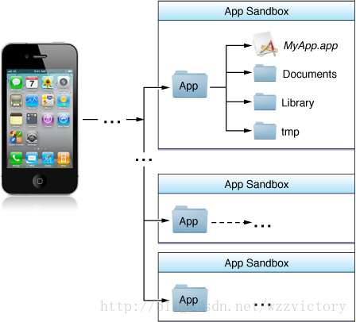
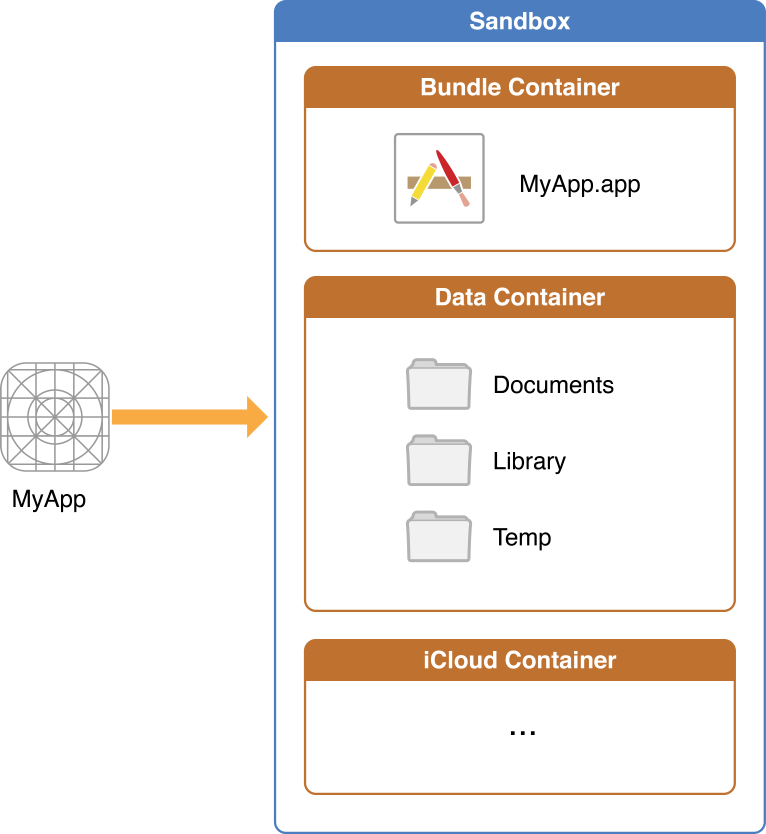

## viewController的生命周期
- -[ViewController initWithCoder:] 或 -[ViewController initWithNibName:Bundle]:首先从归档文件中加载UIViewController对象。即使是纯代码，也会把nil作为参数传给后者。
- -[ViewController awakeFromNib]:作为第一个方法的助手，方便处理一些额外的设置。
- -[ViewController loadView]:创建或加载一个view并把它赋值给UIViewController的view属性
- -[ViewController viewDidLoad]:此时整个视图层次(view hierarchy)已经被放到内存中，可以移除一些视图，修改约束，加载数据等
- -[ViewController viewWillAppear:]:视图加载完成，并即将显示在屏幕上,还没有设置动画，可以改变当前屏幕方向或状态栏的风格等。
- -[ViewController viewWillLayoutSubviews]：即将开始子视图位置布局
- -[ViewController viewDidLayoutSubviews]：用于通知视图的位置布局已经完成
- -[ViewController viewDidAppear:]：视图已经展示在屏幕上，可以对视图做一些关于展示效果方面的修改。
- -[ViewController viewWillDisappear:]：视图即将消失
- -[ViewController viewDidDisappear:]：视图已经消失

参考：[UIViewController视图管理](https://github.com/bestswifter/blog/blob/master/articles/uiview-life-time.md)

## 如何提高编译速度及项目瘦身
### 提高编译速度
- 正确的使用 .pch 文件，这是因为 pch 文件一旦发生修改，会导致彻彻底底，完完整整的项目重编译，从而降低编译速度。
 1. .pch 文件中不要导入宏定义
 2. 我们自己写的比较大的文件，也不要加到 .pch 文件中去
- 正确的 import 操作，推荐使用 @import
- 打包静态库
- 关闭编译优化
- 不生成 dYSM 文件
- 仅支持 armv7 指令集

### 项目瘦身
- Bitcode 这样做的好处在于官方会自动的帮我们去做一些优化，查看了一些国外的文章大致的猜想是苹果在设备安装应用的时候，会根据设备的 CPU 架构自动的去下发与架构相匹配的一份二进制文件，而生成的其它 CPU 架构的二进制文件则不被下发。
- 去除重复、无用资源文件，解决名字重复问题
- 图片使用.xcassets管理且无须考虑@1x\@2x\@3x 问题。万不得已再用拖的办法，同时结合一定策略方案进行包瘦身。
- icon 使用 iconfont
- 非必须资源文件可以放到自己服务器上， 但必用资源文件需要内置到安装包中。


### 参考

1. [iOS App 瘦身实践总结](https://juejin.im/post/5800ef71a0bb9f0058736caa)
2. [iOS可执行文件瘦身方法](http://blog.cnbang.net/tech/2544/)

## 一个autorealese对象在什么时刻释放
- 手动干预释放时机--指定autoreleasepool 在当前作用域大括号结束时release
- 在没有手加 Autorelease Pool 的情况下，Autorelease 对象是在当前的 runloop 迭代结束时释放的，而它能够释放的原因是系统在每个 runloop 迭代中都加入了自动释放池 Push 和 Pop。

在主线程的 NSRunLoop 对象（在系统级别的其他线程中应该也是如此，比如通过 dispatch_get_global_queue(DISPATCH_QUEUE_PRIORITY_DEFAULT, 0) 获取到的线程）的每个 event loop 开始前，系统会自动创建一个 autoreleasepool ，并在 event loop 结束时 drain 。

### 实现原理：

1. @autoreleasepool {} 被转换为一个 __AtAutoreleasePool 结构体, 这个结构体在大括号开始的时候创建，大括号结束的时候释放。


```
struct __AtAutoreleasePool {
  __AtAutoreleasePool() {atautoreleasepoolobj = objc_autoreleasePoolPush();}
  ~__AtAutoreleasePool() {objc_autoreleasePoolPop(atautoreleasepoolobj);}
  void * atautoreleasepoolobj;
};
```
这个结构体会在初始化时调用 `objc_autoreleasePoolPush()` 方法，会在析构时调用 `objc_autoreleasePoolPop` 方法。这样以来就能保证在大括号开始的时候调用`objc_autoreleasePoolPush()`，大括号结束的时候调用`objc_autoreleasePoolPop`。

这样以来就变成了这样

```
int main(int argc, const char * argv[]) {
    {
        void * atautoreleasepoolobj = objc_autoreleasePoolPush();
        
        // do whatever you want
        
        objc_autoreleasePoolPop(atautoreleasepoolobj);
    }
    return 0;
}
```

2. autoreleasepool 是没有单独的内存结构的，它是通过以 AutoreleasePoolPage 为结点的双向链表来实现的。如下图所示。


3. 单个 AutoreleasePoolPage 的内存结构如下


其中从`begain()`到`end()`之间的空间可以看成是一个用来存储自动释放对象的栈，当一个节点的空间使用完之后会创建下一个节点，这样以来就实现了`释放池`这个概念。而 **id *next**指针作为游标指向栈顶最新add进来的autorelease对象的下一个位置

4. 向一个对象发送 - autorelease 消息，就是将这个对象加入到当前 AutoreleasePoolPage 的栈顶 next 指针指向的位置

5. 需要注意的是 `POOL_SENTINEL`（哨兵对象）它其实就是一个 nil 的别名。在每个自动释放池初始化调用 `objc_autoreleasePoolPush` 的时候，都会把一个 `POOL_SENTINEL` push 到自动释放池的栈顶，并且返回这个 `POOL_SENTINEL` 哨兵对象。而当方法 `objc_autoreleasePoolPop` 调用时，就会向自动释放池中的对象发送 release 消息，直到第一个 `POOL_SENTINEL`。这样就实现了多个autoreleasepool 的嵌套。例如：

```
 @autoreleasepool { 
	id obj1 ...
	 @autoreleasepool {
	 	id obj2 ...
		 @autoreleasepool {
			id obj3 ...
		}
	}
}
```

### 参考
1. [黑幕背后的Autorelease](http://blog.sunnyxx.com/2014/10/15/behind-autorelease/)
2. [自动释放池的前世今生](https://github.com/Draveness/analyze/blob/master/contents/objc/%E8%87%AA%E5%8A%A8%E9%87%8A%E6%94%BE%E6%B1%A0%E7%9A%84%E5%89%8D%E4%B8%96%E4%BB%8A%E7%94%9F.md)

## RunLoop

RunLoop 内部其实是一个`_do while_`循环，这也正是 Runloop 运行的本质。执行了这个函数以后就一直处于“等待-处理”的循环之中，直到循环结束。只是不同于我们自己写的循环它在休眠时几乎不会占用系统资源，当然这是由于系统内核负责实现的，也是 Runloop 精华所在。

内部逻辑


### Runloop Mode

从源码很容易看出，Runloop总是运行在某种特定的 CFRunLoopModeRef 下（每次运行`__CFRunLoopRun()`函数时必须指定 Mode）。而通过 CFRunloopRef 对应结构体的定义可以很容易知道每种 Runloop 都可以包含若干个 Mode，每个 Mode 又包含 Source/Timer/Observer。每次调用 Runloop 的主函数`__CFRunLoopRun()`时必须指定一种 Mode，这个 Mode 称为 `currentMode`，当切换Mode时必须退出当前 Mode，然后重新进入 Runloop 以保证不同 Mode 的 Source/Timer/Observer 互不影响。

### Source

Source有两个版本：Source0 和 Source1。

- Source0 只包含了一个回调（函数指针），它并不能主动触发事件。使用时，你需要先调用 CFRunLoopSourceSignal(source)，将这个 Source 标记为待处理，然后手动调用 CFRunLoopWakeUp(runloop) 来唤醒 RunLoop，让其处理这个事件。
- Source1 包含了一个 mach_port 和一个回调（函数指针），被用于通过内核和其他线程相互发送消息。这种 Source 能主动唤醒 RunLoop 的线程。

### Timer
又叫Timer Source，基于时间的触发器，上层对应NSTimer。Source1 和 Timer 都属于端口事件源，不同的是所有的 Timer 都共用一个端口“Mode Timer Port”，而每个 Source1 都有不同的对应端口。

### Observer
它相当于消息循环中的一个监听器，随时通知外部当前RunLoop的运行状态。它包含一个函数指针_callout_将当前状态及时告诉观察者。

### Call out
在开发过程中几乎所有的操作都是通过Call out进行回调的(无论是Observer的状态通知还是Timer、Source的处理)，而系统在回调时通常使用如下几个函数进行回调(换句话说你的代码其实最终都是通过下面几个函数来负责调用的，即使你自己监听Observer也会先调用下面的函数然后间接通知你，所以在调用堆栈中经常看到这些函数)

### Runloop 实际应用

#### AutoreleasePool
App启动后，苹果在主线程 RunLoop 里注册了两个 Observer，其回调都是 `_wrapRunLoopWithAutoreleasePoolHandler()`。

第一个 Observer 监视的事件是 Entry(即将进入Loop)，其回调内会调用 `_objc_autoreleasePoolPush()`创建自动释放池。其 order 是-2147483647，优先级最高，保证创建释放池发生在其他所有回调之前。

第二个 Observer 监视了两个事件： BeforeWaiting(准备进入休眠) 时调用`_objc_autoreleasePoolPop()` 和 `_objc_autoreleasePoolPush()` 释放旧的池并创建新池；Exit(即将退出Loop) 时调用 `_objc_autoreleasePoolPop()` 来释放自动释放池。这个 Observer 的 order 是 2147483647，优先级最低，保证其释放池子发生在其他所有回调之后。

在主线程执行的代码，通常是写在诸如事件回调、Timer回调内的。这些回调会被 RunLoop 创建好的 AutoreleasePool 环绕着，所以不会出现内存泄漏，开发者也不必显示创建 Pool 了。

#### 事件响应
苹果注册了一个 Source1 (基于 mach port 的) 用来接收系统事件，其回调函数为 `__IOHIDEventSystemClientQueueCallback()`。

当一个硬件事件(触摸/锁屏/摇晃等)发生后，首先由 IOKit.framework 生成一个 IOHIDEvent 事件并由 SpringBoard 接收。SpringBoard 只接收按键(锁屏/静音等)，触摸，加速，接近传感器等几种 Event，随后用 mach port 转发给需要的App进程。随后苹果注册的那个 Source1 就会触发回调，并调用 `_UIApplicationHandleEventQueue()` 进行应用内部的分发。

`_UIApplicationHandleEventQueue()` 会把 IOHIDEvent 处理并包装成 UIEvent 进行处理或分发，其中包括识别 UIGesture/处理屏幕旋转/发送给 UIWindow 等。通常事件比如 UIButton 点击、touchesBegin/Move/End/Cancel 事件都是在这个回调中完成的。

#### 界面更新
如果打印App启动之后的主线程RunLoop可以发现另外一个callout为**`_ZN2CA11Transaction17observer_callbackEP19__CFRunLoopObservermPv`**的 Observer，这个监听专门负责UI变化后的更新，比如修改了 frame、调整了 UI 层级（UIView/CALayer）或者手动设置了 `setNeedsDisplay`/`setNeedsLayout`之后就会将这些操作提交到全局容器。而这个Observer监听了主线程 RunLoop 的即将进入休眠和退出状态，一旦进入这两种状态则会遍历所有的 UI 更新并提交进行实际绘制更新。

更具体的内容可以看 [揭秘 iOS 布局](https://juejin.im/post/5a951c655188257a804abf94)

#### 定时器
NSTimer 其实就是 CFRunLoopTimerRef，他们之间是 toll-free bridged 的。一个 NSTimer 注册到 RunLoop 后，RunLoop 会为其重复的时间点注册好事件。例如 10:00, 10:10, 10:20 这几个时间点。RunLoop为了节省资源，并不会在非常准确的时间点回调这个Timer。Timer 有个属性叫做 Tolerance (宽容度)，标示了当时间点到后，容许有多少最大误差。

如果某个时间点被错过了，例如执行了一个很长的任务，则那个时间点的回调也会跳过去，不会延后执行。就比如等公交，如果 10:10 时我忙着玩手机错过了那个点的公交，那我只能等 10:20 这一趟了。

CADisplayLink 是一个和屏幕刷新率一致的定时器（但实际实现原理更复杂，和 NSTimer 并不一样，其内部实际是操作了一个 Source）。如果在两次屏幕刷新之间执行了一个长任务，那其中就会有一帧被跳过去（和 NSTimer 相似），造成界面卡顿的感觉。在快速滑动TableView时，即使一帧的卡顿也会让用户有所察觉。

#### GCD
在 RunLoop 的源代码中可以看到用到了 GCD 的相关内容，但是 RunLoop 本身和 GCD 并没有直接的关系。当调用了`dispatch_async(dispatch_get_main_queue(), <#^(void)block#>)`时 libDispatch 会向主线程 RunLoop 发送消息唤醒 RunLoop，RunLoop 从消息中获取 block，并且在`__CFRUNLOOP_IS_SERVICING_THE_MAIN_DISPATCH_QUEUE__`回调里执行这个 block。不过这个操作仅限于主线程，其他线程 dispatch 操作是全部由 libDispatch 驱动的。

#### NSURLConnection
一旦启动 NSURLConnection 以后就会不断调用 delegate 方法接收数据，这样一个连续的的动作正是基于 RunLoop 来运行。
一旦 NSURLConnection 设置了 delegate 会立即创建一个线程`com.apple.NSURLConnectionLoader`，同时内部启动 RunLoop 并在 NSDefaultMode 模式下添加4个 Source0。其中 CFHTTPCookieStorage 用于处理 cookie ; CFMultiplexerSource 负责各种 delegate 回调并在回调中唤醒 delegate 内部的 RunLoop（通常是主线程）来执行实际操作。

### 参考
1. [iOS刨根问底-深入理解RunLoop](https://www.cnblogs.com/kenshincui/p/6823841.html)
2. [深入理解RunLoop](https://blog.ibireme.com/2015/05/18/runloop/)

## KVO
### 手动设定实例变量的KVO实现监听

需要注意的就是`+ (BOOL)automaticallyNotifiesObserversForKey:(NSString *)key` 这个方法，如果手动设置 KVO 必须重写该方法，并把手动设计的属性排除，否则会调用两次监听方法。


[参考](https://yq.aliyun.com/articles/30483)

### KVO的实现原理，实现的一对方法名，为什么需要在dealloc里移除，如果不移除会如何？如果没有执行add方法，但是却执行了remove方法，会出现什么现象？
当你观察一个对象时，一个新的类会动态被创建。这个类继承自该对象的原本的类，并重写了被观察属性的 setter 方法。自然，重写的 setter 方法会负责在调用原 setter方法之前和之后，通过调willChangeValueForKey: 和 didChangevlueForKey:这两个方法来通知所有观察对象值的更改。最后把这个对象的 isa 指针 指向这个新创建的子类，对象就神奇的变成了新创建的子类的实例。不仅如此，Apple 还重写了 -class 方法，企图欺骗我们这个类没有变，就是原本那个类。


如果不在 dealloc 中移除的话，当被监听的值发生改变后依然会调用监听方法，但是这时候对象已经被释放了，这时候极有可能出现坏内存访问这个错误。

没有执行 add 只执行 remove 方法的操作会导致程序 crash。

更详细的可以看 [这里](http://southpeak.github.io/2015/04/23/cocoa-foundation-nskeyvalueobserving/)

### 简述 KVO 的注册依赖键是什么？
简单来说就是监听的某个属性可能会依赖于其它多个属性的变化(类似于swift，可以称之为计算属性)，不管所依赖的哪个属性发生了变化，都会导致计算属性的变化。

可以通过下面的例子中的函数来实现

```
+ (NSSet *)keyPathsForValuesAffectingValueForKey:(NSString *)key {
    
    NSSet *keyPaths = [super keyPathsForValuesAffectingValueForKey:key];
    
    if ([key isEqualToString:@"accountForBank"]) {
        
        keyPaths = [keyPaths setByAddingObjectsFromArray:@[@"accountBalance", @"bankCodeEn"]];
    }
    
    return keyPaths;
}
```

## copy

### 对非集合类对象的copy操作：

在非集合类对象中：对 immutable 对象进行 copy 操作，是指针复制，mutableCopy 操作时内容复制；对 mutable 对象进行 copy 和 mutableCopy 都是内容复制。用代码简单表示如下：

	- [immutableObject copy] // 浅复制
	- [immutableObject mutableCopy] //深复制
	- [mutableObject copy] //深复制
	- [mutableObject mutableCopy] //深复制

### 对集合类对象的copy操作：

在集合类对象中，对 immutable 对象进行 copy，是指针复制， mutableCopy 是内容复制；对 mutable 对象进行 copy 和 mutableCopy 都是内容复制。但是：集合对象的内容复制仅限于对象本身，对象元素仍然是指针复制。用代码简单表示如下：

	- [immutableObject copy] // 浅复制
	- [immutableObject mutableCopy] //单层深复制
	- [mutableObject copy] //单层深复制
	- [mutableObject mutableCopy] //单层深复制

## 手写单例

```
static Person *_instance;

+ (instancetype)allocWithZone:(struct _NSZone *)zone
{
    static dispatch_once_t onceToken;
    dispatch_once(&onceToken, ^{
        if (!_instance) {
            _instance = [super allocWithZone:zone];
        }
    });
    return _instance;
}

+ (instancetype)shareInstance
{
    return [[self alloc] init];
}


- (id)copyWithZone:(NSZone *)zone
{
    return _instance;
}

- (id)mutableCopyWithZone:(NSZone *)zone
{
    return _instance;
}
```

## Runtime

### 分类和类拓展的区别?
extension 看起来很像一个匿名的 category，但是 extension 和有名字的 category 几乎完全是两个东西。 extension 在编译期决议，它就是类的一部分，在编译期和头文件里的 @interface 以及实现文件里的 @implement 一起形成一个完整的类，它伴随类的产生而产生，亦随之一起消亡。extension 一般用来隐藏类的私有信息，你必须有一个类的源码才能为一个类添加 extension，所以你无法为系统的类比如 NSString 添加 extension。

但是 category 则完全不一样，它是在运行期决议的。
就 category 和 extension 的区别来看，我们可以推导出一个明显的事实，extension 可以添加实例变量，而 category 是无法添加实例变量的（因为在运行期，对象的内存布局已经确定，如果添加实例变量就会破坏类的内部布局，这对编译型语言来说是灾难性的）。

[参考](https://tech.meituan.com/DiveIntoCategory.html)

### 对象的实质
Objc 中的对象是一个指向 ClassObject 地址的变量，即 id obj = &ClassObject ， 而对象的实例变量 void *ivar = &obj + offset(N)

## block相关
### 下面代码输出什么

```
	NSMutableString *a = [NSMutableString stringWithString:@"Tom"];
    void (^foo)(void) = ^{
        NSLog(@"\n block内部：%@", a);
    };
    a = [NSMutableString stringWithFormat:@"Jim"];
    foo();
```

添加注释

```
    NSMutableString *a = [NSMutableString stringWithString:@"Tom"];
    NSLog(@"\n 定义以前：%@-a指向的堆中地址：%p；a在栈中的指针地址：%p", a, a, &a);
    void (^foo)(void) = ^{
        NSLog(@"\n block内部：%@-a指向的堆中地址：%p；a在栈中的指针地址：%p", a, a, &a);
    };
    NSLog(@"\n 定义以后修改之前：%@-a指向的堆中地址：%p；a在栈中的指针地址：%p", a, a, &a);
    a = [NSMutableString stringWithFormat:@"Jim"];
    NSLog(@"\n 定义以后修改之后：%@-a指向的堆中地址：%p；a在栈中的指针地址：%p", a, a, &a);
    foo();
    NSLog(@"\n 调用以后：%@-a指向的堆中地址：%p；a在栈中的指针地址：%p", a, a, &a);
```
打印的结果

```
2018-04-24 18:24:14.527111+0800 run[80182:26277714] 
 定义以前：Tom-a指向的堆中地址：0x60400025d310；a在栈中的指针地址：0x7fff59569c58
2018-04-24 18:24:14.527495+0800 run[80182:26277714] 
 定义以后修改之前：Tom-a指向的堆中地址：0x60400025d310；a在栈中的指针地址：0x7fff59569c58
2018-04-24 18:24:14.527615+0800 run[80182:26277714] 
 定义以后修改之后：Jim-a指向的堆中地址：0x60000025bd50；a在栈中的指针地址：0x7fff59569c58
2018-04-24 18:24:14.527706+0800 run[80182:26277714] 
 block内部：Tom-a指向的堆中地址：0x60400025d310；a在栈中的指针地址：0x60000025bb60
2018-04-24 18:24:14.527803+0800 run[80182:26277714] 
 调用以后：Jim-a指向的堆中地址：0x60000025bd50；a在栈中的指针地址：0x7fff59569c58
```
block 内输出 Tom, 这是因为当 a 被捕获后其成为一个常量指针拷贝指向先前的 Tom 字符串的地址，在 block 内不可修改。修改外部 a 指向的地址后并不会影响 block 内部的拷贝。

### block 的写法。。。o(一︿一+)o怨念
作为变量:

```
returnType (^blockName)(parameterTypes) = ^returnType(parameters) {...};
```
作为属性:

```
@property (nonatomic, copy) returnType (^blockName)(parameterTypes);
```
作为函数声明中的参数:

```
- (void)someMethodThatTakesABlock:(returnType (^)(parameterTypes))blockName;
```
作为函数调用中的参数:

```
[someObject someMethodThatTakesABlock:^returnType (parameters) {...}];
```
作为 typedef:

```
typedef returnType (^TypeName)(parameterTypes);
TypeName blockName = ^returnType(parameters) {...};
```
## NSTimer 需要注意的地方
### 调用 Timer 会强引用对象
timer 添加到 Runloop 的时候，会被 Runloop 强引用。然后 timer 又会有一个对 Target 的强引用。如果说 timer 又强引用了 该对象的话 ，导致对象一直不能被释放掉。

这时候可以通过在合适的时机调用 `[_timer invalidate]`来销毁 timer。而且 timer 在哪个线程创建就要在哪个线程停止，否则会导致资源不能被正确的释放。

更好的做法是抽取一个分类，让 timer 来强引用 NSTimer 这个类。它是个单例。这样的话就无所谓循环引用了。但是这时候还是需要在合适的时间调用`invalidate `来释放 timer。

```
#import "NSTimer+EZ_Helper.h"

@implementation NSTimer (EZ_Helper)
+ (NSTimer *)ez_scheduledTimerWithTimeInterval:(NSTimeInterval)inTimeInterval block:(void (^)())inBlock repeats:(BOOL)inRepeats
{
    void (^block)() = [inBlock copy];
    NSTimer * timer = [self scheduledTimerWithTimeInterval:inTimeInterval target:self selector:@selector(__executeTimerBlock:) userInfo:block repeats:inRepeats];
    return timer;
}

+ (NSTimer *)ez_timerWithTimeInterval:(NSTimeInterval)inTimeInterval block:(void (^)())inBlock repeats:(BOOL)inRepeats
{
    void (^block)() = [inBlock copy];
    NSTimer * timer = [self timerWithTimeInterval:inTimeInterval target:self selector:@selector(__executeTimerBlock:) userInfo:block repeats:inRepeats];
    return timer;
}

+ (void)__executeTimerBlock:(NSTimer *)inTimer;
{
    if([inTimer userInfo])
    {
        void (^block)() = (void (^)())[inTimer userInfo];
        block();
    }
}
@end
```

### NSTimer必须加入NSRunloop中才能正确执行
如果在非主线程的线程中只是创建一个 NSTimer 并启动,该 NSTimer 是不会执行的,除非将NSTimer加入到该线程的 NSRunloop 中,并启动 NSRunloop 才行。

## iOS 内存管理
### 总则
- 自己生成的对象，自己所持有 （比如alloc等方法生成的）
- 非自己生成的对象，自己也可以持有 （比如一些工厂方法生成的，会先将对象放到自动释放池中）
- 不再需要自己持有的对象时释放
- 非自己持有的对象自己无法释放

| 对象操作 | 方法 |
|:----:|:-------|
| 生成并持有对象 | alloc/new/copy/mutableCopy |
| 持有对象 | retain |
| 释放对象 | release |
| 废弃对象 | dealloc |

### 引用计数的实现
苹果是利用引用计数表这个散列表来管理引用计数的。好处如下

- 对象用的内存块的分配无需考虑内存块的头部
- 引用计数表各个记录中存有内存块地址，可以追溯到各个对象的内存块
- 利用内存检测工具检测内存泄露时，引用计数表有助于检测各个对象的持有者是否存在

### __autoreleasing

ARC 下不能显示的对一个对象调用 autorelease 方法，也不能使用 NSAutoreleasePool 类。需要使用 @autoreleasepool 来代替 NSAutoreleasePool。而 `__autoreleasing` 修饰符则用来代替 autorelease  方法。显然我们很少用到这个关键字，这是因为编译器会在合适的时机来添加这个关键字。

- `__weak` 修饰的变量会被加上 `__autoreleasing` 关键字，防止访问变量的时候该对象可能被废弃。
- id 的指针活对象的指针在没有显示的指定时会被加上 `__autoreleasing` 修饰符。例如 

| 代码 | 编译 |
|:----:|:-------|
| `id obj` | `id __strong obj` |
| `id *obj` | `id __autreleasing *obj` |
| `NSObject **obj` | `NSObject * __autreleasing *obj` |

**注意：在 ARC 下，需要注意方法的名称，这是因为对象作为返回值且方法名不是 alloc/new/copy/mutableCopy 时编译器会自动将其注册到缓存池中。例如类似 [NSArray array]这样的方法时**

### 使用自动引用计数应遵循的原则
- 不能使用 retain、release、retainCount、autorelease。
- 不可以使用 NSAllocateObject、NSDeallocateObject。
- 必须遵守内存管理方法的命名规则。
- 不需要显示的调用 Dealloc。
- 使用 @autoreleasePool 来代替 NSAutoreleasePool。
- 不可以使用区域 NSZone。
- 对象性变量不可以作为 C 语言的结构体成员。
- 显示转换 id 和 void*。

### __weak 属性修饰的变量，如何实现在变量没有强引用后自动置为 nil ？
用的弱引用 - weak表。也是一张 哈希表。

被 weak 修饰的指针变量所指向的地址是 key ，所有指向这块内存地址的指针会被添加在一个数组里，这个数组是 Value。当内存地址销毁，数组里的所有对象被置为 nil。

### ARC 在编译时做了哪些工作
根据代码执行的上下文语境，在适当的位置插入 retain，release

### ARC 在运行时做了哪些工作
- 主要是指 weak 关键字。weak 修饰的变量能够在引用计数为0 时被自动设置成 nil，显然是有运行时逻辑在工作的。

- 为了保证向后兼容性，ARC 在运行时检测到类函数中的 autorelease 后紧跟其后 retain，此时不直接调用对象的 autorelease 方法，而是改为调用 `objc_autoreleaseReturnValue`。 `objc_autoreleaseReturnValue` 会检视当前方法返回之后即将要执行的那段代码，若那段代码要在返回对象上执行 retain 操作，则设置全局数据结构中的一个标志位，而不执行 autorelease 操作，与之相似，如果方法返回了一个自动释放的对象，而调用方法的代码要保留此对象，那么此时不直接执行 retain ，而是改为执行 `objc_retainAoutoreleasedReturnValue`函数。此函数要检测刚才提到的标志位，若已经置位，则不执行 retain 操作，设置并检测标志位，要比调用 autorelease 和retain更快。

## 说一下什么是 悬垂指针？什么是 野指针?
悬垂指针

>指针指向的内存已经被释放了，但是指针还存在，这就是一个 悬垂指针 或者说 迷途指针

野指针

>没有进行初始化的指针，其实都是 野指针

## 内存中的5大区分别是什么？
- 栈区（stack）：由编译器自动分配释放 ，存放函数的参数值，局部变量的值等。其 操作方式类似于数据结构中的栈。
- 堆区（heap）：一般由程序员分配释放， 若程序员不释放，程序结束时可能由OS回收 。注意它与数据结构中的堆是两回事，分配方式倒是类似于链表。
- 全局区（静态区）（static）：全局变量和静态变量的存储是放在一块的，初始化的 全局变量和静态变量在一块区域， 未初始化的全局变量和未初始化的静态变量在相邻的另一块区域。 - 程序结束后由系统释放。
- 文字常量区：常量字符串就是放在这里的。 程序结束后由系统释放。
- 程序代码区：存放函数体的二进制代码。

## UIKit 的继承模型


## Swift
### Swift mutating 关键字的使用
Swift 中 structure 和 enumeration 是值类型(value type),class是引用类型(reference type)。与 OC 不同的是结构体和枚举类型是可以有方法的。但是默认情况下方法中是不能修改值类型的属性的。

>Structures and enumerations are value types. By default, the properties of a value type cannot be modified from within its instance methods.

如果需要在方法中修改属性就需要使用 mutating。

```
// 1. 在结构体的方法中修改属性
struct Person {
    var name = ""
    mutating func modify(name:String) {
    self.name = name }
}

// 2. 在使用协议的时候，如果结构体或枚举类型遵守该协议，想要改遍属性值，则必须添加 mutating
protocol Persionprotocol {
    var name : String {get}
    mutating func modify(name:String)
}

struct Persion : Persionprotocol {
    var name = ""
    mutating func modify(name:String) {
        self.name = name
    }
}
// 3. 在枚举中直接修改self属性
enum Switch {
    case On, Off
    mutating func operatorTion() {
        switch self {
        case .On:
            self = .Off
        default:
            self = .On
        }
    }
}
```

## UIView 和 CALayer 是什么关系

- 每个 UIView 内部都有一个 CALayer 在背后提供内容的绘制和显示，并且 UIView 的尺寸样式都由内部的 Layer 所提供。两者都有树状层级结构，layer 内部有 SubLayers，View 内部有 SubViews.但是 Layer 比 View 多了个 AnchorPoint
- 在 View 显示的时候，UIView 做为 Layer 的 CALayerDelegate,View 的显示内容由内部的 CALayer 的 display
- CALayer 是默认修改属性支持隐式动画的，在给 UIView 的 Layer 做动画的时候，View 作为 Layer 的代理，Layer 通过 actionForLayer:forKey:向 View 请求相应的 action(动画行为)
- layer 内部维护着三分 layer tree,分别是 presentLayer Tree(动画树),modeLayer Tree(模型树), Render Tree (渲染树),在做 iOS动画的时候，我们修改动画的属性，在动画的其实是 Layer 的 presentLayer 的属性值,而最终展示在界面上的其实是提供 View 的modelLayer
- 两者最明显的区别是 View可以接受并处理事件，而 Layer 不可以

### 参考
1. [理解Frame](http://www.cocoachina.com/industry/20131209/7498.html)
2. [详解CALayer 和 UIView的区别和联系](https://www.jianshu.com/p/079e5cf0f014)

## iOS 程序 main 函数之前发生了什么
整个事件由 dyld 主导，完成运行环境的初始化后，配合 ImageLoader 将二进制文件按格式加载到内存，
动态链接依赖库，并由 runtime 负责加载成 objc 定义的结构，所有初始化工作结束后，dyld 调用真正的 main 函数。

[iOS 程序 main 函数之前发生了什么](http://blog.sunnyxx.com/2014/08/30/objc-pre-main/)

## iOS app 启动如何优化

> 冷启动（Cold launch）耗时才是我们需要测量的重要数据，为了准确测量冷启动耗时，测量前需要重启设备。在 main() 方法执行前测量是很难的，好在 dyld 提供了内建的测量方法：在 Xcode 中 Edit scheme -> Run -> Auguments 将环境变量 `DYLD_PRINT_STATISTICS` 设为 1

可以针对 App 启动前的每个步骤进行相应的优化工作。

### 加载 Dylib
之前提到过加载系统的 dylib 很快，因为有优化。但加载内嵌（embedded）的 dylib 文件很占时间，所以尽可能把多个内嵌 dylib 合并成一个来加载，或者使用 static archive。使用 dlopen() 来在运行时懒加载是不建议的，这么做可能会带来一些问题，并且总的开销更大。

### Rebase/Binding
之前提过 Rebaing 消耗了大量时间在 I/O 上，而在之后的 Binding 就不怎么需要 I/O 了，而是将时间耗费在计算上。所以这两个步骤的耗时是混在一起的。

之前说过可以从查看 `__DATA` 段中需要修正（fix-up）的指针，所以减少指针数量才会减少这部分工作的耗时。对于 ObjC 来说就是减少 Class,selector 和 category 这些元数据的数量。从编码原则和设计模式之类的理论都会鼓励大家多写精致短小的类和方法，并将每部分方法独立出一个类别，其实这会增加启动时间。对于 C++ 来说需要减少虚方法，因为虚方法会创建 vtable，这也会在 `__DATA` 段中创建结构。虽然 C++ 虚方法对启动耗时的增加要比 ObjC 元数据要少，但依然不可忽视。最后推荐使用 Swift 结构体，它需要 fix-up 的内容较少。

### ObjC Setup
针对这步所能事情很少，几乎都靠 Rebasing 和 Binding 步骤中减少所需 fix-up 内容。因为前面的工作也会使得这步耗时减少。

### Initializer
#### 显式初始化

- 使用 +initialize 来替代 +load
- 不要使用 `__atribute__((constructor))` 将方法显式标记为初始化器，而是让初始化方法调用时才执行。比如使用 `dispatch_once()`,`pthread_once()` 或 `std::once()`。也就是在第一次使用时才初始化，推迟了一部分工作耗时。

#### 隐式初始化

对于带有复杂（non-trivial）构造器的 C++ 静态变量：

1. 在调用的地方使用初始化器。
2. 只用简单值类型赋值（POD:Plain Old Data），这样静态链接器会预先计算 __DATA 中的数据，无需再进行 fix-up 工作。
3. 使用编译器 warning 标志 -Wglobal-constructors 来发现隐式初始化代码。
4. 使用 Swift 重写代码，因为 Swift 已经预先处理好了，强力推荐。

不要在初始化方法中调用 dlopen()，对性能有影响。因为 dyld 在 App 开始前运行，由于此时是单线程运行所以系统会取消加锁，但 dlopen() 开启了多线程，系统不得不加锁，这就严重影响了性能，还可能会造成死锁以及产生未知的后果。所以也不要在初始化器中创建线程。

[优化 App 的启动时间](http://yulingtianxia.com/blog/2016/10/30/Optimizing-App-Startup-Time/)

## 实现代码
完善下面的代码，使其能正确执行

```
int foo(int i, int j) {
    int sum = 0;
    dispatch_async(queue, ^{
        sum = i + j;
    });
    return sum;
}
```

1. 使用信号量

```
int foo(int i, int j) {
    __block int sum = 0;
    
    dispatch_queue_t queue = dispatch_queue_create("com.zhouke", DISPATCH_QUEUE_CONCURRENT);
    dispatch_semaphore_t semaphore = dispatch_semaphore_create(0);
    
    dispatch_async(queue, ^{
        sum = i + j;
        dispatch_semaphore_signal(semaphore);
    });
    dispatch_semaphore_wait(semaphore, DISPATCH_TIME_FOREVER);
    
    return sum;
}
```
2. 使用同步操作 **串行并行队列都可以，但是注意不要使用主队列**

```
int foo1(int i, int j) {
    __block int sum = 0;
    
    dispatch_queue_t queue = dispatch_queue_create("com.zhouke", DISPATCH_QUEUE_CONCURRENT);
//    dispatch_queue_t queue = dispatch_queue_create("com.zhouke", DISPATCH_QUEUE_SERIAL);
    dispatch_sync(queue, ^{
        sum = i + j;
    });
    
    return sum;
}
```
3. 使用`dispatch_barrier_sync `,与上面的方法效果一致

```
int foo(int i, int j) {
    __block int sum = 0;
    
    dispatch_queue_t queue = dispatch_queue_create("com.zhouke", DISPATCH_QUEUE_CONCURRENT);
    
    dispatch_barrier_sync(queue, ^{
        sum = i + j;
    });
    return sum;
}
```
4. 使用 group

```
int foo(int i, int j) {
    __block int sum = 0;
    dispatch_queue_t queue = dispatch_queue_create("com.zhouke", DISPATCH_QUEUE_SERIAL);
    dispatch_group_t group = dispatch_group_create();
    
    dispatch_group_async(group, queue, ^{
        sum = i + j;
    });
    dispatch_group_wait(group, DISPATCH_TIME_FOREVER);

    return sum;
}
```

## UIWindow
一个UIWindow对象为应用程序的用户界面提供了背景以及重要的事件处理行为。
UIWindow继承自UIView，我们一般不会直接去设置其UI展现，但它对展现程序中的views至关重要。每一个view，想要出现在屏幕上都依赖于window，但是程序中的window之间是相互独立的。应用程序收到事件之后会先转发给适当的window对象，从而又将事件转发给view对象。

```
UIKIT_EXTERN const UIWindowLevel UIWindowLevelNormal;      0
UIKIT_EXTERN const UIWindowLevel UIWindowLevelAlert;       2000
UIKIT_EXTERN const UIWindowLevel UIWindowLevelStatusBar;   4000
```
上面这是window 的等级， 是个float值，越大的值表明显示等级越高。

## 沙盒路径


**提醒：上面的已经过期，最新版的如下图**




每个应用的沙盒目录都是相似的，主要包含图中所示的4个目录：

1、**MyApp.app**

①存放内容

该目录包含了应用程序本身的数据，包括资源文件和可执行文件等。程序启动以后，会根据需要从该目录中动态加载代码或资源到内存，这里用到了lazy loading 的思想。

②整个目录是只读的

为了防止被篡改，应用在安装的时候会将该目录签名。非越狱情况下，该目录中内容是无法更改的；在越狱设备上如果更改了目录内容，对应的签名就会被改变，这种情况下苹果官网描述的后果是应用程序将无法启动，我没实践过。

③是否会被 iTunes 同步

否

2、**Documents**

①存放内容

我们可以将应用程序的数据文件保存在该目录下。不过这些数据类型仅限于不可再生的数据，可再生的数据文件应该存放在 Library/Cache 目录下。

②是否会被iTunes同步

是

3、**Documents/Inbox**

①存放内容

该目录用来保存由外部应用请求当前应用程序打开的文件。
比如我们的应用叫 A，向系统注册了几种可打开的文件格式，B 应用有一个 A 支持的格式的文件 F，并且申请调用 A 打开 F。由于 F 当前是在 B 应用的沙盒中，我们知道，沙盒机制是不允许 A 访问 B 沙盒中的文件，因此苹果的解决方案是讲F拷贝一份到A应用的 Documents/Inbox 目录下，再让 A 打开 F。

②是否会被 iTunes 同步

是

4、**Library**

①存放内容

苹果建议用来存放默认设置或其它状态信息。

②是否会被 iTunes 同步

是，但是要除了 Caches 子目录外

5、**Library/Caches**

①存放内容

主要是缓存文件，用户使用过程中缓存都可以保存在这个目录中。前面说过，Documents 目录用于保存不可再生的文件，那么这个目录就用于保存那些可再生的文件，比如网络请求的数据。鉴于此，应用程序通常还需要负责删除这些文件。

②是否会被 iTunes 同步

否。

6、**Library/Preferences**

①存放内容

应用程序的偏好设置文件。我们使用 NSUserDefaults 写的设置数据都会保存到该目录下的一个 plist 文件中，这就是所谓的写到 plist 中！

②是否会被 iTunes 同步

是

7、**tmp**

①存放内容

各种临时文件，保存应用再次启动时不需要的文件。而且，当应用不再需要这些文件时应该主动将其删除，因为该目录下的东西随时有可能被系统清理掉，目前已知的一种可能清理的原因是系统磁盘存储空间不足的时候。

②是否会被 iTunes 同步

否

### 获取主要目录路径的方式

1、 沙盒根目录

```
NSString *homeDir = NSHomeDirectory();
```
2、tmp

```
NSString *tmpDir =  NSTemporaryDirectory();
```
3、Myapp.app

```
[[NSBundle mainBundle] bundlePath]
```
4、Documents

```
NSArray *paths = NSSearchPathForDirectoriesInDomains(NSDocumentDirectory, NSUserDomainMask, YES);  
NSString *path = [paths objectAtIndex:0]; 
```
这里用到的 NSSearchPathForDirectoriesInDomains 方法需要解释下，其声明如下：

```
FOUNDATION_EXPORT NSArray *NSSearchPathForDirectoriesInDomains(NSSearchPathDirectory directory, NSSearchPathDomainMask domainMask, BOOL expandTilde);  
```
该方法用于返回指定范围内的指定名称的目录的路径集合。有三个参数：

- directory

	NSSearchPathDirectory类型的enum值，表明我们要搜索的目录名称，比如这里用NSDocumentDirectory表明我们要搜索的是Documents目录。如果我们将其换成NSCachesDirectory就表示我们搜索的是Library/Caches目录。
- domainMask

	NSSearchPathDomainMask类型的enum值，指定搜索范围，这里的NSUserDomainMask表示搜索的范围限制于当前应用的沙盒目录。还可以写成NSLocalDomainMask（表示/Library）、NSNetworkDomainMask（表示/Network）等。
	
- expandTilde

	BOOL值，该值为 YES 即表示写绝对路径的形式，为NO就表示直接写成相对路径。

5、Library

```
NSString *libDir = [NSSearchPathForDirectoriesInDomains(NSLibraryDirectory, NSUserDomainMask, YES) lastObject];
```
6、Caches

```
NSString *cachesDir = [NSSearchPathForDirectoriesInDomains(NSCachesDirectory, NSUserDomainMask, YES) firstObject];
```
7、Preferences

```
NSString *preferences = [[NSSearchPathForDirectoriesInDomains(NSLibraryDirectory, NSUserDomainMask, YES) firstObject] stringByAppendingString:@"/Preferences"];
```
注意 NSPreferencePanesDirectory 这个是不能获取 Preferences 目录的，它获取的是系统的 System Preferences

### 参考
[apple 文档](https://developer.apple.com/library/content/documentation/FileManagement/Conceptual/FileSystemProgrammingGuide/FileSystemOverview/FileSystemOverview.html)