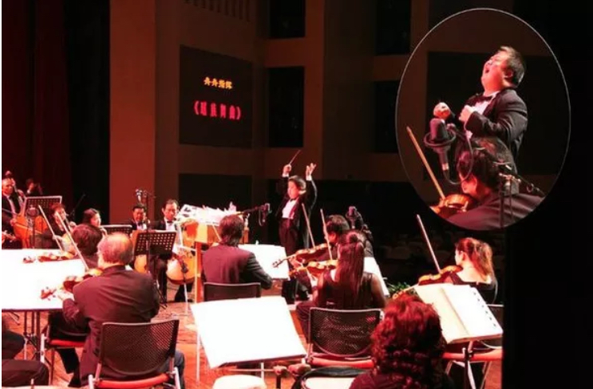

# 我们怎样做父亲

今天在打开 App Store 发现了[游戏里的母亲](https://apps.apple.com/cn/story/id1378845384)这样一篇文章。大致是介绍四个游戏中的母亲形象的，顺便推荐了四款游戏。这里面有这样一段文字。

> “自己背着因袭的重担，肩住了黑暗的闸门，放他们（孩子）到宽阔光明的地方去；此后幸福的度日，合理的做人。”——鲁迅

鲁迅还说过这句话？

搜了一下发现还真是鲁迅的原话，出自《鲁迅文集·杂文集·坟》里的一片文章，标题是[《我们怎样做父亲》](http://www.ziyexing.com/luxun/luxun_zw_fen_07.htm)。

<image src='./images/20200102_2.jpg' style="width:200px"></image>

作为一个新手爸爸，我最近一直在关注这中内容，所以就特地看了一下文章的内容。

不看不知道，一看吓一跳。迅哥儿的思考放在现在也是毫不过时的。

我还特地看了下写作的时间——一九一九年十月。

<image src='./images/20200102_3.jpeg' style="width:200px"></image>

正好一百年前 ？？好吧，迅哥儿牛逼(破音~~)

文章大致内容我总结一下。

首先他说明了起这个标题的原因：

第一，当时的“圣人之徒”们认为：`父对于子，有绝对的权力和威严；若是老子说话，当然无所不可，儿子有话，却在未说之前早已错了。` 也就是说他们认为“我们怎样做父亲”这种东西是不能议论的，他们拥有全部解释权。

迅哥儿认为：`祖父子孙，本来各各都只是生命的桥梁的一级，决不是固定不易的。现在的子，便是将来的父，也便是将来的祖。`大致意思就是说我就议论了怎么滴，毕竟我以后也是会成为父亲的，`也都有做祖宗的希望`。

第二，由于`中国的老年，中了旧习惯旧思想的毒太深了，决定悟不过来。`，因此迅哥儿作为觉醒之人便`自己背着因袭的重担，肩住了黑暗的闸门，放他们到宽阔光明的地方去；此后幸福的度日，合理的做人。`

然后他驳斥了“生养孩子是父母对孩子的恩典”这种观念。他说我们人作为一种生物最重要的就是生命，其次就是延续和发展生命。而类似吃饭这样的行为是为了维持生命那样，养育孩子是延续和发展生命的方式。`饮食的结果，养活了自己，对于自己没有恩；性交的结果，生出子女，对于子女当然也算不了恩。`

“父子间没有什么恩”这一个结论让很多人紧张，迅哥儿指出他们的错误在于功利的解读了父子关系。权利和占有思想很重，义务和责任心却很轻。只想着通过通过生下孩子这一件事就要求孩子的全部都为长者所有，更有甚者要求孩子理应为长者牺牲。

接着他指出我们自古以来都是在`逆天行事`，处处以长者为尊。殊不知自然界的真实情况是生命一直在进化，后代往往是前辈的发展和进化。而长者为尊导致的结果就是`人的能力，十分萎缩，社会的进步，也就跟着停顿。`

没有了`恩`，那么父子之间靠什么来维系呢？迅哥儿的回答是`爱`。

他说爱是生物的天性，`动物总是挚爱他的幼子，不但绝无利益心情，甚或至于牺牲了自己，让他的将来的生命，去上那发展的长途`。

因此`只是有了子女，即天然相爱，愿他生存；更进一步的，便还要愿他比自己更好，就是进化。这离绝了交换关系利害关系的爱，便是人伦的索子，便是所谓“纲”。`

具体怎么做呢？迅哥儿给出了三点解释：`健全的产生，尽力的教育，完全的解放`。

第一：健全的产生。

这个跟现在“优生”的概念一样，就是尽量确保孩子没有先天疾病，健全的来到这个世界上。

说道这我想起了前几天看到的一个新闻：[你还记得那个天才指挥家舟舟吗? 如今结局成了这样](https://mp.weixin.qq.com/s?__biz=MjM5NDEwMDI1MA==&mid=2654666539&idx=1&sn=783dcb8c9f97536636b5fc2be5b1c1c4)。

一些人应该对舟舟有点印象，他是一个唐氏患儿，天生的智力低下。通过媒体的曝光，他成为了家喻户晓的名字，被媒体称为“天才指挥家”。

他成为第一位在卡耐基音乐厅演奏的中国指挥家。

但是现在呢？

>转眼18年过去了，当年那个随着音乐起舞的小伙子，已经迈入不惑之年，跟大多数四十多岁的中年男性一样，他身体发福，两鬓也开始出现了银丝。

>随之改变的，还有他的境遇。

>曾经 4.8 万月薪的他，如今拿着 600 块的低保，居住在深圳一家残疾人艺术团提供的出租屋里。

光环褪去，打回原形。

这也验证了迅哥儿的“健全的产生”的重要性。

第二：尽力的教育

这点的解释我感觉原文写的很好，就直接搬过来了。

> 时势既有改变，生活也必须进化；所以后起的人物，一定尤异于前，决不能用同一模型，无理嵌定。长者须是指导者协商者，却不该是命令者。不但不该责幼者供奉自己；而且还须用全副精神，专为他们自己，养成他们有耐劳作的体力，纯洁高尚的道德，广博自由能容纳新潮流的精神，也就是能在世界新潮流中游泳，不被淹末的力量。

第三：完全的解放

这个的意思就是子女全部为他们自己所有，是一个独立的人。

接着迅哥儿对一些观点进行了驳斥。

观点一：`父母从此以后，一无所有，无聊之极了`

驳斥一：`解放子女的父母，也应预备一种能力。便是自己虽然已经带着过去的色采，却不失独立的本领和精神，有广博的趣味，高尚的娱乐。`这样的父母是不会无聊的。

观点二：`解放之后，父子间要疏隔了`

驳斥二：`父母生了子女，同时又有天性的爱，这爱又很深广很长久，不会即离。现在世界没有大同，相爱还有差等，子女对于父母，也便最爱，最关切，不会即离。`

观点三：`解放之后，长者要吃苦了`

驳斥三：第一，这是旧思想导致的，在传统思想中`虽说“道德好”，实际却太缺乏相爱相助的心思。便是“孝”“烈”这类道德，也都是旁人毫不负责，一味收拾幼者弱者的方法。在这样社会中，不独老者难于生活，既解放的幼者，也难于生活`。第二，同观点一的解释。

观点四：`解放之后，子女要吃苦了`

驳斥四： 经历了父母的“尽力的教育”之后，子女已经具备了`耐劳作的体力，纯洁高尚的道德，广博自由能容纳新潮流的精神，也就是能在世界新潮流中游泳，不被淹末的力量。`

最后，迅哥儿强调了`觉醒的父母，在中国尤不易做。就是开首所说的“自己背着因袭的重担，肩住了黑暗的闸门，放他们到宽阔光明的地方去；此后幸福的度日，合理的做人。”这是一件极伟大的要紧的事，也是一件极困苦艰难的事。`

总结一下，迅哥儿提出了下列观点：

1. 性欲是一种本能，是为了继续生命。性欲是保存后裔，保存永久生命的事。性交也就并非罪恶，并非不净。
2. 父子间没有什么恩。
3. 父母对于子女，应该健全的产生，尽力的教育，完全的解放。
4. 子女全部为他们自己所有，是一个独立的人。

以上

二零二零年一月