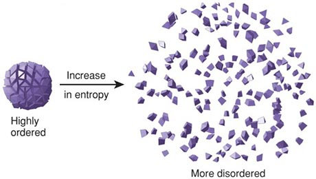

# 世间好物不坚牢，彩云易散琉璃脆

为什么“世间好物不坚牢，彩云易散琉璃脆”？

这涉及到一个物理上的概念：`熵`。

我们都知道物理学家们发现了能量守恒定律，即能量的总量总是保持不变。

但是后续物理学家发现，能量无法完全转化，比如蒸汽机的热能不能完全转化为机械能。这些在能量转换过程中浪费掉的、无法再利用的能量称为`熵`。

这个概念被总结成了“热力学第二定律”：**能量转换总是会产生熵，如果是封闭系统，所有能量最终都会变成熵**。

能量转换的时候，大部分能量会转换成预先设定的状态，比如热能变成机械能、电能变成光能。但是，还有一部分能量会生成新的状态。这部分能量就是熵，由于状态不同，所以很难利用，除非外部注入新的能量，专门处理熵。

而状态多，就是可能性多，表示比较混乱；状态少，就是可能性少，相对来说就比较有秩序。因此，上面结论的另一种表达是：**能量转换会让系统的混乱度增加，熵就是系统的混乱度。**

也就是说如果不施加外力影响，事物永远向着更混乱的状态发展。

因此事**物维持美好的状态是需要能量的，如果没有能量输入，美好的状态就会结束**。比如房间不会一直保持整洁的状态，而是需要有人来消耗能量做清扫工作。

人类社会并非一定会变得更进步、更文明。相反地，人类如同宇宙的其他事物一样，常态和最终命运一定是变得更混乱和无序。过去五千年，人类文明的进步只是因为人类学会利用外部能量（牲畜、火种、水力等等）。越来越多的能量注入，使得人类社会向着文明有序的方向发展。

我们的教育一直是“明天会更好”。但是这句话是有条件的。正常情况下，明天其实会更糟，因为熵在累积，只有不断注入新的能量处理熵，明天才会更好。

以上内容来自[阮一峰：《未来世界的幸存者》](https://survivor.ruanyifeng.com/future/entropy.html)

## 反思

我反思了一下自己，发现我之前的想法有很大的问题。

比如

对于朋友，信奉“朋友就是两条相交的直线，只会越走越远”，时间一长的话就没有再联系的想法。

对于爱人，认为爱人会一直包容自己，忽略了爱人的感受。

现在想想，这些想法真是荒谬的很。

对于朋友，虽然随着各自经历的不同，生活的不同，朋友之间难免会产生疏远，这就是产生了熵。这时候就要求我们持续的输入“能量”。比如不时约个饭，经常打个电话，发个消息。相信通过这样的能量输入，友情这种美好的东西就一定能保持美好的状态。

对于爱人来说更是如此，两个人如此紧密的联系在一起之后，总会有各种各样的摩擦。而且大部分都是因为一些鸡毛蒜皮的事情。这其实也是产生了熵。因此需要不停的输入爱的能量才能保证感情不会转化为熵而消失，甚至变的更好！

以上

二零二零年四月