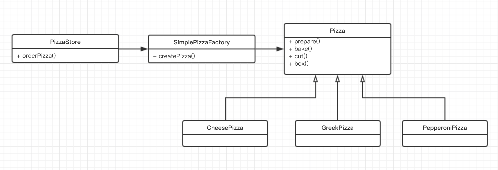

# 设计模式
## 什么是设计模式
可以用一句话概括设计模式———设计模式是一种利用 面向对象编程 的封装、继承和多态三大特性，同时在遵循各种设计原则的前提下，被总结出来的经过反复实践并被多数人知晓且经过分类和设计的可重用的软件设计方式。
简单来说就是程序员们的程序设计的经验总结。是被主流工程师/架构师所广泛接受和使用的。然后再看这个面向对象，根据上面的定义我们可以看出来面向对象是设计模式的基础，这些设计模式都是应用于面向对象程序设计中的。这里我先简单介绍下面向对象。
## 面向对象与面向过程
提到面向对象就不得不提面向过程。它们都是程序设计的思想。就像小说中的华山派的剑宗与气宗的分别一样，它们只是处理问题的思想不同，但是都能解决程序设计中问题。
- 通过面向规程设计程序的实质就是分析出解决问题所需要的步骤，然后用函数把这些步骤一步一步实现，使用的时候一个一个依次调用就可以了。

例如五子棋，面向过程的设计思路就是首先分析问题的步骤：
1、开始游戏，2、黑子先走，3、绘制画面，4、判断输赢，5、轮到白子，6、绘制画面，7、判断输赢，8、返回步骤2，9、输出最后结果。
- 面向对象是把构成问题事务分解成各个对象，建立对象的目的不是为了完成一个步骤，而是为了描叙某个事物在整个解决问题的步骤中的行为。

整个五子棋可以分为：1、黑白双方，这两方的行为是一模一样的，2、棋盘系统，负责绘制画面，3、规则系统，负责判定诸如犯规、输赢等。
第一类对象（玩家对象）负责接受用户输入，并告知第二类对象（棋盘对象）棋子布局的变化，棋盘对象接收到了棋子的变化就要负责在屏幕上面显示出这种变化，同时利用第三类对象（规则系统）来对棋局进行判定。

就像武侠小说中的气宗干掉剑宗一样，现在主流的是面向对象这一设计思想。比如流行的 Java、 OC 等等都是面向对象的语言。而且在面向对象思想的基础上人们又提出了各种设计模式。因此可以说面向对象是目前程序开发中最重要的思想。

## 对象


对象是面向对象编程的核心，我们在通过面向对象思想编写程序的时候就会创建各种对象。当我们需要根据条件创建不同的对象时就会自然而然的出现下面的代码。

举个例子🌰
现在有个需求，一家披萨店提供披萨。

定义一个 PizzaStore 类， 它有一个提供披萨的方法 orderPizza。
```
class PizzaStore {
    
    func orderPizza() -> Pizza {
        let pizza = Pizza();
        
        pizza.prepare();
        pizza.bake();
        pizza.cut();
        pizza.box();
        
        return pizza;
    }
}
```
上面是简单的情况，当披萨店需要提供多种披萨时需要这样修改。

```
class PizzaStore {
    
    func orderPizza(type: String) -> Pizza? {
        var pizza: Pizza?;
        
        if type == "cheese" {
            pizza = CheesePizza()
        } else if type == "greek" {
            pizza = GreekPizza();
        } else if type == "pepperoni" {
            pizza = PepperoniPizza();
        }
        
        pizza?.prepare();
        pizza?.bake();
        pizza?.cut();
        pizza?.box();
        
        return pizza;
    }
}
```
这样以来披萨店能提供了多种披萨，但是当披萨店增加或减少披萨种类的时候就需要修改上面 if else 的代码，而下面部分的代码是不动的。根据封装的思想，我们需要把上半部分给封装一下。这样就导入了另外一个类，SimplePizzaFactory 它专门用来生产披萨对象。

```
class SimplePizzaFactory {
    
    func createPizzaByType(type: String) -> Pizza? {
        var pizza: Pizza?;
        
        if type == "cheese" {
            pizza = CheesePizza()
        } else if type == "greek" {
            pizza = GreekPizza();
        } else if type == "pepperoni" {
            pizza = PepperoniPizza();
        }
        
        return pizza;
    }
}
```

然后 PizzaStore 需要修改成下面这样

```
class PizzaStore {
    
    var factory: SimplePizzaFactory
    
    init(factory: SimplePizzaFactory) {
        self.factory = factory;
    }
    
    func orderPizza(type: String) -> Pizza? {
        
        let pizza = self.factory.createPizzaByType(type: type)
        
        pizza?.prepare();
        pizza?.bake();
        pizza?.cut();
        pizza?.box();
        
        return pizza;
    }
}
```
PizzaStore 在初始化的时候传入 SimplePizzaFactory 属性， 然后在 orderPizza 中通过 factory 来创建 pizza。

上面的这种设计方式就被称为简单工厂模式。
## 简单工厂模式

类图



### 简单工厂模式角色划分
- 客户 （上文中的 PizzaStore）：它是使用工厂来创建产品的类。
- 工厂角色（如上文中的 SimplePizzaFactory）：这是简单工厂模式的核心，由它负责创建所有的类的内部逻辑。当然工厂类必须能够被外界调用，创建所需要的产品对象。在上面的例子中则使用一个工厂属性来实现。而有些时候，工厂类提供一个静态方法，外部程序通过该静态方法创建所需对象，而不用实例化工厂对象。这被称为静态工厂，比上面的写法又简单一点。
- 抽象产品角色(如上文中的 Pizza)：简单工厂模式所创建的是所有对象的父类。注意，这里的父类可以是接口也可以是抽象类，它负责描述所创建实例共有的公共接口。
- 具体产品角色（如上文中的 CheesePizza，GreekPizza，PepperoniPizza）：简单工厂所创建的具体实例对象，这些具体的产品往往都拥有共同的父类。

### 简单工厂模式的优点

工厂类是整个简单工厂模式的关键所在。它包含必要的判断逻辑，能够根据外界给定的信息（配置，或者参数），决定究竟应该创建哪个具体类的对象。用户在使用时可以直接根据工厂类去创建所需的实例，而无需了解这些对象是如何创建以及如何组织的。有利于整个软件体系结构的优化。

### 简单工厂模式缺点
由于简单工厂模式的产品是基于一个共同的抽象类或者接口，这样一来，产品的种类增加的时候，即有不同的产品接口或者抽象类的时候，工厂类就需要判断何时创建何种接口的产品，这就和创建何种种类的产品相互混淆在了一起，违背了单一职责原则，导致系统丧失灵活性和可维护性。

正如上文提到的，一般情况下简单工厂模式违背了“开放-关闭原则”，因为当我们新增加一个产品的时候必须修改工厂类，相应的工厂类就需要重新编译一遍。但这一点可以利用反射在一定程度上解决（比如通过传入类名来区分不同的类型，然后根据类名创建对应的对象）。

## 工厂方法模式

