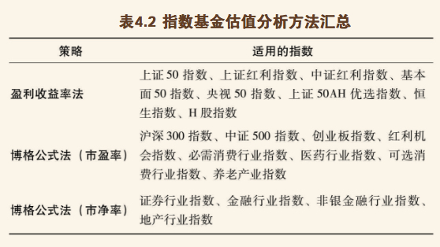
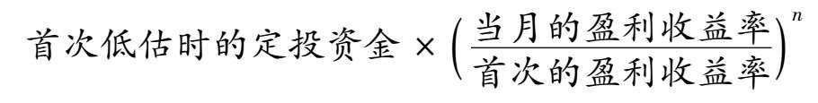
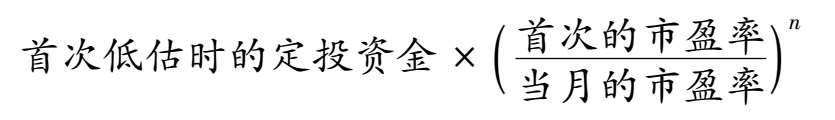
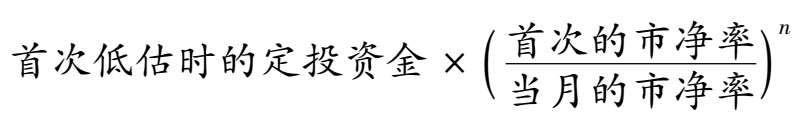

## 指数基金可以分为宽基和行业指数基金。
- 常见宽基指数基金有：上证50、沪深300、中证500、创业板、红利、基本面、央视50、恒生、H股、上证50AH优选、纳斯达克100、标普500等。
- 常见的行业指数基金有：必需消费行业的指数基金、医药行业的指数基金、可选消费行业的指数基金、养老产业的指数基金、银行业的指数基金、证券业的指数基金、保险行业的指数基金、金融行业的指数基金、地产行业的指数基金等。

## 格雷厄姆对价值投资的贡献
- 价格与价值的关系。价格围绕价值上下波动，但长期看是趋于一致的。
- 能力圈。对品种了解得越多，能力圈也就越大。只有具备了能力圈，我们才能判断出股票的价值。
- 安全边际。只有当价格大幅低于价值的时候，我们才会买入。
 
 ## 估值指标

 估值就是从各种不同的角度去评估资产。

 ### 市盈率

 市盈率的定义是：公司市值/公司盈利（即PE=P/E，其中P代表公司市值，E代表公司盈利）

 静态市盈率是取用公司上一个年度的净利润，滚动市盈率是取用最近4个季度财报的净利润，动态市盈率是取用预估的公司下一年度的净利润。

 流动性好、盈利稳定的品种，就可以使用市盈率为其估值.

 ### 盈利收益率

盈利收益率则是用公司盈利除以公司市值。也就是盈利收益率＝E/P。

 假如我们把一家公司全部买下来，这家公司一年的盈利能够带给我们的收益率，就是盈利收益率。

 ### 市净率

 市净率指的是每股股价与每股净资产的比率，也就是我们说的账面价值。市净率的定义是：PB＝P/B（其中P代表公司市值，B代表公司净资产）

### 净资产收益率（ROE）

ROE等于净利润除以净资产。

ROE越高的企业，资产运作效率越高，市净率也就越高。

### 股息率

用过去一年，公司的现金分红除以公司的市值，得到的就是股息率了。股息率衡量的，就是现金分红的收益率。

股息率则会随着股价波动：股价越低，股息率就越高。

### 分红率

分红率是企业过去一年的现金派息额除以公司的总净利润

## 盈利收益率法挑选指数基金

- 当盈利收益率大于10%时，分批投资。
- 盈利收益率小于10%，但大于6.4%时，坚定持有已经买入的基金份额。
- 当盈利收益率小于6.4%时，分批卖出基金。

### “盈利收益率法的局限和适合的品种

盈利收益率法也是有它的局限性的。盈利收益率的使用条件比较苛刻，只适合于流通性比较好、盈利比较稳定的品种。如果是盈利增长速度较快，或者盈利波动比较大的指数基金，则不适合使用盈利收益率法

目前适合盈利收益率的品种，国内主要是上证红利、中证红利、上证50、基本面50、上证50AH优选、央视50、恒生指数和恒生中国企业指数等。这几个品种的投资很简单，当盈利收益率大于10%时就可以投资，小于6.4%时就可以卖出。

内地的朋友在投资恒生指数和H股指数基金的时候，要将它们的盈利收益率打9折之后再做参考。

## 博格公式法挑选指数基金

决定股市长期回报的最关键的三个因素。分别是：

- 初始投资时刻的股息率
- 投资期内的市盈率变化
- 投资期内的盈利增长率

指数基金未来的年复合收益率，等于指数基金的投资初期股息率，加上指数基金每年的市盈率变化率，再加上指数基金的每年的盈利变化率。

### 如何使用博格公式

- 在股息率高的时候买入。
- 在市盈率处于历史较低位置时买入。（以上这两点往往是同时发生的。）
- 买入之后，耐心等待“均值回归”，即等待市盈率从低到高。

## 博格公式的变种

指数基金未来的年复合收益率，等于指数基金每年市净率的变化率加上指数基金每年净资产的变化率。

### 如何使用博格公式的变种 

如果指数基金背后的公司，盈利处于不稳定状态，或者盈利呈现周期性变化的特征，但即使在公司盈利最差的情况下，公司也是赚钱的，那我们就可以使用博格公式的变种，也就是通过市净率这个估值指标来分析这类指数基金。

## 指数基金估值方法小结

- 盈利稳定的指数，可以直接使用博格公式的快速判断版本，也就是盈利收益率法对其进行分析。这种方法容易掌握，成功率比较高，又简单有效，是最适合新手投资者的方法。
- 盈利呈高速增长态势的指数，可以使用博格公式对其进行判断。如果指数当前的市盈率处于它历史市盈率波动范围的较低区域，就可以投资它。这种应用，比上一种方法增加了难度，需要我们具备分析指数的历史数据、判断指数的历史波动范围的能力。
- 盈利处于不稳定状态或者盈利呈周期性变化，但行业没有长期亏损记录的指数，则可以应用博格公式的变种来分析它。如果指数当前的市净率处于历史市净率波动范围的较低区域，可以对其进行投资。不过，这种应用的难度比前两种就更大了，因为增加了不稳定的因素——盈利，再加上我们还要有足够的能力来分析指数的相关历史数据。
- 最后，如果指数背后的公司是长期亏损的，那么直接放弃就好了。有了前面的三类可投资品种，就没有必要考虑这些长期亏损的品种了。

## 盈利收益率法＋定投。
- 在盈利收益率大于10%的时候坚持定投。
- 盈利收益率小于10%，大于6.4%的时候暂停定投，继续持有；可以定投其他盈利收益率大于10%的品种。
- 盈利收益率小于6.4%的时候卖出。

## 博格公式法＋定投。
- 在市盈率或市净率处于历史底部区域的时候坚持定投。
- 市盈率市净率进入正常估值，暂停定投，继续持有；可以定投其他处于底部区域的品种。
- 当市盈率市净率进入历史较高区域的时候卖出。

## 如何计算定投的年复合收益率

在Excel表格中来使用IRR公式。在第二列从上到下输入每个月定投的金额，如每月1万元，最后一行填入期末持有市值，也就是假如我们把全部的基金或股票卖出能得到多少现金，如76 518元。

月复合收益率的值填入公式IRR（B2：B9），意思是计算每月投入和最后收回现金的实际收益率，计算出来约为2%，这个数据是我们定投的月均收益率。如果上面填入的是每周定投的金额，那么计算出来的就是定投的周均收益率。

然后计算年复合收益率，计算公式为（1+2%）12-1，结果约为30%，这就是我们定投指数基金的实际年复合收益率了。（注：IRR收益率适合计算定期投资的收益率，如果投资日期不确定，可以用XIRR公式来计算。）

## 定期不定额

1. 盈利收益率法

2. 博格公式法

3. 博格公式变种法

在这些公式里都有一个n，它就是定投收益的放大器，对进一步提升我们定投的收益，起着很重要的作用。所谓放大，很好理解，即n越大，收益会相对越高。只要普通定期定额的定投是盈利的，那么n就能放大我们的收益。

但是对资金的需求量会随着n的增大而越来越高，而且这种增高是呈几何倍数增长的。

设置 n＝1，效果就已经不错了。有条件的、资金比较多的朋友，可以设置n＝2。

## 资产分配

用100减去自己当前的年龄，用得到的数值加上百分号就是适合投入到指数基金中的资金比例。

我们在投资的时候，更多是以家庭为单位的，可以计算一下家庭平均年龄。

家庭中打算投资股票资产的比例，最好不要低于30%，低于30%的投资对于家庭总资产的收益提升作用不明显。

## 货币基金

随取随用的余额宝

## 债券基金

债券基金是以债券为主要投资对象的基金，它主要投资的是国债、金融债、企业债等固定收益类金融工具。

债券的价格和市场的利率是呈反方向变动的。如果利率下降，债券的价格会上升，这时债券基金的回报会更好；如果利率上升，债券的价格会下降，这时债券基金的回报会变差。

债券基金的作用：作为没有低估指数基金可供投资时的替代品

债券基金怎么投资：

1. 利率低位选短期，利率高位选长期。
2. 随时可以投资，出现浮亏可以加仓拉低成本。

## 家庭资产配置

指数基金在家庭资产中所占的比例，不应该低于“100-家庭成员平均年龄”%。例如家庭成员平均年龄是40岁，那最好配置60%左右的指数基金。剩余的40%，可以配置债券基金和货币基金。

如果市场上没有低估的指数基金，可以投资债券基金品种；如果债券基金也不合适，可以选择银行理财或货币基金。

## 巴菲特是怎么卖出“鹅”的
- 基本面恶化：鹅下不出金蛋了。
- 过于昂贵：有人愿意出大价钱买我们手里的鹅，价钱远比鹅能产出的金蛋多得多。
- 有更好的品种：手里的鹅卖出，可以买到另一只能下更多金蛋的鹅。

每次想卖出手里的指数基金时，问问自己：手里的指数基金有没有过于昂贵？如果我卖了它，是不是因为有更好的选择？