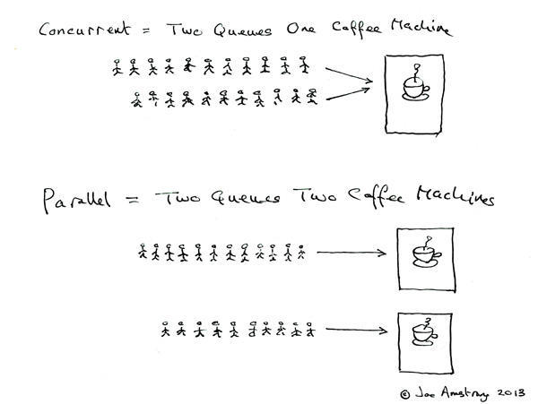
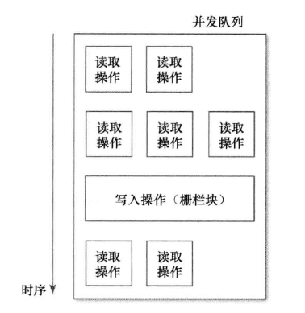

# GCD

## 一些概念
### 进程

指的是一个正在运行中的可执行文件。每一个进程都拥有独立的虚拟内存空间和系统资源，包括端口权限等，且至少包含一个主线程和任意数量的辅助线程。另外，当一个进程的主线程退出时，这个进程就结束了。

### 线程

>一个CPU执行的CPU命令列为一条无分叉路径即为线程

我们都知道我们写的OC/Swift源码最后会被编译器转换成相应的CPU命令列，然后程序启动后操作系统会将包含在程序中的CPU命令列配置到内存中。然后会从应用程序制定的地址开始一个一个的执行命令。虽然在遇到诸如if语句、for语句等控制语句或者函数调用的情况下，执行命令列会进行位置迁移。但是由于一个CPU一次只能处理一个指令，因此依然可以把CPU命令列看成一条无分叉的路径，其执行不会出现分叉。
当这种无分叉的路径存在多条时就是“多线程”。

### 多线程

虽然CPU相关的技术不断进步，但是基本上一个CPU核一次能执行的命令始终为1。这时候要在多条路径中执行CPU命令列就需要进行“上下文切换”。
>将执行中的路径的状态，如CPU寄存器等信息保存到对应路径专用的内存块中，然后从将要切换到的目标路径对应的内存中复原CPU寄存器等信息，继续执行切换路径的CPU命令列。这就称为“上下文切换”。

来个比喻来说，比如CPU是个学生，他需要做英语和数学两种作业。但是我们让CPU写一会儿英语作业后写一会儿数学作业，然后再写一会儿英语作业。两种作业快速切换就给人一种CPU在同时在写英语和数学作业的感觉。

### 多线程的坏处

一般我们都觉得多线程多好啊，几个线程一起执行任务，这样肯定会提高速度。但是从上面多线程的介绍来看并不是这样。（你要是让小明去一边写英语一边写数学，估计早就被打死了。。）当在不同的线程中来回切换的时候会不停地备份、替换寄存器等信息，这明显会耗费性能。那多线程的用处是什么呢？这就要涉及几个新的概念。

### 并发、并行、串行



Erlang 之父 Joe Armstrong 用一张图解释了并发与并行的区别。并发是两队交替使用一台咖啡机，并行则是两个队列同时使用两台咖啡机。串行则是一个队列使用一台咖啡机。（更详细的说明可以看看[知乎这些回答](https://www.zhihu.com/question/33515481)）
多线程就是采用了并行的技术来同时处理不同的指令。而在我们的程序中通过主线程来绘制界面，响应用户交互事件。如果在这个线程上进行长时间的处理，就会阻塞主线程的执行，妨碍主线程中Runloop的住循环，这样就不能及时更新界面，响应用户的交互，这就给用户卡顿的感觉。而使用多线程就能解决这个问题，给用户“快”的感觉。所以多线程所谓能提高速度指的就是这个意思。

### 同步、异步

同步就是我们平常写的那些代码。它会一行接一行的执行，每一行都可以看成是一个任务，一个任务没执行完就不会执行下一个任务。异步就是允许执行一行的时候函数直接返回，真正要执行的任务稍后完成。
对于同步执行的任务来说系统__倾向于__在同一个线程中执行。这是因为这个时候就算开了其他线程系统也要等他们在各自线程中全执行完成，这样以来又增加了线程切换时的性能，得不偿失。
对于异步执行的任务来说系统__倾向于__在多个线程中执行，这样就可以更好的利用CPU性能，缩短完成任务的时间，提高效率。

### 队列、线程

这两个概念经常被混淆，其实这两个是不同层级的概念。队列是为了方便使用和理解的抽象结构，线程则是系统级进行运算调度的单位。系统利用队列来进行任务调度，它会根据调度任务的需要和系统的负载等情况动态的创建和销毁线程。并行队列可能对应多个线程。串行队列则每次对应一个线程，这个线程可能不变，可能会被更换。

## GCD

>Grand Central Dispatch是异步执行任务的技术之一。**开发者要做的只是定义想要执行的任务并追加到适当的Queue中**，GCD就能生成必要的线程并计划计划任务。

可以看出我们需要注意的两点就是Queue和添加任务到Queue，在GCD中对应的就是`dispatch_queue`（队列）和`dispatch_async`、`dispatch_sync`（ 执行方式）。

### 队列

- **串行队列**（Serial Dispatch Queue）遵循先进先出规则，每一个任务都会等待它上个任务处理完成后执行，因此每次只执行一个任务。主队列是一种特殊的串行队列。是在主线程中执行的队列。

- **并行队列**（Concurrent Dispatch Queue）依然遵循先进先出，不过每个任务不会等其他任务处理结束后再执行，而是在其他任务开始执行后就开始执行，这样就实现的多个任务并行。

举个例子：现在有三个任务blk1，blk2，blk3。

在串行队列里会先执行blk1，等blk1执行完之后执行blk2，然后等blk2结束后再执行blk3。

在并行队列里会先执行blk1，不用等blk1的处理结束就开始执行blk2，这时候也不用等待blk1，blk2的执行结束直接执行blk3。

```
// 串行队列的创建
dispatch_queue_t serial = dispatch_queue_create("com.zhouke.serial", NULL);
// 获取主队列（这是个串行队列）
dispatch_queue_t mainSerial = dispatch_get_main_queue();

// 创建并行队列
dispatch_queue_t concurrentCreated = dispatch_queue_create("com.zhouke.concurrent", DISPATCH_QUEUE_CONCURRENT);
// 获取默认优先级的并行队列
dispatch_queue_t concurrentGet = dispatch_get_global_queue(DISPATCH_QUEUE_PRIORITY_DEFAULT, 0);

```

### 执行方式 

- **同步执行**（`dispatch_sync`）这个函数就是把指定的block同步添加到指定的队列中，在这个block执行结束之前，函数会一直等待。（了解这个死锁就很容易理解了）
- **异步执行**（`dispatch_sync`）这个函数会将指定的block非同步的添加到指定队列中，函数不做等待。

一般来说同步方法会在当前线程执行，异步方法会开启新的线程。但是对于主队列来说就有点特殊了。在主队列执行同步方法会产生死锁，执行异步方法不会开启新的线程，依然在主线程执行。

### 线程的开辟

- (串行/并行)队列决定任务是否在当前线程(注意不是队列)执行。
- (同步/异步)任务决定任务立即执行(阻塞线程)还是添加到队列末尾(不阻塞线程)。

由上可知会开辟新线程的两种情况：
- 并行队列+异步任务 = 多条新线程
- 串行队列+异步任务 = 一条新线程

其余的情况下都不会开辟线程。

### 死锁

>如果向**当前**串行队列**同步**派发任务就会产生死锁

```
- (void)viewDidLoad {
    [super viewDidLoad];

    NSLog(@"1.%@", [NSThread currentThread]);
    dispatch_queue_t queue = dispatch_get_main_queue();
    dispatch_sync(queue, ^{
        NSLog(@"2.%@", [NSThread currentThread]);
    });
}
```

这段代码就会会造成死锁。我们可以把`dispatch_sync`这个函数当做一个任务A，block里包装的是另一个任务B。然后我们可以看到A处于主队列中，这时同步添加任务B到主队列中。任务A会等待B任务完成，但是由于当前主队列是串行队列，这个新增的B任务要等到A任务执行完才能执行，这样就造成了两个任务互相等待，导致死锁。

```
- (void)viewDidLoad {
    [super viewDidLoad];

    NSLog(@"1.%@", [NSThread currentThread]);
    dispatch_queue_t queue = dispatch_queue_create("com.xxx.xxx", NULL);
    dispatch_sync(queue, ^{
        NSLog(@"2.%@", [NSThread currentThread]);
    });
}
```

上面这段代码就不会照成死锁，这是因为`dispatch_sync`这个函数处于主队列中,但是block包装的任务处于queue这个串行队列中，两者在不同的串行队列，因此不会死锁。

```
- (void)viewDidLoad {
    [super viewDidLoad];
    
    NSLog(@"1.%@", [NSThread currentThread]);
    dispatch_queue_t queue = dispatch_queue_create("com.xxx.xxx", NULL);
    dispatch_async(queue, ^{
        NSLog(@"2.%@", [NSThread currentThread]);
        dispatch_sync(queue, ^{
            NSLog(@"3.%@", [NSThread currentThread]);
        });
    });
}
```

这段代码依然会死锁，原因跟第一段代码一样。`dispatch_async`函数可以看成是把block里的任务放到queue中执行，这时`dispatch_sync`处于queue这个队列中，它的block包装的任务依然处于queue队列中，因此会死锁。

## GCD 中的函数和对象

### `dispatch_group`

在串行队列中如果想在全部任务结束后再做些操作是很好处理的，但是对于并行队列就不一样了，这时候我们就需要使用 Dispatch Group.

```
    dispatch_queue_t queue = dispatch_get_global_queue(DISPATCH_QUEUE_PRIORITY_DEFAULT, 0);
    dispatch_group_t group = dispatch_group_create();
    
    dispatch_group_async(group, queue, ^{
        NSLog(@"任务1执行");
    });
    dispatch_group_async(group, queue, ^{
        NSLog(@"任务2执行");
    });
    dispatch_group_async(group, queue, ^{
        NSLog(@"任务3执行");
    });
    
    dispatch_group_notify(group, dispatch_get_main_queue(), ^{
        NSLog(@"全部执行完成");
    });
```
这段代码中全部执行完成这个任务就会在任务1、2、3全部执行后调用。

还可以使用 `dispatch_group_enter` `dispatch_group_leave` 来实现相识的功能。与上面的区别就是不需要开新的线程

```
dispatch_group_t group = dispatch_group_create();

dispatch_group_notify(group, dispatch_get_main_queue(), ^{
        NSLog(@"全部执行完成");
    });

dispatch_group_enter(group);
NSLog(@"任务1执行");
dispatch_group_leave(group);

dispatch_group_enter(group);
NSLog(@"任务2执行");
dispatch_group_leave(group);

dispatch_group_enter(group);
NSLog(@"任务3执行");
dispatch_group_leave(group);
```

### `dispatch_barrier`

当多个线程同时更新资源的时候会造成数据竞争，这时候我们需要使用 `dispatch_barrier`。

`dispatch_barrier_sync` `dispatch_barrier_async` 区别就是它的 block 里代码是否在当前线程执行，跟上面同步（`dispatch_sync`）异步(`dispatch_async`)执行方式的区别是一样的。

比如我们经常会碰到的一个问题，atomic 修饰的属性一定是安全的吗？

答案是否定的，atomic 只保证了针对这个属性的成员变量的读写的原子性，而如果一个线程在连续多次读取某属性值的过程中有别的线程在同时改写该值，那么即便将属性声明为 atomic，也还是会读到不正确的属性值。使用串行队列可以解决这个问题,将所有的读取写入操作都放到串行队列中，这样就能保证线程安全了。更好的更高性能的解决办法就是利用 `dispatch_barrier`。

```
_queue = dispatch_get_global_queue(DISPATCH_QUEUE_PRIORITY_DEFAULT, 0);

- (NSString *)name
{
    __block NSString *localString;
    dispatch_sync(_queue, ^{
        localString = _name;
    });
    return localString;
}

- (void)setName:(NSString *)name
{
    dispatch_barrier_async(_queue, ^{
        _name = name;
    });
}
```

当上面的执行时属性的读取操作并发执行，而写入操作必须单独执行。



**需要注意**的是如果我们调用 `dispatch_barrier_async` 时提交到一个 global queue，barrier blocks 执行效果与 `dispatch_async()` 一致；只有将 Barrier blocks 提交到使用 `DISPATCH_QUEUE_CONCURRENT` 属性创建的并行 queue 时它才会表现的如同预期。

### `dispatch_semaphore`

`dispatch_barrier` 能在任务这种粒度上来防止数据竞争，当我们需要更细粒度控制的时候就需要使用 `dispatch_semaphore`。

>首先介绍一下信号量 ( semaphore ) 的概念。信号量是持有计数的信号，不过这么解释等于没解释。我们举个生活中的例子来看看。
>
>假设有一个房子，它对应进程的概念，房子里的人就对应着线程。一个进程可以包括多个线程。这个房子(进程)有很多资源，比如花园、客厅等，是所有人(线程)共享的。
>
>但是有些地方，比如卧室，最多只有两个人能进去睡觉。怎么办呢，在卧室门口挂上两把钥匙。进去的人(线程)拿着钥匙进去，没有钥匙就不能进去，出来的时候把钥匙放回门口。
>
>这时候，门口的钥匙数量就称为信号量( semaphore )。很明显，信号量为0时需要等待，信号量不为零时，减去1而且不等待。

```
    dispatch_queue_t queue = dispatch_get_global_queue(DISPATCH_QUEUE_PRIORITY_DEFAULT, 0);
    /*
     *  生成dispatch_semaphore，其初始值设置为1
     *  保证访问array的线程在同一时间只有一个
     */
    dispatch_semaphore_t semaphore = dispatch_semaphore_create(1);
    
    NSMutableArray *array = [NSMutableArray array];
    
    for (int i = 0; i < 1000; ++i) {
        dispatch_async(queue, ^{
            /*
             某个线程执行到这里，如果信号量值为1，那么wait方法返回1，开始执行接下来的操作。
             与此同时，因为信号量变为0，其它执行到这里的线程都必须等待  
             */
            dispatch_semaphore_wait(semaphore, DISPATCH_TIME_FOREVER);
            /*
             执行了wait方法后，信号量的值变成了0。可以进行接下来的操作。
             这时候其它线程都得等待wait方法返回。
             可以对array修改的线程在任意时刻都只有一个，可以安全的修改array
             */
            [array addObject:[NSNumber numberWithInt:i]];
            /*
             排他操作执行结束，记得要调用signal方法，把信号量的值加1。
             这样，如果有别的线程在等待wait函数返回，就由最先等待的线程执行。
             */
            dispatch_semaphore_signal(semaphore);
        });
    }
```
#### 具体使用的例子

##### 1. 控制并发数

```
// 创建队列组
    dispatch_group_t group = dispatch_group_create();   
// 创建信号量，并且设置值为10
    dispatch_semaphore_t semaphore = dispatch_semaphore_create(10);   
    dispatch_queue_t queue = dispatch_get_global_queue(DISPATCH_QUEUE_PRIORITY_DEFAULT, 0);   
    for (int i = 0; i < 100; i++)   
    {   // 由于是异步执行的，所以每次循环Block里面的dispatch_semaphore_signal根本还没有执行就会执行dispatch_semaphore_wait，从而semaphore-1.当循环10此后，semaphore等于0，则会阻塞线程，直到执行了Block的dispatch_semaphore_signal 才会继续执行
        dispatch_semaphore_wait(semaphore, DISPATCH_TIME_FOREVER);   
        dispatch_group_async(group, queue, ^{   
            NSLog(@"%i",i);   
            sleep(2);   
// 每次发送信号则semaphore会+1，
            dispatch_semaphore_signal(semaphore);   
        });   
    }
```
##### 2. 限制请求频次
每次请求发出后由于信号量0则其他线程必须等待，只有等请求返回成功或者失败后信号量设为1，这时候才能继续其他的网络请求。

需要注意死锁的问题。

```
- (void)request1{
    //创建信号量并设置计数默认为0
    dispatch_semaphore_t semaphore = dispatch_semaphore_create(0);
    AFHTTPSessionManager *manager = [AFHTTPSessionManager manager];
    manager.responseSerializer = [AFJSONResponseSerializer serializer];
    manager.completionQueue = dispatch_get_global_queue(DISPATCH_QUEUE_PRIORITY_DEFAULT, 0);//关键的就是这句，如果是默认在主线程的回调就会造成死锁
    NSString *url = [NSString stringWithFormat:@"%s","http://v3.wufazhuce.com:8000/api/channel/movie/more/0?platform=ios&version=v4.0.1"];
    [manager GET:url parameters:nil progress:^(NSProgress * _Nonnull uploadProgress) {
        
    } success:^(NSURLSessionDataTask * _Nonnull task, id  _Nullable responseObject) {
        NSArray *data = responseObject[@"data"];
        for (NSDictionary *dic in data) {
            NSLog(@"请求1---%@",dic[@"id"]);
        }
        //计数加1
        dispatch_semaphore_signal(semaphore);
        //11380-- data.lastObject[@"id"];
    } failure:^(NSURLSessionDataTask * _Nullable task, NSError * _Nonnull error) {
        NSLog(@"shibai...");
        //计数加1
        dispatch_semaphore_signal(semaphore);
    }];
    //若计数为0则一直等待
    dispatch_semaphore_wait(semaphore, DISPATCH_TIME_FOREVER);
}
```

## 扩展
### 1. 完善代码
完善下面的代码，使其能正确执行

```
int foo(int i, int j) {
    int sum = 0;
    dispatch_async(queue, ^{
        sum = i + j;
    });
    return sum;
}
```

#### 1. 使用同步操作

串行并行队列都可以，但是注意不要使用当前队列

```
int foo1(int i, int j) {
    __block int sum = 0;
    
    dispatch_queue_t queue = dispatch_queue_create("com.zhouke", DISPATCH_QUEUE_CONCURRENT);
    dispatch_sync(queue, ^{
        sum = i + j;
    });
    
    return sum;
}
```

#### 2. 使用 `dispatch_group`

```
int foo(int i, int j) {
    __block int sum = 0;
    dispatch_queue_t queue = dispatch_queue_create("com.zhouke", DISPATCH_QUEUE_SERIAL);
    dispatch_group_t group = dispatch_group_create();
    
    dispatch_group_async(group, queue, ^{
        sum = i + j;
    });
    dispatch_group_wait(group, DISPATCH_TIME_FOREVER);

    return sum;
}
```

#### 3. 使用 `dispatch_barrier`

本质上跟第一种是一样的。

```
int foo(int i, int j) {
    __block int sum = 0;
    
    dispatch_queue_t queue = dispatch_queue_create("com.zhouke", DISPATCH_QUEUE_CONCURRENT);
    
    dispatch_barrier_sync(queue, ^{
        sum = i + j;
    });
    return sum;
}
```

#### 4. 使用信号量

注意不要使用当前队列，否则依然会造成死锁。

```
int foo(int i, int j) {
    __block int sum = 0;
    
    dispatch_queue_t queue = dispatch_queue_create("com.zhouke", DISPATCH_QUEUE_CONCURRENT);
    dispatch_semaphore_t semaphore = dispatch_semaphore_create(0);
    
    dispatch_async(queue, ^{
        sum = i + j;
        dispatch_semaphore_signal(semaphore);
    });
    dispatch_semaphore_wait(semaphore, DISPATCH_TIME_FOREVER);
    
    return sum;
}
```

### 异步转同步

#### 1. 利用 `dispatch_barrier`

```
    // 创建队列
    dispatch_queue_t queue = dispatch_queue_create("task", DISPATCH_QUEUE_CONCURRENT);
    // 添加任务
    dispatch_async(queue, ^{
        NSLog(@"1===task===%@", [NSThread currentThread]);
    });
    dispatch_async(queue, ^{
        NSLog(@"2===task===%@", [NSThread currentThread]);
    });
    dispatch_async(queue, ^{
        NSLog(@"3===task===%@", [NSThread currentThread]);
    });
    // 与dispatch_barrier_async区别就是它的 block 里代码是否在当前线程执行
    dispatch_barrier_sync(queue, ^{
        NSLog(@"===barrier==%@", [NSThread currentThread]);
    });
    dispatch_async(queue, ^{
        NSLog(@"4===task===%@", [NSThread currentThread]);
    });
    dispatch_async(queue, ^{
        NSLog(@"5===task===%@", [NSThread currentThread]);
    });
    dispatch_async(queue, ^{
        NSLog(@"6===task===%@", [NSThread currentThread]);
    });
```

会阻塞当前线程，不能在主线程用。

#### 2. 使用 `dispatch_group`

```
 dispatch_group_t group = dispatch_group_create();

// 请求 1
dispatch_group_enter(group);
[RequestManager requestOnSucceeded:^(id result) {
        NSLog(@"请求 1 完成");
        dispatch_group_leave(group);
    } onError:^(NSInteger code, NSString *message) {
        NSLog(@"请求 1 失败");
        dispatch_group_leave(group);
    }];

// 请求 2
dispatch_group_enter(group);
[RequestManager requestOnSucceeded:^(id result) {
        NSLog(@"请求 2 完成");
        dispatch_group_leave(group);
    } onError:^(NSInteger code, NSString *message) {
        NSLog(@"请求 2 失败");
        dispatch_group_leave(group);
    }];

dispatch_group_notify(group, dispatch_get_main_queue(), ^{
       NSLog(@"全部任务完成==%@", [NSThread currentThread]);
    });
```

#### 3. 使用信号量

```
    dispatch_semaphore_t semaphore = dispatch_semaphore_create(0);
    
    dispatch_queue_t queue = dispatch_queue_create("task", DISPATCH_QUEUE_CONCURRENT);
    dispatch_async(queue, ^{
        NSLog(@"1===task===%@", [NSThread currentThread]);
        
        dispatch_after(dispatch_time(DISPATCH_TIME_NOW, (int64_t)(3 * NSEC_PER_SEC)), queue, ^{
            dispatch_semaphore_signal(semaphore);
        });
    });
    
    dispatch_semaphore_wait(semaphore, DISPATCH_TIME_FOREVER);
    dispatch_async(queue, ^{
        NSLog(@"2===task===%@", [NSThread currentThread]);
    });
```

由于 AFN 等第三方网络请求框架的成功失败回调都是在主线程，因此需要特别注意死锁的问题。

# 参考资料

- Objective-C高级编程 iOS与OS X多线程和内存管理》
- 《Effective Objective-C 2.0  编写高质量iOS与OS X代码的52个有效方法》
- [iOS多线程编程总结 ](https://bestswifter.com/multithreadconclusion/#)
- [iOS基础深入补完计划--GCD](https://www.jianshu.com/p/96b93aa05bcd)
- [ios GCD将异步转换为同步](https://www.cnblogs.com/buerjj/p/8041676.html)
