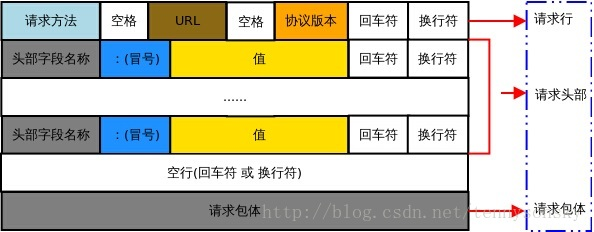
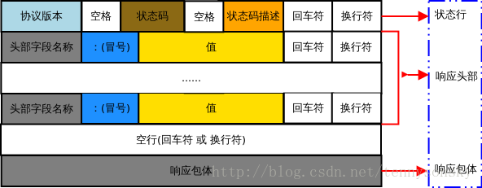
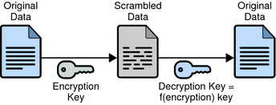
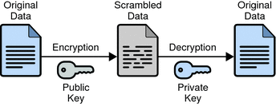
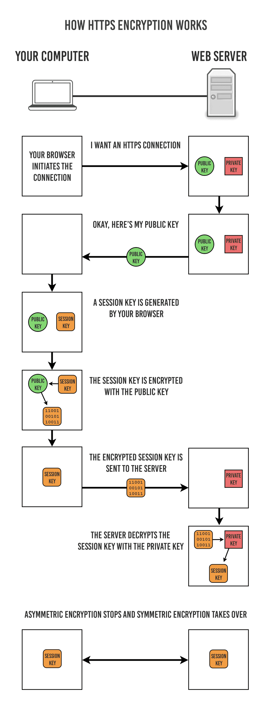

# HTTP 与 HTTPS
## HTTP 请求报文 和 响应报文的结构
### HTTP 报文
HTTP 报文本身是由多行(用 CR（回车符）+LF（换行符） 作换行符)数据构成的字符串文本。HTTP 报文大致可分为报文首部和报文主体两块。两者由最初出现的空行(CR+LF)来划分。通常，并不一定要有报文主体。

**起始行**

报文的第一行就是起始行,在请求报文中用来说明要做些什么,在响应报文中说明出现了什么情况。

**首部字段**

起始行后面有零个或多个首部字段。每个首部字段都包含一个名字和一个值,为了便于解析,两者之间用冒号(:)来分隔。首部以一个空行结束。添加一个首部字段和添加新行一样简单。

**主体**

空行之后就是可选的报文主体了,其中包含了所有类型的数据。请求主体中包括 了要发送给 Web 服务器的数据;响应主体中装载了要返回给客户端的数据。起始行和首部都是文本形式且都是结构化的,而主体则不同,主体中可以包含任意 的二进制数据(比如图片、视频、音轨、软件程序)。当然,主体中也可以包含 文本。

### 请求报文



```
GET / HTTP/1.1
Host: www.baidu.com
Connection: keep-alive
Upgrade-Insecure-Requests: 1
User-Agent: Mozilla/5.0 (Macintosh; Intel Mac OS X 10_11_6) AppleWebKit/537.36 (KHTML, like Gecko) Chrome/54.0.2840.71 Safari/537.36
Accept: text/html,application/xhtml+xml,application/xml;q=0.9,image/webp,*/*;q=0.8
Accept-Encoding: gzip, deflate, sdch
Accept-Language: zh-CN,zh;q=0.8,en;q=0.6
Cookie: BAIDUID=4082549DEE5E64678FC46642E185D98C:FG=1; BIDUPSID=4082549DEE5E64678FC46642E185D98C; PSTM=1472215668; MCITY=-%3A; BDSFRCVID=pSFsJeCCxG3C4A5iySIze8tzxQmzvLxREDct3J; H_BDCLCKID_SF=tR38LRu8KJjEe-Kk-PnVeUFLQlbZKxJmMgkeWlbMQnTR85CGXUQVWx4_Qb6gXU-L5nT9bDOFfDL2bKKmjTL3K4LOMq5-5b0X-K5L3JD8bnjoHRjvq4bohjPy5G7eBtQm05bxohOIHRoE8M0m2ROkMtutKJjQW-nQ5HbbhCLbWDF5MIDGj50WenLHMfnXetJQ2C7WsJceHJOoDDvx0Uj5y4LdLp7xJMtJ0RT0XxOYMJKWf-c90tc05xAb04oR5b0eWJQ2QJ8BtCtKhD3P; pgv_pvi=7232093184; pgv_si=s9982430208; BDRCVFR[IzI_eUGSZP3]=mbxnW11j9Dfmh7GuZR8mvqV; BD_CK_SAM=1; PSINO=5; BD_HOME=0; H_PS_PSSID=1421_17946_21125_18559_21455_21419_21394_21378_21191_21398; BD_UPN=123253; BD_LAST_QID=17716714193052416912
```
解释：

- GET / HTTP/1.1，请求起始行
- GET，请求方法
- /，请求URL，命名了所请求资源,或者URL路径组件的完整URL。如果直接与服务器进行对话,只要URL的路径组件是资源的绝对路径,通常就不会有什么问题——服务器可以假定自己是URL的主机/端口。
- HTTP/1.1，请求采用的协议及版本号
- Host，请求的服务器
- Connection，连接方式
- Upgrade-Insecure-Requests，
- User-Agent，将发起请求的应用程序名称告知服务器
- Accept，请求首部，是请求报文特有的。它们为服务器提供了一些额外信息,比如客户端希望接收什么类型的数据。例子中接收html，xhtml，xml等数据。
- Accept-Encoding，告诉服务器能够发送哪些编码方式
- Accept-Language，告诉服务器能够发送哪些语言
- Cookie，Cookie信息，客户端用它向服务器传送一个令牌——它并不是真正的安全首部,但确实隐含了安全功能

### 响应报文


```
HTTP/1.1 200 OK
Server: bfe/1.0.8.18
Date: Thu, 03 Nov 2016 08:30:43 GMT
Content-Type: text/html
Content-Length: 277
Last-Modified: Mon, 13 Jun 2016 02:50:03 GMT
Connection: Keep-Alive
ETag: "575e1f5b-115"
Cache-Control: private, no-cache, no-store, proxy-revalidate, no-transform
Pragma: no-cache
Accept-Ranges: bytes
```

解释：

- HTTP/1.1 200 OK，响应状态行
- HTTP/1.1，访问采用的协议为HTTP，版本为1.1
- 200，HTTP状态码，表示文档正确返回
- OK，一个描述性的原因短语
- Server，服务器应用程序软件的名称和版本
- Date，服务器产生响应的日期
- Content-Type，实体中所承载对象的类型，例子中响应实体的主体是一个html文本。
- Content-Length，所传送实体主体的长度或大小，例子中响应实体的主体包含了277字节的数据
- Last-Modified，资源的最后修改日期时间
- Connection，连接方式，close或keep-alive
- ETag，资源的匹配信息
- Cache-Control，控制缓存的行为
- Pragma，报文指令
- Accept-Ranges，是否接受字节范围请求


## HTTP 状态码

服务器返回的  **响应报文**  中第一行为状态行，包含了状态码以及原因短语，用来告知客户端请求的结果。

| 状态码 | 类别 | 原因短语 |
| :---: | :---: | :---: |
| 1XX | Informational（信息性状态码） | 接收的请求正在处理 |
| 2XX | Success（成功状态码） | 请求正常处理完毕 |
| 3XX | Redirection（重定向状态码） | 需要进行附加操作以完成请求 |
| 4XX | Client Error（客户端错误状态码） | 服务器无法处理请求 |
| 5XX | Server Error（服务器错误状态码） | 服务器处理请求出错 |

### 1XX 信息
-  100 Continue ：表明到目前为止都很正常，客户端可以继续发送请求或者忽略这个响应。

### 2XX 成功

-  200 OK 
-  204 No Content ：请求已经成功处理，但是返回的响应报文不包含实体的主体部分。一般在只需要从客户端往服务器发送信息，而不需要返回数据时使用。
-  206 Partial Content ：表示客户端进行了范围请求。响应报文包含由 Content-Range 指定范围的实体内容。

### 3XX 重定向

-  301 Moved Permanently ：永久性重定向
-  302 Found ：临时性重定向
-  303 See Other ：和 302 有着相同的功能，但是 303 明确要求客户端应该采用 GET 方法获取资源。
- 注：虽然 HTTP 协议规定 301、302 状态下重定向时不允许把 POST 方法改成 GET 方法，但是大多数浏览器都会在 301、302 和 303 状态下的重定向把 POST 方法改成 GET 方法。
-  304 Not Modified ：如果请求报文首部包含一些条件，例如：If-Match，If-ModifiedSince，If-None-Match，If-Range，If-Unmodified-Since，如果不满足条件，则服务器会返回 304 状态码。
-  307 Temporary Redirect ：临时重定向，与 302 的含义类似，但是 307 要求浏览器不会把重定向请求的 POST 方法改成 GET 方法。

### 4XX 客户端错误

-  400 Bad Request ：请求报文中存在语法错误。
-  401 Unauthorized ：该状态码表示发送的请求需要有认证信息（BASIC 认证、DIGEST 认证）。如果之前已进行过一次请求，则表示用户认证失败。
-  403 Forbidden ：请求被拒绝，服务器端没有必要给出拒绝的详细理由。
-  404 Not Found

### 5XX 服务器错误

-  500 Internal Server Error ：服务器正在执行请求时发生错误。
-  503 Service Unavilable ：服务器暂时处于超负载或正在进行停机维护，现在无法处理请求。


## POST 请求和 GET 请求
GET 请求通常用于查询、获取数据，而 POST 请求则用于发送数据，除了用途上的区别，它们还有以下这些不同：

1. GET 请求可以被缓存，可以被收藏为书签，但 POST 不行。
2. GET 请求会保留在浏览器的历史记录中，POST 不会。
3. GET 请求的长度有限制（不同的浏览器不一样，大约在几 Kb 左右），URL 的数据类型只能是 ASCII 字符，POST 请求没有限制。
4. GET 请求的参数在 URL 中，因此绝不能用 GET 请求传输敏感数据。POST 请求数据则写在 HTTP 的请求头中，安全性略高于 GET 请求。

**注意：**

POST 请求仅比 GET 请求略安全一点，它的数据不在 URL 中，但依然以明文的形式存放于 HTTP 的请求头中。

## Post请求体有哪些格式
HTTP 协议是以 ASCII 码传输，建立在 TCP/IP 协议之上的应用层规范。规范把 HTTP 请求分为三个部分：状态行、请求头、消息主体。

协议规定 POST 提交的数据必须放在消息主体（entity-body）中，但协议并没有规定数据必须使用什么编码方式。实际上，开发者完全可以自己决定消息主体的格式，只要最后发送的 HTTP 请求满足上面的格式就可以。

但是，数据发送出去，还要服务端解析成功才有意义。一般服务端语言如 php、python 等，以及它们的 framework，都内置了自动解析常见数据格式的功能。服务端通常是根据请求头（headers）中的 Content-Type 字段来获知请求中的消息主体是用何种方式编码，再对主体进行解析。所以说到 POST 提交数据方案，包含了 Content-Type 和消息主体编码方式两部分。

1. application/x-www-form-urlencoded
2. multipart/form-data
3. application/json
4. text/xml

## HTTPS
### HTTP 的缺点
- 通信使用明文(不加密)，内容可能会被窃听 
- 不验证通信方的身份，因此有可能遭遇伪装 
- 无法证明报文的完整性，所以有可能已遭篡改

### 加密
根据加密解密的密钥是否相同分为对称加密和非对称加密。
#### 1. 对称密钥加密

（Symmetric-Key Encryption），加密的加密和解密使用同一密钥。

- 优点：运算速度快；
- 缺点：密钥容易被获取。




#### 2. 公开密钥加密

（Public-Key Encryption）而公开密钥加密使用一对密钥用于加密和解密，分别为公开密钥和私有密钥。公开密钥所有人都可以获得，通信发送方获得接收方的公开密钥之后，就可以使用公开密钥进行加密，接收方收到通信内容后使用私有密钥解密。

- 优点：更为安全；
- 缺点：运算速度慢；



#### 3. HTTPs 采用的加密方式

HTTPs 采用混合的加密机制，使用公开密钥加密用于传输对称密钥，之后使用对称密钥加密进行通信。
<div align="center">  </div>

## 引用
[https://github.com/CyC2018/Interview-Notebook/blob/master/notes/HTTP.md](https://github.com/CyC2018/Interview-Notebook/blob/master/notes/HTTP.md)
