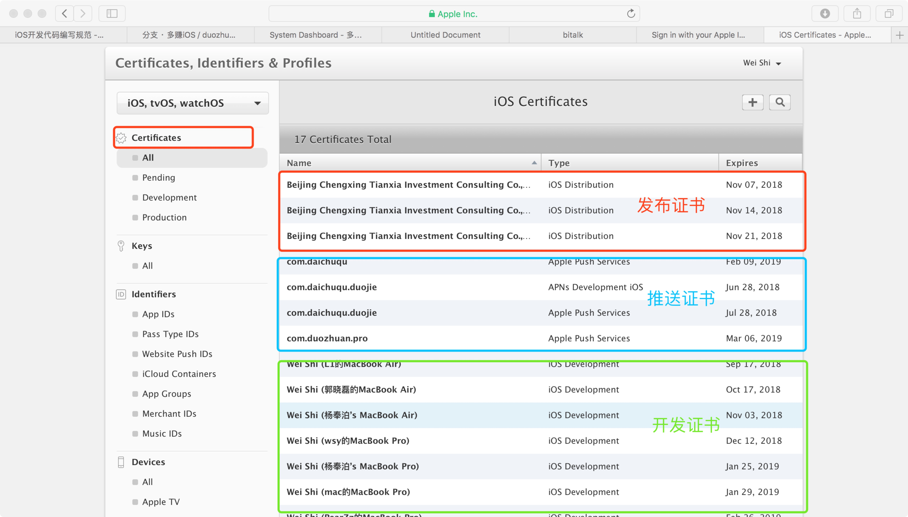
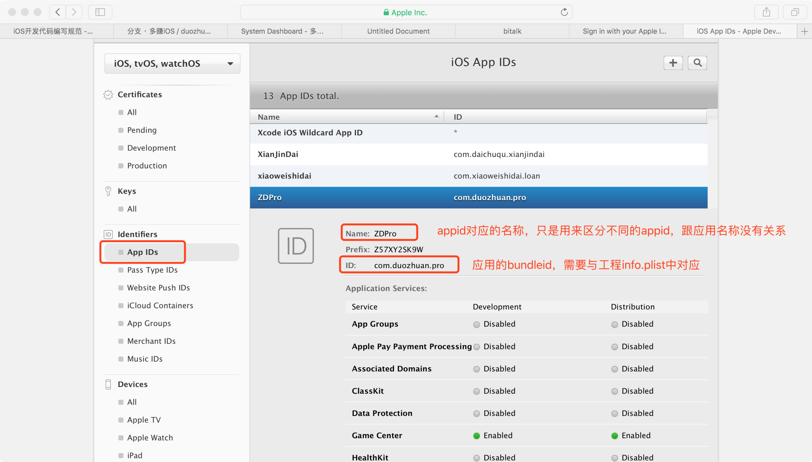

# iOS App 上线流程
## 苹果开发者账号相关
iOS App 的上线离不开苹果的开发者账号体系，下面先来介绍几个概念。

### Certificates, Identifiers & Profiles
这是我们配置证书，appid 以及配置文件的地方。

#### Certificates
这是开发过程中需要的相关证书配置的地方。

如图所示证书的分为以下三种

1. 发布证书

	发布证书又称为生产证书，是发布应用二进制文件到 iTunes Connect 上时必须配置的证书。它起到的作用就是验证发布者当前的机器有发布权限。需要注意的是直接 download 下来的发布证书并不能直接使用，如果需要在当前机器上发布的话需要 rework 掉之前的发布证书，而且 rework 掉并不会影响到 iTunes Connect 上已经上线的 App。
	
	（之前手动管理证书的时候一个开发者账号只能有一个发布证书。后来一直用的 XCode 自动管理签名，会莫名其妙的多出来几个发布证书，不知道是什么情况🤔。）
2. 开发证书
	
	开发证书又称为调试证书，是调试用的证书。没有的话本地机器就无法进行调试。它也是跟机器绑定的，不需要的可以 rework 掉。
3. 推送证书

	推送证书就是苹果的推送服务 APNs 需要的证书，一般情况下是推送服务器或者第三方推送平台需要的。它也分为生产环境的证书和开发环境的证书。
	
	1. 开发环境
	
		就如同字面意思，这是线上环境的推送证书。
	2. 生产环境

		这是测试环境的推送证书。需要注意的是苹果的推送测试环境称为沙盒环境，服务质量不是很好，经常会有收不到的情况。
		
	在 iOS9 的时候苹果推出了另外一种证书 `Apple Push Notification service SSL (Sandbox & Production)`, 也就是说用着一种证书就可以了，不用再区分测试和线上环境。不过感觉还是别用这种证书了，还是要确保开发和生产环境分离开比较好控制。
	
#### Identifiers
配置应用的地方

这个 appid 与工程一一对应。创建的时候需要明确名称和 bundle id 。一些 App 的功能比如 推送，applepay 等都需要在这里配置。

#### Profiles
配置文件配置的地方。个人感觉所谓配置文件其实就是 XCode 用来配置项目工程时候需要用到的文件，没有配置文件的话 XCode 就无法联系证书和项目的关系。比如手动配置的时候需要确保发布的配置文件及调试的配置文件，配置文件出错的话就没法收到推送了。现在的话还是建议使用 XCode 的自动管理来自动配置。

### iTunes Connect
我们可以通过这里来发布 App 、查看 App 的销售情况、应用内测邀请等功能。

最为常用就是发布 App 这个功能了。当要发布一个新的 App 时需要点击我的应用里面左上角的加号进行添加。对于已经上线的 App 要发布新版的时候点击应用图标然后点击添加新版即可。

发布新版的时候有几个地方需要注意的。

1. 屏幕快照

	这个会显示在 App Store 上的介绍中，目前只需要提供 iPhoneX 和 iPhone Plus 对于尺寸就行了，小于 iPhone Plus 的尺寸可以使用 iPhone Plus 的图片自动剪裁到合适的尺寸。
	
2. 新版升级说明

	说明新版功能的文字，每次发版前需要产品提供。
	
3. 关键字

	用户搜索 App 时能匹配到的关键字，关键字之间使用半角的分号分割。
	
4. 构建版本

	可以通过 XCode 和 application loader 来提交，速度都差不多。需要注意的是提交后需要等半个小时到多个小时不等的时间 iTunes Connect 才能看到提交的二进制文件。o(一︿一+)o
	
5. 广告标识符

	需要根据是否使用苹果的广告标识符来确定，一般情况下本地代码不会使用，但是一些第三方的 SDK 可能会使用。解决办法就是引入不含广告标识符的版本，或者在提交审核的时候选着正确的保证选项（勾选最下面的三个选项）。

6. 是否使用加密以及加密技术是否符合美帝出口标准

	根据项目中使用的技术选择即可，没有就选否，有的话就全部选是（即符合标准）。
	
## 上线流程
了解过上面的信息之后我们可以整理出上线的基本流程。
### 1. 代码检查
1. api 检查

2. 第三方 SDK appkey 检查

	检查 AppKey.h 文件下的 QQ、微信、 微博、极光推送的 key 的配置是否正确。
	
3. 版本号及build编号检查

	build 号建议直接取整数，比如 1 或者 5 等等。这个只跟提交到 iTunes connect 的构建版本有关，发布新版的时候从新从 1 开始取。
4. url_schame 检查

	这个主要是用来进行 App 之间的跳转用的，一般不会修改，安全起见发版前还是需要查看一下。防止上线以后跳转失败。

### 2. 配置检查
当手动管理签名的时候需要配置好对应的证书及配置文件。

1. 新应用上线
	
	1. 在开发者中心创建一个有意义的 App id，填入对应的 bundle id。
	2. 如果新应用需要推送的话，在对应 app id 内部，编辑推送相关信息。添加生产环境和测试环境的推送证书。
	3. 为对应 app id 创建配置文件，包括测试的和发布的配置文件。
	4. down 下来配置文件之后安装到 XCode 中，然后在签名配置中选择对应的配置文件。
2. 新版上线

	新版上线的话说明已经存在对应的配置文件，直接 down 下来安装就行。

提示： 现在 XCode 的自动签名还是很好用的，建议配置好 app id 和推送证书之后选择自动签名来减少工作量

### 3. App 上传
项目配置完成之后就可以打包上传到 App Store 了。按照提示一步一步来就行了。上传的同时我们还需要在 iTunes Connect 中进行相关的配置。

1. 新应用上线
	
	1. 首先在 iTunes Connect 中创建新的应用。
		1. 需要注意的是在 iTunes Connect 中的应用名称并不是应用安装到手机上的显示的名字，因此可以填多一些的介绍性文字方便用户了解 App。
		2. 创建的时候需要填一个叫 SKU 的标识，一般情况下直接填bundle id 就行，这个主要是来做应用的唯一标识用的。
	2. 创建完应用之后填写一些资料，比如屏幕快照、应用介绍、联系方式、测试账号等等信息。
	3. 点击提交审核后再对广告标识符及加密技术做出相应的保证之后就可以正式提交审核了。
2. 新版上线

	与新应用上线不同的是新版本上线只需要添加一个新版本，然后相关资料会继承自上个版本，只需要修改新版本更新提示及选择新的构建版本后就能进行提交了。
	
### 4. App 审核

- App 在等待审核过程中可以修改除二进制文件之外的任何描述信息，审核过了之后就不能再修改了。
- 审核被拒的情况下可以先看下审核人员提供的截图，然后排查问题。可以直接通过中文跟他们进行交流。有些时候确定不是我们代码的问题的时候可以请他们从新审核。
- 用户登录注册的时候需要提供用户隐私及用户权利义务等相关说明文档，不提供的话可能悲剧。
- 涉及到视频音像等可能产生版权纠纷的问题时需要额外提供相关版权证明，比如对于应用中存在的视频声明拥有其版权。对于一些下载文件的操作可以通过上线前隐去，上线后打开的操作规避审核。
- 支付相关业务的时候尽量使用第三方支付，如果存在用户充值等业务时需要介入 Apple Pay。（两年前还是可以不使用 Apple Pay，最近貌似必须接入，不然审核不让通过）。
