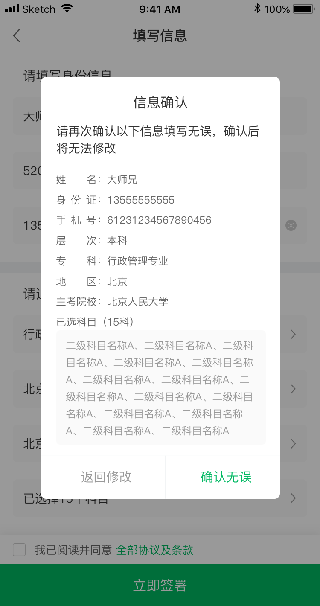

# View
## RCHtmlView
### ParseHtmlModel

```
- (instancetype)initWithContentString:(NSString *)contentString maxWidth:(CGFloat)maxWidth imageArray:(NSArray *)imageArray;
- (instancetype)initWithContentString:(NSString *)contentString maxWidth:(CGFloat)maxWidth lineHeightMultiplier:(CGFloat)lineHeightMultiplier imageArray:(NSArray *)imageArray;

- (void)reloadWithContentString:(NSString *)contentString;
```

### RCHtmlView

```
- (void)reloadWithModel:(ParseHtmlModel *)model;
```
## HKAlertView




## InfiniteTree
[https://github.com/hnxczk/InfiniteTree](https://github.com/hnxczk/InfiniteTree)
# Category
## UIResponder+FirstResponder

```
+ (id)getCurrentFirstResponder;
```

## UIScrollView+AutoAdjustWhileEdit

[https://github.com/hnxczk/ScrollViewAutoAdjust](https://github.com/hnxczk/ScrollViewAutoAdjust)

## NSDate+Date

```
+ (NSString *)dateStringSince1970WithDateFormat:(NSString *)
dateFormat interval:(NSInteger)interval;
```
## NSString+StringDrawing

```
- (CGSize)sizeWithFont:(UIFont *)font constrainedToSize:(CGSize)size;
- (CGSize)sizeWithFont:(UIFont *)font constrainedWidth:(CGFloat)width;
- (CGSize)sizeWithFont:(UIFont *)font;
```

