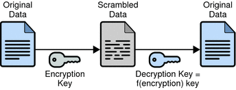
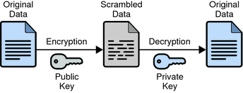
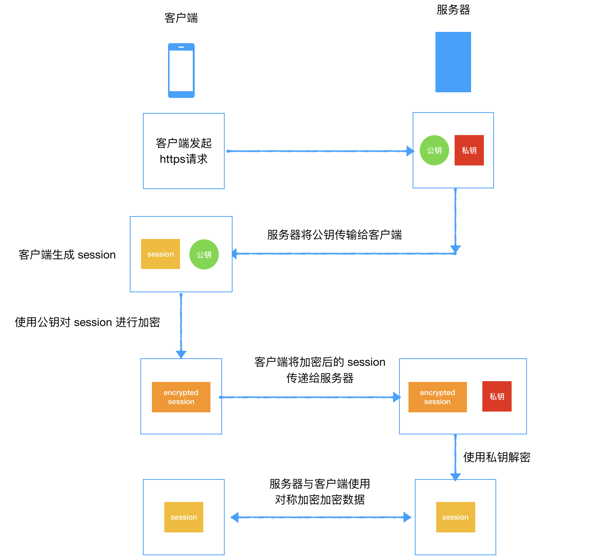

## HTTPS

### HTTP 的缺点

- 通信使用明文(不加密)，内容可能会被窃听 
- 不验证通信方的身份，因此有可能遭遇伪装 
- 无法证明报文的完整性，所以有可能已遭篡改

HTTP 中的内容是明文传输的，而在传输的过程中会经过很多的物理节点。比如路由器、wifi 热点、通信服务运营商等等。因此任何一个节点都可以窃听传输的内容。另外还可以篡改传输的信息而不被双方察觉。这种就是所谓的中间人攻击了。

由于 HTTP 有以上的缺点，就出现了 HTTPS。通过使用加密，HTTPS 不仅能保证密文传输，重要的是还可以做到验证通信方的身份，保证报文的完整性。完美的解决了 HTTP 在安全性上的三大缺陷。

### 加密

根据加密解密的密钥是否相同分为对称加密和非对称加密。

#### 1. 对称密钥加密

（Symmetric-Key Encryption），加密的加密和解密使用同一密钥。

- 优点：运算速度快；
- 缺点：密钥容易被获取。

看起来，这是个很好的方案，但是这里面最大的问题就是**秘钥如何只让传输的双方知晓，同时不被别人知道**。

如果秘钥在传输的过程中被劫持了怎么办呢？这样它就能对内容进行解密了，结果就是加密了跟不加密的效果是一样的。

针对这样的情况，出现了公开密钥加密，也叫非对称加密。

#### 2. 非对称加密

（Public-Key Encryption）非对称加密使用一对密钥用于加密和解密，分别为公开密钥和私有密钥。公开密钥所有人都可以获得，通信发送方获得接收方的公开密钥之后，就可以使用公开密钥进行加密，接收方收到通信内容后使用私有密钥解密。

- 优点：更为安全；
- 缺点：运算速度慢；

具体使用的时候就是服务器先把公钥直接明文传输给客户端，之后客户端向服务器传数据前都先用这个公钥加密好再传，这条数据的安全似乎可以保障了！因为只有服务器有相应的私钥能解开这条数据。

然而由服务器到浏览器的这条路怎么保障安全？如果服务器用它的的私钥加密数据传给浏览器，那么浏览器用公钥可以解密它，而这个公钥是一开始通过明文传输给浏览器的，这个公钥被谁劫持到的话，他也能用该公钥解密服务器传来的信息了。所以这似乎只能保证由浏览器向服务器传输数据时的安全性。

另外由于非对称加密的算法非常耗时，特别是加密解密一些较大数据的时候有些力不从心。

#### 3. HTTPS 采用的加密方式

HTTPS 采用混合的加密机制，使用非对称加密用于传输对称密钥，之后使用对称密钥加密进行通信。这样就减少了非对称加密的次数，提高了性能。

过程如下图

  

通过混合加密的机制提高了性能，但是有个关键的问题还是没有解决。那就是服务器将公钥传递给客户端的时候，这个公钥有可能被伪造。为了解决这个问题，出现了数字证书。

#### 4. 数字证书

在使用 HTTPS 前，需要向“CA机构”申请颁发一份数字证书，数字证书里有证书持有者、证书持有者的公钥等信息，服务器把证书传输给客户端，客户端从证书里取公钥就行了，证书就如身份证一样，可以证明“该公钥对应该网站”。

为了防止证书被篡改，证书在生成的过程中进行了数字签名。具体流程如下。

  

验证过程如下

  

这样以来假设中间人篡改了证书的原文，由于他没有 CA 机构的私钥，所以无法得到此时加密后签名，无法相应地篡改签名。客户端收到该证书后会发现原文和签名解密后的值不一致，则说明证书已被篡改，证书不可信，从而终止向服务器传输信息，防止信息泄露给中间人。

## 引用

1. [HTTP](https://github.com/CyC2018/Interview-Notebook/blob/master/notes/HTTP.md)
2. [彻底搞懂 HTTPS 的加密机制](https://zhuanlan.zhihu.com/p/43789231)
3. [HTTPS 温故知新](https://halfrost.com/https-begin/#7iosats)
