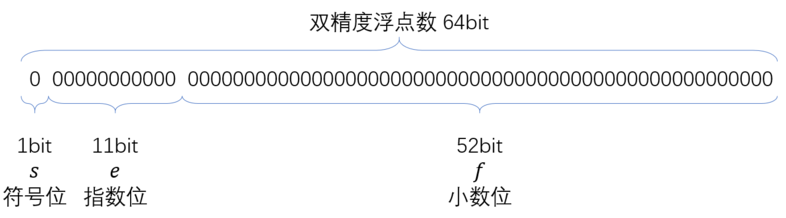

# 类型

在 JavaScript 规范中，共定义了七种数据类型，分为 “基本类型” 和 “引用类型” 两大类，如下所示：

基本类型：Undefined、Null、Boolean、String、Number、Symbol

引用类型：Object

## 1. 基本类型和引用类型的区别

### 1.1 不可变性
基本类型，在 ECMAScript 标准中，它们被定义为 `primitive values` ，即原始值，代表值本身是不可被改变的。

基本类型的值被直接存储在栈中，在变量定义时，栈就为其分配好了内存空间。由于栈中的内存空间的大小是固定的，那么注定了存储在栈中的变量就是不可变的。

以字符串为例，我们在调用操作字符串的方法时，没有任何方法是可以直接改变字符串的。对其修改也只是修改变量指向的值，而值的本身是不课改变的。

```
let str = 'str'
str += '1'
console.log(str);  // str1
```

在上面的代码 `str` 是变量名，`'str'` 则是一个 String 类型的值，通过 `+=` 这个操作符会将一个新的 String 类型的值 `'str1'` 赋值给 `str` 这个变量。值本身是没有改变的。

引用类型的值实际存储在堆内存中，它在栈中只存储了一个固定长度的地址，这个地址指向堆内存中的值。因此引用类型的值是可以修改的。

### 1.2 复制

基本类型在复制的时候，会在栈中开辟一个新的内存空间来存储复制出来的值。这样以来二者指向的内存空间完全不同，这两个变量的操作就互不影响。

当我们复制引用类型的变量时，实际上复制的是栈中存储的地址，因此复制出来的变量实际上和之前的变量指向堆中同一个对象。这样以来操作会相互影响。

### 1.3 比较

对于原始类型，比较时会直接比较它们的值，如果值相等，即返回 true。

对于引用类型，比较时会比较它们的引用地址，即使两个变量在堆中存储的对象具有的属性值都是相等的，但是它们被存储在了不同的存储空间，因此比较值为 false。 

### 1.4 值传递和引用传递

> 所有的函数的参数都是按值传递的。

当函数参数是值类型的时候，修改函数参数的值是不能修改外部值。

当函数参数是引用类型时，我们同样将参数复制了一个副本到局部变量，只不过复制的这个副本是指向堆内存中的地址而已，我们在函数内部对对象的属性进行操作，实际上和外部变量指向堆内存中的值相同，但是这并不代表着引用传递，依然是值传递。

## 2. Undefined

### 2.1 语义

表示一个变量最原始的状态，代表未定义的值，而非人为操作的结果

### 2.2 本质

undefined 是全局对象的一个属性。也就是说，它是全局作用域的一个变量，并非一个关键字。

### 2.3 获取 undefined

- 变量被声明了，但没有赋值时，就等于 undefined。
- 调用函数时，应该提供的参数没有提供，该参数等于 undefined。
- 对象没有赋值的属性，该属性的值为 undefined。
- 函数没有返回值时(没有写 return 或者 return 后面没有东西)，默认返回 undefined。

### 2.4 void 0 代替 undefined

void 操作符 对任何表达式求值都返回 undefined ，这和函数执行操作后没有返回值的作用是一样的，JavaScript 中的函数都有返回值，当没有 return 操作时，就默认返回一个原始的状态值，这个值就是 undefined，表明函数的返回值未被定义。

undefined 是一个变量而不是关键字，为了避免被篡改一般使用 void 0 来获取 undefined 值。

## 3. Null

### 3.1 语义

表示一个对象被人为的重置为空对象，而非一个变量最原始的状态。它只有一个值，即 null。

### 3.2 本质

null 在内存里的表示栈中的变量没有指向堆中的内存对象。当一个对象被赋值了 null 以后，原来的对象在内存中就处于游离状态，GC 会择机回收该对象并释放内存。因此，如果需要释放某个对象，就将变量设置为 null，即表示该对象已经被清空，目前无效状态。

### 3.3 `typeof null == 'object'`

typeof 会将 null 误判为 Object 类型。

这是因为数据类型在底层都是以二进制形式表示的，二进制的前三位为 0 会被 typeof 判定为对象类型。

- 000 - 对象，数据是对象的应用
- 1 - 整型，数据是31位带符号整数
- 010 - 双精度类型，数据是双精度数字
- 100 - 字符串，数据是字符串
- 110 - 布尔类型，数据是布尔值

null 值的二进制表示全是 0 ，自然前三位当然也是 000，因此，typeof 会误以为是对象类型。

### 3.4 null 和 undefined 的区别

null 表示无值,即该处不应该有值，也没有指向任何对象或者任何值，而 undefined 表示缺少值,表示应该有值，但是还没有定义，所以先指向全局变量 window.undefined 或者 undefined 来代替那个还没有定义的值。

使用 == 只判断值的时候，null 和 undefined 是一样的，但是使用 === 的时候，需要做类型判断，null 的类型为 Null, undefined 的类型为 Undefined

## 4. Boolean

### 4.1 语义

表示逻辑上的真和假，它有两个值 true 和 false

### 4.2 转化

在 JavaScript 中，所有类型的值都可以转化为与 Boolean 等价的值。转化规则如下：

1. 所有对象都被当作 true
2. 空字符串被当作 false
3. null 和 undefined 被当作 false
4. 数字 0 和 NaN 被当作 false 
5. 出去 2，3，4 之外的值类型都被当做 true

只推荐使用 Boolean() 转换函数。

### 4.3 返回 Boolean 的操作符

#### 4.3.1 关系操作符：>，>=，<，<=

> 当关系操作符的操作数使用了非数值时，要进行数据转换或完成某些奇怪的操作。

- 如果两个操作数都是数值，则执行数值比较。
- 如果两个操作数都是字符串，则逐个比较两者对应的字符编码(charCode)，直到分出大小为止 。
- 如果操作数是其他基本类型，则调用 Number() 将其转化为数值，然后进行比较。
- NaN 与任何值比较，均返回 false 。
- 如果操作数是对象，则调用对象的 valueOf 方法（如果没有 valueOf ，就调用 toString 方法），最后用得到的结果，根据前面的规则执行比较。 

#### 4.3.2 相等操作符： ==，!=，===，!==

如果两个操作数类型相同则 == 和 != 跟 === 和 !== 是等价的。 

> == 和 != 操作符都会先转换操作数，然后再比较它们的相等性。

- 如果有一个操作数是布尔值，则在比较相等性之前，先调用 Number() 将其转换为数值；
- 如果一个操作数是字符串，另一个操作数是数值，在比较相等性之前，先调用 Number() 将字符串转换为数值；
- 如果一个操作数是对象，另一个操作数不是，则调用对象的 valueOf() 方法，用得到的基本类型值按照前面的规则进行比较；
- null 和 undefined 是相等的。在比较相等性之前，不能将 null 和 undefined 转换成其他任何值。
- 如果有一个操作数是 NaN，则相等操作符返回 false，而不相等操作符返回 true；
- 如果两个操作数都是对象，则比较它们的指针地址。如果都指向同一个对象，则相等操作符返回 true；否则，返回 false。

> === 和 !== 操作符最在比较之前不转换操作数

- ===： 类型相同，并且值相等，才返回 true ，否则返回 false 。
- !== ： 类型不同，或者值不相等，就返回 true，否则返回 false 。

#### 4.3.3 逻辑操作符： &&，||，!

> 逻辑与 `&&` 和 逻辑或 `||` 返回的不一定是布尔值，而是包含布尔值在内的任意类型值。

逻辑操作符属于短路操作符 。在进行计算之前，会先通过 Boolean() 方法将两边的分项转换为布尔值，然后分别遵循下列规则进行计算：

- `&&`：从左到右检测每一个分项，返回第一个布尔值为 false 的分项，并停止检测 。如果没有检测到 false 项，则返回最后一个分项。
- `||`：从左到右检测每一个分项，返回第一个布尔值为 true 的分项，并停止检测 。如果没有检测到 true 项，则返回最后一个分项。

> 布尔操作符 `!` 其求值过程如下

1. 对分项求值，得到一个任意类型值；
2. 使用 Boolean() 把该值转换为布尔值 true 或 false；
3. 对布尔值取反，即 true 变 false，false 变 true

> 利用 `!` 的取反的特点，使用 `!!` 可以很方便的将一个任意类型值转换为布尔值

#### 4.3.4 条件语句：if，while，?

1. 对表达式求值，得到一个任意类型值
2. 使用 Boolean() 将得到的值转换为布尔值 true 或 false

## 5. String

### 5.1 语义

String 类型是零个或多个 16 位无符号整数值（“元素”）的所有有序序列的集合，最大长度为 2^53-1 个元素。 String 类型通常用于表示正在运行的程序中的文本数据，在这种情况下，String 中的每个元素都被视为 UTF-16 代码单元值。每个元素被视为占据序列内的位置。这些位置用非负整数索引。第一个元素（如果有）位于索引 0，索引为 1 的下一个元素（如果有），依此类推。 String 的长度是其中的元素数（即 16 位值）。

### 5.2 Unicode

现行的字符集国际标准，字符是以 Unicode 的方式表示的，每一个 Unicode 的码点表示一个字符，理论上, Unicode 的范围是无限的。UTF 是 Unicode 的编码方式，规定了码点在计算机中的表示方法，常见的有 UTF16 和 UTF8。 Unicode的码点通常用 U+??? 来表示，其中 ??? 是十六进制的码点值。 0-65536（U+0000 - U+FFFF）的码点被称为基本字符区域（BMP）。

> UTF-16 比较好理解,就是任何字符对应的数字都用两个字节来保存.我们通常对 Unicode 的误解就是把 Unicode 与 UTF-16 等同了.但是很显然如果都是英文字母这做有点浪费.明明用一个字节能表示一个字符为啥整两个啊.
>
> 于是又有个 UTF-8,这里的 8 非常容易误导人,8 不是指一个字节,难道一个字节表示一个字符?实际上不是.当用 UTF-8 时表示一个字符是可变的,有可能是用一个字节表示一个字符,也可能是 两个,三个.当然最多不能超过 3个字节了.反正是根据字符对应的数字大小来确定.
>
> 于是 UTF-8 和 UTF-16 的优劣很容易就看出来了.如果全部英文或英文与其他文字混合,但英文占绝大部分,用 UTF-8 就比 UTF-16 节省了很多空间.而如果全部是中文这样类似的字符或者混合字符中中文占绝大多数. UTF-16 就占优势了,可以节省很多空间.
>
> [来源](https://www.cnblogs.com/kingcat/archive/2012/10/16/2726334.html)

### 5.3 String 对象

在 JavaScript 中，字符串是基本数据类型，本身不存任何操作方法 。为了方便的对字符串进行操作，JavaScript 提供了一个 String 类型对象：String 对象 。它是一种特殊的引用类型，JS 引擎每当读取一个字符串的时候，就会在内部创建一个对应的 String 对象，该对象提供了很多操作字符的方法，这就是为什么能对字符串调用方法的原因 。

### 5.4 String 对象的常见方法

- 字符操作：charAt，charCodeAt，fromCharCode
- 字符串提取：substr，substring ，slice
- 位置索引：indexOf ，lastIndexOf
- 大小写转换：toLowerCase，toUpperCase
- 模式匹配：match，search，replace，split
- 其他操作：concat，trim，localeCompare

charCodeAt 的作用是获取字符的 Unicode 编码，俗称 “Unicode 码点”。通过 charCodeAt 获取字符的 Unicode 编码，然后再把这个编码转化成二进制，就可以得到该字符的二进制表示。

```
var a = 'a';
var code = a.charCodeAt(0); // 97
code.toString(2); // 1100001
```

fromCharCode 是 String 对象上的静态方法，作用是根据 Unicode 编码返回对应的字符。

```
substring(start [, end])
```
substring 截取字符串的某个 start 位置到某个 end 位置（但 end 位置的字符不包括在结果中）的子串，如果没有第 2 个 end 参数，直到字符串末尾。参数只接受正数和 0，把负数或其它无效的数当作 0。

```
substr(start [, length])
```
substr 截取字符串的某个 start 位置起，数 length 个长度的字符才结束。如果没有第 2 个参数，直到字符串末尾。可以接受 “负数”，表示从字符串尾部开始计数。

```
slice(start [, end])
```
slice 与 substring 基本相同，不同的是参数能接受 “负数”，表示从结尾开始计数。

## 6. Number

### 6.1 表示方式

JavaScript 中的数字类型只有 Number 一种，Number 类型采用 IEEE754 标准中的 “双精度浮点数” 来表示一个数字，不区分整数和浮点数 。所以，1与1.0是相同的，是同一个数。

### 6.2 存储方式

在 IEEE754 中，双精度浮点数采用 64 位存储，即 8 个字节表示一个浮点数 。其存储结构如下图所示：



指数位可以通过下面的方法转换为使用的指数值：


### 6.3 数值范围

从存储结构中可以看出， 指数部分的长度是11个二进制，即指数部分能表示的最大值是 2047（211-1），取中间值进行偏移，用来表示负指数，也就是说指数的范围是 [-1023,1024] 。因此，这种存储结构能够表示的数值范围为 21024 到 2-1023 ，超出这个范围的数无法表示 。21024  和 2-1023  转换为科学计数法如下所示：

```
1.7976931348623157 × 10308

5 × 10-324
```

因此，JavaScript 中能表示的最大值是 1.7976931348623157 × 10308，最小值为 5 × 10-324 。分别对应 Number 对象的 MAX_VALUE 属性和 MIN_VALUE 属性。

如果一个数大于等于 2 的 1024 次方，那么就会发生“正向溢出”，即 JavaScript 无法表示这么大的数，这时就会返回 Infinity。

如果一个数小于等于 2 的 -1075 次方（指数部分最小值 -1023，再加上小数部分的 52 位），那么就会发生为“负向溢出”，即 JavaScript 无法表示这么小的数，这时会直接返回 0。

### 6.4 精度丢失

计算机中的数字都是以二进制存储的，如果要计算 0.1 + 0.2 的结果，计算机会先把 0.1 和 0.2 分别转化成二进制，然后相加，最后再把相加得到的结果转为十进制 。

但有一些浮点数在转化为二进制时，会出现无限循环 。这时候为了表示该数会最末尾出进行 0 舍 1 入。最终导致精度丢失。

因此非整数的 Number 类型无法用==（===也不行） 来比较，因为有可能会发生精度丢失。

精度丢失解决：正确的比较浮点数的方法是，检查等式左右两边差的绝对值是否小于最小精度。

```
console.log( Math.abs(0.1 + 0.2 - 0.3) <= Number.EPSILON);  // true
```

### 6.5 特殊数值

- Number.MAX_VALUE：JavaScript 中的最大值
- Number.MIN_VALUE：JavaScript 中的最小值
- Number.MAX_SAFE_INTEGER：最大安全整数，为 253-1
- Number.MIN_SAFE_INTEGER：最小安全整数，为 -(253-1)（在安全整数范围内不会出现精度丢失（小数除外））
- Number.POSITIVE_INFINITY：对应 Infinity，代表正无穷
- Number.NEGATIVE_INFINITY：对应 -Infinity，代表负无穷
- Number.EPSILON：是一个极小的值，用于检测计算结果是否在误差范围内
- Number.NaN：表示非数字，NaN 与任何值都不相等，包括 NaN 本身
- Infinity：表示无穷大，分 正无穷 Infinity 和 负无穷 -Infinity

指数部分为 2^11 – 1 且小数部分全 0，这个数字是 ±∞。（符号位决定正负，代表正无穷 Infinity 和 负无穷 -Infinity）

指数部分为 2^11 – 1 且小数部分非全0，这个数字是 NaN。它不是一个值，而是一批值。这也就解释了为什么 `NaN != NaN`。

### 6.6 数值转换

#### 6.6.1 Number()

对于不同数据类型的转换，Number() 的处理也不尽相同，其转换规则如下:

- 如果是 Boolean 值，true 和 false 将分别被转换为 1 和 0。 
- 如果是数字值，只是简单的传入和返回。
- 如果是 null 值，返回 0。
- 如果是 undefined，返回 NaN。
- 如果是字符串，遵循下列规则：
    - 如果字符串中只包含数字(包括前面带正号或负号的情况)，则将其转换为十进制数值; 
    - 如果字符串中包含有效的浮点格式，则将其转换为对应的浮点数值; 
    - 如果字符串中包含有效的十六进制格式，则将其转换为相同大小的十进制整数值; 
    - 如果字符串是空的(不包含任何字符)，则将其转换为 0; 
    - 如果字符串中包含除上述格式之外的字符，则将其转换为 NaN。
- 如果是对象，则调用对象的 valueOf() 方法，然后依照前面的规则转换返回的值。如果转换的结果是 NaN，则调用对象的 toString() 方法，然后再次依照前面的规则转换返回的字符串值。

#### 6.6.2 parseInt() 和 parseFloat()

parseInt() 只支持 16 进制的前缀 “0x”, 不支持其他进制。而且会忽略非数字字符。

parseFloat() 直接把原字符串作为十进制来解析。

他们都不支持科学计数法表示的字符串。

## 7. Symbol

### 7.1 语义

Symbol 是 ES6 新增的一种原始数据类型，它的字面意思是：符号、标记。代表独一无二的值 。

### 7.2 初始化

和其他基本类型不同的是，Symbol 作为基本类型，没有对应的包装类型，也就是说 Symbol 本身不是对象，而是一个函数。因此，在生成 Symbol 类型值的时候，不能使用 new 操作符 。

Symbol 函数可以接受一个字符串作为参数，表示对 Symbol 值的描述，当有多个 Symbol 值时，比较容易区分。

有时，我们希望重新使用同一个 Symbol 值，Symbol.for 方法可以做到这一点。它接受一个字符串作为参数，然后全局搜索有没有以该参数作为名称的 Symbol 值。如果有，就返回这个 Symbol 值，否则就新建并返回一个以该字符串为名称的 Symbol 值。

Symbol.for() 也可以生成 Symbol 值，它 和 Symbol() 的区别是：

- Symbol.for() 首先会在全局环境中查找给定的 key 是否存在，如果存在就返回，否则就创建一个以 key 为标识的 Symbol 值
- Symbol.for() 生成的 Symbol 会登记在全局环境中供搜索，而 Symbol() 不会。
- Symbol.for()  永远搜索不到 用 Symbol() 产生的值。

### 7.3 Symbol 特性

Symbol 作为属性名，该属性不会出现在 for...in、for...of 循环中，也不会被 Object.keys()、Object.getOwnPropertyNames()、JSON.stringify() 返回。但是，它也不是私有属性，有一个 Object.getOwnPropertySymbols() 方法，专门获取指定对象的所有 Symbol 属性名。

## 8. Object

### 8.1 语义

ECMA262 把对象定义为：无序属性的集合，其属性可以包含基本值、对象或者函数。

### 8.2 对象拷贝

由于引用类型的变量只存指针，而对象本身存储在堆中 。因此，当把一个对象赋值给多个变量时，就相当于把同一个对象地址赋值给了每个变量指针 。这样，每个变量都指向了同一个对象，当通过一个变量修改对象，其他变量也会同步更新。

#### 8.2.1 浅拷贝

ES6 提供了一个原生方法用于对象的拷贝，即 Object.assign() 。

需要注意的是，Object.assign() 拷贝的是属性值。当属性值是基本类型时，没有什么问题 ，但如果该属性值是一个指向对象的引用，它也只能拷贝那个引用值，而不会拷贝被引用的那个对象。

#### 8.2.2 深拷贝

深拷贝指的是彻底的拷贝一个对象作为副本，两者之间的操作相互不受影响，可以通过 JSON 的序列化和反序列化方法来实现 。

## 9. 类型转化

### 9.1 装箱和拆箱

了解装箱拆箱之前需要先了解包装类型。

Number、String、Boolean、Symbol 这些基本类型都有对应的包装类型。我们使用这些基本类型调用方法的时候，就会自动进行装箱和拆箱操作。

基本包装类型是一种特殊的引用类型。它和普通引用类型有一个很重要的区别，就是对象的生存期不同 。使用 new 操作符创建的引用类型的实例，在执行流离开当前作用域之前都一直保存在内存中。而自动创建的基本包装类型的对象，则只存在于一行代码的执行瞬间，然后立即被销毁。

#### 9.1.1 装箱转换：把基本类型转换为对应的包装类型

装箱转换会在我们利用基本类型调用方法的时候自动发生。

使用内置的 Object 函数，我们可以在 JavaScript 代码中显式调用装箱能力。

```
    var symbolObject = Object(Symbol("a"));

    console.log(typeof symbolObject); //object
    console.log(symbolObject instanceof Symbol); //true
    console.log(symbolObject.constructor == Symbol); //true
```

装箱机制会频繁产生临时对象，在一些对性能要求较高的场景下，我们应该尽量避免对基本类型做装箱转换。

#### 9.1.2 拆箱操作：把引用类型转换为基本类型

从引用类型到基本类型的转换，也就是拆箱的过程中，会遵循 ECMAScript 规范规定的 toPrimitive 原则，一般会调用引用类型的 valueOf 和 toString 方法，你也可以直接重写 toPeimitive 方法。一般转换成不同类型的值遵循的原则不同，例如：

- 引用类型转换为 Number 类型，先调用 valueOf，再调用 toString
- 引用类型转换为 String 类型，先调用 toString，再调用 valueOf

若valueOf和toString都不存在，或者没有返回基本类型，则抛出TypeError异常。

我们可以直接调用包装类型的valueOf或toString，实现拆箱操作。

### 9.2 隐式类型转换

#### 9.2.1 规则


#### 9.2.2 各种运算符

我们在对各种非 Number 类型运用数学运算符 `(- * /)` 时，会先将非Number类型转换为 Number 类型;

注意 `+` 是个例外，执行 `+` 操作符时：

- 1.当一侧为 String 类型，被识别为字符串拼接，并会优先将另一侧转换为字符串类型。
- 2.当一侧为 Number 类型，另一侧为原始类型，则将原始类型转换为 Number 类型。
- 3.当一侧为 Number 类型，另一侧为引用类型，将引用类型和 Number 类型转换成字符串后拼接。

其他运算符涉及的类型转换可以查看上面的相关总结。

## 10. 参考

1. [细说 JavaScript 七种数据类型](https://www.cnblogs.com/onepixel/p/5140944.html)
2. [【JS 进阶】你真的掌握变量和类型了吗](https://juejin.im/post/5cec1bcff265da1b8f1aa08f)
3. [JS 教程](https://js-tutorial.readthedocs.io/zh/latest/index.html)

