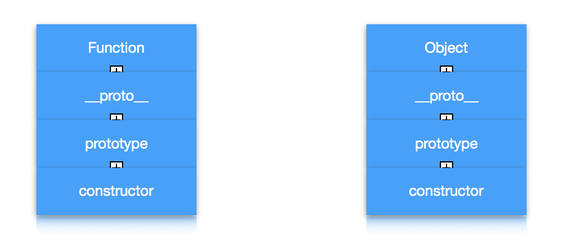
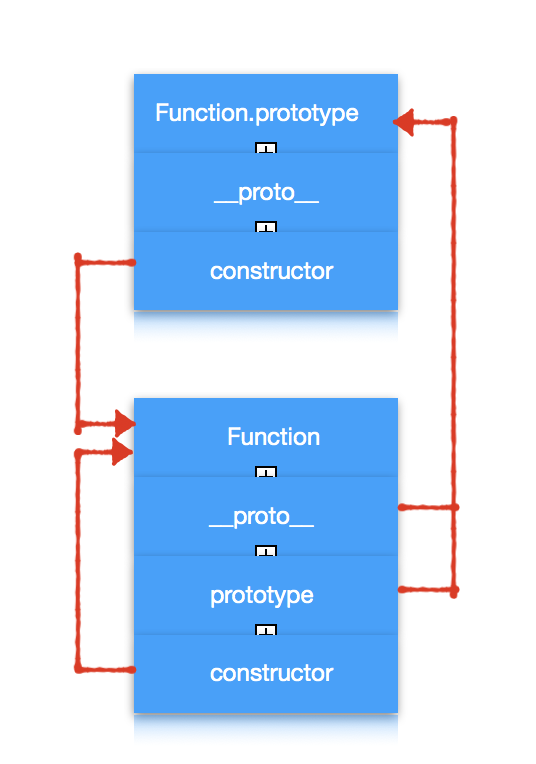
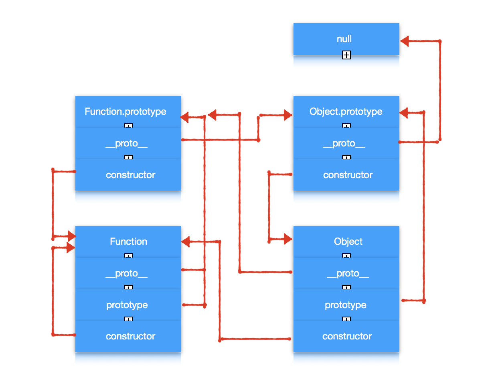

# 对象

## 基于类和基于原型

我们都知道 JavaScript 是一个面向对象的语言，但是它却没有其他诸如 Java、C++ 这些面向对象的语言中都存在**类**的这个概念。取而代之的是**原型**的概念。这其实就是两种不同的编程范式。

1. 基于类的面向对象
   
    在这种范式中，类定义了对象的结构和行为以及继承关系，所有基于该类的对象都有**相同**的行为和结构，不同的只是他们的状态。

    创建新的对象通过类的构造器来创建。只有少数基于类的面向对象语言允许类在运行时进行修改。

2. 基于原型的面向对象

    在这种范式中，关注的是一系列对象的行为，将拥有**相似**行为的对象通过原型链串联起来。

    创建新的对象通过拓展原有对象创建。很多的基于原型的语言提倡运行时对原型进行修改。

我们可以看出来基于原型相对来说更加灵活。这也许是 JavaScript 选择基于原型构建面向对象的原因之一吧。

## 对象：无序属性的集合

ECMA262 把对象定义为：无序属性的集合，其属性可以包含基本值、对象或者函数。

```
var obj = {
    a: 5,
    b: function() {},
    c:{ d: 10 }
}
```
在上面这段代码中 基本类型 a，函数 b，对象 c 都是对象 obj 的属性。

实际上 JavaScript 中函数也可以添加属性。

```
var fun = function(){}
fun.a = 5
fun.b = function() {}
fun.c = { d: 10 }
```

因此我们可以推断出来函数也是属性的集合，它也是对象。

## 函数对象和普通对象

我们先看下面的代码。

```
typeof obj // "object"
typeof fun // "function"

obj instanceof Object // true
fun instanceof Object // true
```

我们可以得出以下结论：

1. 通过 instanceof 的结果我们确认了函数也是对象；
2. 通过 typeof 的结果我们了解了函数与普通对象是有区别的。

> 注意：由于 typeof 的设计有局限性，并不能完全反应引用类型的类型。因此在实际应用中，因此值类型的类型判断用 typeof，引用类型的类型判断用 instanceof。但是下面为了探究函数对象和普通对象的区别依然使用 typeof。

相信你一定很好奇函数对象和普通对象的区别，先别急。我们先看下面的一个例子。

```
function Fun() {
    this.a = 5
}
var fun = new Fun()

typeof Fun // "function"
typeof fun // "object"
```

我们可以看出来通过函数 `Fun` 生成了对象 `fun`。其实**所有的对象都是通过函数生成的**。你可能会提出反对意见：

```
var obj = { a: 5, b: 10 }
var fun = function(){}
```

你会说 obj 和 fun 都是对象，但他们都没有通过函数生成啊。

其实这是 JavaScript 提供的语法糖，本质上他们会分别调用 Object 和 Function （注意大写）这两个**函数对象**来生成。**每个对象**都有一个 constructor 的属性指向它的构建函数。

```
obj.constructor // ƒ Object() { [native code] }
fun.constructor // ƒ Function() { [native code] }
```

因此上面的代码等同于：

```
// var obj = { a: 5, b: 10 }
var obj = new Object()
obj.a = 5
obj.b = 10

// var fun = function(){} 
var fun = new Function()
```

到了这里引出了两个重要的函数对象 Object 和 Function。

在解释他们之前需要再在了解两个容易混淆的东西：`__proto__` 和 `prototype`。

- `prototype` 是每个**函数**都有的一个属性。它本身是一个对象，它的 constructor 指向函数本身。

- `__proto__` 是每个**对象**都有的一个属性。指向创建该对象的函数的prototype。它是个隐藏属性，早期低版本的浏览器甚至不支持这个属性。

我们先看一下 Object 和 Function 的类型。
```
typeof Function // "function"
typeof Object // "function"
```

让人意外的是他们都是函数对象，我们按照上面的说明列出他们的内存布局。

因为它们都是对象因此它们都有 `constructor`、`__proto__` 属性，又因为他们是函数对象，因此它们都有 `prototype` 属性。



对于 Function 来说

```
// 虽然 Function.prototype 返回的类型是 function 但是它的 prototype 属性并不存在，因此它是一个对象而不是函数对象。

typeof Function.prototype // "function"
typeof Function.prototype.prototype // "undefined"

// Function.prototype 与 Function.__proto__ 指向同一个对象
Function.prototype == Function.__proto__

// Function.prototype 的 constructor 是 Function 函数
Function.prototype.constructor // ƒ Function() { [native code] }

// Function 的 constructor 是 Function 函数自己（特例）
Function.constructor // ƒ Function() { [native code] }
```

可以画出下面的图



对于 Object 来说

```
// Object.prototype 是一个对象
typeof Object.prototype // "object"

// Object.__proto__ 与 Object.prototype 指向的不是同一个对象
Object.prototype == Object.__proto__ // false
// Object.__proto__ 指向 Function.prototype 的对象 （特例）
Object.__proto__ == Function.prototype // true

// Object.prototype 的 constructor 是 Object 函数
Object.prototype.constructor // ƒ Object() { [native code] }

// Object 的 constructor 是 Function 函数（特例）
Object.constructor // ƒ Function() { [native code] }
```

可以画出下面的图


我们发现还有两个属性没确定分别是 `Object.prototype.__proto__` 和 `Function.prototype.__proto__`。我们通过代码在确认一下。

```
// Function.prototype 的 __proto__ 属性指向 Object.prototype
Function.prototype.__proto__ == Object.prototype // true

// Object.prototype 的 __proto__  属性指向 null
Object.prototype.__proto__ // null
```

最终得到这个图



## 原型链

## 与原型链相关的方法

## ES5 对象继承

## ES6 实现继承

## 参考

1. []()
2. []()
3. []()
4. []()
5. []()