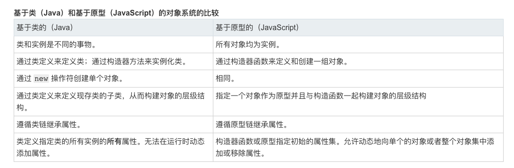

# 对象与原型链

## 基于类和基于原型

我们都知道 JavaScript 是一个面向对象的语言，但是它却没有其他诸如 Java、C++ 这些面向对象的语言中都存在**类**的这个概念。取而代之的是**原型**的概念。这其实就是两种不同的编程范式。

1. 基于类的面向对象
   
    在这种范式中，类定义了对象的结构和行为以及继承关系，所有基于该类的对象都有**相同**的行为和结构，不同的只是他们的状态。

    创建新的对象通过类的构造器来创建。只有少数基于类的面向对象语言允许类在运行时进行修改。

2. 基于原型的面向对象

    在这种范式中，关注的是一系列对象的行为，将拥有**相似**行为的对象通过原型链串联起来。

    创建新的对象通过拓展原有对象创建。很多的基于原型的语言提倡运行时对原型进行修改。

### 对比



> 图片来自 [MDN](https://developer.mozilla.org/zh-CN/docs/Web/JavaScript/Guide/Details_of_the_Object_Model#%E5%B7%AE%E5%BC%82%E6%80%BB%E7%BB%93)

总的来说基于原型相对来说更加灵活。这也许是 JavaScript 选择基于原型构建面向对象的原因之一吧。

## 对象：无序属性的集合

ECMA262 把对象定义为：无序属性的集合，其属性可以包含基本值、对象或者函数。

```
var obj = {
    a: 5,
    b: function() {},
    c:{ d: 10 }
}
```
基本类型 a，函数 b，对象 c 都是对象 obj 的属性。

实际上 JavaScript 中函数也可以添加属性。

```
var fun = function(){}
fun.a = 5
fun.b = function() {}
fun.c = { d: 10 }
```

因此函数也是属性的集合，它也是对象。

## 构造函数

‘面向对象编程’的第一步，就是要生成对象。在基于类的语言中类都有创建对象的构造函数。而在 JavaScript 中没有类，那么生成对象的工作就由函数来完成。这种函数被称为构造函数。

**所有对象**都有一个 constructor 的属性指向它的构建函数。

你可能会提出反对意见：

```
var obj = { a: 5, b: 10 }
var fun = function(){}
```

你会说 obj 和 fun 都是对象，但他们都没有通过函数生成啊。

其实这是 JavaScript 提供的语法糖，本质上他们会分别调用 Object 和 Function （注意大写）这两个**函数**来生成。

```
obj.constructor // ƒ Object() { [native code] }
fun.constructor // ƒ Function() { [native code] }
```

等同于

```
// var obj = { a: 5, b: 10 }
var obj = new Object()
obj.a = 5
obj.b = 10

// var fun = function(){} 
var fun = new Function()
```

除了 Object 和 Function 这两个函数外，你也可以自定义构造函数。函数要具备下面的特征：

- 为区别于普通函数，通常构造函数名首字母大写；
- 构造函数必须通过 new 命令调用；
- 构造函数内部使用 this 关键字，this 指向当前构造函数生成的对象；
- 构造函数没有 return，默认返回 this。

一个例子

```
function Person(name) {
    this.name = name
}
var peter = new Person('Peter')
```

其中 new 运算符都做了以下工作：

- 创建一个空对象，作为将要返回的对象实例；
- 将空对象的原型 `__proto__` 指向了构造函数的 `prototype` 属性；
- 将空对象赋值给构造函数内部的 this 关键字；
- 开始执行构造函数内部的代码；
- 如果构造器返回的是对象，则返回，否则返回第一步创建的对象。

这里出现了两个容易混淆的概念：`__proto__` 和 `prototype`。

- `__proto__` 是每个**对象**都有的一个属性。指向创建该对象的函数的 prototype。用它来产生一个链，一个原型链，用于寻找方法名或属性，等等。它是个隐藏属性，早期低版本的浏览器甚至不支持这个属性。
- `prototype` 是每个**函数**都有的一个属性。它本身是一个对象，它的 constructor 指向函数本身。这个属性存在的目的就是在通过 new 来创建对象时构造对象的 `__proto__` 属性。

只是通过上面的叙述可能理解起来比较困难，我们通过代码和内存布局来仔细分析。

对于 Person 函数

```
// Person.prototype 是一个对象，它有两个属性 constructor 指向 Person 函数，__proto__ 指向 Object。（先不用理会 Object 这个对象，后面会详细介绍）

Person.prototype 
/*
 * {constructor: ƒ}
 *    constructor: ƒ Person()
 *    __proto__: Object
 */
```

Person 是函数因此它拥有 `constructor`、`__proto__`、`prototype` 属性。

Person.prototype 是只是个普通对象，因此 Person.prototype 拥有 `constructor`、`__proto__` 属性。


对于 peter 来说，它是个对象因此具有 `constructor`、`__proto__` 属性。

```
// peter 对象的构造函数就是 Person()
peter.constructor // ƒ Person() {...}

// peter 对象的 __proto__ 属性指向 Person.prototype
peter.__proto__ == Person.prototype // true
```


可以清楚的看到对象和它的构造函数之间的联系，总结一下：

1. 每个对象都是由其构造函数生成，并且对象有个 `constructor` 属性指向构造函数；
2. 每个对象都有个原型属性 `__proto__`，指向其构造函数的 `prototype` 属性；
3. 每个函数都有一个 `prototype` 属性用于充当构造函数时构建对象的 `__proto__` 属性。

## 原型链

到此你也许会疑惑为什么要这样设计，这是因为 JavaScript 也是面向对象的语言，它通过这样的设计来构建原型链以实现继承。

在上面代码的基础上我们再声明一个 Student 的构造函数

```
function Student(name, score) {
    Person.call(this, name)
    this.score = score
}

// 只执行上面的语句还不够，需要通过这行代码将它们产生链接也就是继承关系
Student.prototype = Object.create(Person.prototype)

// 这段代码是为了让 Student.prototype 的构造函数指向 Student 函数，不指定的话会指向 Person 函数。（许多地方都没有这一步，也可以不写。这里为了保持 constructor 指向一致）
Student.prototype.constructor = Student

// 创建一个对象
var jim = new Student('Jim', 90)
```

分析下内存布局

```
Student.prototype.constructor == Student // true
Student.prototype.__proto__ == Person.prototype // true 

jim.__proto__ == Student.prototype // true
jim.constructor == Student // true 
```


可以明显的看到一个链条，一个靠 `__proto__` 属性串联起来的链条，这就是所谓的原型链。


正是有了原型链当我们访问一个对象的属性时，会先在基本属性中查找，如果没有，再沿着 `__proto__` 这条链向上找。这样就实现了继承。

我们还可以发现这个链条在 Person.prototype 这里断了，而且图中有些属性没有标注出来。别急，我们后面来把它慢慢补全。

## Function 和 Object

我们先看下面的代码

```
var obj = { a: 5, b: 10 }
var fun = function(){}
```

等价于

```
// var obj = { a: 5, b: 10 }
var obj = new Object()
obj.a = 5
obj.b = 10
typeof Object // function

// var fun = function(){} 
var fun = new Function()
typeof Function // function
```

由此可见 Object 和 Function 是两个比较总要的**函数对象**。我们来探究下它们的内存布局。

因为它们都是对象因此它们都有 `constructor`、`__proto__` 属性，又因为他们是函数对象，因此它们都有 `prototype` 属性。


对于 Function 来说

```
// 虽然 Function.prototype 返回的类型是 function 但是它的 prototype 属性并不存在，因此它是特殊的函数对象。
typeof Function.prototype // "function"
typeof Function.prototype.prototype // "undefined"

// Function.prototype 与 Function.__proto__ 指向同一个对象
Function.prototype == Function.__proto__

// Function.prototype 的 constructor 是 Function 函数
Function.prototype.constructor // ƒ Function() { [native code] }

// Function 的 constructor 是 Function 函数自己
Function.constructor // ƒ Function() { [native code] }
```

可以画出下面的图


对于 Object 来说

```
// Object.prototype 是一个对象
typeof Object.prototype // "object"

// Object.__proto__ 与 Object.prototype 指向的不是同一个对象
Object.prototype == Object.__proto__ // false
// Object.__proto__ 指向 Function.prototype 的对象 
Object.__proto__ == Function.prototype // true

// Object.prototype 的 constructor 是 Object 函数
Object.prototype.constructor // ƒ Object() { [native code] }

// Object 的 constructor 是 Function 函数
Object.constructor // ƒ Function() { [native code] }
```

可以画出下面的图


我们发现还有两个属性没确定分别是 `Object.prototype.__proto__` 和 `Function.prototype.__proto__`。我们通过代码在确认一下。

```
// Function.prototype 的 __proto__ 属性指向 Object.prototype
Function.prototype.__proto__ == Object.prototype // true

// Object.prototype 的 __proto__  属性指向 null
Object.prototype.__proto__ // null
```

最终得到这个图


我们再结合上面原型链那部分的内容。

```
// Person 函数的构造函数是 Function
Person.constructor // ƒ Function() { [native code] }

// Person 函数的原型是 Function.prototype
Person.__proto__ // ƒ () { [native code] }
Person.__proto__ == Function.prototype // true

// Student 函数的构造函数是 Function
Student.constructor // ƒ Function() { [native code] }

// Student 函数的原型是 Function.prototype
Student.__proto__ // ƒ () { [native code] }
Student.__proto__ == Function.prototype // true

// Person.prototype 的原型是 Object.prototype
Person.prototype.__proto__ == Object.prototype
```


我们可以观察到几条明显的原型链，见下图：

1. 绿色的是我们自定义的 Person Student 对象的原型链；
2. 其他颜色的是 函数对象的原型链。


分析这张图我们可以得出以下结论

1. **所有函数的原型都是 `Function.prototype`，包括 Function 函数自己**
2. **所有函数的构造函数都是 Function，包括 Function 函数自己**
3. **所有对象的原型终点都是 `Object.prototype`，包括函数对象和普通对象，而 `Object.prototype.__proto__` 的原型指向了 `null`**

这里面有个最初让我比较疑惑的就是 Object 的原型为什么不是 `Object.prototype` 而是 `Function.prototype`

```
Object.__proto__ == Function.prototype // true
```

其实这是因为 Object 本身就是个函数，它跟其他函数一样都是由 Function 来构造的。

这里还有张大佬的[图片](http://www.ibm.com/developerworks/cn/web/1306_jiangjj_jsinstanceof/figure1.jpg)，相信你可以很清楚的跟上面的图片对应上。


## 与原型链相关的方法

### instanceof

instanceof 主要的作用就是判断一个实例是否属于某种类型，实现原理就是通过原型链进行判断。

```
function new_instance_of(leftVaule, rightVaule) { 
    let rightProto = rightVaule.prototype; // 取右表达式的 prototype 值
    leftVaule = leftVaule.__proto__; // 取左表达式的__proto__值
    while (true) {
    	if (leftVaule === null) {
            return false;	
        }
        if (leftVaule === rightProto) {
            return true;	
        } 
        leftVaule = leftVaule.__proto__ 
    }
}
```

可以看出来 instanceof 的实现思路就是判断右值变量的 prototype 是否在左值变量的原型链上。

```
jim instanceof Person // true
jim instanceof Student // true
```

参考上方的图我们也可以解释一些看起来比较诡异的判断

```
Object instanceof Object // true
```


```
Function instanceof Function // true
```

```
Function instanceof Object // true
```


下面这些你可以自行检测。

```
function Foo() { } // 定义一个函数

Foo instanceof Object // true
Foo instanceof Function // true
```

### hasOwnProperty

Object.hasOwnProperty() 返回一个布尔值，表示某个对象的实例是否含有指定的属性，而且此属性非原型链继承。用来判断属性是来自实例属性还是原型属性。类似还有 in 操作符，in 操作符只要属性存在，不管实在实例中还是原型中，就会返回 true。同时使用 in 和 hasOwnProperty 就可以判断属性是在原型中还是在实例中。

### isPrototypeOf 

返回一个布尔值，表示指定的对象是否在本对象的原型链中。

### getPrototypeOf

返回该对象的原型。

## 创建对象和生成原型链

上面已经提到了创建对象以及实现继承的部分方法，其实还有其他很多的方法来创建和生成原型链以实现继承。

### 使用语法结构创建对象

```
var o = {a: 1}
```

 o 这个对象继承了 Object.prototype 上面的所有属性

 原型链: `o ---> Object.prototype ---> null`

 ```
 var a = ["yo", "whadup", "?"]
 ```

数组都继承于 Array.prototype

原型链: `a ---> Array.prototype ---> Object.prototype ---> null`

```
function f(){ return 2 }
```

函数都继承于 Function.prototype

原型链: `f ---> Function.prototype ---> Object.prototype ---> null`

### 使用构造器创建对象

```
function Person(name) {
    this.name = name
}
var peter = new Person('Peter')
```

构造器创建的对象继承了对应构造函数的 prototype 属性

原型链: `peter ---> peter.prototype ---> Object.prototype ---> null`

其实上面使用语法结构创建对象本质上也是调用相应的构造器。

### 使用 `Object.create` 创建的对象

ECMAScript 5 中引入了一个的新方法：Object.create()。可以调用这个方法来创建一个新对象。新对象的原型就是调用 create 方法时传入的第一个参数。

```
var a = {a: 1}; 
// a ---> Object.prototype ---> null

var b = Object.create(a);
// b ---> a ---> Object.prototype ---> null
console.log(b.a); // 1 (继承而来)

var c = Object.create(b);
// c ---> b ---> a ---> Object.prototype ---> null

var d = Object.create(null);
// d ---> null
console.log(d.hasOwnProperty); // undefined, 因为d没有继承Object.prototype
```

上面的创建方法都节选自 [MDN 继承与原型链](https://developer.mozilla.org/zh-CN/docs/Web/JavaScript/Inheritance_and_the_prototype_chain)。其实还有其他很多的方法来实现创建对象和继承，但是万变不离其宗。他们的本质就是保证原型链的正确构建就可以了。

## class

通过上面的学习我们知道了很多创建对象和实现继承的方式，但是这些方式都比较繁琐，需要使用者自己保证原型链的正确构建。尤其是对于熟悉基于类面向对象语言的同学来说感觉这种方式比较怪异。

其实在 ES6 出现之前，就有很多框架来模拟类，使得 JS 能基于类实现继承。但是由于社区和碎片化原因趋于小众。

直到 ES6 的新特性 class，这让类的概念成为了语言一个基础特性。

当然它实质上是 JavaScript 现有的基于原型的继承的语法糖。类语法不会为 JavaScript 引入新的面向对象的继承模型。

### 定义 class

类实际上是个“特殊的函数”，与声明一个函数类似，不过这里使用的是 class 关键字。

```
class Rectangle {
    // 属性 
    color = 'Red'

    // constructor 构造函数
    constructor(height, width) {
        this.height = height
        this.width = width
    }

    // Getter Setter
    get prop() {
        return 'getter'
    }
    set prop(value) {
        console.log('setter: ' + value)
    }

    // Method
    calcArea() {
        return this.height * this.width
    }

    static 
}

class Square extends Rectangle {
    // constructor 构造函数
    constructor(edge) {
        super(edge, edge)
    }
}

let square = new Square(10)
```

### 构造函数

constructor 方法是一个特殊的方法，这种方法用于创建和初始化一个由 class 创建的对象。它具有以下特性。

1. 一个类只能拥有一个名为 constructor 的特殊方法。
    
    如果类包含多个 constructor 的方法，则将抛出 一个 SyntaxError 。

2. 一个构造函数可以使用 super 关键字来调用一个父类的构造函数。
    
    比如我们定义的 Square 子类中就调用了父类的构造方法。
    
    但是需要注意的一点是子类的构造方法中 this 必须在调用父类构造方法之后才能使用。这是因为如果在父类方法之前调用这时候 this 还没有被初始化。

3. constructor 方法不用写 return 它默认返回实例对象（即this），当然你也可以指定返回另外一个对象。

### 属性

#### 实例属性

我们都知道 JavaScript 对象有两类属性：数据属性和访问器（getter/setter）属性。

定义数据属性有两种方式：

1. 在构造函数里创建。
2. 也可以定义在类的最顶层，与构造函数同级的地方。

```
class Rectangle {
    // 实例属性 1 
    color = 'Red'

    // constructor 构造函数
    constructor(height, width) {
        // 实例属性 2
        this.height = height
        this.width = width
    }
}
```

访问器（getter/setter）属性的定义跟之前类似。

```
    // Getter Setter
    get prop() {
        return 'getter'
    }
    set prop(value) {
        console.log('setter: ' + value)
    }
```

#### 静态属性

静态属性指的是 Class 本身的属性，，即Class.propName，而不是定义在实例对象上的属性。

```
// 现在的写法
class Foo {
  // ...
}
Foo.prop = 1;

// 提案的写法
class Foo {
  static prop = 1;
}
```

目前只有个上面的方法来定义，下面的写法还只是一个提案。

### 方法

类相当于实例的原型，所有在类中定义的方法，都会被实例继承，这些称为实例方法。另外如果在一个方法前，加上 static 关键字，就表示该方法不会被实例继承，而是直接通过类来调用，这就称为“静态方法”。

#### 静态方法

实例方法没什么好说的，这里主要介绍下静态方法。

```
class Foo {
  static bar() {
    this.baz();
  }
  static baz() {
    console.log('hello');
  }
  baz() {
    console.log('world');
  }
}

Foo.bar() // hello
```

上面代码中，静态方法 bar 调用了 this.baz，注意，如果静态方法包含this关键字，这个this指的是类，而不是实例。因此这里的 this 指的是 Foo 类，而不是 Foo 的实例，等同于调用Foo.baz。另外，从这个例子还可以看出，静态方法可以与非静态方法重名。

### 注意点

1. 严格模式

    类声明和类表达式的主体都执行在严格模式下。比如，构造函数，静态方法，实例方法，getter 和 setter 都在严格模式下执行。

    只要你的代码写在类或模块之中，就只有严格模式可用。考虑到未来所有的代码，其实都是运行在模块之中，所以 ES6 实际上把整个语言升级到了严格模式。

2. 不存在提升

    函数声明和类声明之间的一个重要区别是函数声明会提升，类声明不会。你首先需要声明你的类，然后访问它，否则代码会抛出一个 ReferenceError。

3. this 的指向

    类的方法内部如果含有 this，它默认指向类的实例。但是，必须非常小心，一旦单独使用该方法，很可能报错。

    ```
    class Logger {
        printName(name = 'there') {
            this.print(`Hello ${name}`);
        } 

        print(text) {
            console.log(text);
        }
    }

    const logger = new Logger();
    const { printName } = logger;
    printName(); // TypeError: Cannot read property 'print' of undefined
    ```

    printName 方法被提取出来单独使用，this 会指向该方法运行时所在的环境（由于 class 内部是严格模式，所以 this 实际指向的是 undefined），从而导致找不到 print 方法而报错。

    可以通过在构造方法中绑定 this 或者使用箭头函数来解决

    ```
    class Logger {
        constructor() {
            this.printName = this.printName.bind(this);
        }
    }

    class Obj {
        constructor() {
            this.getThis = () => this;
        }
    }
    const myObj = new Obj();
    myObj.getThis() === myObj // true
    ```

## 总结

通过上面我们可以看出来 JavaScript 中对象独有的特色就是：对象具有高度的动态性。它是一个彻底的动态语言。这让我想到了另一个动态语言 Objective-C。而且 OC 中的 NSObject class 和 meta class 之间的关系也类似于 JS 中 Function 和 Object 之间的关系。由此可见语言之间有些基本内容都是想通的，多学习一门语言也可以触类旁通。😁

## 参考

1. [JavaScript 中的构造函数](https://juejin.im/entry/584a1c98ac502e006c5d63b8)
2. [全方位理解JavaScript面向对象](https://www.jianshu.com/p/3cada0f002f5?utm_campaign=maleskine&utm_content=note&utm_medium=seo_notes&utm_source=recommendation)
3. [大话JavaScript对象](https://www.jianshu.com/p/b0f10a9b584c?utm_campaign=haruki&utm_content=note&utm_medium=reader_share&utm_source=weixin_timeline&from=timeline&isappinstalled=0)
4. [深入理解javascript原型和闭包（完结）](https://www.cnblogs.com/wangfupeng1988/p/3977924.html)
5. [浅谈 instanceof 和 typeof 的实现原理](https://juejin.im/post/5b0b9b9051882515773ae714)
6. [MDN 继承与原型链](https://developer.mozilla.org/zh-CN/docs/Web/JavaScript/Inheritance_and_the_prototype_chain)
7. [极客时间：重学前端](https://time.geekbang.org/column/article/79539)
8. [阮一峰：ECMAScript 6 入门 ](http://es6.ruanyifeng.com/#docs/class)