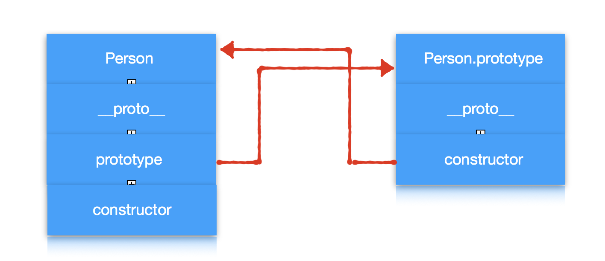
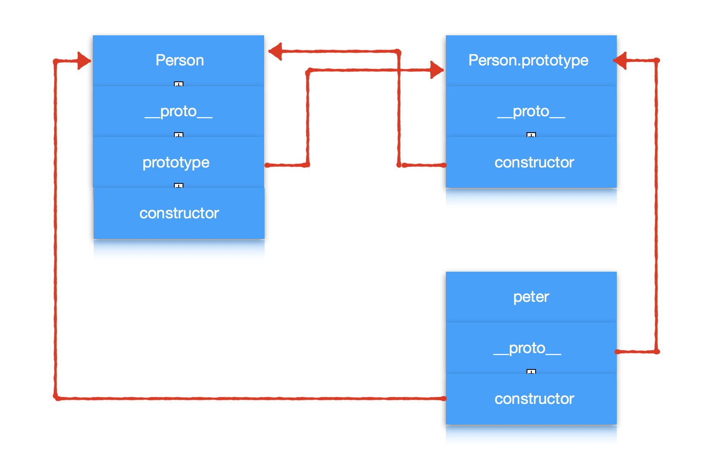
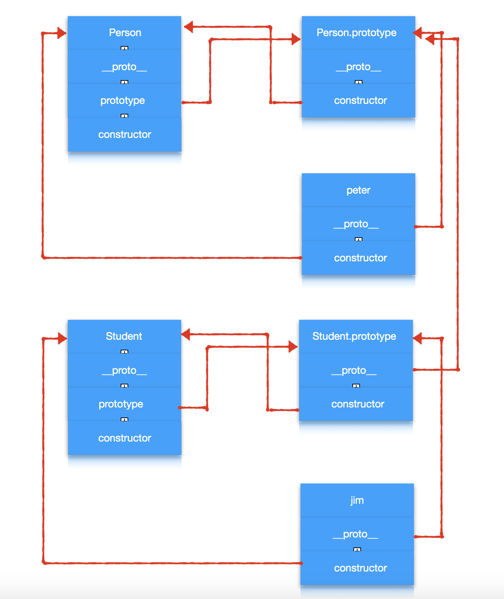
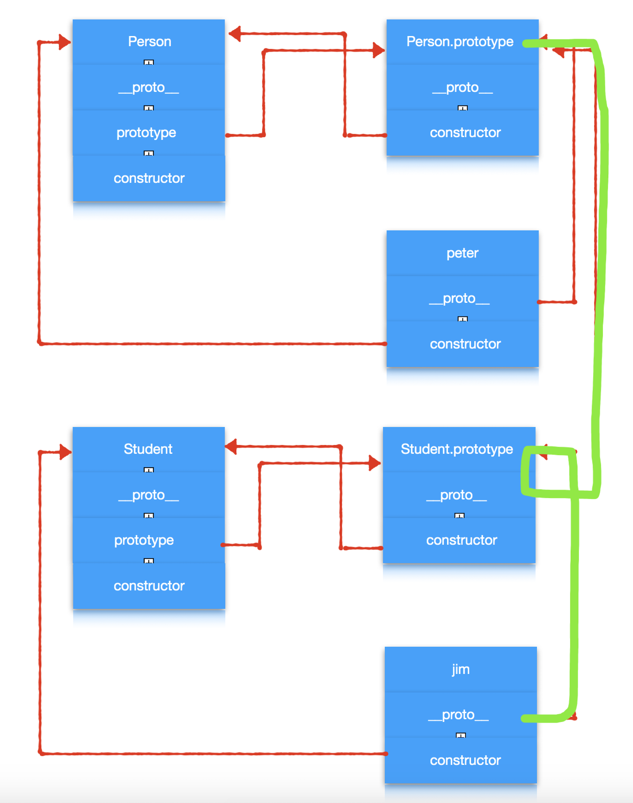
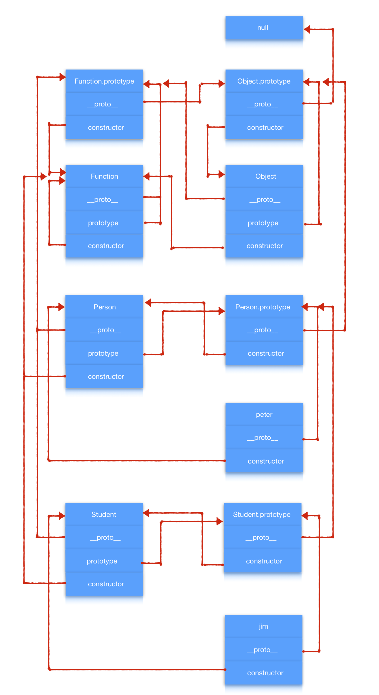
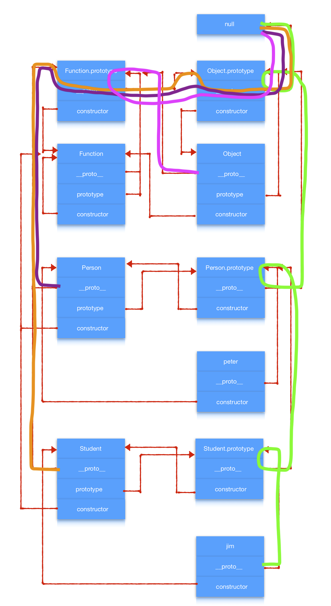
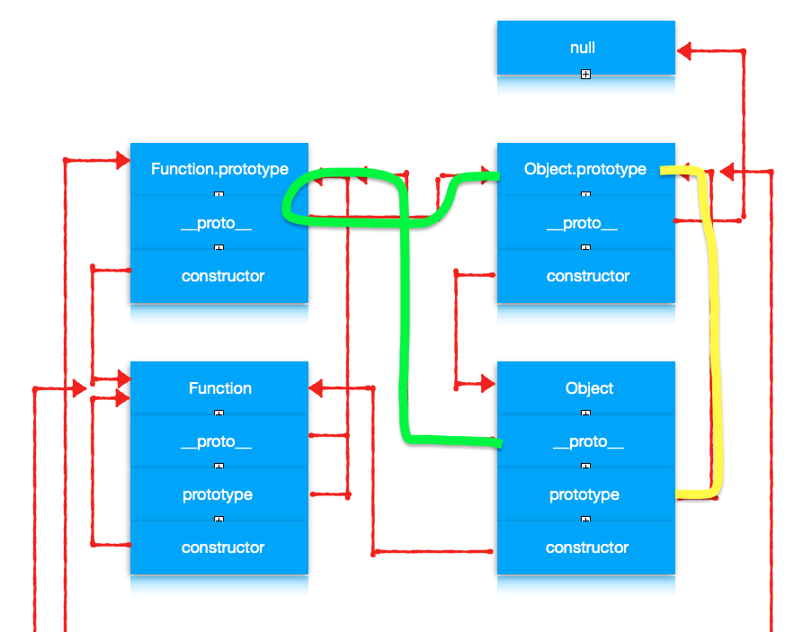
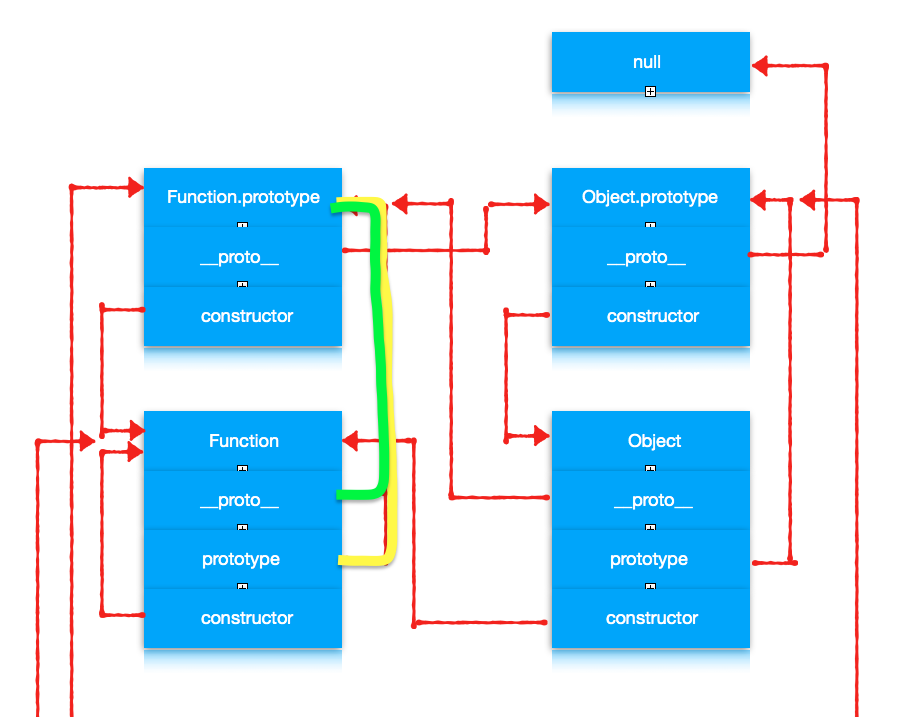
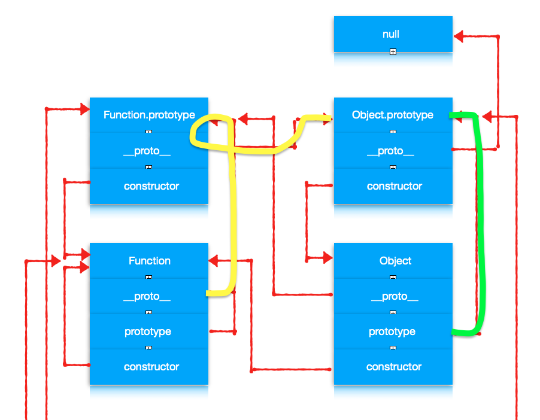

# 对象与原型链

## 基于类和基于原型

我们都知道 JavaScript 是一个面向对象的语言，但是它却没有其他诸如 Java、C++ 这些面向对象的语言中都存在**类**的这个概念。取而代之的是**原型**的概念。这其实就是两种不同的编程范式。

1. 基于类的面向对象
   
    在这种范式中，类定义了对象的结构和行为以及继承关系，所有基于该类的对象都有**相同**的行为和结构，不同的只是他们的状态。

    创建新的对象通过类的构造器来创建。只有少数基于类的面向对象语言允许类在运行时进行修改。

2. 基于原型的面向对象

    在这种范式中，关注的是一系列对象的行为，将拥有**相似**行为的对象通过原型链串联起来。

    创建新的对象通过拓展原有对象创建。很多的基于原型的语言提倡运行时对原型进行修改。

我们可以看出来基于原型相对来说更加灵活。这也许是 JavaScript 选择基于原型构建面向对象的原因之一吧。

## 对象：无序属性的集合

ECMA262 把对象定义为：无序属性的集合，其属性可以包含基本值、对象或者函数。

```
var obj = {
    a: 5,
    b: function() {},
    c:{ d: 10 }
}
```
在上面这段代码中 基本类型 a，函数 b，对象 c 都是对象 obj 的属性。

实际上 JavaScript 中函数也可以添加属性。

```
var fun = function(){}
fun.a = 5
fun.b = function() {}
fun.c = { d: 10 }
```

因此我们可以推断出来函数也是属性的集合，它也是对象。

## 构造函数

‘面向对象编程’的第一步，就是要生成对象。在基于类的语言中类都有创建对象的构造函数。而在 JavaScript 中没有类，生成对象的工作就交由函数来完成。这种函数被称为构造函数。**所有对象**都有一个 constructor 的属性指向它的构建函数。

你可能会提出反对意见：

```
var obj = { a: 5, b: 10 }
var fun = function(){}
```

你会说 obj 和 fun 都是对象，但他们都没有通过函数生成啊。

其实这是 JavaScript 提供的语法糖，本质上他们会分别调用 Object 和 Function （注意大写）这两个**函数**来生成。

```
obj.constructor // ƒ Object() { [native code] }
fun.constructor // ƒ Function() { [native code] }
```
因此上面的代码等同于：

```
// var obj = { a: 5, b: 10 }
var obj = new Object()
obj.a = 5
obj.b = 10

// var fun = function(){} 
var fun = new Function()
```

除了 Object 和 Function 这两个函数外，你也可以自定义构造函数。函数要具备下面的特征：

- 为区别于普通函数，通常构造函数名首字母大写；
- 构造函数必须通过 new 命令调用；
- 构造函数内部使用 this 关键字，this 指向当前构造函数生成的对象；
- 构造函数没有 return，默认返回 this。

一个例子
```
function Person(name) {
    this.name = name
}
var peter = new Person('Peter')
```

通过例子我们可以看到除了构造函数外还需要 new 运算符，它都做了以下工作：

- 创建一个空对象，作为将要返回的对象实例；
- 将空对象的原型 `__proto__` 指向了构造函数的 `prototype` 属性；
- 将空对象赋值给构造函数内部的 this 关键字；
- 开始执行构造函数内部的代码；
- 如果构造器返回的是对象，则返回，否则返回第一步创建的对象。

这里出现了两个容易混淆的概念：`__proto__` 和 `prototype`。

- `__proto__` 是每个**对象**都有的一个属性。指向创建该对象的函数的 prototype。用它来产生一个链，一个原型链，用于寻找方法名或属性，等等。它是个隐藏属性，早期低版本的浏览器甚至不支持这个属性。
- `prototype` 是每个**函数**都有的一个属性。它本身是一个对象，它的 constructor 指向函数本身。这个属性存在的目的就是在通过 new 来创建对象时构造对象的 `__proto__` 属性。

知识通过上面的叙述可能理解起来比较困难，我们通过代码和图来仔细分析。

对于 Person 函数来说，

```
// Person.prototype 是一个对象，它有两个属性 constructor 指向 Person 函数，__proto__ 指向 Object。（先不用理会 Object 这个对象，后面会详细介绍）

Person.prototype 
/*
 * {constructor: ƒ}
 *    constructor: ƒ Person()
 *    __proto__: Object
 */
```

由于 Person 是函数因此它拥有 `constructor`、`__proto__`、`prototype` 属性。Person.prototype 是只是个普通对象，因此 Person.prototype 拥有 `constructor`、`__proto__` 属性。



对于 peter 来说，它是个对象因此具有 `constructor`、`__proto__` 属性。

```
// peter 对象的构造函数就是 Person()
peter.constructor // ƒ Person() {...}

// peter 对象的 __proto__ 属性指向 Person.prototype
peter.__proto__ == Person.prototype // true
```



通过上面的图可以清楚的看到对象和它的构造函数之间的联系，总结一下：

1. 每个对象都是由其构造函数生成，并且对象有个 `constructor` 属性指向构造函数；
2. 每个对象都有个原型属性 `__proto__`，指向其构造函数的 `prototype` 属性；
3. 每个函数都有一个 `prototype` 属性用于充当构造函数时构建对象的 `__proto__` 属性。

## 原型链

看到上面的内容你也许会疑惑为什么要这样设计，其实是因为 JavaScript 也是面向对象的语言，他是通过这样的设计通过构建原型链实现继承的。


在上面代码的基础上我们在声明一个 Student 的构造函数

```
function Student(name, score) {
    Person.call(this, name)
    this.score = score
}

// 只执行上面的语句还不够，需要通过这行代码将它们产生链接也就是继承关系
Student.prototype = Object.create(Person.prototype)

// 这段代码是为了让 Student.prototype 的构造函数指向 Student 函数，不指定的话会指向 Person 函数
Student.prototype.constructor = Student

// 创建一个对象
var jim = new Student('Jim', 90)
```

我们先来分析下内存布局

```
Student.prototype.constructor == Student // true
Student.prototype.__proto__ == Person.prototype // true 

jim.__proto__ == Student.prototype // true
jim.constructor == Student // true 
```



看着这张图我们可以明显的看到一个链条，一个靠 `__proto__` 属性串联起来的链条，这就是所谓的原型链。



正是有了原型链当我们访问一个对象的属性时，会先在基本属性中查找，如果没有，再沿着 `__proto__` 这条链向上找。这样就实现了继承。

不过按照我们现在的分析可以发现这个链条在 Person.prototype 这里断了，而且图中有些属性没有标注出来。别急，我们后面来把它慢慢补全。

## Function 和 Object

我们先看下面的代码。

```
var obj = { a: 5, b: 10 }
var fun = function(){}
```

我们知道等价于

```
// var obj = { a: 5, b: 10 }
var obj = new Object()
obj.a = 5
obj.b = 10

// var fun = function(){} 
var fun = new Function()
```

由此可见 Object 和 Function 是两个比较总要的**函数对象**。我们来探究下它们的内存布局。

因为它们都是对象因此它们都有 `constructor`、`__proto__` 属性，又因为他们是函数对象，因此它们都有 `prototype` 属性。


对于 Function 来说

```
// 虽然 Function.prototype 返回的类型是 function 但是它的 prototype 属性并不存在，因此它是特殊的函数对象。
typeof Function.prototype // "function"
typeof Function.prototype.prototype // "undefined"

// Function.prototype 与 Function.__proto__ 指向同一个对象
Function.prototype == Function.__proto__

// Function.prototype 的 constructor 是 Function 函数
Function.prototype.constructor // ƒ Function() { [native code] }

// Function 的 constructor 是 Function 函数自己
Function.constructor // ƒ Function() { [native code] }
```

可以画出下面的图


对于 Object 来说

```
// Object.prototype 是一个对象
typeof Object.prototype // "object"

// Object.__proto__ 与 Object.prototype 指向的不是同一个对象
Object.prototype == Object.__proto__ // false
// Object.__proto__ 指向 Function.prototype 的对象 
Object.__proto__ == Function.prototype // true

// Object.prototype 的 constructor 是 Object 函数
Object.prototype.constructor // ƒ Object() { [native code] }

// Object 的 constructor 是 Function 函数
Object.constructor // ƒ Function() { [native code] }
```

可以画出下面的图


我们发现还有两个属性没确定分别是 `Object.prototype.__proto__` 和 `Function.prototype.__proto__`。我们通过代码在确认一下。

```
// Function.prototype 的 __proto__ 属性指向 Object.prototype
Function.prototype.__proto__ == Object.prototype // true

// Object.prototype 的 __proto__  属性指向 null
Object.prototype.__proto__ // null
```

最终得到这个图


我们再结合上面原型链那部分的内容。

```
// Person 函数的构造函数是 Function
Person.constructor // ƒ Function() { [native code] }

// Person 函数的原型是 Function.prototype
Person.__proto__ // ƒ () { [native code] }
Person.__proto__ == Function.prototype // true

// Student 函数的构造函数是 Function
Student.constructor // ƒ Function() { [native code] }

// Student 函数的原型是 Function.prototype
Student.__proto__ // ƒ () { [native code] }
Student.__proto__ == Function.prototype // true

// Person.prototype 的原型是 Object.prototype
Person.prototype.__proto__ == Object.prototype
```



我们可以观察到几条明显的原型链，见下图：

1. 绿色的是我们自定义的 Person Student 对象的原型链；
2. 其他颜色的是 函数对象的原型链。



分析这张图我们可以得出以下结论

1. **所有函数的原型都是 `Function.prototype`，包括 Function 函数自己**
2. **所有函数的构造函数都是 Function，包括 Function 函数自己**
3. **所有对象的原型终点都是 `Object.prototype`，包括函数对象和普通对象，而 `Object.prototype.__proto__` 的原型指向了 `null`**

这里面有个最初让我比较疑惑的就是 Object 的原型为什么不是 `Object.prototype` 而是 `Function.prototype`

```
Object.__proto__ == Function.prototype // true
```

其实这是因为 Object 本身就是个函数，它跟其他函数一样都是由 Function 来构造的。

## 与原型链相关的方法

### instanceof

instanceof 主要的作用就是判断一个实例是否属于某种类型，其实现原理就是通过原型链进行判断。

```
function new_instance_of(leftVaule, rightVaule) { 
    let rightProto = rightVaule.prototype; // 取右表达式的 prototype 值
    leftVaule = leftVaule.__proto__; // 取左表达式的__proto__值
    while (true) {
    	if (leftVaule === null) {
            return false;	
        }
        if (leftVaule === rightProto) {
            return true;	
        } 
        leftVaule = leftVaule.__proto__ 
    }
}
```

可以看出来 instanceof 的实现思路就是判断右值变量的 prototype 是否在左值变量的原型链上。

```
jim instanceof Person // true
jim instanceof Student // true
```

参考上方的图我们也可以解释一些看起来比较诡异的判断

```
Object instanceof Object // true
```


```
Function instanceof Function // true
```

```
Function instanceof Object // true
```


下面这些你可以自行检测。

```
function Foo() { } // 定义一个函数

Foo instanceof Object // true
Foo instanceof Function // true
```

### hasOwnProperty

Object.hasOwnProperty() 返回一个布尔值，表示某个对象的实例是否含有指定的属性，而且此属性非原型链继承。用来判断属性是来自实例属性还是原型属性。类似还有 in 操作符，in 操作符只要属性存在，不管实在实例中还是原型中，就会返回 true。同时使用 in 和 hasOwnProperty 就可以判断属性是在原型中还是在实例中。

### isPrototypeOf 

返回一个布尔值，表示指定的对象是否在本对象的原型链中。

### getPrototypeOf

返回该对象的原型

## 创建对象的方法


## ES6 实现继承

## 参考

1. [JavaScript 中的构造函数](https://juejin.im/entry/584a1c98ac502e006c5d63b8)
2. [全方位理解JavaScript面向对象](https://www.jianshu.com/p/3cada0f002f5?utm_campaign=maleskine&utm_content=note&utm_medium=seo_notes&utm_source=recommendation)
3. [大话JavaScript对象](https://www.jianshu.com/p/b0f10a9b584c?utm_campaign=haruki&utm_content=note&utm_medium=reader_share&utm_source=weixin_timeline&from=timeline&isappinstalled=0)
4. [深入理解javascript原型和闭包（完结）](https://www.cnblogs.com/wangfupeng1988/p/3977924.html)
5. [浅谈 instanceof 和 typeof 的实现原理](https://juejin.im/post/5b0b9b9051882515773ae714)
6. [MDN 继承与原型链](https://developer.mozilla.org/zh-CN/docs/Web/JavaScript/Inheritance_and_the_prototype_chain)