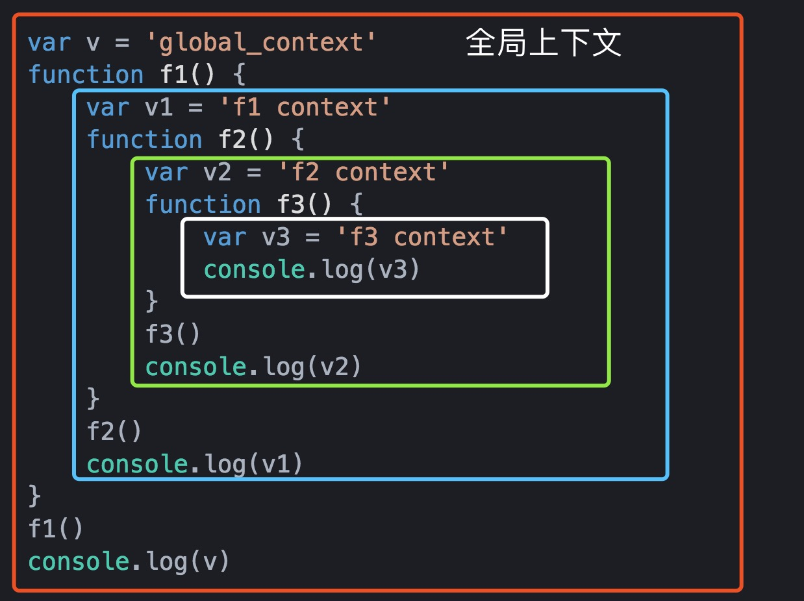

# 执行上下文和执行栈

开始之前，我们先看以下代码。

```javascript
console.log(a)
// Uncaught ReferenceError: a is not defined
```

```javascript
console.log(a)
// undefined
var a = 10
```

第一段代码报错很好理解，a 没有声明。所以抛出错误。

第二段代码中 a 的声明在使用 a 之后，打印 a 的值是 undefined。

也就是说在使用 a 的时候，a 已经被声明了。这就很奇怪了，明明 a 的声明在这一行下面，为什么这个时候就已经被声明了呢？

其实这就是变量提升的概念。本质上是因为当代码真正执行之前就已经做了一些准备工作。而这些工作跟执行上下文有着紧密的联系，我们需要先来了解什么是执行上下文。

## 执行上下文

简单来说执行上下文（Execution Context）就是执行代码的环境。所有的代码都在执行上下文中执行。

上面的例子都是在全局上下文中执行的，其实执行上下文可以分为下面这三种

1. 全局执行上下文 (Global Execution Context)
  - 这是最基础或者默认的执行上下文，是代码一开始运行就会创建的上下文。
  - 一个程序中只会有一个全局执行上下文
  - 所有不在函数内部的代码都在全局执行上下文之中
    
2. 函数执行上下文 (Functional Execution Context)
  - 当一个函数被调用时, 会为该函数创建一个上下文
  - 每个函数都有自己的执行上下文
3. Eval 函数执行上下文 (Eval Function Execution Context)
  - 执行在 eval 函数内部的代码也会有它属于自己的执行上下文

下面有一个例子

```javascript
var v = 'global_context'
function f1() {
    var v1 = 'f1 context'
    function f2() {
        var v2 = 'f2 context'
        function f3() {
            var v3 = 'f3 context'
            console.log(v3)
        }
        f3()
        console.log(v2)
    }
    f2()
    console.log(v1)
}  
f1()
console.log(v)
```



最外侧的是全局执行上下文，它有 f1 和 v 这两个变量，f1、f2、f3内部是三个函数执行上下文（Eval 函数执行上下文不是很常用，在这里不做介绍）。

通过上面我们了解了每个函数都对应一个执行上下文，实际代码中肯定会有很多的函数，甚至函数会嵌套函数，这些执行上下文是如何组织起来的呢？代码又是如何运行的呢？

其实这些都是执行栈的工作。

## 执行栈

执行栈，其他语言中被称为调用栈，与存储变量的那个栈的概念不同，它是被用来存储代码运行时创建的所有执行上下文的栈。

当 JavaScript 引擎第一次遇到你的脚本时，它会创建一个全局的执行上下文并且压入当前执行栈。每当引擎遇到一个函数调用，它会为该函数创建一个新的执行上下文并压入栈的顶部。

Javascript 是一门单线程的语言，这就意味着同一个时间只能处理一个任务。因此引擎只会执行那些执行上下文位于栈顶的函数。当该函数执行结束时，执行上下文从栈中弹出，控制流程到达当前栈中的下一个上下文。

我们在上面的代码的执行过程可以归结为下面这个图：


文字版总结如下：

1. 全局上下文压入栈顶
2. 每执行某一函数就为其创建一个执行上下文，并压入栈顶
3. 栈顶的函数执行完之后它的执行上下文就会从执行栈中弹出，将控制权交给下一个上下文
4. 所有函数执行完之后执行栈中只剩下全局上下文，它会在应用关闭时销毁

## 执行上下文的创建

如果执行上下文抽象成为一个对象的话它是如下的对象

```javascript
executionContextObj = {
    'scopeChain': { /* 变量对象（variableObject）+ 所有父级执行上下文的变量对象 */ },
    'variableObject': { /* 函数 arguments/参数，内部变量和函数声明 */ },
    'this': {}
}
```

其中 variableObject 不是一成不变的，按照时间顺序可以分为 VO 和 AO

- VO 变量对象（Variable Object）
  - 它是执行上下文中都有的对象。
  - 执行上下文中可被访问但是不能被 delete 的函数标示符、形参、变量声明等都会被挂在这个对象上
  - 对象的属性名对应它们的名字，对象属性的值对应它们的值。
  - 该对象不能直接访问到

- AO 活动对象（Activation object）
  - 当函数开始执行的时候，这个执行上下文儿中的变量对象就被激活，这时候 VO 就变成了 AO

因此执行上下文创建的具体过程如下：

1. 找到当前上下文调用函数的代码
2. 执行代码之前，先创建执行上下文
3. 创建阶段：
   1. 创建变量对象：  
      1. 创建 arguments 对象，和参数
      2. 扫描上下文的函数申明：
         1. 每扫描到一个函数什么就会用函数名创建一个属性，它是一个指针，指向该函数在内存中的地址
         2. 如果函数名已经存在，对应的属性值会被新的指针覆盖
      3. 扫描上下文的变量申明：
         1. 每扫描到一个变量就会用变量名作为属性名，其值初始化为 undefined
         2. 如果该变量名在变量对象中已经存在，则直接跳过继续扫描
    2. 初始化作用域链
    3. 确定上下文中 this 的指向
4. 代码执行阶段
   1. 执行函数体中的代码，给变量赋值

> 注意：
> 1. 全局上下文的变量对象初始化是全局对象
> 2. 全局上下文的生命周期，与程序的生命周期一致，只要程序运行不结束，比如关掉浏览器窗口，全局上下文就会一直存在。
> 3. 作用域链（scopeChain） 和 this 的指向我们后面再详细了解

我们看一个例子

```javascript
function foo(i) {
    var a = 'hello';
    var b = function privateB() {

    };
    function c() {

    }
}

foo(22);
```

在调用了 `foo(22)` 的时候，创建阶段如下所示

```javascript
fooExecutionContext = {
    scopeChain: { ... },
    variableObject: {
        arguments: {
            0: 22,
            length: 1
        },
        i: 22,
        c: pointer to function c()
        a: undefined,
        b: undefined
    },
    this: { ... }
}
```

激活阶段如下

```javascript
fooExecutionContext = {
    scopeChain: { ... },
    activationObject: {
        arguments: {
            0: 22,
            length: 1
        },
        i: 22,
        c: pointer to function c()
        a: 'hello',
        b: pointer to function privateB()
    },
    this: { ... }
}
```

### 注意
创建需要注意以下几点

1. 创建阶段的创建顺序是：函数的形参声明并**赋值** ==>> 函数声明 ==>> 变量声明
2. 创建阶段处理函数重名和变量重名的策略不同，简单来说就是函数优先级高。

```javascript
function foo(a){
    console.log(a)
    var a = 10
}
foo(20) // 20

function foo(a){
    console.log(a)
    function a(){}
}
foo(20) // ƒ a(){}

function foo(){
    console.log(a)
    var a = 10
    function a(){}
}
foo() // f a(){}
```
## 变量提升

通过上面的介绍我们其实就知道了变量提升这一现象的出现的根本原因就是执行上下文在创建的时候就会扫描上下文中的变量将其声明出来，并设置为 VO 的属性。

我们分析下面的代码来加深印象。

```javascript
(function() {

    console.log(typeof foo); // function pointer
    console.log(typeof bar); // undefined

    var foo = 'hello',
        bar = function() {
            return 'world';
        };

    function foo() {
        return 'hello';
    }

}());​
```

我们来回答以下问题

1. 为什么我们能在 foo 声明之前访问它？

回想 VO 的创建阶段，foo 在该阶段就已经被创建在变量对象中。因此可以访问它。

2. foo 被声明了两次, 为什么 foo 展现出来的是 functiton，而不是undefined 或者 string

在创建阶段，函数声明是优先于变量被创建的。而且在变量的创建过程中，如果发现 VO 中已经存在相同名称的属性，则不会影响已经存在的属性。

因此，对 foo() 函数的引用首先被创建在活动对象里，并且当我们解释到 `var foo` 时，我们看见 foo 属性名已经存在，所以代码什么都不做并继续执行。

3. 为什么 bar 的值是 undefined？

bar 采用的是函数表达式的方式来定义的，所以 bar 实际上是一个变量，但变量的值是函数，并且我们知道变量在创建阶段被创建但他们被初始化为 undefined。

## 参考

1. [What is the Execution Context & Stack in JavaScript?](http://davidshariff.com/blog/what-is-the-execution-context-in-javascript/)
2. [前端基础进阶（三）：变量对象详解](https://www.jianshu.com/p/330b1505e41d)
