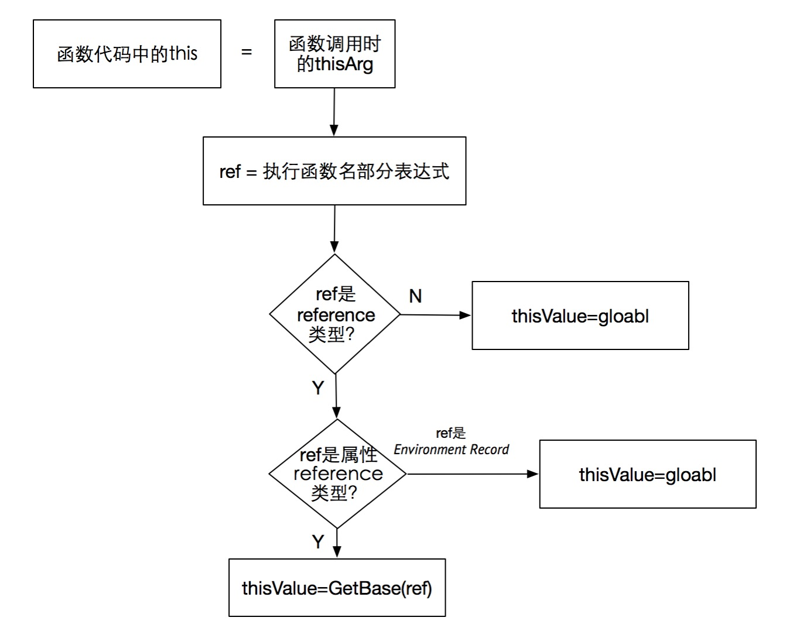

# 从 ECMAScript 规范中解读 this

大部分介绍 this 的文章都是从现象出发，然后总结规律。虽然说这也是一种方式，但这样以来就如同盲人摸象，只看到了局部而不能解释全局。前段时间看到有人从 ECMAScript 规范的角度来解读 this。我觉得这种方式不错，虽然可能有点晦涩难懂，不过它却能透过现象看到本质，不失为一种好的方法。

[https://www.w3.org/html/ig/zh/wiki/ES5](https://www.w3.org/html/ig/zh/wiki/ES5)

## 纠正

有些观点认为：this 的值取决于函数如何定义，如果它是全局函数，this 设置为全局对象，如果函数是一个对象的方法，this 将总是指向这个对象。

这是不正确的。通过前面[《执行上下文和执行栈》](./05md) 这篇文章我们知道函数执行的时候会创建执行上下文，而在执行上下文生成的过程中，会分别确定变量对象，作用域链，以及 this 的值。因此 this 的值在进入上下文时就确定了。而且在函数代码中，this 的值在每一次(进入上下文时)可能完全不同。但是不管怎样，在代码运行期间，this的值是不变的。

## 函数调用

知道了 this 是在函数调用的时候确定的之后我们就去函数调用的规范去看看具体是如何确定的。

[函数调用](https://www.w3.org/html/ig/zh/wiki/ES5/%E8%A1%A8%E8%BE%BE%E5%BC%8F#.E5.87.BD.E6.95.B0.E8.B0.83.E7.94.A8)

The production CallExpression : MemberExpression Arguments is evaluated as follows:

1. **Let ref be the result of evaluating MemberExpression.**
2. **Let func be GetValue(ref).**
3. Let argList be the result of evaluating Arguments, producing an internal list of argument values (see 11.2.4).
4. If Type(func) is not Object, throw a TypeError exception.
5. If IsCallable(func) is false, throw a TypeError exception.
6. **If Type(ref) is Reference, then**
   - **If IsPropertyReference(ref) is true, then
Let thisValue be GetBase(ref).**
   - **Else, the base of ref is an Environment Record
Let thisValue be the result of calling the ImplicitThisValue concrete method of GetBase(ref).**
7. **Else, Type(ref) is not Reference.**
    - **Let thisValue be undefined.**
8. Return the result of calling the [[Call]] internal method on func, providing thisValue as the this value and providing the list argList as the argument values.

上面有许多不认识的方法和类型，这需要我们先了解一下引用类型（Reference type）。

## [左值表达式](https://www.w3.org/html/ig/zh/wiki/ES5/%E8%A1%A8%E8%BE%BE%E5%BC%8F#.E5.B7.A6.E5.80.BC.E8.A1.A8.E8.BE.BE.E5.BC.8F)

MemberExpression :
- PrimaryExpression 原始表达式
- FunctionExpression 函数定义表达式
- MemberExpression [ Expression ] 属性访问表达式
- MemberExpression . IdentifierName 属性访问表达式
- new MemberExpression Arguments 对象创建表达式

几个例子

```
function foo(){}; 
foo(); // MemberEcpression --> foo

function foo(){
    return function(){

    }
};
foo()(); //MemberEcpression --> foo()

var foo = {
    bar: function(){}
}
foo.bar(); //MemberEcpression --> foo.bar
```

因此 MemberExpression 可以理解为（）左边的表达式

## [类型](https://www.w3.org/html/ig/zh/wiki/ES5/%E7%B1%BB%E5%9E%8B)

在 ECMAScript 标准中类型分为 语言类型(Language Type) 和 规范类型(Specification Type)。

其中的语言类型就是语言中直接操作的类型，比如 Undefined、Null、Boolean、String、Number、Object。这些事我们平时所接触的到的。

规范类型用来描述表达式求值过程的中间结果，是一种内部实现，不对程序员直接开放。ECMAScript 规范使用规范类型来自洽地描述其内部作用机制，平时我们接触不到。

规范类型包括：Reference, List, Completion, Property Descriptor, Property Identifier, Lexical Environment, Environment Record。

## [引用类型（Reference type）](https://www.w3.org/html/ig/zh/wiki/ES5/%E7%B1%BB%E5%9E%8B#.E5.BC.95.E7.94.A8.E8.A7.84.E8.8C.83.E7.B1.BB.E5.9E.8B)

Reference 类型是 ECMAScript 规范用来解释 delete 、 typeof 、赋值运算符等语言特性的行为的。

Reference 表示的是对某个变量、数组元素或对象属性所在内存地址的引用，而非对其所在内存地址所保存值的引用。在 ECMAScript 中，赋值运算符的左侧只能是一个内存地址，而不能是一个值。（其实很好理解，你可以把值保存在某个内存地址，而不能把值赋给另一个值）

[出处](https://www.zhihu.com/question/31911373/answer/54055480)

Reference 的构成，由三个组成部分，分别是：

- base value
  - 所处的环境或者所在的对象
  - 它的值只可能是 Undefined, Object, Boolean, String, Number, 环境变量 其中的一种。
- referenced name
  - referenced 的名字
  - 是一个字符串
- strict mode flag
  - 用来检测严格下的一些限制的标志位

例子

```javascript
var foo = 1

var fooReference = {
    base: EnvironmentRecord,
    name: 'foo',
    strict: false
}
```
```javascript
var foo = {
    bar: function () {
        return this;
    }
};
 
foo.bar() 

var BarReference = {
    base: foo,
    name: 'bar',
    strict: false
}
```

Reference 类型的值只有两种：

1. 标识符解析
   - 标识符是变量名，函数名，函数参数名和全局对象中未识别的属性名。
   - 具体的过程可以看[这里](https://www.w3.org/html/ig/zh/wiki/ES5/%E5%8F%AF%E6%89%A7%E8%A1%8C%E4%BB%A3%E7%A0%81%E4%B8%8E%E6%89%A7%E8%A1%8C%E7%8E%AF%E5%A2%83#.E6.A0.87.E8.AF.86.E7.AC.A6.E8.A7.A3.E6.9E.90)，详细过程就不再细说了，只要知道这种会返回 Reference 类型就可以了。
2. 属性访问器
   - 具体可以看[这里](https://www.w3.org/html/ig/zh/wiki/ES5/%E8%A1%A8%E8%BE%BE%E5%BC%8F#.E5.B1.9E.E6.80.A7.E8.AE.BF.E9.97.AE)


### 相关方法

#### 1. GetValue()

用于从 Reference 获取对应值。

```javascript
var foo = 1;

var fooReference = {
    base: EnvironmentRecord,
    name: 'foo',
    strict: false
};

GetValue(fooReference) // 1;
```

调用 GetValue，返回的将是具体的语言类型的值，而不再是一个 Reference

另外

#### 2. GetBase()

返回 Reference 的 base value

#### 3. HasPrimitiveBase()

如果 Reference 的 base value 是 Boolean、String、Number，那么返回 true。

#### 4. IsPropertyReference()

如果 Reference 的 base value 是个 Object 或 HasPrimitiveBase(V) 是 true，那么返回 true；否则返回 false。

也就是说 如果 Reference 的 base value 是个 Object、Boolean、String、Number 返回 true；否则返回 false。

#### 5. ImplicitThisValue()

该函数始终返回 undefined

## 分析

了解过上面的内容之后我们将函数调用转化为伪代码，并且仅留下与 this 相关的内容。

```javascript
var ref = MemberExpression
var type = Type(ref)
var thisValue
if (type == Reference) {
    if (IsPropertyReference(ref)) {
        thisValue = GetBase(ref)
    } else { // (GetBase(ref) == EnvironmentRecord)
        thisValue = ImplicitThisValue()
    }
} else {
    thisValue = undefined
}

this = thisValue
```

需要注意在[进入函数代码](https://www.w3.org/html/ig/zh/wiki/ES5/%E5%8F%AF%E6%89%A7%E8%A1%8C%E4%BB%A3%E7%A0%81%E4%B8%8E%E6%89%A7%E8%A1%8C%E7%8E%AF%E5%A2%83#.E8.BF.9B.E5.85.A5.E5.87.BD.E6.95.B0.E4.BB.A3.E7.A0.81)的时候，如果是非严格模式且 this 为 null、undefined，this 会指向全局对象。

得出以下的流程图



[图片来源](http://liyangready.github.io/2016/07/31/%E6%A0%B9%E6%B2%BBJavaScript%E4%B8%AD%E7%9A%84this-ECMAScript%E8%A7%84%E8%8C%83%E8%A7%A3%E8%AF%BB/)

## 实战

### 例1
```javascript
function foo() {
    console.log(this)
}

foo(); 
```

分析如下：

1. 首先可以知道 MemberExpression 就是 foo，这是一个标识符，进行标识符解析，然后得到一个 Reference

```javascript
var fooReference = {
    base: EnvironmentRecord,
    name: 'foo',
    strict: false
}
```
2. fooReference 是 Reference 类型，调用 IsPropertyReference 判断
3. 由于 fooReference 的 base value 不是 Object、Boolean、String、Number 这几种，因而 IsPropertyReference 返回 false
4. fooReference 是 Reference 类型且 base value 正是 Environment Record，所以会调用 ImplicitThisValue(ref)
5. ImplicitThisValue 始终返回 undefined
6. 因此 thisValue 等于 undefined
7. 是非严格模式且 this 为 undefined，因此最终 this 会指向全局对象

### 例2

```javascript
var foo = {
  bar: function () {
    console.log(this)
  }
}

foo.bar()
```

分析如下

1. MemberExpression 就是 foo.bar，这是一个属性访问器，因此得到一个 Reference
   
```javascript
var barReference = {
  base: foo,
  name: 'bar',
  strict: false
}
```

2. barReference 是 Reference 类型，调用 IsPropertyReference 判断
3. 由于 barReference 的 base value 是 foo，是一个 Object，因此 IsPropertyReference 返回 true
4. 因此 thisValue 等于 GetBase(barReference)，也就是 foo

### 例3

```javascript
var foo = {
  bar: function () {
    console.log(this)
  }
}

var test = foo.bar
test()
```

可以看出这个例子与例 2 很像，但是调用的方式改变了。

分析如下：

1. MemberExpression 就是 test，这是一个标识符，进行标识符解析，然后得到一个 Reference

```javascript
var testReference = {
  base: EnvironmentRecord,
  name: 'test',
  strict: false
}
```

2. 接下来这个例子的处理方式就跟例 1 中的一样了，最终 this 指向了全局变量

### 例4

```javascript
var foo = {
  bar: function () {
    console.log(this)
  }
};

// 1
foo.bar() // Reference, foo
// 2
(foo.bar)() // Reference, foo
// 3
(foo.bar = foo.bar)() // global?
// 4
(false || foo.bar)() // global?
// 5
(foo.bar, foo.bar)() // global?
```
#### 1. foo.bar()
foo.bar() 我们上面分析过了， this 是 base 对象，也就是 foo

#### 2. (foo.bar)()
foo.bar 被 () 包住， () 是[群组运算符](https://www.w3.org/html/ig/zh/wiki/ES5/%E8%A1%A8%E8%BE%BE%E5%BC%8F#.E7.BE.A4.E7.BB.84.E8.BF.90.E7.AE.97.E7.AC.A6)。

> 返回执行 Expression 的结果。这可能是一个 Reference。
> 
> 注：本算法不在执行 Expression 后使用 GetValue。这主要的目的是让 delete 与 typeof 运算符可以作用在被括号括起来的表达式。

因此其与 foo.bar()结果一样。

#### 3. (foo.bar = foo.bar)()

我们可以看到有[赋值运算符](https://www.w3.org/html/ig/zh/wiki/ES5/%E8%A1%A8%E8%BE%BE%E5%BC%8F#.E7.AE.80.E5.8D.95.E8.B5.8B.E5.80.BC.EF.BC.88.3D.EF.BC.89)

运算过程中有一步是

> 3. 令 rval 为 GetValue(rref)。

上面我们知道 GetValue() 返回的是语言类型，不是 Reference。因此我们可以得出结论 thisValue 等于 undefined 。由于是非严格模式，因此 this 最终指向全局对象

剩下的 `(false || foo.bar)()` 和 `(foo.bar, foo.bar)()` 分别涉及到 [逻辑与运算符](https://www.w3.org/html/ig/zh/wiki/ES5/%E8%A1%A8%E8%BE%BE%E5%BC%8F#.E4.BA.8C.E5.85.83.E9.80.BB.E8.BE.91.E8.BF.90.E7.AE.97.E7.AC.A6) 和 [逗号运算符](https://www.w3.org/html/ig/zh/wiki/ES5/%E8%A1%A8%E8%BE%BE%E5%BC%8F#.E9.80.97.E5.8F.B7.E8.BF.90.E7.AE.97.E7.AC.A6)。它们也会调用 `GetValue()` 因此 this 都指向全局对象。

### 例5

```javascript
(function () {
      console.log(this) // null => global
})()
```

分析如下

1. MemberExpression 是一个函数对象，不是一个可以解析的标识符或者属性访问器，那么最终得到的结果为 null。
2. 非严格模式下，最终 this 指向 全局对象。

## this 的特殊情况

### 使用 call，apply 显示绑定 this

JavaScript 内部提供了一种机制，让我们可以自行手动设置 this 的指向。它们就是 call 与 apply。所有的函数都具有着两个方法。它们除了参数略有不同，其功能完全一样。它们的第一个参数都为 this 将要指向的对象。

### 构造函数中的 this

this 指向构建的对象

### 箭头函数中的 this

在箭头函数中，this 与封闭词法环境的 this 保持一致。

```
var globalObject = this;
var foo = (() => this);
console.log(foo() === globalObject); // true
```

如果将 this 传递给 call、bind、或者 apply，它将被忽略。

```
// 作为对象的一个方法调用
var obj = {foo: foo};
console.log(obj.foo() === globalObject); // true

// 尝试使用call来设定this
console.log(foo.call(obj) === globalObject); // true

// 尝试使用bind来设定this
foo = foo.bind(obj);
console.log(foo() === globalObject); // true
```

无论如何，foo 的 this 被设置为他被创建时的环境（在上面的例子中，就是全局对象）。这同样适用于在其他函数内创建的箭头函数：这些箭头函数的this被设置为封闭的词法环境的。

## 参考

1. [深入理解JavaScript系列——this](https://juejin.im/entry/5a3368f65188250f8874ea19)
2. [JavaScript深入之从ECMAScript规范解读this](https://github.com/mqyqingfeng/Blog/issues/7)
3. [W3C ES5](https://www.w3.org/html/ig/zh/wiki/ES5)
4. [深入理解JavaScript系列（13）：This? Yes,this!](https://www.cnblogs.com/TomXu/archive/2012/01/17/2310479.html)
5. [MDN this](https://developer.mozilla.org/zh-CN/docs/Web/JavaScript/Reference/Operators/this)