# 编译 Runtime 源码 （objc4-750.1）

[这里](https://github.com/hnxczk/objc4-750.1)有一个编译好的，对下面内容不感兴趣的可以直接拿走用。（提示： 这里和后面所用的源码都是 x86 平台的）。

## 如何查看开源网站

[开源网站首页](https://opensource.apple.com/)

1. 这里面有许多开源的项目，以及开源项目对应的系统版本。因此需要先选择某个版本的系统来查看对应的开源项目。
    ```
    https://opensource.apple.com/
    ```

    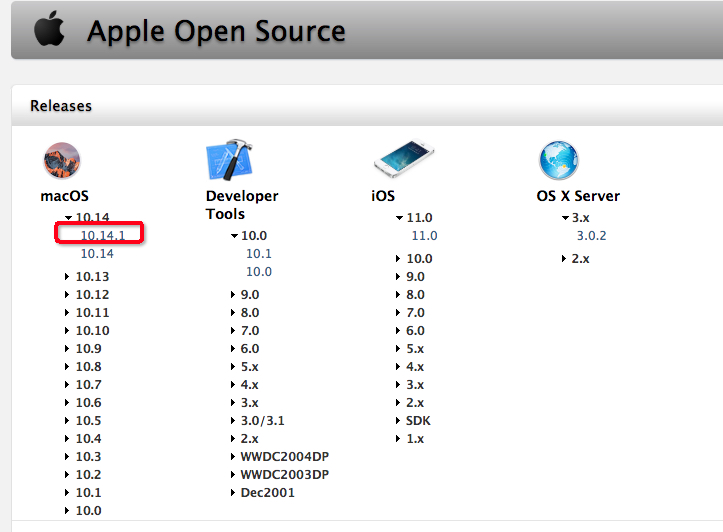

2. 由于 iOS 的开源项目较少，因此我们选择最新的 mac OS 10.14.1 版本。
    ```
    https://opensource.apple.com/release/macos-10141.html
    ```
3. Runtime 对应的开源项目是 objc4 这个项目，通过 `command + F` 来搜索点击右侧的下载按钮就能下载下来。下面就是下载地址。
    ```
    https://opensource.apple.com/tarballs/objc4/objc4-750.1.tar.gz
    ```

    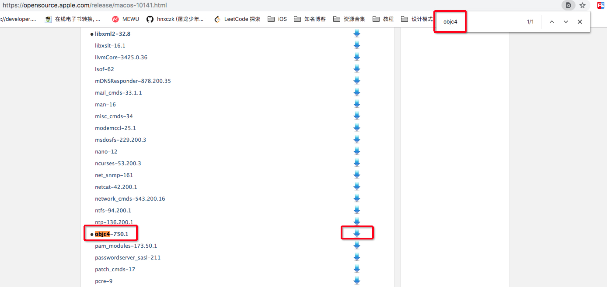

4. 如果你没有点击下载按钮而是点击了左侧的项目，就会跳转到源码目录
    ```
    https://opensource.apple.com/source/objc4/objc4-750.1/
    ```
    
    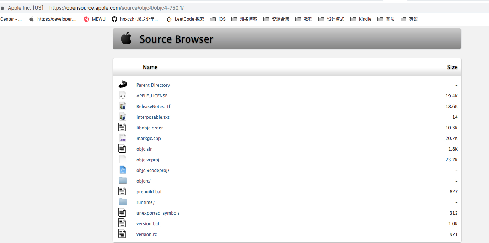

5. 通过对比 3 和 4 的地址我们可以看出来地址中的 `tarballs` 和 `source` 决定了这个地址是项目的目录还是项目的压缩包。查找其他缺失的头文件所属的项目会用到这个技巧。

    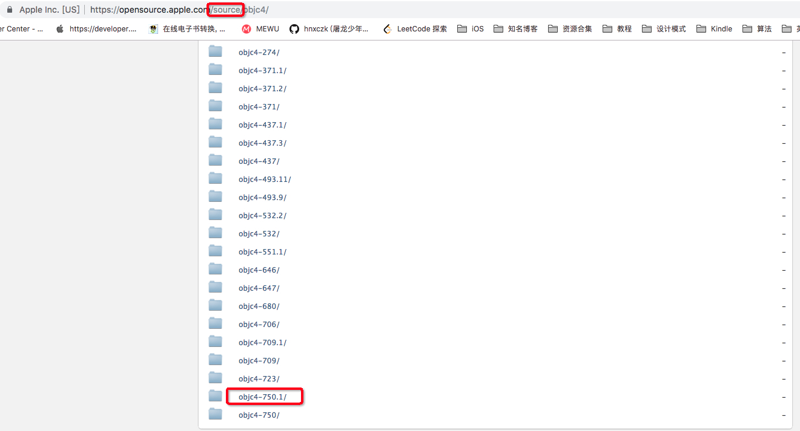

    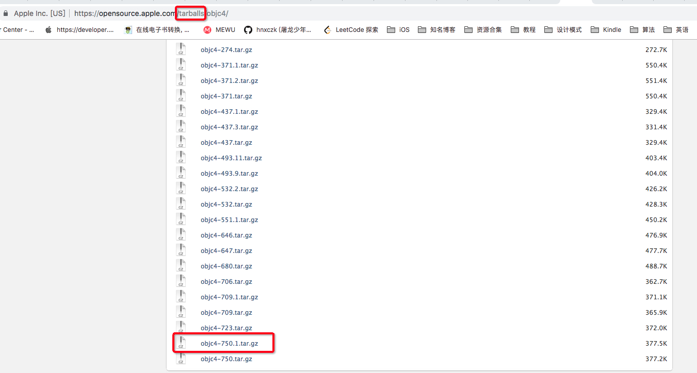

6. 通过下面的地址可以查找到所有版本的 objc4 的项目，我们可以看出来数值越大的版本越新。但是也不是版本越高越好，某些时候新版本会缺失一些文件，应该是移去其他项目或者私有化了。这时候可以使用低版本来替换。
    ```
    https://opensource.apple.com/source/objc4/
    ```

## 下载源码

按照上面所说的我们下载了 `objc4-750.1` 的压缩包。解压之后编译就会报很多的错误，其中大部分都是缺少头文件，我们需要从其他的开源项目中找到它们。下面是需要下载的开源项目列表。

1. objc4-750.1.tar.gz (Runtime 源码)
2. Libc-825.40.1.tar.gz （不是最新的，最新的有些头文件找不到）
3. dyld-551.4.tar.gz （不是最新的）
4. launchd-842.92.1.tar.gz (这个在 source 目录下找不到，需要在 tarballs 目录下查找)
5. libauto-187.tar.gz
6. libclosure-73.tar.gz
7. libdispatch-1008.200.78.tar.gz
8. libplatform-177.200.16.tar.gz
9. xnu-4903.221.2.tar.gz

## 解压

将所有压缩包都解压，除了 `objc4-750.1` 外都放到一个文件夹 `source` 下。

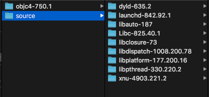

## 编译

### 1. 创建 `include` 文件夹并设置 Header Search Paths

进入 `objc4-750.1/`，创建一个文件夹 `include` 文件夹。

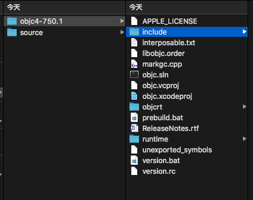

在 `Build Settings` 中设置 `Header Search Paths`。 Debug 和 Release 都要修改。

```
$(SRCROOT)/include
```

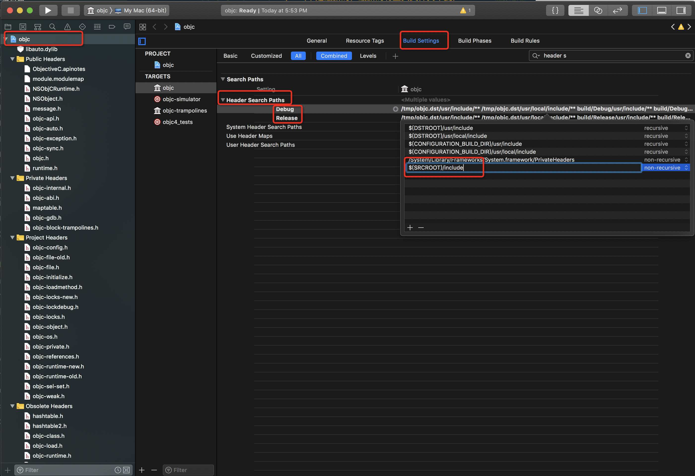

### 2. 开始编译

开始编译后会出现很多 error ，一个一个来解决它们。

#### 1. `i386 error`

```
error: The i386 architecture is deprecated. You should update your ARCHS build setting to remove the i386 architecture. (in target 'objc-trampolines')
Build system information
error: The i386 architecture is deprecated. You should update your ARCHS build setting to remove the i386 architecture. (in target 'objc')
```

提示很明显，将 对应的 `TARGETS` -> `Build Settings` -> `Architectures` 都改为 `Standard Archiectures` 或者去除 i386 这种架构的支持。

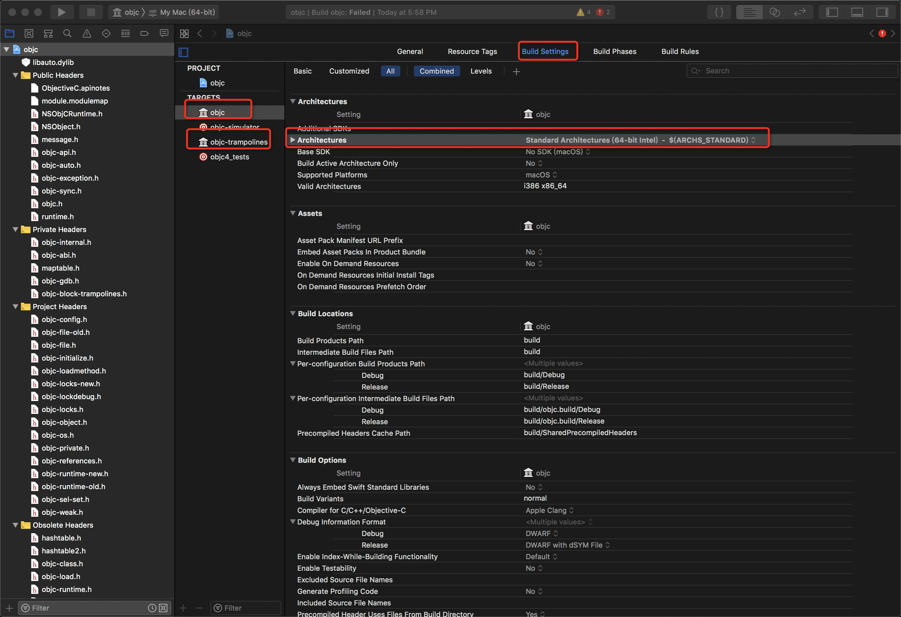

继续编译

#### 2. `'sys/reason.h' file not found`

在 source 目录下搜索 reason.h

##### 1. 通过 Finder 
通过 finder 在 `source/` 文件夹下搜索 `reason.h`。

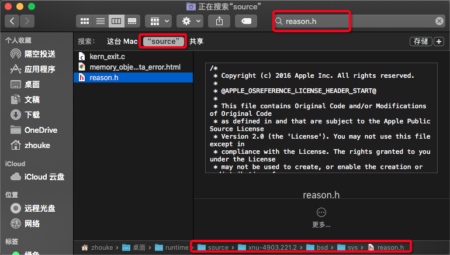

##### 2. 通过终端搜索 

```
find . -name "reason.h"
```
这样会得到对应的路径

```
./xnu-4903.221.2/bsd/sys/reason.h
```

根据编译错误我们可以看出 reason.h 文件在 sys 目录下面，因此我们在 include 目录下创建 sys 目录，并将 reason.h 放到该目录下。当然也可以通过命令行来实现，这里就不作细数了。

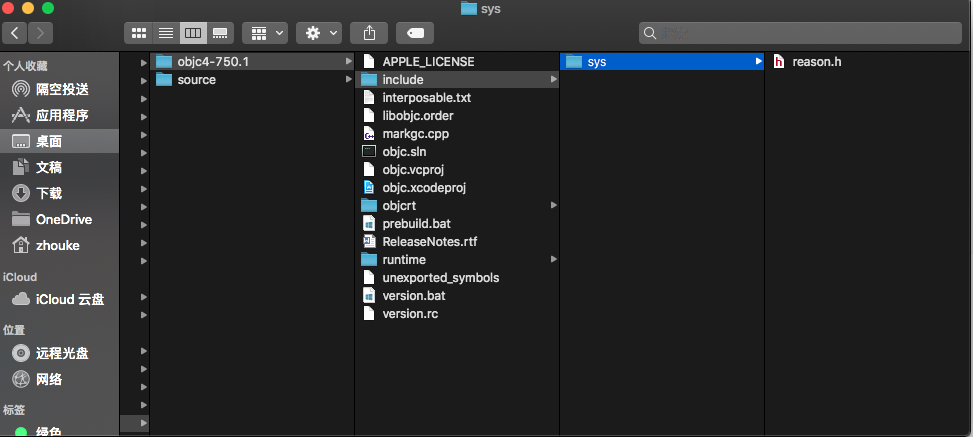

#### 3. `'mach-o/dyld_priv.h' file not found`

重复上面的操作，选择 `./dyld-551.4/include/mach-o/dyld_priv.h`

#### 4. `'os/lock_private.h' file not found`

选择 `./libplatform-177.200.16/private/os/lock_private.h`

#### 5. `'os/base_private.h' file not found`

选择 `./libplatform-177.200.16/private/os/base_private.h`

#### 6. `'pthread/tsd_private.h' file not found`

选择 `./libpthread-330.220.2/private/tsd_private.h`

#### 7. `'System/machine/cpu_capabilities.h' file not found`

这个搜索出来三个
```
./xnu-4903.221.2/osfmk/i386/cpu_capabilities.h
./xnu-4903.221.2/osfmk/machine/cpu_capabilities.h
./xnu-4903.221.2/osfmk/arm/cpu_capabilities.h
```
根据目录名 `machine` 选择 `./xnu-4903.221.2/osfmk/machine/cpu_capabilities.h`

#### 8. `'os/tsd.h' file not found`

同样有两个

```
./xnu-4903.221.2/libsyscall/os/tsd.h
./libdispatch-1008.200.78/src/shims/tsd.h
```

选择 `./xnu-4903.221.2/libsyscall/os/tsd.h`

#### 9. `'pthread/spinlock_private.h' file not found`

选择 `./libpthread-330.220.2/private/spinlock_private.h`

#### 10. `'System/pthread_machdep.h' file not found`

选择 `./Libc-825.40.1/pthreads/pthread_machdep.h`

#### 11. `'CrashReporterClient.h' file not found`

选择 `./Libc-825.40.1/include/CrashReporterClient.h`

添加进去之后依然报错，查看报错的位置在 `CrashReporterClient.h` 文件中，代码如下

```
#ifdef LIBC_NO_LIBCRASHREPORTERCLIENT

/* Fake the CrashReporterClient API */
#define CRGetCrashLogMessage() 0
#define CRSetCrashLogMessage(x) /* nothing */

#else /* !LIBC_NO_LIBCRASHREPORTERCLIENT */

/* Include the real CrashReporterClient.h */

#include_next <CrashReporterClient.h>

#endif /* !LIBC_NO_LIBCRASHREPORTERCLIENT */

#endif /* _LIBC_CRASHREPORTERCLIENT_H */
```
这个错误发生在 `#include_next`，事实上我们并没 `CrashReporterClient` 这个库。所以需要改一下工程配置文件: 
`Build Settings` -> `Preprocessor Macros（Debug & Release）`加入:

```
LIBC_NO_LIBCRASHREPORTERCLIENT
```

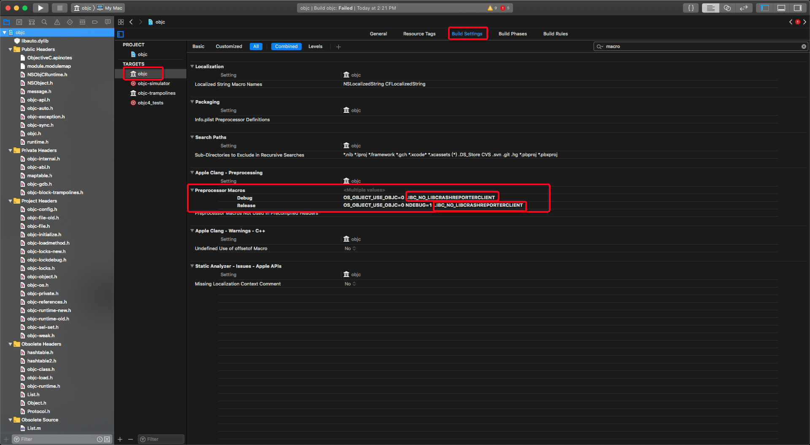

#### 12. `'Block_private.h' file not found`

找到三个

```
./xnu-4903.221.2/libkern/libkern/Block_private.h
./libclosure-73/Block_private.h
./libdispatch-1008.200.78/src/BlocksRuntime/Block_private.h
```

通过对比选择了 `./libdispatch-1008.200.78/src/BlocksRuntime/Block_private.h`, 这个版本最新。

#### 13. `'objc-shared-cache.h' file not found`

选择 `./dyld-551.4/include/objc-shared-cache.h`

#### 14. `Typedef redefinition with different types ('int' vs 'volatile OSSpinLock' (aka 'volatile int'))`

这是因为重复定义引起的，也就是我们引入的头文件中有重复定义的变量或者函数名称，因此我们在 `include` 目录下通过执行 `grep` 命令来查找重复的定义。

```
grep -rne "typedef.*pthread_lock_t” .
```

找到以下定义的位置

```
./pthread/spinlock_private.h:59:typedef volatile OSSpinLock pthread_lock_t __deprecated_msg("Use <os/lock.h> instead");
./System/pthread_machdep.h:214:typedef int pthread_lock_t;
```

因此需要注释掉一个，而又由于 `pthread_machdep.h` 来自 `Libc-825.40.1`, 这是较老的版本，因此在这里最好注释掉它里面的定义。


#### 14. `Static declaration of '_pthread_has_direct_tsd' follows non-static declaration`

这里有三个函数重复了

```
_pthread_has_direct_tsd(void)
_pthread_getspecific_direct(unsigned long slot)
_pthread_setspecific_direct(unsigned long slot, void * val)
```

同样同过 `grep` 命令来查找，然后发现他们也都是在 `pthread_machdep.h` 中，因此注释掉它们。

```
_pthread_has_direct_tsd(void) 在 Line 216 - 232
_pthread_getspecific_direct(unsigned long slot) 在 Line 243 - 264
_pthread_setspecific_direct(unsigned long slot, void * val) 在 Line 267 - 294
```

> 经过上面这两次我们的修改，我们可以大概猜测到版本9XX后的Libc项目下的pthread相关代码，被苹果移到了libpthread项目了。（pthread_machdep.h来自Libc项目，tsd_private.h和spinlock_private.h来自libpthread项目）

[原文](https://blog.csdn.net/wotors/article/details/52489464) 
#### 15. `Use of undeclared identifier 'DYLD_MACOSX_VERSION_10_11'`

在 dyld_priv.h 文件顶部加入一下宏：

```
#define DYLD_MACOSX_VERSION_10_11 0x000A0B00
#define DYLD_MACOSX_VERSION_10_12 0x000A0C00
#define DYLD_MACOSX_VERSION_10_13 0x000A0D00
#define DYLD_MACOSX_VERSION_10_14 0x000A0E00
```

#### 16. `'isa.h' file not found`

通过查找你会发现 `isa.h` 是存在于 objc4 的项目中的，只不过没有引入工程。

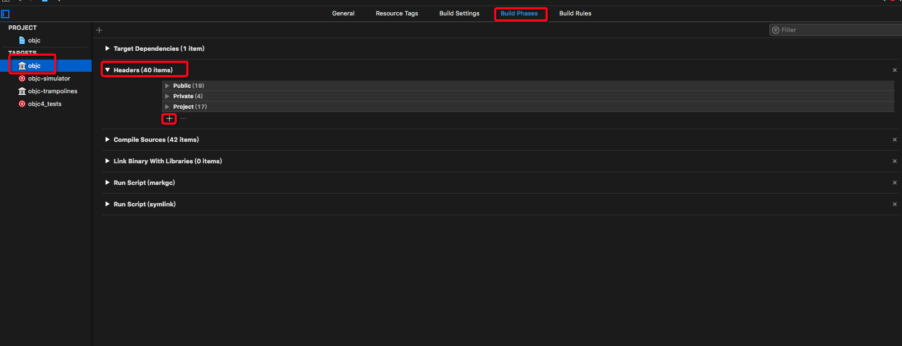

#### 17. `'_simple.h' file not found`

发现两个

```
./Libc-825.40.1/gen/_simple.h
./libplatform-177.200.16/private/_simple.h
```

对比以后发现 `./libplatform-177.200.16/private/_simple.h`，较新，选择这个。

#### 18. `libobjc.order`

```
ld: can't open order file: /Applications/Xcode.app/Contents/Developer/Platforms/MacOSX.platform/Developer/SDKs/MacOSX10.14.sdk/AppleInternal/OrderFiles/libobjc.order
clang: error: linker command failed with exit code 1 (use -v to see invocation)
```

`libobjc.order` 的路径错误，在 `objc4-750.1` 目录下通过 `find . -name "libobjc.order"` 查找结果如下

```
./libobjc.order
```
因此我们修改下工程配置。`Build Settings` -> `Linking` -> `Order File`, 把 Debug 和 Release 下的 `$(SDKROOT)/AppleInternal/OrderFiles/libobjc.order` 都修改成 `libobjc.order`。

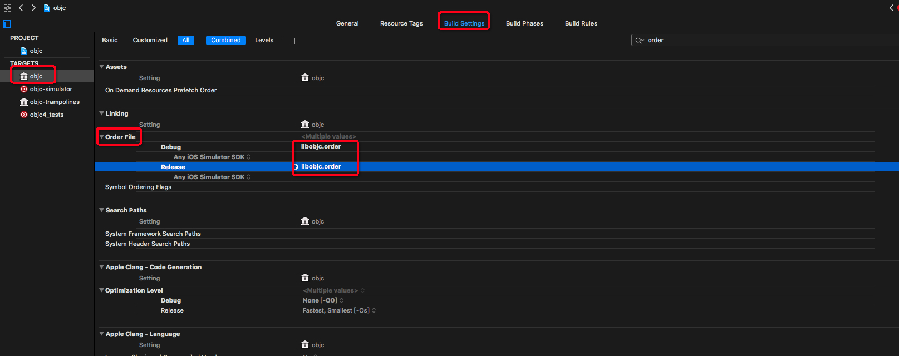

#### 19. `-lCrashReporterClient`

```
ld: library not found for -lCrashReporterClient
clang: error: linker command failed with exit code 1 (use -v to see invocation)
```

需去 `Build Settings` -> `Linking` -> `Other Linker Flags` 里删掉 `"-lCrashReporterClient"`

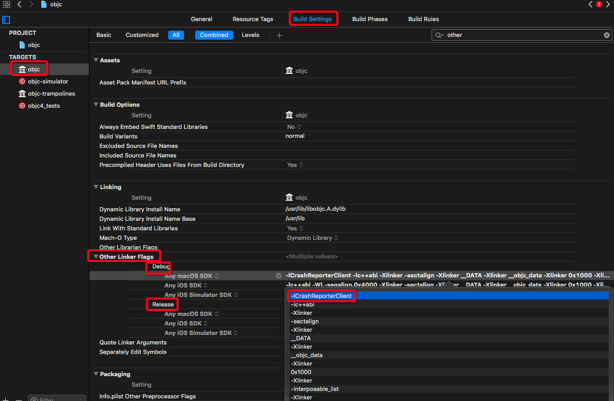

#### 20. `macosx.internal`

```
xcodebuild: error: SDK "macosx.internal" cannot be located.
xcrun: error: unable to find utility "clang++", not a developer tool or in PATH
```
把 `Target-objc` 的 `Build Phases` -> `Run Script(markgc)` 里的内容 `macosx.internal` 改为 `macosx`.

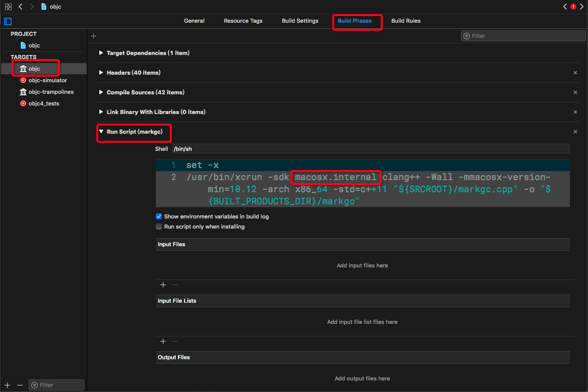

#### 21. ` no such public header file: '/tmp/objc.dst/usr/include/objc/ObjectiveC.apinotes'`

需要把 `Target-objc` 的 `Build Settings` -> `Other Text` -> `Based InstallAPI Flags` 里的内容全部清除。

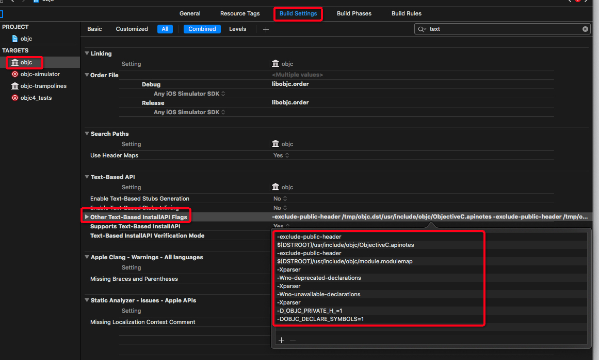

并且一定记得要把 `Text-Based InstallAPI Verification Model` 里的值改为 `Errors Only`.

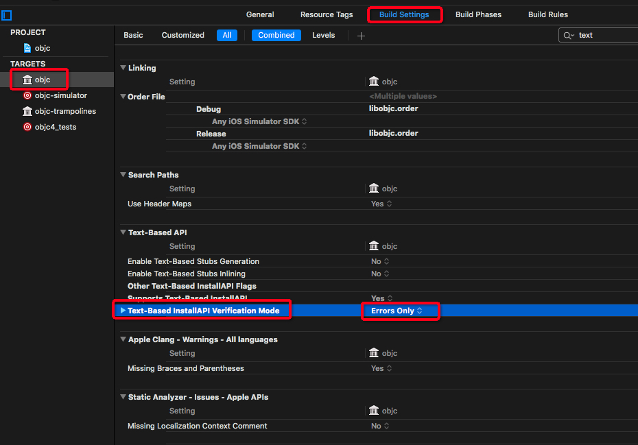

### 警告的处理

#### 1. `'_PTHREAD_TSD_SLOT_PTHREAD_SELF' macro redefined`

在 `pthread_machdep.h` 头文件中宏定义重复了：

- `_PTHREAD_TSD_SLOT_PTHREAD_SELF`
- `_PTHREAD_TSD_RESERVED_SLOT_COUNT`
- `__PTK_LIBC_TTYNAME_KEY`
- `LOCK_INIT`
- `LOCK_INITIALIZER`

根据上面的经验这里选择把 `pthread_machdep.h` 文件中的宏定义注释掉。

#### 2. `Traditional headermap style`
```
Traditional headermap style is no longer supported; please migrate to using separate headermaps and set 'ALWAYS_SEARCH_USER_PATHS' to NO. (in target 'objc-trampolines')
Traditional headermap style is no longer supported; please migrate to using separate headermaps and set 'ALWAYS_SEARCH_USER_PATHS' to NO. (in target 'objc')
```

在项目 `Target` -> `objc-trampolines` 和 `objc` -> `Build Settings` 下设置 `ALWAYS_SEARCH_USER_PATHS` 为 NO。

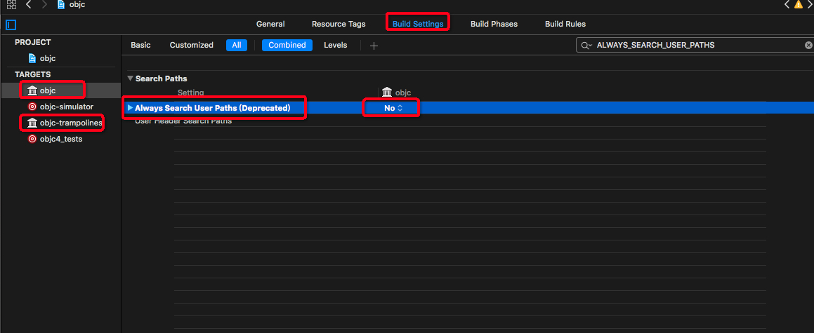

#### 3. `objc-exception.mm:584:5: Code will never be executed`

把不会执行到的代码 `__builtin_trap();` 注释掉.

#### 4. `objc-class.mm:558:33: Possible misuse of comma operator here`

根据提示修改。

## 调试

经过上面的一系列修改项目就可以跑起来了，这时候新建一个 `target` ，选择 OS X 下的 `Command Line Tool` ，起个名字 `test`。

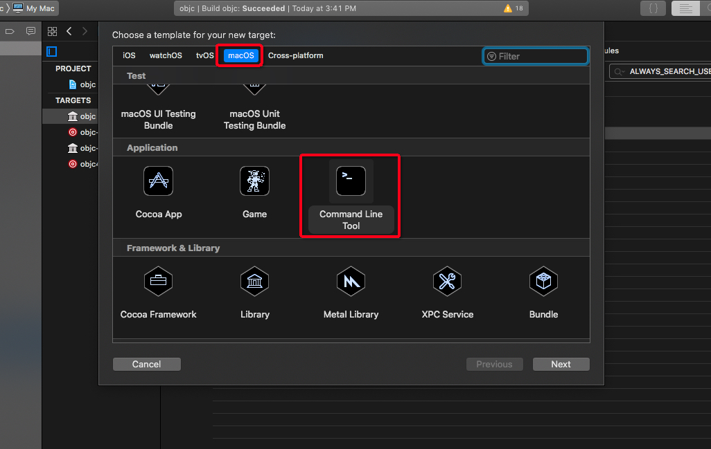

然后在 `Build Phases` -> `Target Dependencies`，把 `Target objc`加进来。

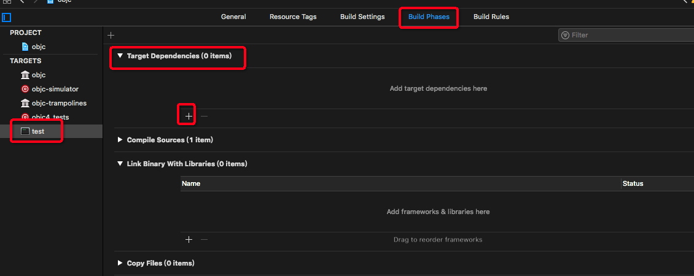

然后在 `main.m` 加入你想加的测试代码。

```
#import <Foundation/Foundation.h>
#import <objc/runtime.h>
#import <objc/message.h>

int main(int argc, const char * argv[]) {
    @autoreleasepool {
        Class suprerClass = [NSObject class];
        Class someClass = objc_allocateClassPair(suprerClass, "someClass", 0);
        objc_registerClassPair(someClass);
        id someInstance = [[someClass alloc] init];
        NSLog(@"%@", someInstance);
    }
    return 0;
}
```
## 统计

需要加入的头文件及其目录如下

```
./CrashReporterClient.h
./Block_private.h
./_simple.h
./pthread
./pthread/spinlock_private.h
./pthread/tsd_private.h
./System
./System/pthread_machdep.h
./System/machine
./System/machine/cpu_capabilities.h
./sys
./sys/reason.h
./os
./os/lock_private.h
./os/tsd.h
./os/base_private.h
./objc-shared-cache.h
./mach-o
./mach-o/dyld_priv.h
```

## 杂项

### 1. import 没有提示

这应该是 XCode 10 的问题，可以通过 `File` --> `Workspace 或者 Project Settings` --> `Build System` --> `Legacy Build System` 来设置。

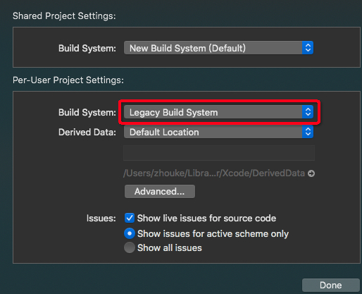

### 2. 某些库的头文件无法找到

随着版本的更新，新版本可能就不能按照上面的进行处理了。

这时候首先可以先 Google 一下缺失的头文件，大部分情况下都能直接找到源码的地址。实在没有找到就换低版本尝试。

## 参考

1. [objc - 编译Runtime源码objc4-680](https://blog.csdn.net/wotors/article/details/52489464)
2. [最新Runtime源码objc4-750编译](http://www.imooc.com/article/268031)
3. [Xcode 10 下如何创建可调试的objc4-723、objc4-750.1工程](https://www.jianshu.com/p/9e0fc8295c4b)
