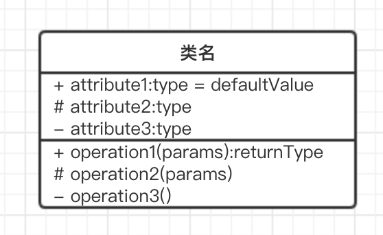
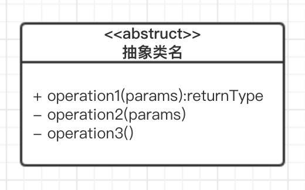
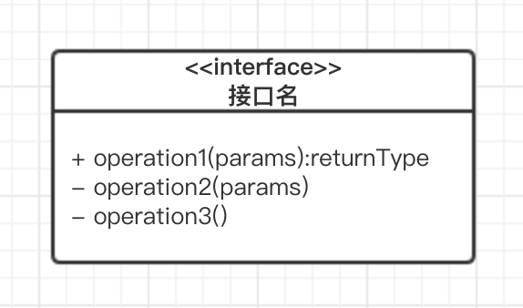
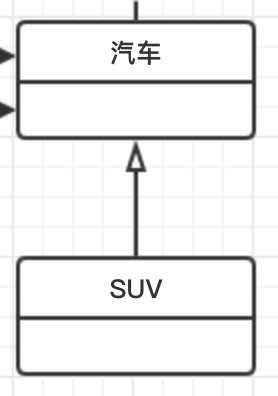
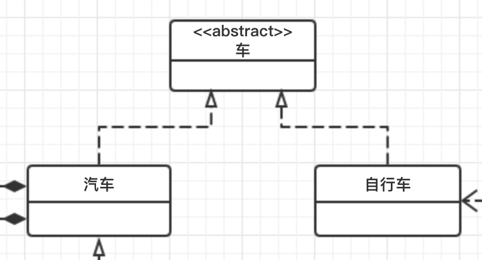
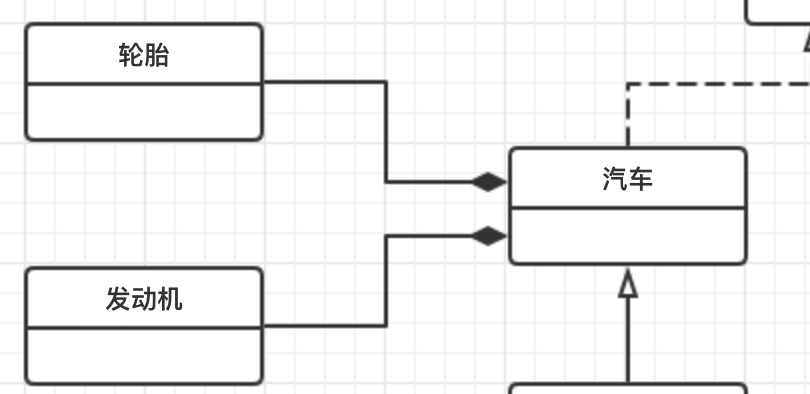
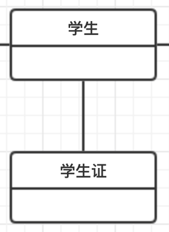
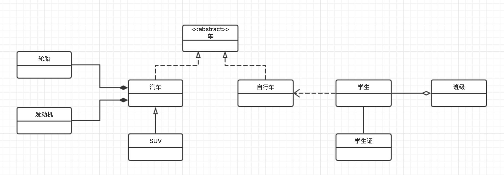

# UML 类图

UML 是统一建模语言（Unified Modeling Language）的缩写。这里只简单介绍其中类图的各个类之间的线条和箭头的含义。通过学习以后看一些设计模式相关的结构图就不会有什么问题了。

首先推荐个在线编辑 UML 的网站 [www.processon.com](https://www.processon.com)。用了一下个人感觉相较一些软件例如 StarUML 而言这个网站比较好上手一些。功能样式都还不错。
## 类图中的元素
### 类和接口

从上到下依次是类名、属性、方法。

属性和方法前面的符号代表其可见性

- private 的在前方用 - 表示
- public 的在前方用 + 表示
- protected 的在前方用 # 表示

接口和抽象类中的标识方式在不同地方介绍也不同，这里取其中我认为看起来比较好的两种方式。

### 类之间关系
#### 泛化关系(generalization)
> 泛化可以被定义为一个专门的元件连接关系与一个广义的元素，它基本上描述了在对象世界中的继承关系，是一种一般化-特殊化的关系。

继承非抽象类属于这个关系。比如 SUV 继承自 汽车。

用一条带空心箭头的直线来表示。

#### 实现关系(realize)
> 类之间的语义关系，其中的一个类指定了由另一个类保证执行的契约。

继承抽象类或者实现接口都属于这种关系。

用一条带空心箭头的虚线表示。

#### 聚合关系(aggregation)
> 聚合关系用于表示实体对象之间的关系，表示整体由部分构成的语义；例如一个班级由多个学生组成；
与组合关系不同的是，整体和部分不是强依赖的，即使整体不存在了，部分仍然存在；例如， 班级因毕业撤销了，学生不会消失，他们依然存在；

用一条带空心菱形箭头的直线表示。

上图中学生聚合而成为一个班级。
#### 组合关系(composition)
> 组合关系同样表示整体由部分构成的语义；比如公司由多个部门组成；
但组合关系是一种强依赖的特殊聚合关系，如果整体不存在了，则部分也不存在了；例如， 公司不存在了，部门也将不存在了；

用一条带实心菱形箭头直线表示.

上图中汽车由引擎和轮胎组合而成。
#### 关联关系(association)
> 它描述不同类的对象之间的结构关系；它是一种静态关系， 通常与运行状态无关，一般由常识等因素决定的；它一般用来定义对象之间静态的、天然的结构； 所以，关联关系是一种“强关联”的关系；
比如，乘车人和车票之间就是一种关联关系；学生和学校就是一种关联关系；
关联关系默认不强调方向，表示对象间相互知道；如果特别强调方向，可以使用箭头来表示；

拥有成员变量属于这种关系。

用一条直线表示，如果强调方向的话可以加上箭头表示方向。

上图中，学生拥有学生证这个成员变量
#### 依赖关系(dependency)
> 描述一个对象在运行期间会用到另一个对象的关系；
> 与关联关系不同的是，它是一种临时性的关系，通常在运行期间产生，并且随着运行时的变化； 依赖关系也可能发生变化；
显然，依赖也有方向，双向依赖是一种非常糟糕的结构，我们总是应该保持单向依赖，杜绝双向依赖的产生；

依赖关系体现为类构造方法及类方法的传入参数，箭头的指向为调用关系；依赖关系除了临时知道对方外，还是“使用”对方的方法和属性；

用一套带箭头的虚线表示。

上图中自行车在骑的时候需要学生来骑，因此它依赖于学生。但这个关系是临时的，比如对应共享单车来说一个学生骑过之后，学生和自行车就没有了关系。

## 完整的示例

- 车的类图结构为`<<abstract>>`，表示车是一个抽象类；
- 它有两个继承类：小汽车和自行车；它们之间的关系为实现关系，使用带空心箭头的虚线表示；
- 小汽车为与SUV之间也是继承关系，它们之间的关系为泛化关系，使用带空心箭头的实线表示；
- 小汽车与发动机之间是组合关系，使用带实心箭头的实线表示；
- 学生与班级之间是聚合关系，使用带空心箭头的实线表示；
- 学生与学生证之间为关联关系，使用一根实线表示；
- 学生上学需要用到自行车，与自行车是一种依赖关系，使用带箭头的虚线表示；

## 参考
- [看懂UML类图和时序图](http://design-patterns.readthedocs.io/zh_CN/latest/read_uml.html)
- [w3cschool UML教程](https://www.w3cschool.cn/uml_tutorial/uml_tutorial-pohy28t3.html)
- [轻松理解UML用例图时序图类图的教程](http://www.wistbean.com/blog/2017/10/03/uml-diagrams/)

